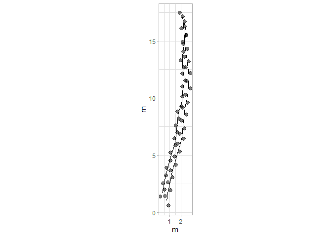
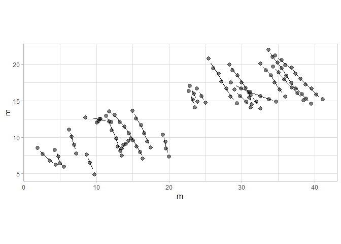
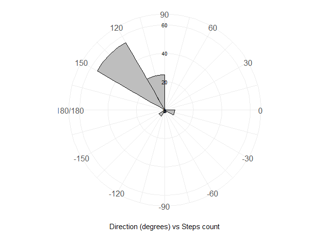

<!-- README.md is generated from README.Rmd. Please edit that file -->

# QuAnTeTrack

<!-- badges: start -->

[](https://CRAN.R-project.org/package=QuAnTeTrack)
[](https://github.com/MacroFunUV/QuAnTeTrack/actions/workflows/R-CMD-check.yaml)
<!-- badges: end -->

Studying fossil vertebrate trackways is crucial as they provide valuable
insights into the behavior, locomotion, and environmental interactions
of extinct species, offering a dynamic perspective on prehistoric life
that skeletal remains alone cannot. Here, I present **QuAnTeTrack**, an
integrated tool designed to **semi-automatically extract
palaeobiological information** by digitizing footprint and trackway
coordinates and analyzing them within the R environment.

QuAnTeTrack includes functions to read footprint coordinates and
trackways stored as **.TPS files**, transforming them into **“track”
objects**. These objects can be used to **calculate and plot key
parameters** such as **turning angles, trackway distances, step lengths,
sinuosity, and straightness**. Additional functions enable the
**quantification of velocity** and the testing of scenarios involving
**acceleration, deceleration, or stable velocity**, as well as comparing
velocity differences between tracks.

The tool also supports **visualizing movement patterns**, plotting
tracks according to velocity. Furthermore, **QuAnTeTrack facilitates the
testing of hypotheses related to gregarious behavior or predatory
events**. For interactions involving multiple tetrapods, such as **group
movement or predation**, trackways are expected to covary more
significantly and present fewer intersections than those generated by
independent events. QuAnTeTrack estimates this by computing **Frechet
and Dynamic Time Warping (DTW) trajectory similarity metrics** and
**quantifying track intersections**. These metrics are evaluated through
**random simulation procedures** to determine how actual trackway
similarities differ from randomly generated ones under various
scenarios, including **geographical constraints and resource
directionality**.

## Installation

You can install the development version of QuAnTeTrack from
[GitHub](https://github.com/) with:

``` r
# install.packages("devtools")
devtools::install_github("MacroFunUV/QuAnTeTrack")
```

## Example

<div style="max-height: 500px; overflow-y: auto; border: 1px solid #ddd; padding: 10px;">

``` r
library(QuAnTeTrack)

# Example 1: Paluxy River Dataset

tpsPaluxyRiver <- system.file("extdata", "PaluxyRiver.tps", package = "QuAnTeTrack")
PaluxyRiver <- tps_to_track(tpsPaluxyRiver, scale = 0.004341493, missing = FALSE, NAs = NULL)
#> $Trajectories
#> $Trajectories$Track_1
#>            x         y        IMAGE ID time displacementTime
#> 1  0.7554198  1.026763 Sauropod.png  0 0.00             0.00
#> 2  0.8313959  1.680158 Sauropod.png  0 0.02             0.02
#> 3  0.9703237  2.292308 Sauropod.png  0 0.04             0.04
#> 4  1.0680073  2.850190 Sauropod.png  0 0.06             0.06
#> 5  1.1656909  3.375511 Sauropod.png  0 0.08             0.08
#> 6  1.3176431  3.929051 Sauropod.png  0 0.10             0.10
#> 7  1.4934736  4.532519 Sauropod.png  0 0.12             0.12
#> 8  1.6606211  5.112108 Sauropod.png  0 0.14             0.14
#> 9  1.8234271  5.663478 Sauropod.png  0 0.16             0.16
#> 10 1.9970868  6.219189 Sauropod.png  0 0.18             0.18
#> 11 2.0795751  6.655509 Sauropod.png  0 0.20             0.20
#> 12 2.1012826  7.120049 Sauropod.png  0 0.22             0.22
#> 13 2.1642343  7.701809 Sauropod.png  0 0.24             0.24
#> 14 2.2402104  8.290081 Sauropod.png  0 0.26             0.26
#> 15 2.3009913  8.854475 Sauropod.png  0 0.28             0.28
#> 16 2.3747967  9.384137 Sauropod.png  0 0.30             0.30
#> 17 2.4898462  9.933336 Sauropod.png  0 0.32             0.32
#> 18 2.5983836 10.543316 Sauropod.png  0 0.34             0.34
#> 19 2.6548230 11.146783 Sauropod.png  0 0.36             0.36
#> 20 2.6743597 11.824056 Sauropod.png  0 0.38             0.38
#> 21 2.6396277 12.429694 Sauropod.png  0 0.40             0.40
#> 22 2.5636516 12.955015 Sauropod.png  0 0.42             0.42
#> 23 2.4985292 13.417384 Sauropod.png  0 0.44             0.44
#> 24 2.4268946 13.949217 Sauropod.png  0 0.46             0.46
#> 25 2.3530892 14.589587 Sauropod.png  0 0.48             0.48
#> 26 2.3053328 15.195226 Sauropod.png  0 0.50             0.50
#> 27 2.2488934 15.790010 Sauropod.png  0 0.52             0.52
#> 28 2.1859417 16.386965 Sauropod.png  0 0.54             0.54
#> 29 2.1121363 17.059897 Sauropod.png  0 0.56             0.56
#>                  polar          displacement
#> 1  0.755420+ 1.026763i  0.0000000+0.0000000i
#> 2  0.831396+ 1.680158i  0.0759761+0.6533947i
#> 3  0.970324+ 2.292308i  0.1389278+0.6121505i
#> 4  1.068007+ 2.850190i  0.0976836+0.5578819i
#> 5  1.165691+ 3.375511i  0.0976836+0.5253207i
#> 6  1.317643+ 3.929051i  0.1519523+0.5535404i
#> 7  1.493474+ 4.532519i  0.1758305+0.6034675i
#> 8  1.660621+ 5.112108i  0.1671475+0.5795893i
#> 9  1.823427+ 5.663478i  0.1628060+0.5513696i
#> 10 1.997087+ 6.219189i  0.1736597+0.5557111i
#> 11 2.079575+ 6.655509i  0.0824884+0.4363200i
#> 12 2.101283+ 7.120049i  0.0217075+0.4645398i
#> 13 2.164234+ 7.701809i  0.0629516+0.5817601i
#> 14 2.240210+ 8.290081i  0.0759761+0.5882723i
#> 15 2.300991+ 8.854475i  0.0607809+0.5643941i
#> 16 2.374797+ 9.384137i  0.0738054+0.5296621i
#> 17 2.489846+ 9.933336i  0.1150496+0.5491989i
#> 18 2.598384+10.543316i  0.1085373+0.6099798i
#> 19 2.654823+11.146783i  0.0564394+0.6034675i
#> 20 2.674360+11.824056i  0.0195367+0.6772729i
#> 21 2.639628+12.429694i -0.0347319+0.6056383i
#> 22 2.563652+12.955015i -0.0759761+0.5253207i
#> 23 2.498529+13.417384i -0.0651224+0.4623690i
#> 24 2.426895+13.949217i -0.0716346+0.5318329i
#> 25 2.353089+14.589587i -0.0738054+0.6403702i
#> 26 2.305333+15.195226i -0.0477564+0.6056383i
#> 27 2.248893+15.790010i -0.0564394+0.5947845i
#> 28 2.185942+16.386965i -0.0629516+0.5969553i
#> 29 2.112136+17.059897i -0.0738054+0.6729314i
#> 
#> $Trajectories$Track_2
#>            x         y        IMAGE ID time displacementTime
#> 1  0.3646854  1.693182 Theropod.png  1 0.00             0.00
#> 2  0.4927595  2.279284 Theropod.png  1 0.02             0.02
#> 3  0.5730771  2.891434 Theropod.png  1 0.04             0.04
#> 4  0.7206878  3.564366 Theropod.png  1 0.06             0.06
#> 5  0.9095428  4.213419 Theropod.png  1 0.08             0.08
#> 6  1.0897147  4.884180 Theropod.png  1 0.10             0.10
#> 7  1.2959357  5.546257 Theropod.png  1 0.12             0.12
#> 8  1.4652539  6.171432 Theropod.png  1 0.14             0.14
#> 9  1.5564252  6.742339 Theropod.png  1 0.16             0.16
#> 10 1.6150354  7.304562 Theropod.png  1 0.18             0.18
#> 11 1.6736456  7.899347 Theropod.png  1 0.20             0.20
#> 12 1.7452802  8.494131 Theropod.png  1 0.22             0.22
#> 13 1.8690127  9.043330 Theropod.png  1 0.24             0.24
#> 14 2.0752337  9.724944 Theropod.png  1 0.26             0.26
#> 15 2.1208193 10.591072 Theropod.png  1 0.28             0.28
#> 16 2.2597471 11.277028 Theropod.png  1 0.30             0.30
#> 17 2.2467226 11.832739 Theropod.png  1 0.32             0.32
#> 18 2.1729172 12.405816 Theropod.png  1 0.34             0.34
#> 19 2.1186486 12.994089 Theropod.png  1 0.36             0.36
#> 20 2.0969411 13.667020 Theropod.png  1 0.38             0.38
#> 21 2.1989662 14.368171 Theropod.png  1 0.40             0.40
#> 22 2.3292110 15.112737 Theropod.png  1 0.42             0.42
#> 23 2.3986749 15.902889 Theropod.png  1 0.44             0.44
#> 24 2.2445519 16.708236 Theropod.png  1 0.46             0.46
#>                  polar          displacement
#> 1  0.364685+ 1.693182i  0.0000000+0.0000000i
#> 2  0.492759+ 2.279284i  0.1280740+0.5861016i
#> 3  0.573077+ 2.891434i  0.0803176+0.6121505i
#> 4  0.720688+ 3.564366i  0.1476108+0.6729314i
#> 5  0.909543+ 4.213419i  0.1888549+0.6490532i
#> 6  1.089715+ 4.884180i  0.1801720+0.6707607i
#> 7  1.295936+ 5.546257i  0.2062209+0.6620777i
#> 8  1.465254+ 6.171432i  0.1693182+0.6251750i
#> 9  1.556425+ 6.742339i  0.0911714+0.5709063i
#> 10 1.615035+ 7.304562i  0.0586102+0.5622233i
#> 11 1.673646+ 7.899347i  0.0586102+0.5947845i
#> 12 1.745280+ 8.494131i  0.0716346+0.5947845i
#> 13 1.869013+ 9.043330i  0.1237326+0.5491989i
#> 14 2.075234+ 9.724944i  0.2062209+0.6816144i
#> 15 2.120819+10.591072i  0.0455857+0.8661279i
#> 16 2.259747+11.277028i  0.1389278+0.6859559i
#> 17 2.246723+11.832739i -0.0130245+0.5557111i
#> 18 2.172917+12.405816i -0.0738054+0.5730771i
#> 19 2.118649+12.994089i -0.0542687+0.5882723i
#> 20 2.096941+13.667020i -0.0217075+0.6729314i
#> 21 2.198966+14.368171i  0.1020251+0.7011511i
#> 22 2.329211+15.112737i  0.1302448+0.7445660i
#> 23 2.398675+15.902889i  0.0694639+0.7901517i
#> 24 2.244552+16.708236i -0.1541230+0.8053470i
#> 
#> 
#> $Footprints
#> $Footprints[[1]]
#>            X         Y        IMAGE ID missing
#> 1  0.9160550  0.633858 Sauropod.png  0  Actual
#> 2  0.5947845  1.419668 Sauropod.png  0  Actual
#> 3  1.0680073  1.940647 Sauropod.png  0  Actual
#> 4  0.8726401  2.643969 Sauropod.png  0  Actual
#> 5  1.2633745  3.056411 Sauropod.png  0  Actual
#> 6  1.0680073  3.694611 Sauropod.png  0  Actual
#> 7  1.5672790  4.163492 Sauropod.png  0  Actual
#> 8  1.4196682  4.901546 Sauropod.png  0  Actual
#> 9  1.9015739  5.322670 Sauropod.png  0  Actual
#> 10 1.7452802  6.004285 Sauropod.png  0  Actual
#> 11 2.2488934  6.434093 Sauropod.png  0  Actual
#> 12 1.9102569  6.876925 Sauropod.png  0  Actual
#> 13 2.2923083  7.363172 Sauropod.png  0  Actual
#> 14 2.0361602  8.040445 Sauropod.png  0  Actual
#> 15 2.4442606  8.539717 Sauropod.png  0  Actual
#> 16 2.1577220  9.169233 Sauropod.png  0  Actual
#> 17 2.5918713  9.599041 Sauropod.png  0  Actual
#> 18 2.3878212 10.267631 Sauropod.png  0  Actual
#> 19 2.8089460 10.819001 Sauropod.png  0  Actual
#> 20 2.5007000 11.474566 Sauropod.png  0  Actual
#> 21 2.8480194 12.173546 Sauropod.png  0  Actual
#> 22 2.4312361 12.685843 Sauropod.png  0  Actual
#> 23 2.6960672 13.224188 Sauropod.png  0  Actual
#> 24 2.3009913 13.610581 Sauropod.png  0  Actual
#> 25 2.5527979 14.287853 Sauropod.png  0  Actual
#> 26 2.1533805 14.891321 Sauropod.png  0  Actual
#> 27 2.4572850 15.499130 Sauropod.png  0  Actual
#> 28 2.0405017 16.080890 Sauropod.png  0  Actual
#> 29 2.3313817 16.693041 Sauropod.png  0  Actual
#> 30 1.8928909 17.426753 Sauropod.png  0  Actual
#> 
#> $Footprints[[2]]
#>            X         Y        IMAGE ID missing
#> 1  0.1866842  1.376253 Theropod.png  1  Actual
#> 2  0.5426866  2.010111 Theropod.png  1  Actual
#> 3  0.4428323  2.548456 Theropod.png  1  Actual
#> 4  0.7033219  3.234412 Theropod.png  1  Actual
#> 5  0.7380538  3.894319 Theropod.png  1  Actual
#> 6  1.0810318  4.532519 Theropod.png  1  Actual
#> 7  1.0983977  5.235841 Theropod.png  1  Actual
#> 8  1.4934736  5.856674 Theropod.png  1  Actual
#> 9  1.4370342  6.486191 Theropod.png  1  Actual
#> 10 1.6758163  6.998487 Theropod.png  1  Actual
#> 11 1.5542545  7.610637 Theropod.png  1  Actual
#> 12 1.7930366  8.188056 Theropod.png  1  Actual
#> 13 1.6975238  8.800206 Theropod.png  1  Actual
#> 14 2.0405017  9.286454 Theropod.png  1  Actual
#> 15 2.1099656 10.163435 Theropod.png  1  Actual
#> 16 2.1316731 11.018709 Theropod.png  1  Actual
#> 17 2.3878212 11.535347 Theropod.png  1  Actual
#> 18 2.1056241 12.130131 Theropod.png  1  Actual
#> 19 2.2402104 12.681501 Theropod.png  1  Actual
#> 20 1.9970868 13.306676 Theropod.png  1  Actual
#> 21 2.1967955 14.027364 Theropod.png  1  Actual
#> 22 2.2011370 14.708978 Theropod.png  1  Actual
#> 23 2.4572850 15.516496 Theropod.png  1  Actual
#> 24 2.3400647 16.289282 Theropod.png  1  Actual
#> 25 2.1490390 17.127190 Theropod.png  1  Actual
plot_track(PaluxyRiver)
```



``` r

# Display track parameters within a scrollable box
params_paluxy <- track_param(PaluxyRiver)
#> $Track_1
#> $Track_1$Turning_angles
#>  [1] 83.36749 77.21330 80.06835 79.46614 74.64986 73.75563 73.91299 73.54942
#>  [9] 72.64598 79.29432 87.32457 83.82411 82.64091 83.85337 82.06724 78.16842
#> [17] 79.91062 84.65694 88.34770 93.28218 98.22952 98.01709 97.67122 96.57457
#> [25] 94.50862 95.42060 96.01985 96.25904
#> 
#> $Track_1$Mean_turning_angle
#> [1] 85.16786
#> 
#> $Track_1$Standard_deviation_turning_angle
#> [1] 8.716076
#> 
#> $Track_1$Distance
#> [1] 16.09043
#> 
#> $Track_1$Length
#> [1] 16.2711
#> 
#> $Track_1$Step_lengths
#>  [1] 0.6577971 0.6277174 0.5663694 0.5343256 0.5740178 0.6285614 0.6032098
#>  [8] 0.5749037 0.5822135 0.4440490 0.4650467 0.5851561 0.5931582 0.5676575
#> [15] 0.5347796 0.5611201 0.6195609 0.6061010 0.6775546 0.6066334 0.5307864
#> [22] 0.4669326 0.5366356 0.6446094 0.6075182 0.5974563 0.6002654 0.6769667
#> 
#> $Track_1$Mean_step_length
#> [1] 0.5811108
#> 
#> $Track_1$Standard_deviation_step_length
#> [1] 0.05855971
#> 
#> $Track_1$Sinuosity
#> [1] 0.07738533
#> 
#> $Track_1$Straightness
#> [1] 0.9888963
#> 
#> 
#> $Track_2
#> $Track_2$Turning_angles
#>  [1]  77.67357  82.52517  77.62784  73.77659  74.96477  72.69947  74.84593
#>  [8]  80.92672  84.04858  84.37223  83.13249  77.30345  73.16693  86.98721
#> [15]  78.55066  91.34262  97.33861  95.27067  91.84761  81.72095  80.07781
#> [22]  84.97592 100.83397
#> 
#> $Track_2$Mean_turning_angle
#> [1] 82.86999
#> 
#> $Track_2$Standard_deviation_turning_angle
#> [1] 7.941837
#> 
#> $Track_2$Distance
#> [1] 15.13227
#> 
#> $Track_2$Length
#> [1] 15.27567
#> 
#> $Track_2$Step_lengths
#>  [1] 0.5999317 0.6173971 0.6889308 0.6759706 0.6945371 0.6934507 0.6476978
#>  [8] 0.5781403 0.5652701 0.5976653 0.5990828 0.5629646 0.7121273 0.8673266
#> [15] 0.6998831 0.5558637 0.5778101 0.5907702 0.6732814 0.7085351 0.7558719
#> [22] 0.7931992 0.8199620
#> 
#> $Track_2$Mean_step_length
#> [1] 0.6641595
#> 
#> $Track_2$Standard_deviation_step_length
#> [1] 0.08686601
#> 
#> $Track_2$Sinuosity
#> [1] 0.1466281
#> 
#> $Track_2$Straightness
#> [1] 0.9906128
cat("<div style='max-height: 300px; overflow-y: auto;'>")
#> <div style='max-height: 300px; overflow-y: auto;'>
print(params_paluxy)
#> $Track_1
#> $Track_1$Turning_angles
#>  [1] 83.36749 77.21330 80.06835 79.46614 74.64986 73.75563 73.91299 73.54942
#>  [9] 72.64598 79.29432 87.32457 83.82411 82.64091 83.85337 82.06724 78.16842
#> [17] 79.91062 84.65694 88.34770 93.28218 98.22952 98.01709 97.67122 96.57457
#> [25] 94.50862 95.42060 96.01985 96.25904
#> 
#> $Track_1$Mean_turning_angle
#> [1] 85.16786
#> 
#> $Track_1$Standard_deviation_turning_angle
#> [1] 8.716076
#> 
#> $Track_1$Distance
#> [1] 16.09043
#> 
#> $Track_1$Length
#> [1] 16.2711
#> 
#> $Track_1$Step_lengths
#>  [1] 0.6577971 0.6277174 0.5663694 0.5343256 0.5740178 0.6285614 0.6032098
#>  [8] 0.5749037 0.5822135 0.4440490 0.4650467 0.5851561 0.5931582 0.5676575
#> [15] 0.5347796 0.5611201 0.6195609 0.6061010 0.6775546 0.6066334 0.5307864
#> [22] 0.4669326 0.5366356 0.6446094 0.6075182 0.5974563 0.6002654 0.6769667
#> 
#> $Track_1$Mean_step_length
#> [1] 0.5811108
#> 
#> $Track_1$Standard_deviation_step_length
#> [1] 0.05855971
#> 
#> $Track_1$Sinuosity
#> [1] 0.07738533
#> 
#> $Track_1$Straightness
#> [1] 0.9888963
#> 
#> 
#> $Track_2
#> $Track_2$Turning_angles
#>  [1]  77.67357  82.52517  77.62784  73.77659  74.96477  72.69947  74.84593
#>  [8]  80.92672  84.04858  84.37223  83.13249  77.30345  73.16693  86.98721
#> [15]  78.55066  91.34262  97.33861  95.27067  91.84761  81.72095  80.07781
#> [22]  84.97592 100.83397
#> 
#> $Track_2$Mean_turning_angle
#> [1] 82.86999
#> 
#> $Track_2$Standard_deviation_turning_angle
#> [1] 7.941837
#> 
#> $Track_2$Distance
#> [1] 15.13227
#> 
#> $Track_2$Length
#> [1] 15.27567
#> 
#> $Track_2$Step_lengths
#>  [1] 0.5999317 0.6173971 0.6889308 0.6759706 0.6945371 0.6934507 0.6476978
#>  [8] 0.5781403 0.5652701 0.5976653 0.5990828 0.5629646 0.7121273 0.8673266
#> [15] 0.6998831 0.5558637 0.5778101 0.5907702 0.6732814 0.7085351 0.7558719
#> [22] 0.7931992 0.8199620
#> 
#> $Track_2$Mean_step_length
#> [1] 0.6641595
#> 
#> $Track_2$Standard_deviation_step_length
#> [1] 0.08686601
#> 
#> $Track_2$Sinuosity
#> [1] 0.1466281
#> 
#> $Track_2$Straightness
#> [1] 0.9906128
cat("</div>")
#> </div>

plot_direction(PaluxyRiver, plot_type = "polar_steps")
#> $Track_1
#> $Track_1$Turning_angles
#>  [1] 83.36749 77.21330 80.06835 79.46614 74.64986 73.75563 73.91299 73.54942
#>  [9] 72.64598 79.29432 87.32457 83.82411 82.64091 83.85337 82.06724 78.16842
#> [17] 79.91062 84.65694 88.34770 93.28218 98.22952 98.01709 97.67122 96.57457
#> [25] 94.50862 95.42060 96.01985 96.25904
#> 
#> $Track_1$Mean_turning_angle
#> [1] 85.16786
#> 
#> $Track_1$Standard_deviation_turning_angle
#> [1] 8.716076
#> 
#> $Track_1$Distance
#> [1] 16.09043
#> 
#> $Track_1$Length
#> [1] 16.2711
#> 
#> $Track_1$Step_lengths
#>  [1] 0.6577971 0.6277174 0.5663694 0.5343256 0.5740178 0.6285614 0.6032098
#>  [8] 0.5749037 0.5822135 0.4440490 0.4650467 0.5851561 0.5931582 0.5676575
#> [15] 0.5347796 0.5611201 0.6195609 0.6061010 0.6775546 0.6066334 0.5307864
#> [22] 0.4669326 0.5366356 0.6446094 0.6075182 0.5974563 0.6002654 0.6769667
#> 
#> $Track_1$Mean_step_length
#> [1] 0.5811108
#> 
#> $Track_1$Standard_deviation_step_length
#> [1] 0.05855971
#> 
#> $Track_1$Sinuosity
#> [1] 0.07738533
#> 
#> $Track_1$Straightness
#> [1] 0.9888963
#> 
#> 
#> $Track_2
#> $Track_2$Turning_angles
#>  [1]  77.67357  82.52517  77.62784  73.77659  74.96477  72.69947  74.84593
#>  [8]  80.92672  84.04858  84.37223  83.13249  77.30345  73.16693  86.98721
#> [15]  78.55066  91.34262  97.33861  95.27067  91.84761  81.72095  80.07781
#> [22]  84.97592 100.83397
#> 
#> $Track_2$Mean_turning_angle
#> [1] 82.86999
#> 
#> $Track_2$Standard_deviation_turning_angle
#> [1] 7.941837
#> 
#> $Track_2$Distance
#> [1] 15.13227
#> 
#> $Track_2$Length
#> [1] 15.27567
#> 
#> $Track_2$Step_lengths
#>  [1] 0.5999317 0.6173971 0.6889308 0.6759706 0.6945371 0.6934507 0.6476978
#>  [8] 0.5781403 0.5652701 0.5976653 0.5990828 0.5629646 0.7121273 0.8673266
#> [15] 0.6998831 0.5558637 0.5778101 0.5907702 0.6732814 0.7085351 0.7558719
#> [22] 0.7931992 0.8199620
#> 
#> $Track_2$Mean_step_length
#> [1] 0.6641595
#> 
#> $Track_2$Standard_deviation_step_length
#> [1] 0.08686601
#> 
#> $Track_2$Sinuosity
#> [1] 0.1466281
#> 
#> $Track_2$Straightness
#> [1] 0.9906128
```


``` r

H_paluxyriver <- c(3.472, 2.200)
Method_paluxyriver <- c("A", "B")
velocity_paluxyriver <- velocity_track(PaluxyRiver, H = H_paluxyriver, method = Method_paluxyriver)
#> $Track_1
#> $Track_1$Step_velocities
#>  [1] 0.2884087 0.2667234 0.2246319 0.2038125 0.2297207 0.2673225 0.2495612
#>  [8] 0.2303131 0.2352243 0.1496251 0.1616271 0.2372131 0.2426553 0.2254857
#> [15] 0.2041018 0.2211659 0.2609607 0.2515620 0.3030204 0.2519311 0.2015630
#> [22] 0.1627231 0.2052861 0.2788176 0.2525451 0.2455988 0.2475302 0.3025814
#> 
#> $Track_1$Mean_velocity
#> [1] 0.2357754
#> 
#> $Track_1$Standard_deviation_velocity
#> [1] 0.03865919
#> 
#> $Track_1$Maximum_velocity
#> [1] 0.3030204
#> 
#> $Track_1$Minimum_velocity
#> [1] 0.1496251
#> 
#> $Track_1$Step_relative_stride
#>  [1] 0.3789154 0.3615884 0.3262496 0.3077913 0.3306554 0.3620745 0.3474711
#>  [8] 0.3311657 0.3353764 0.2557886 0.2678840 0.3370715 0.3416810 0.3269916
#> [15] 0.3080528 0.3232259 0.3568899 0.3491365 0.3902964 0.3494432 0.3057525
#> [22] 0.2689704 0.3091219 0.3713188 0.3499529 0.3441569 0.3457750 0.3899578
#> 
#> $Track_1$Mean_relative_stride
#> [1] 0.3347413
#> 
#> $Track_1$Standard_deviation_relative_stride
#> [1] 0.03373255
#> 
#> $Track_1$Maximum_relative_stride
#> [1] 0.3902964
#> 
#> $Track_1$Minimum_relative_stride
#> [1] 0.2557886
#> 
#> 
#> $Track_2
#> $Track_2$Step_velocities
#>  [1] 0.3812738 0.3999907 0.4803527 0.4653572 0.4868985 0.4856273 0.4333103
#>  [8] 0.3584286 0.3452030 0.3788715 0.3803733 0.3428550 0.5076662 0.7056220
#> [15] 0.4931734 0.3356635 0.3580868 0.3716003 0.4622697 0.5033969 0.5608097
#> [22] 0.6078206 0.6424547
#> 
#> $Track_2$Mean_velocity
#> [1] 0.4559611
#> 
#> $Track_2$Standard_deviation_velocity
#> [1] 0.1015011
#> 
#> $Track_2$Maximum_velocity
#> [1] 0.705622
#> 
#> $Track_2$Minimum_velocity
#> [1] 0.3356635
#> 
#> $Track_2$Step_relative_stride
#>  [1] 0.5453924 0.5612701 0.6263007 0.6145187 0.6313974 0.6304098 0.5888162
#>  [8] 0.5255821 0.5138819 0.5433321 0.5446207 0.5117860 0.6473884 0.7884788
#> [15] 0.6362574 0.5053306 0.5252820 0.5370638 0.6120740 0.6441228 0.6871563
#> [22] 0.7210902 0.7454200
#> 
#> $Track_2$Mean_relative_stride
#> [1] 0.6037814
#> 
#> $Track_2$Standard_deviation_relative_stride
#> [1] 0.0789691
#> 
#> $Track_2$Maximum_relative_stride
#> [1] 0.7884788
#> 
#> $Track_2$Minimum_relative_stride
#> [1] 0.5053306
cat("<div style='max-height: 300px; overflow-y: auto;'>")
#> <div style='max-height: 300px; overflow-y: auto;'>
print(velocity_paluxyriver)
#> $Track_1
#> $Track_1$Step_velocities
#>  [1] 0.2884087 0.2667234 0.2246319 0.2038125 0.2297207 0.2673225 0.2495612
#>  [8] 0.2303131 0.2352243 0.1496251 0.1616271 0.2372131 0.2426553 0.2254857
#> [15] 0.2041018 0.2211659 0.2609607 0.2515620 0.3030204 0.2519311 0.2015630
#> [22] 0.1627231 0.2052861 0.2788176 0.2525451 0.2455988 0.2475302 0.3025814
#> 
#> $Track_1$Mean_velocity
#> [1] 0.2357754
#> 
#> $Track_1$Standard_deviation_velocity
#> [1] 0.03865919
#> 
#> $Track_1$Maximum_velocity
#> [1] 0.3030204
#> 
#> $Track_1$Minimum_velocity
#> [1] 0.1496251
#> 
#> $Track_1$Step_relative_stride
#>  [1] 0.3789154 0.3615884 0.3262496 0.3077913 0.3306554 0.3620745 0.3474711
#>  [8] 0.3311657 0.3353764 0.2557886 0.2678840 0.3370715 0.3416810 0.3269916
#> [15] 0.3080528 0.3232259 0.3568899 0.3491365 0.3902964 0.3494432 0.3057525
#> [22] 0.2689704 0.3091219 0.3713188 0.3499529 0.3441569 0.3457750 0.3899578
#> 
#> $Track_1$Mean_relative_stride
#> [1] 0.3347413
#> 
#> $Track_1$Standard_deviation_relative_stride
#> [1] 0.03373255
#> 
#> $Track_1$Maximum_relative_stride
#> [1] 0.3902964
#> 
#> $Track_1$Minimum_relative_stride
#> [1] 0.2557886
#> 
#> 
#> $Track_2
#> $Track_2$Step_velocities
#>  [1] 0.3812738 0.3999907 0.4803527 0.4653572 0.4868985 0.4856273 0.4333103
#>  [8] 0.3584286 0.3452030 0.3788715 0.3803733 0.3428550 0.5076662 0.7056220
#> [15] 0.4931734 0.3356635 0.3580868 0.3716003 0.4622697 0.5033969 0.5608097
#> [22] 0.6078206 0.6424547
#> 
#> $Track_2$Mean_velocity
#> [1] 0.4559611
#> 
#> $Track_2$Standard_deviation_velocity
#> [1] 0.1015011
#> 
#> $Track_2$Maximum_velocity
#> [1] 0.705622
#> 
#> $Track_2$Minimum_velocity
#> [1] 0.3356635
#> 
#> $Track_2$Step_relative_stride
#>  [1] 0.5453924 0.5612701 0.6263007 0.6145187 0.6313974 0.6304098 0.5888162
#>  [8] 0.5255821 0.5138819 0.5433321 0.5446207 0.5117860 0.6473884 0.7884788
#> [15] 0.6362574 0.5053306 0.5252820 0.5370638 0.6120740 0.6441228 0.6871563
#> [22] 0.7210902 0.7454200
#> 
#> $Track_2$Mean_relative_stride
#> [1] 0.6037814
#> 
#> $Track_2$Standard_deviation_relative_stride
#> [1] 0.0789691
#> 
#> $Track_2$Maximum_relative_stride
#> [1] 0.7884788
#> 
#> $Track_2$Minimum_relative_stride
#> [1] 0.5053306
cat("</div>")
#> </div>


# Example 2: Mount Tom Dataset

tpsMountTom <- system.file("extdata", "MountTom.tps", package = "QuAnTeTrack")
NAs <- matrix(c(7, 3), nrow = 1, ncol = 2)
MountTom <- tps_to_track(tpsMountTom, scale = 0.004411765, missing = TRUE, NAs = NAs,
                         R.L.side = c("R", "L", "L", "L", "R", "L", "R", "R", "L", "L", 
                                      "L", "L", "L", "R", "R", "L", "R", "R", "L", "R", 
                                      "R", "R", "R"))
#> $Trajectories
#> $Trajectories$Track_01
#>          x        y       IMAGE ID time displacementTime              polar
#> 1 40.67868 15.50294 Track 1.png  0 0.00             0.00 40.67868+15.50294i
#> 2 39.91544 16.25515 Track 1.png  0 0.02             0.02 39.91544+16.25515i
#> 3 39.21177 16.96103 Track 1.png  0 0.04             0.04 39.21177+16.96103i
#> 4 38.45074 17.61838 Track 1.png  0 0.06             0.06 38.45074+17.61838i
#> 5 37.75809 18.33088 Track 1.png  0 0.08             0.08 37.75809+18.33088i
#> 6 37.14927 19.09632 Track 1.png  0 0.10             0.10 37.14927+19.09632i
#> 7 36.43677 19.69853 Track 1.png  0 0.12             0.12 36.43677+19.69853i
#> 8 35.74633 20.21030 Track 1.png  0 0.14             0.14 35.74633+20.21030i
#> 9 35.03383 20.87427 Track 1.png  0 0.16             0.16 35.03383+20.87427i
#>            displacement
#> 1  0.0000000+0.0000000i
#> 2 -0.7632353+0.7522059i
#> 3 -0.7036765+0.7058824i
#> 4 -0.7610295+0.6573530i
#> 5 -0.6926471+0.7125000i
#> 6 -0.6088236+0.7654412i
#> 7 -0.7125000+0.6022059i
#> 8 -0.6904412+0.5117647i
#> 9 -0.7125000+0.6639706i
#> 
#> $Trajectories$Track_02
#>          x        y       IMAGE ID time displacementTime              polar
#> 1 39.18971 14.90735 Track 2.png  1 0.00             0.00 39.18971+14.90735i
#> 2 38.56544 15.57794 Track 2.png  1 0.02             0.02 38.56544+15.57794i
#> 3 37.86177 16.29044 Track 2.png  1 0.04             0.04 37.86177+16.29044i
#> 4 37.12280 17.04485 Track 2.png  1 0.06             0.06 37.12280+17.04485i
#> 5 36.46544 17.90074 Track 2.png  1 0.08             0.08 36.46544+17.90074i
#> 6 35.83015 18.93750 Track 2.png  1 0.10             0.10 35.83015+18.93750i
#> 7 35.24118 19.83750 Track 2.png  1 0.12             0.12 35.24118+19.83750i
#> 8 34.58383 20.58530 Track 2.png  1 0.14             0.14 34.58383+20.58530i
#> 9 33.95515 21.46324 Track 2.png  1 0.16             0.16 33.95515+21.46324i
#>            displacement
#> 1  0.0000000+0.0000000i
#> 2 -0.6242647+0.6705883i
#> 3 -0.7036765+0.7125000i
#> 4 -0.7389706+0.7544118i
#> 5 -0.6573530+0.8558824i
#> 6 -0.6352942+1.0367648i
#> 7 -0.5889706+0.9000001i
#> 8 -0.6573530+0.7477942i
#> 9 -0.6286765+0.8779412i
#> 
#> $Trajectories$Track_03
#>          x        y       IMAGE ID time displacementTime              polar
#> 1 38.10441 15.55147 Track 3.png  2 0.00             0.00 38.10441+15.55147i
#> 2 37.27500 16.41618 Track 3.png  2 0.02             0.02 37.27500+16.41618i
#> 3 36.36177 17.36912 Track 3.png  2 0.04             0.04 36.36177+17.36912i
#> 4 35.45515 18.44118 Track 3.png  2 0.06             0.06 35.45515+18.44118i
#> 5 34.68088 19.29927 Track 3.png  2 0.08             0.08 34.68088+19.29927i
#>            displacement
#> 1  0.0000000+0.0000000i
#> 2 -0.8294118+0.8647059i
#> 3 -0.9132354+0.9529412i
#> 4 -0.9066177+1.0720589i
#> 5 -0.7742648+0.8580883i
#> 
#> $Trajectories$Track_04
#>          x        y       IMAGE ID time displacementTime              polar
#> 1 35.58088 16.01250 Track 4.png  3 0.00             0.00 35.58088+16.01250i
#> 2 34.86177 17.00294 Track 4.png  3 0.02             0.02 34.86177+17.00294i
#> 3 34.27280 17.97794 Track 4.png  3 0.04             0.04 34.27280+17.97794i
#> 4 33.67059 18.83382 Track 4.png  3 0.06             0.06 33.67059+18.83382i
#> 5 32.91838 19.63677 Track 4.png  3 0.08             0.08 32.91838+19.63677i
#>            displacement
#> 1  0.0000000+0.0000000i
#> 2 -0.7191177+0.9904412i
#> 3 -0.5889706+0.9750001i
#> 4 -0.6022059+0.8558824i
#> 5 -0.7522059+0.8029412i
#> 
#> $Trajectories$Track_05
#>          x        y       IMAGE ID time displacementTime              polar
#> 1 32.28750 14.39559 Track 5.png  4 0.00             0.00 32.28750+14.39559i
#> 2 31.60368 15.31544 Track 5.png  4 0.02             0.02 31.60368+15.31544i
#>           displacement
#> 1  0.0000000+0.000000i
#> 2 -0.6838236+0.919853i
#> 
#> $Trajectories$Track_06
#>          x        y       IMAGE ID time displacementTime              polar
#> 1 30.91324 14.48382 Track 6.png  5 0.00             0.00 30.91324+14.48382i
#> 2 30.16544 15.26691 Track 6.png  5 0.02             0.02 30.16544+15.26691i
#> 3 29.38235 16.07647 Track 6.png  5 0.04             0.04 29.38235+16.07647i
#>            displacement
#> 1  0.0000000+0.0000000i
#> 2 -0.7477942+0.7830883i
#> 3 -0.7830883+0.8095589i
#> 
#> $Trajectories$Track_07
#>          x        y       IMAGE ID time displacementTime              polar
#> 1 31.20221 14.97574 Track 7.png  6 0.00             0.00 31.20221+14.97574i
#> 2 30.99062 15.79181 Track 7.png  6 0.02             0.02 30.99062+15.79181i
#> 3 30.74798 16.46461 Track 7.png  6 0.04             0.04 30.74798+16.46461i
#> 4 30.24706 17.14191 Track 7.png  6 0.06             0.06 30.24706+17.14191i
#> 5 29.68015 17.99118 Track 7.png  6 0.08             0.08 29.68015+17.99118i
#> 6 29.05809 18.81397 Track 7.png  6 0.10             0.10 29.05809+18.81397i
#> 7 28.50441 19.56177 Track 7.png  6 0.12             0.12 28.50441+19.56177i
#>            displacement
#> 1  0.0000000+0.0000000i
#> 2 -0.2115858+0.8160783i
#> 3 -0.2426471+0.6727942i
#> 4 -0.5009143+0.6773041i
#> 5 -0.5669118+0.8492648i
#> 6 -0.6220589+0.8227942i
#> 7 -0.5536765+0.7477942i
#> 
#> $Trajectories$Track_08
#>          x        y       IMAGE ID time displacementTime              polar
#> 1 28.89485 15.10809 Track 8.png  7 0.00             0.00 28.89485+15.10809i
#> 2 28.16030 16.11177 Track 8.png  7 0.02             0.02 28.16030+16.11177i
#> 3 27.52941 17.17500 Track 8.png  7 0.04             0.04 27.52941+17.17500i
#> 4 27.00441 18.19853 Track 8.png  7 0.06             0.06 27.00441+18.19853i
#> 5 26.43750 19.10515 Track 8.png  7 0.08             0.08 26.43750+19.10515i
#> 6 25.73162 20.15515 Track 8.png  7 0.10             0.10 25.73162+20.15515i
#>            displacement
#> 1  0.0000000+0.0000000i
#> 2 -0.7345589+1.0036765i
#> 3 -0.6308824+1.0632354i
#> 4 -0.5250000+1.0235295i
#> 5 -0.5669118+0.9066177i
#> 6 -0.7058824+1.0500001i
#> 
#> $Trajectories$Track_09
#>          x        y       IMAGE ID time displacementTime              polar
#> 1 29.19706 17.09118 Track 9.png  8 0.00             0.00 29.19706+17.09118i
#> 2 30.53824 16.41397 Track 9.png  8 0.02             0.02 30.53824+16.41397i
#> 3 31.87941 15.90221 Track 9.png  8 0.04             0.04 31.87941+15.90221i
#> 4 33.15883 15.41691 Track 9.png  8 0.06             0.06 33.15883+15.41691i
#> 5 34.25074 15.04412 Track 9.png  8 0.08             0.08 34.25074+15.04412i
#>         displacement
#> 1 0.000000+0.000000i
#> 2 1.341177-0.677206i
#> 3 1.341177-0.511765i
#> 4 1.279412-0.485294i
#> 5 1.091912-0.372794i
#> 
#> $Trajectories$Track_10
#>          x        y        IMAGE ID time displacementTime              polar
#> 1 24.15000 16.14485 Track 10.png  9 0.00             0.00 24.15000+16.14485i
#> 2 24.73677 15.15662 Track 10.png  9 0.02             0.02 24.73677+15.15662i
#>           displacement
#> 1 0.0000000+0.0000000i
#> 2 0.5867647-0.9882354i
#> 
#> $Trajectories$Track_11
#>          x        y        IMAGE ID time displacementTime              polar
#> 1 23.13309 16.49118 Track 11.png 10 0.00             0.00 23.13309+16.49118i
#> 2 23.63824 15.39265 Track 11.png 10 0.02             0.02 23.63824+15.39265i
#>         displacement
#> 1 0.000000+0.000000i
#> 2 0.505147-1.098529i
#> 
#> $Trajectories$Track_12
#>          x        y        IMAGE ID time displacementTime              polar
#> 1 23.42206 14.58750 Track 12.png 11 0.00             0.00 23.42206+14.58750i
#> 2 22.98750 15.70809 Track 12.png 11 0.02             0.02 22.98750+15.70809i
#>          displacement
#> 1  0.000000+0.000000i
#> 2 -0.434559+1.120588i
#> 
#> $Trajectories$Track_13
#>          x        y        IMAGE ID time displacementTime             polar
#> 1 14.57868 9.652942 Track 13.png 12 0.00             0.00 14.57868+9.65294i
#> 2 14.23456 9.302207 Track 13.png 12 0.02             0.02 14.23456+9.30221i
#> 3 13.88824 9.011030 Track 13.png 12 0.04             0.04 13.88824+9.01103i
#> 4 13.63015 8.682354 Track 13.png 12 0.06             0.06 13.63015+8.68235i
#> 5 13.42280 8.261030 Track 13.png 12 0.08             0.08 13.42280+8.26103i
#>            displacement
#> 1  0.0000000+0.0000000i
#> 2 -0.3441177-0.3507353i
#> 3 -0.3463236-0.2911765i
#> 4 -0.2580883-0.3286765i
#> 5 -0.2073530-0.4213236i
#> 
#> $Trajectories$Track_14
#>          x        y        IMAGE ID time displacementTime             polar
#> 1 19.77574 7.859559 Track 14.png 13 0.00             0.00 19.77574+7.85956i
#> 2 19.51103 8.876471 Track 14.png 13 0.02             0.02 19.51103+8.87647i
#> 3 19.32794 9.807354 Track 14.png 13 0.04             0.04 19.32794+9.80735i
#>            displacement
#> 1  0.0000000+0.0000000i
#> 2 -0.2647059+1.0169118i
#> 3 -0.1830882+0.9308824i
#> 
#> $Trajectories$Track_15
#>          x         y        IMAGE ID time displacementTime              polar
#> 1 17.24780  9.004412 Track 15.png 14 0.00             0.00 17.24780+ 9.00441i
#> 2 16.81324  9.968383 Track 15.png 14 0.02             0.02 16.81324+ 9.96838i
#> 3 16.37868 11.082354 Track 15.png 14 0.04             0.04 16.37868+11.08235i
#> 4 15.82059 12.092648 Track 15.png 14 0.06             0.06 15.82059+12.09265i
#> 5 15.22941 13.089707 Track 15.png 14 0.08             0.08 15.22941+13.08971i
#>            displacement
#> 1  0.0000000+0.0000000i
#> 2 -0.4345589+0.9639707i
#> 3 -0.4345589+1.1139707i
#> 4 -0.5580883+1.0102942i
#> 5 -0.5911765+0.9970589i
#> 
#> $Trajectories$Track_16
#>          x         y        IMAGE ID time displacementTime              polar
#> 1 16.21103  7.497795 Track 16.png 15 0.00             0.00 16.21103+ 7.49779i
#> 2 15.80515  8.309559 Track 16.png 15 0.02             0.02 15.80515+ 8.30956i
#> 3 15.29559  9.121324 Track 16.png 15 0.04             0.04 15.29559+ 9.12132i
#> 4 14.77059 10.027942 Track 16.png 15 0.06             0.06 14.77059+10.02794i
#> 5 14.19485 10.963236 Track 16.png 15 0.08             0.08 14.19485+10.96324i
#> 6 13.53971 11.757354 Track 16.png 15 0.10             0.10 13.53971+11.75735i
#> 7 12.86471 12.573530 Track 16.png 15 0.12             0.12 12.86471+12.57353i
#> 8 12.14118 13.277207 Track 16.png 15 0.14             0.14 12.14118+13.27721i
#>            displacement
#> 1  0.0000000+0.0000000i
#> 2 -0.4058824+0.8117648i
#> 3 -0.5095589+0.8117648i
#> 4 -0.5250000+0.9066177i
#> 5 -0.5757353+0.9352942i
#> 6 -0.6551471+0.7941177i
#> 7 -0.6750000+0.8161765i
#> 8 -0.7235295+0.7036765i
#> 
#> $Trajectories$Track_17
#>          x        y        IMAGE ID time displacementTime              polar
#> 1 10.37427 12.34412 Track 17.png 16 0.00             0.00 10.37427+12.34412i
#> 2 10.17132 12.11250 Track 17.png 16 0.02             0.02 10.17132+12.11250i
#>            displacement
#> 1  0.0000000+0.0000000i
#> 2 -0.2029412-0.2316177i
#> 
#> $Trajectories$Track_18
#>          x         y        IMAGE ID time displacementTime              polar
#> 1 13.24191  8.069118 Track 18.png 17 0.00             0.00 13.24191+ 8.06912i
#> 2 12.85809  9.266912 Track 18.png 17 0.02             0.02 12.85809+ 9.26691i
#> 3 12.45221 10.378677 Track 18.png 17 0.04             0.04 12.45221+10.37868i
#> 4 11.94265 11.536765 Track 18.png 17 0.06             0.06 11.94265+11.53677i
#> 5 11.56324 12.531618 Track 18.png 17 0.08             0.08 11.56324+12.53162i
#>           displacement
#> 1  0.0000000+0.000000i
#> 2 -0.3838236+1.197794i
#> 3 -0.4058824+1.111765i
#> 4 -0.5095589+1.158088i
#> 5 -0.3794118+0.994853i
#> 
#> $Trajectories$Track_19
#>          x        y        IMAGE ID time displacementTime              polar
#> 1 9.443383 5.647059 Track 19.png 18 0.00             0.00 9.443383+5.647059i
#> 2 8.887501 7.030148 Track 19.png 18 0.02             0.02 8.887501+7.030148i
#>          displacement
#> 1  0.000000+0.000000i
#> 2 -0.555882+1.383088i
#> 
#> $Trajectories$Track_20
#>          x         y        IMAGE ID time displacementTime               polar
#> 1 7.058824  8.338236 Track 20.png 19 0.00             0.00 7.058824+ 8.338236i
#> 2 6.761030  9.505148 Track 20.png 19 0.02             0.02 6.761030+ 9.505148i
#> 3 6.421324 10.548530 Track 20.png 19 0.04             0.04 6.421324+10.548530i
#>          displacement
#> 1  0.000000+0.000000i
#> 2 -0.297794+1.166912i
#> 3 -0.339706+1.043382i
#> 
#> $Trajectories$Track_21
#>          x        y        IMAGE ID time displacementTime              polar
#> 1 4.008089 6.498530 Track 21.png 20 0.00             0.00 4.008089+6.498530i
#> 2 3.127941 7.217648 Track 21.png 20 0.02             0.02 3.127941+7.217648i
#> 3 2.289706 8.064706 Track 21.png 20 0.04             0.04 2.289706+8.064706i
#>            displacement
#> 1  0.0000000+0.0000000i
#> 2 -0.8801471+0.7191177i
#> 3 -0.8382353+0.8470589i
#> 
#> $Trajectories$Track_22
#>          x        y        IMAGE ID time displacementTime              polar
#> 1 5.272059 6.134559 Track 22.png 21 0.00             0.00 5.272059+6.134559i
#> 2 4.883824 6.853677 Track 22.png 21 0.02             0.02 4.883824+6.853677i
#> 3 4.552941 7.780148 Track 22.png 21 0.04             0.04 4.552941+7.780148i
#>            displacement
#> 1  0.0000000+0.0000000i
#> 2 -0.3882353+0.7191177i
#> 3 -0.3308824+0.9264706i
#> 
#> $Trajectories$Track_23
#>           x        y        IMAGE ID time displacementTime              polar
#> 1  9.529412 12.59779 Track 23.png 22 0.00             0.00  9.52941+12.59779i
#> 2 11.289707 12.29338 Track 23.png 22 0.02             0.02 11.28971+12.29338i
#>         displacement
#> 1 0.000000+0.000000i
#> 2 1.760294-0.304412i
#> 
#> 
#> $Footprints
#> $Footprints[[1]]
#>           X        Y       IMAGE ID Side missing
#> 1  41.15294 15.18088 Track 1.png  0    R  Actual
#> 2  40.20441 15.82500 Track 1.png  0    L  Actual
#> 3  39.62647 16.68530 Track 1.png  0    R  Actual
#> 4  38.79706 17.23677 Track 1.png  0    L  Actual
#> 5  38.10441 18.00000 Track 1.png  0    R  Actual
#> 6  37.41177 18.66177 Track 1.png  0    L  Actual
#> 7  36.88677 19.53088 Track 1.png  0    R  Actual
#> 8  35.98677 19.86618 Track 1.png  0    L  Actual
#> 9  35.50588 20.55441 Track 1.png  0    R  Actual
#> 10 34.56177 21.19412 Track 1.png  0    L  Actual
#> 
#> $Footprints[[2]]
#>           X        Y       IMAGE ID Side missing
#> 1  39.51618 14.55441 Track 2.png  1    L  Actual
#> 2  38.86324 15.26030 Track 2.png  1    R  Actual
#> 3  38.26765 15.89559 Track 2.png  1    L  Actual
#> 4  37.45588 16.68530 Track 2.png  1    R  Actual
#> 5  36.78971 17.40441 Track 2.png  1    L  Actual
#> 6  36.14118 18.39706 Track 2.png  1    R  Actual
#> 7  35.51912 19.47794 Track 2.png  1    L  Actual
#> 8  34.96324 20.19706 Track 2.png  1    R  Actual
#> 9  34.20441 20.97353 Track 2.png  1    L  Actual
#> 10 33.70588 21.95294 Track 2.png  1    R  Actual
#> 
#> $Footprints[[3]]
#>          X        Y       IMAGE ID Side missing
#> 1 38.51912 15.05294 Track 3.png  2    L  Actual
#> 2 37.68971 16.05000 Track 3.png  2    R  Actual
#> 3 36.86030 16.78235 Track 3.png  2    L  Actual
#> 4 35.86324 17.95588 Track 3.png  2    R  Actual
#> 5 35.04706 18.92647 Track 3.png  2    L  Actual
#> 6 34.31471 19.67206 Track 3.png  2    R  Actual
#> 
#> $Footprints[[4]]
#>          X        Y       IMAGE ID Side missing
#> 1 35.94706 15.52059 Track 4.png  3    L  Actual
#> 2 35.21471 16.50441 Track 4.png  3    R  Actual
#> 3 34.50883 17.50147 Track 4.png  3    L  Actual
#> 4 34.03677 18.45441 Track 4.png  3    R  Actual
#> 5 33.30441 19.21324 Track 4.png  3    L  Actual
#> 6 32.53236 20.06030 Track 4.png  3    R  Actual
#> 
#> $Footprints[[5]]
#>          X        Y       IMAGE ID Side missing
#> 1 32.57206 13.94559 Track 5.png  4    R  Actual
#> 2 32.00294 14.84559 Track 5.png  4    L  Actual
#> 3 31.20441 15.78530 Track 5.png  4    R  Actual
#> 
#> $Footprints[[6]]
#>          X        Y       IMAGE ID Side missing
#> 1 31.24412 14.08235 Track 6.png  5    L  Actual
#> 2 30.58235 14.88530 Track 6.png  5    R  Actual
#> 3 29.74853 15.64853 Track 6.png  5    L  Actual
#> 4 29.01618 16.50441 Track 6.png  5    R  Actual
#> 
#> $Footprints[[7]]
#>          X        Y       IMAGE ID Side  missing
#> 1 31.38088 14.52794 Track 7.png  6    R   Actual
#> 2 31.02353 15.42353 Track 7.png  6    L   Actual
#> 3 30.95771 16.16010 Track 7.png  6    R Inferred
#> 4 30.53824 16.76912 Track 7.png  6    L   Actual
#> 5 29.95588 17.51471 Track 7.png  6    R   Actual
#> 6 29.40441 18.46765 Track 7.png  6    L   Actual
#> 7 28.71177 19.16030 Track 7.png  6    R   Actual
#> 8 28.29706 19.96324 Track 7.png  6    L   Actual
#> 
#> $Footprints[[8]]
#>          X        Y       IMAGE ID Side missing
#> 1 29.35147 14.66471 Track 8.png  7    R  Actual
#> 2 28.43824 15.55147 Track 8.png  7    L  Actual
#> 3 27.88235 16.67206 Track 8.png  7    R  Actual
#> 4 27.17647 17.67794 Track 8.png  7    L  Actual
#> 5 26.83235 18.71912 Track 8.png  7    R  Actual
#> 6 26.04265 19.49118 Track 8.png  7    L  Actual
#> 7 25.42059 20.81912 Track 8.png  7    R  Actual
#> 
#> $Footprints[[9]]
#>          X        Y       IMAGE ID Side missing
#> 1 28.50441 17.52794 Track 9.png  8    L  Actual
#> 2 29.88971 16.65441 Track 9.png  8    R  Actual
#> 3 31.18677 16.17353 Track 9.png  8    L  Actual
#> 4 32.57206 15.63088 Track 9.png  8    R  Actual
#> 5 33.74559 15.20294 Track 9.png  8    L  Actual
#> 6 34.75588 14.88530 Track 9.png  8    R  Actual
#> 
#> $Footprints[[10]]
#>          X        Y        IMAGE ID Side missing
#> 1 23.84559 16.69853 Track 10.png  9    L  Actual
#> 2 24.45441 15.59118 Track 10.png  9    R  Actual
#> 3 25.01912 14.72206 Track 10.png  9    L  Actual
#> 
#> $Footprints[[11]]
#>          X        Y        IMAGE ID Side missing
#> 1 22.86177 17.02941 Track 11.png 10    L  Actual
#> 2 23.40441 15.95294 Track 11.png 10    R  Actual
#> 3 23.87206 14.83235 Track 11.png 10    L  Actual
#> 
#> $Footprints[[12]]
#>          X        Y        IMAGE ID Side missing
#> 1 23.56765 14.05588 Track 12.png 11    L  Actual
#> 2 23.27647 15.11912 Track 12.png 11    R  Actual
#> 3 22.69853 16.29706 Track 12.png 11    L  Actual
#> 
#> $Footprints[[13]]
#>          X        Y        IMAGE ID Side missing
#> 1 14.73088 9.798530 Track 13.png 12    L  Actual
#> 2 14.42647 9.507354 Track 13.png 12    R  Actual
#> 3 14.04265 9.097059 Track 13.png 12    L  Actual
#> 4 13.73382 8.925001 Track 13.png 12    R  Actual
#> 5 13.52647 8.439706 Track 13.png 12    L  Actual
#> 6 13.31912 8.082353 Track 13.png 12    R  Actual
#> 
#> $Footprints[[14]]
#>          X         Y        IMAGE ID Side missing
#> 1 20.00735  7.288236 Track 14.png 13    R  Actual
#> 2 19.54412  8.430883 Track 14.png 13    L  Actual
#> 3 19.47794  9.322059 Track 14.png 13    R  Actual
#> 4 19.17794 10.292648 Track 14.png 13    L  Actual
#> 
#> $Footprints[[15]]
#>          X         Y        IMAGE ID Side missing
#> 1 17.47941  8.602942 Track 15.png 14    R  Actual
#> 2 17.01618  9.405883 Track 15.png 14    L  Actual
#> 3 16.61030 10.530883 Track 15.png 14    R  Actual
#> 4 16.14706 11.633824 Track 15.png 14    L  Actual
#> 5 15.49412 12.551471 Track 15.png 14    R  Actual
#> 6 14.96471 13.627942 Track 15.png 14    L  Actual
#> 
#> $Footprints[[16]]
#>          X         Y        IMAGE ID Side missing
#> 1 16.37206  7.072059 Track 16.png 15    L  Actual
#> 2 16.05000  7.923530 Track 16.png 15    R  Actual
#> 3 15.56030  8.695589 Track 16.png 15    L  Actual
#> 4 15.03088  9.547059 Track 16.png 15    R  Actual
#> 5 14.51030 10.508824 Track 16.png 15    L  Actual
#> 6 13.87941 11.417648 Track 16.png 15    R  Actual
#> 7 13.20000 12.097060 Track 16.png 15    L  Actual
#> 8 12.52941 13.050001 Track 16.png 15    R  Actual
#> 9 11.75294 13.504413 Track 16.png 15    L  Actual
#> 
#> $Footprints[[17]]
#>          X        Y        IMAGE ID Side missing
#> 1 10.46029 12.46765 Track 17.png 16    R  Actual
#> 2 10.28824 12.22059 Track 17.png 16    L  Actual
#> 3 10.05441 12.00441 Track 17.png 16    R  Actual
#> 
#> $Footprints[[18]]
#>          X         Y        IMAGE ID Side missing
#> 1 13.53971  7.442648 Track 18.png 17    R  Actual
#> 2 12.94412  8.695589 Track 18.png 17    L  Actual
#> 3 12.77206  9.838236 Track 18.png 17    R  Actual
#> 4 12.13235 10.919118 Track 18.png 17    L  Actual
#> 5 11.75294 12.154413 Track 18.png 17    R  Actual
#> 6 11.37353 12.908824 Track 18.png 17    L  Actual
#> 
#> $Footprints[[19]]
#>          X        Y        IMAGE ID Side missing
#> 1 9.767648 4.844118 Track 19.png 18    L  Actual
#> 2 9.119118 6.450000 Track 19.png 18    R  Actual
#> 3 8.655883 7.610295 Track 19.png 18    L  Actual
#> 
#> $Footprints[[20]]
#>          X         Y        IMAGE ID Side missing
#> 1 7.191177  7.733824 Track 20.png 19    R  Actual
#> 2 6.926471  8.942648 Track 20.png 19    L  Actual
#> 3 6.595589 10.067648 Track 20.png 19    R  Actual
#> 4 6.247059 11.029412 Track 20.png 19    L  Actual
#> 
#> $Footprints[[21]]
#>          X        Y        IMAGE ID Side missing
#> 1 4.411765 6.220589 Track 21.png 20    R  Actual
#> 2 3.604412 6.776471 Track 21.png 20    L  Actual
#> 3 2.651471 7.658824 Track 21.png 20    R  Actual
#> 4 1.927941 8.470589 Track 21.png 20    L  Actual
#> 
#> $Footprints[[22]]
#>          X        Y        IMAGE ID Side missing
#> 1 5.580883 5.889706 Track 22.png 21    R  Actual
#> 2 4.963236 6.379412 Track 22.png 21    L  Actual
#> 3 4.804412 7.327942 Track 22.png 21    R  Actual
#> 4 4.301471 8.232353 Track 22.png 21    L  Actual
#> 
#> $Footprints[[23]]
#>           X        Y        IMAGE ID Side missing
#> 1  8.505883 12.67941 Track 23.png 22    R  Actual
#> 2 10.552942 12.51618 Track 23.png 22    L  Actual
#> 3 12.026471 12.07059 Track 23.png 22    R  Actual
plot_track(MountTom)
```



``` r

# Display track parameters within a scrollable box
params_mounttom <- track_param(MountTom)
#> $Track_01
#> $Track_01$Turning_angles
#> [1] 135.4170 134.9103 139.1806 134.1905 128.4984 139.7955 143.4536 137.0192
#> 
#> $Track_01$Mean_turning_angle
#> [1] 136.5581
#> 
#> $Track_01$Standard_deviation_turning_angle
#> [1] 4.46736
#> 
#> $Track_01$Distance
#> [1] 7.792014
#> 
#> $Track_01$Length
#> [1] 7.811916
#> 
#> $Track_01$Step_lengths
#> [1] 1.0716072 0.9967099 1.0056236 0.9936882 0.9780421 0.9329032 0.8594255
#> [8] 0.9739165
#> 
#> $Track_01$Mean_step_length
#> [1] 0.9764895
#> 
#> $Track_01$Standard_deviation_step_length
#> [1] 0.06119478
#> 
#> $Track_01$Sinuosity
#> [1] 0.1073126
#> 
#> $Track_01$Straightness
#> [1] 0.9974524
#> 
#> 
#> $Track_02
#> $Track_02$Turning_angles
#> [1] 132.9511 134.6430 134.4076 127.5257 121.4985 123.2012 131.3173 125.6057
#> 
#> $Track_02$Mean_turning_angle
#> [1] 128.8938
#> 
#> $Track_02$Standard_deviation_turning_angle
#> [1] 5.148772
#> 
#> $Track_02$Distance
#> [1] 8.389291
#> 
#> $Track_02$Length
#> [1] 8.419799
#> 
#> $Track_02$Step_lengths
#> [1] 0.9161851 1.0014075 1.0560373 1.0791884 1.2159276 1.0755866 0.9956450
#> [8] 1.0798217
#> 
#> $Track_02$Mean_step_length
#> [1] 1.052475
#> 
#> $Track_02$Standard_deviation_step_length
#> [1] 0.08712676
#> 
#> $Track_02$Sinuosity
#> [1] 0.08820136
#> 
#> $Track_02$Straightness
#> [1] 0.9963766
#> 
#> 
#> $Track_03
#> $Track_03$Turning_angles
#> [1] 133.8065 133.7811 130.2205 132.0604
#> 
#> $Track_03$Mean_turning_angle
#> [1] 132.4671
#> 
#> $Track_03$Standard_deviation_turning_angle
#> [1] 1.706197
#> 
#> $Track_03$Distance
#> [1] 5.076073
#> 
#> $Track_03$Length
#> [1] 5.077853
#> 
#> $Track_03$Step_lengths
#> [1] 1.198182 1.319885 1.404018 1.155769
#> 
#> $Track_03$Mean_step_length
#> [1] 1.269463
#> 
#> $Track_03$Standard_deviation_step_length
#> [1] 0.1135117
#> 
#> $Track_03$Sinuosity
#> [1] 0.03584756
#> 
#> $Track_03$Straightness
#> [1] 0.9996494
#> 
#> 
#> $Track_04
#> $Track_04$Turning_angles
#> [1] 125.9818 121.1350 125.1305 133.1314
#> 
#> $Track_04$Mean_turning_angle
#> [1] 126.3447
#> 
#> $Track_04$Standard_deviation_turning_angle
#> [1] 4.993546
#> 
#> $Track_04$Distance
#> [1] 4.497133
#> 
#> $Track_04$Length
#> [1] 4.509806
#> 
#> $Track_04$Step_lengths
#> [1] 1.223971 1.139084 1.046512 1.100240
#> 
#> $Track_04$Mean_step_length
#> [1] 1.127452
#> 
#> $Track_04$Standard_deviation_step_length
#> [1] 0.07470601
#> 
#> $Track_04$Sinuosity
#> [1] 0.09660109
#> 
#> $Track_04$Straightness
#> [1] 0.9971898
#> 
#> 
#> $Track_05
#> $Track_05$Turning_angles
#> [1] 126.6273
#> 
#> $Track_05$Mean_turning_angle
#> [1] 126.6273
#> 
#> $Track_05$Standard_deviation_turning_angle
#> [1] NA
#> 
#> $Track_05$Distance
#> [1] 1.146187
#> 
#> $Track_05$Length
#> [1] 1.146187
#> 
#> $Track_05$Step_lengths
#> [1] 1.146187
#> 
#> $Track_05$Mean_step_length
#> [1] 1.146187
#> 
#> $Track_05$Standard_deviation_step_length
#> [1] NA
#> 
#> $Track_05$Sinuosity
#> [1] NaN
#> 
#> $Track_05$Straightness
#> [1] 1
#> 
#> 
#> $Track_06
#> $Track_06$Turning_angles
#> [1] 133.6793 134.0478
#> 
#> $Track_06$Mean_turning_angle
#> [1] 133.8635
#> 
#> $Track_06$Standard_deviation_turning_angle
#> [1] 0.2605755
#> 
#> $Track_06$Distance
#> [1] 2.209101
#> 
#> $Track_06$Length
#> [1] 2.209112
#> 
#> $Track_06$Step_lengths
#> [1] 1.082785 1.126327
#> 
#> $Track_06$Mean_step_length
#> [1] 1.104556
#> 
#> $Track_06$Standard_deviation_step_length
#> [1] 0.03078894
#> 
#> $Track_06$Sinuosity
#> [1] 0.006119749
#> 
#> $Track_06$Straightness
#> [1] 0.9999948
#> 
#> 
#> $Track_07
#> $Track_07$Turning_angles
#> [1] 104.5351 109.8321 126.4855 123.7244 127.0905 126.5167
#> 
#> $Track_07$Mean_turning_angle
#> [1] 119.6974
#> 
#> $Track_07$Standard_deviation_turning_angle
#> [1] 9.906308
#> 
#> $Track_07$Distance
#> [1] 5.320692
#> 
#> $Track_07$Length
#> [1] 5.38372
#> 
#> $Track_07$Step_lengths
#> [1] 0.8430613 0.7152130 0.8424108 1.0210973 1.0314783 0.9304589
#> 
#> $Track_07$Mean_step_length
#> [1] 0.8972866
#> 
#> $Track_07$Standard_deviation_step_length
#> [1] 0.1212761
#> 
#> $Track_07$Sinuosity
#> [1] 0.1483819
#> 
#> $Track_07$Straightness
#> [1] 0.9882929
#> 
#> 
#> $Track_08
#> $Track_08$Turning_angles
#> [1] 126.1992 120.6832 117.1547 122.0179 123.9117
#> 
#> $Track_08$Mean_turning_angle
#> [1] 121.9934
#> 
#> $Track_08$Standard_deviation_turning_angle
#> [1] 3.409506
#> 
#> $Track_08$Distance
#> [1] 5.956414
#> 
#> $Track_08$Length
#> [1] 5.964889
#> 
#> $Track_08$Step_lengths
#> [1] 1.243762 1.236318 1.150321 1.069273 1.265215
#> 
#> $Track_08$Mean_step_length
#> [1] 1.192978
#> 
#> $Track_08$Standard_deviation_step_length
#> [1] 0.08185074
#> 
#> $Track_08$Sinuosity
#> [1] 0.06692552
#> 
#> $Track_08$Straightness
#> [1] 0.9985792
#> 
#> 
#> $Track_09
#> $Track_09$Turning_angles
#> [1] -26.79077 -20.88580 -20.77225 -18.85063
#> 
#> $Track_09$Mean_turning_angle
#> [1] -21.82486
#> 
#> $Track_09$Standard_deviation_turning_angle
#> [1] 3.439774
#> 
#> $Track_09$Distance
#> [1] 5.452531
#> 
#> $Track_09$Length
#> [1] 5.460107
#> 
#> $Track_09$Step_lengths
#> [1] 1.502452 1.435499 1.368359 1.153797
#> 
#> $Track_09$Mean_step_length
#> [1] 1.365027
#> 
#> $Track_09$Standard_deviation_step_length
#> [1] 0.1510864
#> 
#> $Track_09$Sinuosity
#> [1] 0.0535709
#> 
#> $Track_09$Straightness
#> [1] 0.9986127
#> 
#> 
#> $Track_10
#> $Track_10$Turning_angles
#> [1] -59.30028
#> 
#> $Track_10$Mean_turning_angle
#> [1] -59.30028
#> 
#> $Track_10$Standard_deviation_turning_angle
#> [1] NA
#> 
#> $Track_10$Distance
#> [1] 1.149305
#> 
#> $Track_10$Length
#> [1] 1.149305
#> 
#> $Track_10$Step_lengths
#> [1] 1.149305
#> 
#> $Track_10$Mean_step_length
#> [1] 1.149305
#> 
#> $Track_10$Standard_deviation_step_length
#> [1] NA
#> 
#> $Track_10$Sinuosity
#> [1] NaN
#> 
#> $Track_10$Straightness
#> [1] 1
#> 
#> 
#> $Track_11
#> $Track_11$Turning_angles
#> [1] -65.30517
#> 
#> $Track_11$Mean_turning_angle
#> [1] -65.30517
#> 
#> $Track_11$Standard_deviation_turning_angle
#> [1] NA
#> 
#> $Track_11$Distance
#> [1] 1.209107
#> 
#> $Track_11$Length
#> [1] 1.209107
#> 
#> $Track_11$Step_lengths
#> [1] 1.209107
#> 
#> $Track_11$Mean_step_length
#> [1] 1.209107
#> 
#> $Track_11$Standard_deviation_step_length
#> [1] NA
#> 
#> $Track_11$Sinuosity
#> [1] NaN
#> 
#> $Track_11$Straightness
#> [1] 1
#> 
#> 
#> $Track_12
#> $Track_12$Turning_angles
#> [1] 111.1961
#> 
#> $Track_12$Mean_turning_angle
#> [1] 111.1961
#> 
#> $Track_12$Standard_deviation_turning_angle
#> [1] NA
#> 
#> $Track_12$Distance
#> [1] 1.201898
#> 
#> $Track_12$Length
#> [1] 1.201898
#> 
#> $Track_12$Step_lengths
#> [1] 1.201898
#> 
#> $Track_12$Mean_step_length
#> [1] 1.201898
#> 
#> $Track_12$Standard_deviation_step_length
#> [1] NA
#> 
#> $Track_12$Sinuosity
#> [1] NaN
#> 
#> $Track_12$Straightness
#> [1] 1
#> 
#> 
#> $Track_13
#> $Track_13$Turning_angles
#> [1] -134.4543 -139.9441 -128.1402 -116.2039
#> 
#> $Track_13$Mean_turning_angle
#> [1] -129.6857
#> 
#> $Track_13$Standard_deviation_turning_angle
#> [1] 10.2
#> 
#> $Track_13$Distance
#> [1] 1.809277
#> 
#> $Track_13$Length
#> [1] 1.831302
#> 
#> $Track_13$Step_lengths
#> [1] 0.4913575 0.4524641 0.4178969 0.4695836
#> 
#> $Track_13$Mean_step_length
#> [1] 0.4578255
#> 
#> $Track_13$Standard_deviation_step_length
#> [1] 0.03101447
#> 
#> $Track_13$Sinuosity
#> [1] 0.2636325
#> 
#> $Track_13$Straightness
#> [1] 0.9879729
#> 
#> 
#> $Track_14
#> $Track_14$Turning_angles
#> [1] 104.5905 101.1270
#> 
#> $Track_14$Mean_turning_angle
#> [1] 102.8588
#> 
#> $Track_14$Standard_deviation_turning_angle
#> [1] 2.449041
#> 
#> $Track_14$Distance
#> [1] 1.998605
#> 
#> $Track_14$Length
#> [1] 1.999516
#> 
#> $Track_14$Step_lengths
#> [1] 1.0507992 0.9487167
#> 
#> $Track_14$Mean_step_length
#> [1] 0.9997579
#> 
#> $Track_14$Standard_deviation_step_length
#> [1] 0.0721832
#> 
#> $Track_14$Sinuosity
#> [1] 0.06047449
#> 
#> $Track_14$Straightness
#> [1] 0.9995445
#> 
#> 
#> $Track_15
#> $Track_15$Turning_angles
#> [1] 114.2659 111.3107 118.9163 120.6646
#> 
#> $Track_15$Mean_turning_angle
#> [1] 116.2894
#> 
#> $Track_15$Standard_deviation_turning_angle
#> [1] 4.278817
#> 
#> $Track_15$Distance
#> [1] 4.556698
#> 
#> $Track_15$Length
#> [1] 4.56646
#> 
#> $Track_15$Step_lengths
#> [1] 1.057393 1.195731 1.154191 1.159145
#> 
#> $Track_15$Mean_step_length
#> [1] 1.141615
#> 
#> $Track_15$Standard_deviation_step_length
#> [1] 0.05912482
#> 
#> $Track_15$Sinuosity
#> [1] 0.07871941
#> 
#> $Track_15$Straightness
#> [1] 0.9978623
#> 
#> 
#> $Track_16
#> $Track_16$Turning_angles
#> [1] 116.5651 122.1172 120.0741 121.6150 129.5226 129.5917 135.7970
#> 
#> $Track_16$Mean_turning_angle
#> [1] 125.0404
#> 
#> $Track_16$Standard_deviation_turning_angle
#> [1] 6.748851
#> 
#> $Track_16$Distance
#> [1] 7.068614
#> 
#> $Track_16$Length
#> [1] 7.109877
#> 
#> $Track_16$Step_lengths
#> [1] 0.9075806 0.9584426 1.0476549 1.0982925 1.0294856 1.0591361 1.0092847
#> 
#> $Track_16$Mean_step_length
#> [1] 1.015697
#> 
#> $Track_16$Standard_deviation_step_length
#> [1] 0.06445766
#> 
#> $Track_16$Sinuosity
#> [1] 0.08320294
#> 
#> $Track_16$Straightness
#> [1] 0.9941965
#> 
#> 
#> $Track_17
#> $Track_17$Turning_angles
#> [1] -131.2245
#> 
#> $Track_17$Mean_turning_angle
#> [1] -131.2245
#> 
#> $Track_17$Standard_deviation_turning_angle
#> [1] NA
#> 
#> $Track_17$Distance
#> [1] 0.3079478
#> 
#> $Track_17$Length
#> [1] 0.3079478
#> 
#> $Track_17$Step_lengths
#> [1] 0.3079478
#> 
#> $Track_17$Mean_step_length
#> [1] 0.3079478
#> 
#> $Track_17$Standard_deviation_step_length
#> [1] NA
#> 
#> $Track_17$Sinuosity
#> [1] NaN
#> 
#> $Track_17$Straightness
#> [1] 1
#> 
#> 
#> $Track_18
#> $Track_18$Turning_angles
#> [1] 107.7676 110.0561 113.7495 110.8756
#> 
#> $Track_18$Mean_turning_angle
#> [1] 110.6122
#> 
#> $Track_18$Standard_deviation_turning_angle
#> [1] 2.470679
#> 
#> $Track_18$Distance
#> [1] 4.767794
#> 
#> $Track_18$Length
#> [1] 4.771307
#> 
#> $Track_18$Step_lengths
#> [1] 1.257788 1.183538 1.265235 1.064747
#> 
#> $Track_18$Mean_step_length
#> [1] 1.192827
#> 
#> $Track_18$Standard_deviation_step_length
#> [1] 0.09301194
#> 
#> $Track_18$Sinuosity
#> [1] 0.04807342
#> 
#> $Track_18$Straightness
#> [1] 0.9992637
#> 
#> 
#> $Track_19
#> $Track_19$Turning_angles
#> [1] 111.8959
#> 
#> $Track_19$Mean_turning_angle
#> [1] 111.8959
#> 
#> $Track_19$Standard_deviation_turning_angle
#> [1] NA
#> 
#> $Track_19$Distance
#> [1] 1.490617
#> 
#> $Track_19$Length
#> [1] 1.490617
#> 
#> $Track_19$Step_lengths
#> [1] 1.490617
#> 
#> $Track_19$Mean_step_length
#> [1] 1.490617
#> 
#> $Track_19$Standard_deviation_step_length
#> [1] NA
#> 
#> $Track_19$Sinuosity
#> [1] NaN
#> 
#> $Track_19$Straightness
#> [1] 1
#> 
#> 
#> $Track_20
#> $Track_20$Turning_angles
#> [1] 104.3162 108.0343
#> 
#> $Track_20$Mean_turning_angle
#> [1] 106.1753
#> 
#> $Track_20$Standard_deviation_turning_angle
#> [1] 2.629063
#> 
#> $Track_20$Distance
#> [1] 2.300393
#> 
#> $Track_20$Length
#> [1] 2.301602
#> 
#> $Track_20$Step_lengths
#> [1] 1.204311 1.097291
#> 
#> $Track_20$Mean_step_length
#> [1] 1.150801
#> 
#> $Track_20$Standard_deviation_step_length
#> [1] 0.07567463
#> 
#> $Track_20$Sinuosity
#> [1] 0.06051244
#> 
#> $Track_20$Straightness
#> [1] 0.9994748
#> 
#> 
#> $Track_21
#> $Track_21$Turning_angles
#> [1] 140.7497 134.7000
#> 
#> $Track_21$Mean_turning_angle
#> [1] 137.7249
#> 
#> $Track_21$Standard_deviation_turning_angle
#> [1] 4.277776
#> 
#> $Track_21$Distance
#> [1] 2.325026
#> 
#> $Track_21$Length
#> [1] 2.328268
#> 
#> $Track_21$Step_lengths
#> [1] 1.136569 1.191699
#> 
#> $Track_21$Mean_step_length
#> [1] 1.164134
#> 
#> $Track_21$Standard_deviation_step_length
#> [1] 0.03898298
#> 
#> $Track_21$Sinuosity
#> [1] 0.09795169
#> 
#> $Track_21$Straightness
#> [1] 0.9986075
#> 
#> 
#> $Track_22
#> $Track_22$Turning_angles
#> [1] 118.3636 109.6538
#> 
#> $Track_22$Mean_turning_angle
#> [1] 114.0087
#> 
#> $Track_22$Standard_deviation_turning_angle
#> [1] 6.158744
#> 
#> $Track_22$Distance
#> [1] 1.795854
#> 
#> $Track_22$Length
#> [1] 1.801009
#> 
#> $Track_22$Step_lengths
#> [1] 0.8172251 0.9837840
#> 
#> $Track_22$Mean_step_length
#> [1] 0.9005046
#> 
#> $Track_22$Standard_deviation_step_length
#> [1] 0.1177749
#> 
#> $Track_22$Sinuosity
#> [1] 0.1604935
#> 
#> $Track_22$Straightness
#> [1] 0.9971376
#> 
#> 
#> $Track_23
#> $Track_23$Turning_angles
#> [1] -9.811257
#> 
#> $Track_23$Mean_turning_angle
#> [1] -9.811257
#> 
#> $Track_23$Standard_deviation_turning_angle
#> [1] NA
#> 
#> $Track_23$Distance
#> [1] 1.786422
#> 
#> $Track_23$Length
#> [1] 1.786422
#> 
#> $Track_23$Step_lengths
#> [1] 1.786422
#> 
#> $Track_23$Mean_step_length
#> [1] 1.786422
#> 
#> $Track_23$Standard_deviation_step_length
#> [1] NA
#> 
#> $Track_23$Sinuosity
#> [1] NaN
#> 
#> $Track_23$Straightness
#> [1] 1
cat("<div style='max-height: 300px; overflow-y: auto;'>")
#> <div style='max-height: 300px; overflow-y: auto;'>
print(params_mounttom)
#> $Track_01
#> $Track_01$Turning_angles
#> [1] 135.4170 134.9103 139.1806 134.1905 128.4984 139.7955 143.4536 137.0192
#> 
#> $Track_01$Mean_turning_angle
#> [1] 136.5581
#> 
#> $Track_01$Standard_deviation_turning_angle
#> [1] 4.46736
#> 
#> $Track_01$Distance
#> [1] 7.792014
#> 
#> $Track_01$Length
#> [1] 7.811916
#> 
#> $Track_01$Step_lengths
#> [1] 1.0716072 0.9967099 1.0056236 0.9936882 0.9780421 0.9329032 0.8594255
#> [8] 0.9739165
#> 
#> $Track_01$Mean_step_length
#> [1] 0.9764895
#> 
#> $Track_01$Standard_deviation_step_length
#> [1] 0.06119478
#> 
#> $Track_01$Sinuosity
#> [1] 0.1073126
#> 
#> $Track_01$Straightness
#> [1] 0.9974524
#> 
#> 
#> $Track_02
#> $Track_02$Turning_angles
#> [1] 132.9511 134.6430 134.4076 127.5257 121.4985 123.2012 131.3173 125.6057
#> 
#> $Track_02$Mean_turning_angle
#> [1] 128.8938
#> 
#> $Track_02$Standard_deviation_turning_angle
#> [1] 5.148772
#> 
#> $Track_02$Distance
#> [1] 8.389291
#> 
#> $Track_02$Length
#> [1] 8.419799
#> 
#> $Track_02$Step_lengths
#> [1] 0.9161851 1.0014075 1.0560373 1.0791884 1.2159276 1.0755866 0.9956450
#> [8] 1.0798217
#> 
#> $Track_02$Mean_step_length
#> [1] 1.052475
#> 
#> $Track_02$Standard_deviation_step_length
#> [1] 0.08712676
#> 
#> $Track_02$Sinuosity
#> [1] 0.08820136
#> 
#> $Track_02$Straightness
#> [1] 0.9963766
#> 
#> 
#> $Track_03
#> $Track_03$Turning_angles
#> [1] 133.8065 133.7811 130.2205 132.0604
#> 
#> $Track_03$Mean_turning_angle
#> [1] 132.4671
#> 
#> $Track_03$Standard_deviation_turning_angle
#> [1] 1.706197
#> 
#> $Track_03$Distance
#> [1] 5.076073
#> 
#> $Track_03$Length
#> [1] 5.077853
#> 
#> $Track_03$Step_lengths
#> [1] 1.198182 1.319885 1.404018 1.155769
#> 
#> $Track_03$Mean_step_length
#> [1] 1.269463
#> 
#> $Track_03$Standard_deviation_step_length
#> [1] 0.1135117
#> 
#> $Track_03$Sinuosity
#> [1] 0.03584756
#> 
#> $Track_03$Straightness
#> [1] 0.9996494
#> 
#> 
#> $Track_04
#> $Track_04$Turning_angles
#> [1] 125.9818 121.1350 125.1305 133.1314
#> 
#> $Track_04$Mean_turning_angle
#> [1] 126.3447
#> 
#> $Track_04$Standard_deviation_turning_angle
#> [1] 4.993546
#> 
#> $Track_04$Distance
#> [1] 4.497133
#> 
#> $Track_04$Length
#> [1] 4.509806
#> 
#> $Track_04$Step_lengths
#> [1] 1.223971 1.139084 1.046512 1.100240
#> 
#> $Track_04$Mean_step_length
#> [1] 1.127452
#> 
#> $Track_04$Standard_deviation_step_length
#> [1] 0.07470601
#> 
#> $Track_04$Sinuosity
#> [1] 0.09660109
#> 
#> $Track_04$Straightness
#> [1] 0.9971898
#> 
#> 
#> $Track_05
#> $Track_05$Turning_angles
#> [1] 126.6273
#> 
#> $Track_05$Mean_turning_angle
#> [1] 126.6273
#> 
#> $Track_05$Standard_deviation_turning_angle
#> [1] NA
#> 
#> $Track_05$Distance
#> [1] 1.146187
#> 
#> $Track_05$Length
#> [1] 1.146187
#> 
#> $Track_05$Step_lengths
#> [1] 1.146187
#> 
#> $Track_05$Mean_step_length
#> [1] 1.146187
#> 
#> $Track_05$Standard_deviation_step_length
#> [1] NA
#> 
#> $Track_05$Sinuosity
#> [1] NaN
#> 
#> $Track_05$Straightness
#> [1] 1
#> 
#> 
#> $Track_06
#> $Track_06$Turning_angles
#> [1] 133.6793 134.0478
#> 
#> $Track_06$Mean_turning_angle
#> [1] 133.8635
#> 
#> $Track_06$Standard_deviation_turning_angle
#> [1] 0.2605755
#> 
#> $Track_06$Distance
#> [1] 2.209101
#> 
#> $Track_06$Length
#> [1] 2.209112
#> 
#> $Track_06$Step_lengths
#> [1] 1.082785 1.126327
#> 
#> $Track_06$Mean_step_length
#> [1] 1.104556
#> 
#> $Track_06$Standard_deviation_step_length
#> [1] 0.03078894
#> 
#> $Track_06$Sinuosity
#> [1] 0.006119749
#> 
#> $Track_06$Straightness
#> [1] 0.9999948
#> 
#> 
#> $Track_07
#> $Track_07$Turning_angles
#> [1] 104.5351 109.8321 126.4855 123.7244 127.0905 126.5167
#> 
#> $Track_07$Mean_turning_angle
#> [1] 119.6974
#> 
#> $Track_07$Standard_deviation_turning_angle
#> [1] 9.906308
#> 
#> $Track_07$Distance
#> [1] 5.320692
#> 
#> $Track_07$Length
#> [1] 5.38372
#> 
#> $Track_07$Step_lengths
#> [1] 0.8430613 0.7152130 0.8424108 1.0210973 1.0314783 0.9304589
#> 
#> $Track_07$Mean_step_length
#> [1] 0.8972866
#> 
#> $Track_07$Standard_deviation_step_length
#> [1] 0.1212761
#> 
#> $Track_07$Sinuosity
#> [1] 0.1483819
#> 
#> $Track_07$Straightness
#> [1] 0.9882929
#> 
#> 
#> $Track_08
#> $Track_08$Turning_angles
#> [1] 126.1992 120.6832 117.1547 122.0179 123.9117
#> 
#> $Track_08$Mean_turning_angle
#> [1] 121.9934
#> 
#> $Track_08$Standard_deviation_turning_angle
#> [1] 3.409506
#> 
#> $Track_08$Distance
#> [1] 5.956414
#> 
#> $Track_08$Length
#> [1] 5.964889
#> 
#> $Track_08$Step_lengths
#> [1] 1.243762 1.236318 1.150321 1.069273 1.265215
#> 
#> $Track_08$Mean_step_length
#> [1] 1.192978
#> 
#> $Track_08$Standard_deviation_step_length
#> [1] 0.08185074
#> 
#> $Track_08$Sinuosity
#> [1] 0.06692552
#> 
#> $Track_08$Straightness
#> [1] 0.9985792
#> 
#> 
#> $Track_09
#> $Track_09$Turning_angles
#> [1] -26.79077 -20.88580 -20.77225 -18.85063
#> 
#> $Track_09$Mean_turning_angle
#> [1] -21.82486
#> 
#> $Track_09$Standard_deviation_turning_angle
#> [1] 3.439774
#> 
#> $Track_09$Distance
#> [1] 5.452531
#> 
#> $Track_09$Length
#> [1] 5.460107
#> 
#> $Track_09$Step_lengths
#> [1] 1.502452 1.435499 1.368359 1.153797
#> 
#> $Track_09$Mean_step_length
#> [1] 1.365027
#> 
#> $Track_09$Standard_deviation_step_length
#> [1] 0.1510864
#> 
#> $Track_09$Sinuosity
#> [1] 0.0535709
#> 
#> $Track_09$Straightness
#> [1] 0.9986127
#> 
#> 
#> $Track_10
#> $Track_10$Turning_angles
#> [1] -59.30028
#> 
#> $Track_10$Mean_turning_angle
#> [1] -59.30028
#> 
#> $Track_10$Standard_deviation_turning_angle
#> [1] NA
#> 
#> $Track_10$Distance
#> [1] 1.149305
#> 
#> $Track_10$Length
#> [1] 1.149305
#> 
#> $Track_10$Step_lengths
#> [1] 1.149305
#> 
#> $Track_10$Mean_step_length
#> [1] 1.149305
#> 
#> $Track_10$Standard_deviation_step_length
#> [1] NA
#> 
#> $Track_10$Sinuosity
#> [1] NaN
#> 
#> $Track_10$Straightness
#> [1] 1
#> 
#> 
#> $Track_11
#> $Track_11$Turning_angles
#> [1] -65.30517
#> 
#> $Track_11$Mean_turning_angle
#> [1] -65.30517
#> 
#> $Track_11$Standard_deviation_turning_angle
#> [1] NA
#> 
#> $Track_11$Distance
#> [1] 1.209107
#> 
#> $Track_11$Length
#> [1] 1.209107
#> 
#> $Track_11$Step_lengths
#> [1] 1.209107
#> 
#> $Track_11$Mean_step_length
#> [1] 1.209107
#> 
#> $Track_11$Standard_deviation_step_length
#> [1] NA
#> 
#> $Track_11$Sinuosity
#> [1] NaN
#> 
#> $Track_11$Straightness
#> [1] 1
#> 
#> 
#> $Track_12
#> $Track_12$Turning_angles
#> [1] 111.1961
#> 
#> $Track_12$Mean_turning_angle
#> [1] 111.1961
#> 
#> $Track_12$Standard_deviation_turning_angle
#> [1] NA
#> 
#> $Track_12$Distance
#> [1] 1.201898
#> 
#> $Track_12$Length
#> [1] 1.201898
#> 
#> $Track_12$Step_lengths
#> [1] 1.201898
#> 
#> $Track_12$Mean_step_length
#> [1] 1.201898
#> 
#> $Track_12$Standard_deviation_step_length
#> [1] NA
#> 
#> $Track_12$Sinuosity
#> [1] NaN
#> 
#> $Track_12$Straightness
#> [1] 1
#> 
#> 
#> $Track_13
#> $Track_13$Turning_angles
#> [1] -134.4543 -139.9441 -128.1402 -116.2039
#> 
#> $Track_13$Mean_turning_angle
#> [1] -129.6857
#> 
#> $Track_13$Standard_deviation_turning_angle
#> [1] 10.2
#> 
#> $Track_13$Distance
#> [1] 1.809277
#> 
#> $Track_13$Length
#> [1] 1.831302
#> 
#> $Track_13$Step_lengths
#> [1] 0.4913575 0.4524641 0.4178969 0.4695836
#> 
#> $Track_13$Mean_step_length
#> [1] 0.4578255
#> 
#> $Track_13$Standard_deviation_step_length
#> [1] 0.03101447
#> 
#> $Track_13$Sinuosity
#> [1] 0.2636325
#> 
#> $Track_13$Straightness
#> [1] 0.9879729
#> 
#> 
#> $Track_14
#> $Track_14$Turning_angles
#> [1] 104.5905 101.1270
#> 
#> $Track_14$Mean_turning_angle
#> [1] 102.8588
#> 
#> $Track_14$Standard_deviation_turning_angle
#> [1] 2.449041
#> 
#> $Track_14$Distance
#> [1] 1.998605
#> 
#> $Track_14$Length
#> [1] 1.999516
#> 
#> $Track_14$Step_lengths
#> [1] 1.0507992 0.9487167
#> 
#> $Track_14$Mean_step_length
#> [1] 0.9997579
#> 
#> $Track_14$Standard_deviation_step_length
#> [1] 0.0721832
#> 
#> $Track_14$Sinuosity
#> [1] 0.06047449
#> 
#> $Track_14$Straightness
#> [1] 0.9995445
#> 
#> 
#> $Track_15
#> $Track_15$Turning_angles
#> [1] 114.2659 111.3107 118.9163 120.6646
#> 
#> $Track_15$Mean_turning_angle
#> [1] 116.2894
#> 
#> $Track_15$Standard_deviation_turning_angle
#> [1] 4.278817
#> 
#> $Track_15$Distance
#> [1] 4.556698
#> 
#> $Track_15$Length
#> [1] 4.56646
#> 
#> $Track_15$Step_lengths
#> [1] 1.057393 1.195731 1.154191 1.159145
#> 
#> $Track_15$Mean_step_length
#> [1] 1.141615
#> 
#> $Track_15$Standard_deviation_step_length
#> [1] 0.05912482
#> 
#> $Track_15$Sinuosity
#> [1] 0.07871941
#> 
#> $Track_15$Straightness
#> [1] 0.9978623
#> 
#> 
#> $Track_16
#> $Track_16$Turning_angles
#> [1] 116.5651 122.1172 120.0741 121.6150 129.5226 129.5917 135.7970
#> 
#> $Track_16$Mean_turning_angle
#> [1] 125.0404
#> 
#> $Track_16$Standard_deviation_turning_angle
#> [1] 6.748851
#> 
#> $Track_16$Distance
#> [1] 7.068614
#> 
#> $Track_16$Length
#> [1] 7.109877
#> 
#> $Track_16$Step_lengths
#> [1] 0.9075806 0.9584426 1.0476549 1.0982925 1.0294856 1.0591361 1.0092847
#> 
#> $Track_16$Mean_step_length
#> [1] 1.015697
#> 
#> $Track_16$Standard_deviation_step_length
#> [1] 0.06445766
#> 
#> $Track_16$Sinuosity
#> [1] 0.08320294
#> 
#> $Track_16$Straightness
#> [1] 0.9941965
#> 
#> 
#> $Track_17
#> $Track_17$Turning_angles
#> [1] -131.2245
#> 
#> $Track_17$Mean_turning_angle
#> [1] -131.2245
#> 
#> $Track_17$Standard_deviation_turning_angle
#> [1] NA
#> 
#> $Track_17$Distance
#> [1] 0.3079478
#> 
#> $Track_17$Length
#> [1] 0.3079478
#> 
#> $Track_17$Step_lengths
#> [1] 0.3079478
#> 
#> $Track_17$Mean_step_length
#> [1] 0.3079478
#> 
#> $Track_17$Standard_deviation_step_length
#> [1] NA
#> 
#> $Track_17$Sinuosity
#> [1] NaN
#> 
#> $Track_17$Straightness
#> [1] 1
#> 
#> 
#> $Track_18
#> $Track_18$Turning_angles
#> [1] 107.7676 110.0561 113.7495 110.8756
#> 
#> $Track_18$Mean_turning_angle
#> [1] 110.6122
#> 
#> $Track_18$Standard_deviation_turning_angle
#> [1] 2.470679
#> 
#> $Track_18$Distance
#> [1] 4.767794
#> 
#> $Track_18$Length
#> [1] 4.771307
#> 
#> $Track_18$Step_lengths
#> [1] 1.257788 1.183538 1.265235 1.064747
#> 
#> $Track_18$Mean_step_length
#> [1] 1.192827
#> 
#> $Track_18$Standard_deviation_step_length
#> [1] 0.09301194
#> 
#> $Track_18$Sinuosity
#> [1] 0.04807342
#> 
#> $Track_18$Straightness
#> [1] 0.9992637
#> 
#> 
#> $Track_19
#> $Track_19$Turning_angles
#> [1] 111.8959
#> 
#> $Track_19$Mean_turning_angle
#> [1] 111.8959
#> 
#> $Track_19$Standard_deviation_turning_angle
#> [1] NA
#> 
#> $Track_19$Distance
#> [1] 1.490617
#> 
#> $Track_19$Length
#> [1] 1.490617
#> 
#> $Track_19$Step_lengths
#> [1] 1.490617
#> 
#> $Track_19$Mean_step_length
#> [1] 1.490617
#> 
#> $Track_19$Standard_deviation_step_length
#> [1] NA
#> 
#> $Track_19$Sinuosity
#> [1] NaN
#> 
#> $Track_19$Straightness
#> [1] 1
#> 
#> 
#> $Track_20
#> $Track_20$Turning_angles
#> [1] 104.3162 108.0343
#> 
#> $Track_20$Mean_turning_angle
#> [1] 106.1753
#> 
#> $Track_20$Standard_deviation_turning_angle
#> [1] 2.629063
#> 
#> $Track_20$Distance
#> [1] 2.300393
#> 
#> $Track_20$Length
#> [1] 2.301602
#> 
#> $Track_20$Step_lengths
#> [1] 1.204311 1.097291
#> 
#> $Track_20$Mean_step_length
#> [1] 1.150801
#> 
#> $Track_20$Standard_deviation_step_length
#> [1] 0.07567463
#> 
#> $Track_20$Sinuosity
#> [1] 0.06051244
#> 
#> $Track_20$Straightness
#> [1] 0.9994748
#> 
#> 
#> $Track_21
#> $Track_21$Turning_angles
#> [1] 140.7497 134.7000
#> 
#> $Track_21$Mean_turning_angle
#> [1] 137.7249
#> 
#> $Track_21$Standard_deviation_turning_angle
#> [1] 4.277776
#> 
#> $Track_21$Distance
#> [1] 2.325026
#> 
#> $Track_21$Length
#> [1] 2.328268
#> 
#> $Track_21$Step_lengths
#> [1] 1.136569 1.191699
#> 
#> $Track_21$Mean_step_length
#> [1] 1.164134
#> 
#> $Track_21$Standard_deviation_step_length
#> [1] 0.03898298
#> 
#> $Track_21$Sinuosity
#> [1] 0.09795169
#> 
#> $Track_21$Straightness
#> [1] 0.9986075
#> 
#> 
#> $Track_22
#> $Track_22$Turning_angles
#> [1] 118.3636 109.6538
#> 
#> $Track_22$Mean_turning_angle
#> [1] 114.0087
#> 
#> $Track_22$Standard_deviation_turning_angle
#> [1] 6.158744
#> 
#> $Track_22$Distance
#> [1] 1.795854
#> 
#> $Track_22$Length
#> [1] 1.801009
#> 
#> $Track_22$Step_lengths
#> [1] 0.8172251 0.9837840
#> 
#> $Track_22$Mean_step_length
#> [1] 0.9005046
#> 
#> $Track_22$Standard_deviation_step_length
#> [1] 0.1177749
#> 
#> $Track_22$Sinuosity
#> [1] 0.1604935
#> 
#> $Track_22$Straightness
#> [1] 0.9971376
#> 
#> 
#> $Track_23
#> $Track_23$Turning_angles
#> [1] -9.811257
#> 
#> $Track_23$Mean_turning_angle
#> [1] -9.811257
#> 
#> $Track_23$Standard_deviation_turning_angle
#> [1] NA
#> 
#> $Track_23$Distance
#> [1] 1.786422
#> 
#> $Track_23$Length
#> [1] 1.786422
#> 
#> $Track_23$Step_lengths
#> [1] 1.786422
#> 
#> $Track_23$Mean_step_length
#> [1] 1.786422
#> 
#> $Track_23$Standard_deviation_step_length
#> [1] NA
#> 
#> $Track_23$Sinuosity
#> [1] NaN
#> 
#> $Track_23$Straightness
#> [1] 1
cat("</div>")
#> </div>

plot_direction(MountTom, plot_type = "polar_steps")
#> $Track_01
#> $Track_01$Turning_angles
#> [1] 135.4170 134.9103 139.1806 134.1905 128.4984 139.7955 143.4536 137.0192
#> 
#> $Track_01$Mean_turning_angle
#> [1] 136.5581
#> 
#> $Track_01$Standard_deviation_turning_angle
#> [1] 4.46736
#> 
#> $Track_01$Distance
#> [1] 7.792014
#> 
#> $Track_01$Length
#> [1] 7.811916
#> 
#> $Track_01$Step_lengths
#> [1] 1.0716072 0.9967099 1.0056236 0.9936882 0.9780421 0.9329032 0.8594255
#> [8] 0.9739165
#> 
#> $Track_01$Mean_step_length
#> [1] 0.9764895
#> 
#> $Track_01$Standard_deviation_step_length
#> [1] 0.06119478
#> 
#> $Track_01$Sinuosity
#> [1] 0.1073126
#> 
#> $Track_01$Straightness
#> [1] 0.9974524
#> 
#> 
#> $Track_02
#> $Track_02$Turning_angles
#> [1] 132.9511 134.6430 134.4076 127.5257 121.4985 123.2012 131.3173 125.6057
#> 
#> $Track_02$Mean_turning_angle
#> [1] 128.8938
#> 
#> $Track_02$Standard_deviation_turning_angle
#> [1] 5.148772
#> 
#> $Track_02$Distance
#> [1] 8.389291
#> 
#> $Track_02$Length
#> [1] 8.419799
#> 
#> $Track_02$Step_lengths
#> [1] 0.9161851 1.0014075 1.0560373 1.0791884 1.2159276 1.0755866 0.9956450
#> [8] 1.0798217
#> 
#> $Track_02$Mean_step_length
#> [1] 1.052475
#> 
#> $Track_02$Standard_deviation_step_length
#> [1] 0.08712676
#> 
#> $Track_02$Sinuosity
#> [1] 0.08820136
#> 
#> $Track_02$Straightness
#> [1] 0.9963766
#> 
#> 
#> $Track_03
#> $Track_03$Turning_angles
#> [1] 133.8065 133.7811 130.2205 132.0604
#> 
#> $Track_03$Mean_turning_angle
#> [1] 132.4671
#> 
#> $Track_03$Standard_deviation_turning_angle
#> [1] 1.706197
#> 
#> $Track_03$Distance
#> [1] 5.076073
#> 
#> $Track_03$Length
#> [1] 5.077853
#> 
#> $Track_03$Step_lengths
#> [1] 1.198182 1.319885 1.404018 1.155769
#> 
#> $Track_03$Mean_step_length
#> [1] 1.269463
#> 
#> $Track_03$Standard_deviation_step_length
#> [1] 0.1135117
#> 
#> $Track_03$Sinuosity
#> [1] 0.03584756
#> 
#> $Track_03$Straightness
#> [1] 0.9996494
#> 
#> 
#> $Track_04
#> $Track_04$Turning_angles
#> [1] 125.9818 121.1350 125.1305 133.1314
#> 
#> $Track_04$Mean_turning_angle
#> [1] 126.3447
#> 
#> $Track_04$Standard_deviation_turning_angle
#> [1] 4.993546
#> 
#> $Track_04$Distance
#> [1] 4.497133
#> 
#> $Track_04$Length
#> [1] 4.509806
#> 
#> $Track_04$Step_lengths
#> [1] 1.223971 1.139084 1.046512 1.100240
#> 
#> $Track_04$Mean_step_length
#> [1] 1.127452
#> 
#> $Track_04$Standard_deviation_step_length
#> [1] 0.07470601
#> 
#> $Track_04$Sinuosity
#> [1] 0.09660109
#> 
#> $Track_04$Straightness
#> [1] 0.9971898
#> 
#> 
#> $Track_05
#> $Track_05$Turning_angles
#> [1] 126.6273
#> 
#> $Track_05$Mean_turning_angle
#> [1] 126.6273
#> 
#> $Track_05$Standard_deviation_turning_angle
#> [1] NA
#> 
#> $Track_05$Distance
#> [1] 1.146187
#> 
#> $Track_05$Length
#> [1] 1.146187
#> 
#> $Track_05$Step_lengths
#> [1] 1.146187
#> 
#> $Track_05$Mean_step_length
#> [1] 1.146187
#> 
#> $Track_05$Standard_deviation_step_length
#> [1] NA
#> 
#> $Track_05$Sinuosity
#> [1] NaN
#> 
#> $Track_05$Straightness
#> [1] 1
#> 
#> 
#> $Track_06
#> $Track_06$Turning_angles
#> [1] 133.6793 134.0478
#> 
#> $Track_06$Mean_turning_angle
#> [1] 133.8635
#> 
#> $Track_06$Standard_deviation_turning_angle
#> [1] 0.2605755
#> 
#> $Track_06$Distance
#> [1] 2.209101
#> 
#> $Track_06$Length
#> [1] 2.209112
#> 
#> $Track_06$Step_lengths
#> [1] 1.082785 1.126327
#> 
#> $Track_06$Mean_step_length
#> [1] 1.104556
#> 
#> $Track_06$Standard_deviation_step_length
#> [1] 0.03078894
#> 
#> $Track_06$Sinuosity
#> [1] 0.006119749
#> 
#> $Track_06$Straightness
#> [1] 0.9999948
#> 
#> 
#> $Track_07
#> $Track_07$Turning_angles
#> [1] 104.5351 109.8321 126.4855 123.7244 127.0905 126.5167
#> 
#> $Track_07$Mean_turning_angle
#> [1] 119.6974
#> 
#> $Track_07$Standard_deviation_turning_angle
#> [1] 9.906308
#> 
#> $Track_07$Distance
#> [1] 5.320692
#> 
#> $Track_07$Length
#> [1] 5.38372
#> 
#> $Track_07$Step_lengths
#> [1] 0.8430613 0.7152130 0.8424108 1.0210973 1.0314783 0.9304589
#> 
#> $Track_07$Mean_step_length
#> [1] 0.8972866
#> 
#> $Track_07$Standard_deviation_step_length
#> [1] 0.1212761
#> 
#> $Track_07$Sinuosity
#> [1] 0.1483819
#> 
#> $Track_07$Straightness
#> [1] 0.9882929
#> 
#> 
#> $Track_08
#> $Track_08$Turning_angles
#> [1] 126.1992 120.6832 117.1547 122.0179 123.9117
#> 
#> $Track_08$Mean_turning_angle
#> [1] 121.9934
#> 
#> $Track_08$Standard_deviation_turning_angle
#> [1] 3.409506
#> 
#> $Track_08$Distance
#> [1] 5.956414
#> 
#> $Track_08$Length
#> [1] 5.964889
#> 
#> $Track_08$Step_lengths
#> [1] 1.243762 1.236318 1.150321 1.069273 1.265215
#> 
#> $Track_08$Mean_step_length
#> [1] 1.192978
#> 
#> $Track_08$Standard_deviation_step_length
#> [1] 0.08185074
#> 
#> $Track_08$Sinuosity
#> [1] 0.06692552
#> 
#> $Track_08$Straightness
#> [1] 0.9985792
#> 
#> 
#> $Track_09
#> $Track_09$Turning_angles
#> [1] -26.79077 -20.88580 -20.77225 -18.85063
#> 
#> $Track_09$Mean_turning_angle
#> [1] -21.82486
#> 
#> $Track_09$Standard_deviation_turning_angle
#> [1] 3.439774
#> 
#> $Track_09$Distance
#> [1] 5.452531
#> 
#> $Track_09$Length
#> [1] 5.460107
#> 
#> $Track_09$Step_lengths
#> [1] 1.502452 1.435499 1.368359 1.153797
#> 
#> $Track_09$Mean_step_length
#> [1] 1.365027
#> 
#> $Track_09$Standard_deviation_step_length
#> [1] 0.1510864
#> 
#> $Track_09$Sinuosity
#> [1] 0.0535709
#> 
#> $Track_09$Straightness
#> [1] 0.9986127
#> 
#> 
#> $Track_10
#> $Track_10$Turning_angles
#> [1] -59.30028
#> 
#> $Track_10$Mean_turning_angle
#> [1] -59.30028
#> 
#> $Track_10$Standard_deviation_turning_angle
#> [1] NA
#> 
#> $Track_10$Distance
#> [1] 1.149305
#> 
#> $Track_10$Length
#> [1] 1.149305
#> 
#> $Track_10$Step_lengths
#> [1] 1.149305
#> 
#> $Track_10$Mean_step_length
#> [1] 1.149305
#> 
#> $Track_10$Standard_deviation_step_length
#> [1] NA
#> 
#> $Track_10$Sinuosity
#> [1] NaN
#> 
#> $Track_10$Straightness
#> [1] 1
#> 
#> 
#> $Track_11
#> $Track_11$Turning_angles
#> [1] -65.30517
#> 
#> $Track_11$Mean_turning_angle
#> [1] -65.30517
#> 
#> $Track_11$Standard_deviation_turning_angle
#> [1] NA
#> 
#> $Track_11$Distance
#> [1] 1.209107
#> 
#> $Track_11$Length
#> [1] 1.209107
#> 
#> $Track_11$Step_lengths
#> [1] 1.209107
#> 
#> $Track_11$Mean_step_length
#> [1] 1.209107
#> 
#> $Track_11$Standard_deviation_step_length
#> [1] NA
#> 
#> $Track_11$Sinuosity
#> [1] NaN
#> 
#> $Track_11$Straightness
#> [1] 1
#> 
#> 
#> $Track_12
#> $Track_12$Turning_angles
#> [1] 111.1961
#> 
#> $Track_12$Mean_turning_angle
#> [1] 111.1961
#> 
#> $Track_12$Standard_deviation_turning_angle
#> [1] NA
#> 
#> $Track_12$Distance
#> [1] 1.201898
#> 
#> $Track_12$Length
#> [1] 1.201898
#> 
#> $Track_12$Step_lengths
#> [1] 1.201898
#> 
#> $Track_12$Mean_step_length
#> [1] 1.201898
#> 
#> $Track_12$Standard_deviation_step_length
#> [1] NA
#> 
#> $Track_12$Sinuosity
#> [1] NaN
#> 
#> $Track_12$Straightness
#> [1] 1
#> 
#> 
#> $Track_13
#> $Track_13$Turning_angles
#> [1] -134.4543 -139.9441 -128.1402 -116.2039
#> 
#> $Track_13$Mean_turning_angle
#> [1] -129.6857
#> 
#> $Track_13$Standard_deviation_turning_angle
#> [1] 10.2
#> 
#> $Track_13$Distance
#> [1] 1.809277
#> 
#> $Track_13$Length
#> [1] 1.831302
#> 
#> $Track_13$Step_lengths
#> [1] 0.4913575 0.4524641 0.4178969 0.4695836
#> 
#> $Track_13$Mean_step_length
#> [1] 0.4578255
#> 
#> $Track_13$Standard_deviation_step_length
#> [1] 0.03101447
#> 
#> $Track_13$Sinuosity
#> [1] 0.2636325
#> 
#> $Track_13$Straightness
#> [1] 0.9879729
#> 
#> 
#> $Track_14
#> $Track_14$Turning_angles
#> [1] 104.5905 101.1270
#> 
#> $Track_14$Mean_turning_angle
#> [1] 102.8588
#> 
#> $Track_14$Standard_deviation_turning_angle
#> [1] 2.449041
#> 
#> $Track_14$Distance
#> [1] 1.998605
#> 
#> $Track_14$Length
#> [1] 1.999516
#> 
#> $Track_14$Step_lengths
#> [1] 1.0507992 0.9487167
#> 
#> $Track_14$Mean_step_length
#> [1] 0.9997579
#> 
#> $Track_14$Standard_deviation_step_length
#> [1] 0.0721832
#> 
#> $Track_14$Sinuosity
#> [1] 0.06047449
#> 
#> $Track_14$Straightness
#> [1] 0.9995445
#> 
#> 
#> $Track_15
#> $Track_15$Turning_angles
#> [1] 114.2659 111.3107 118.9163 120.6646
#> 
#> $Track_15$Mean_turning_angle
#> [1] 116.2894
#> 
#> $Track_15$Standard_deviation_turning_angle
#> [1] 4.278817
#> 
#> $Track_15$Distance
#> [1] 4.556698
#> 
#> $Track_15$Length
#> [1] 4.56646
#> 
#> $Track_15$Step_lengths
#> [1] 1.057393 1.195731 1.154191 1.159145
#> 
#> $Track_15$Mean_step_length
#> [1] 1.141615
#> 
#> $Track_15$Standard_deviation_step_length
#> [1] 0.05912482
#> 
#> $Track_15$Sinuosity
#> [1] 0.07871941
#> 
#> $Track_15$Straightness
#> [1] 0.9978623
#> 
#> 
#> $Track_16
#> $Track_16$Turning_angles
#> [1] 116.5651 122.1172 120.0741 121.6150 129.5226 129.5917 135.7970
#> 
#> $Track_16$Mean_turning_angle
#> [1] 125.0404
#> 
#> $Track_16$Standard_deviation_turning_angle
#> [1] 6.748851
#> 
#> $Track_16$Distance
#> [1] 7.068614
#> 
#> $Track_16$Length
#> [1] 7.109877
#> 
#> $Track_16$Step_lengths
#> [1] 0.9075806 0.9584426 1.0476549 1.0982925 1.0294856 1.0591361 1.0092847
#> 
#> $Track_16$Mean_step_length
#> [1] 1.015697
#> 
#> $Track_16$Standard_deviation_step_length
#> [1] 0.06445766
#> 
#> $Track_16$Sinuosity
#> [1] 0.08320294
#> 
#> $Track_16$Straightness
#> [1] 0.9941965
#> 
#> 
#> $Track_17
#> $Track_17$Turning_angles
#> [1] -131.2245
#> 
#> $Track_17$Mean_turning_angle
#> [1] -131.2245
#> 
#> $Track_17$Standard_deviation_turning_angle
#> [1] NA
#> 
#> $Track_17$Distance
#> [1] 0.3079478
#> 
#> $Track_17$Length
#> [1] 0.3079478
#> 
#> $Track_17$Step_lengths
#> [1] 0.3079478
#> 
#> $Track_17$Mean_step_length
#> [1] 0.3079478
#> 
#> $Track_17$Standard_deviation_step_length
#> [1] NA
#> 
#> $Track_17$Sinuosity
#> [1] NaN
#> 
#> $Track_17$Straightness
#> [1] 1
#> 
#> 
#> $Track_18
#> $Track_18$Turning_angles
#> [1] 107.7676 110.0561 113.7495 110.8756
#> 
#> $Track_18$Mean_turning_angle
#> [1] 110.6122
#> 
#> $Track_18$Standard_deviation_turning_angle
#> [1] 2.470679
#> 
#> $Track_18$Distance
#> [1] 4.767794
#> 
#> $Track_18$Length
#> [1] 4.771307
#> 
#> $Track_18$Step_lengths
#> [1] 1.257788 1.183538 1.265235 1.064747
#> 
#> $Track_18$Mean_step_length
#> [1] 1.192827
#> 
#> $Track_18$Standard_deviation_step_length
#> [1] 0.09301194
#> 
#> $Track_18$Sinuosity
#> [1] 0.04807342
#> 
#> $Track_18$Straightness
#> [1] 0.9992637
#> 
#> 
#> $Track_19
#> $Track_19$Turning_angles
#> [1] 111.8959
#> 
#> $Track_19$Mean_turning_angle
#> [1] 111.8959
#> 
#> $Track_19$Standard_deviation_turning_angle
#> [1] NA
#> 
#> $Track_19$Distance
#> [1] 1.490617
#> 
#> $Track_19$Length
#> [1] 1.490617
#> 
#> $Track_19$Step_lengths
#> [1] 1.490617
#> 
#> $Track_19$Mean_step_length
#> [1] 1.490617
#> 
#> $Track_19$Standard_deviation_step_length
#> [1] NA
#> 
#> $Track_19$Sinuosity
#> [1] NaN
#> 
#> $Track_19$Straightness
#> [1] 1
#> 
#> 
#> $Track_20
#> $Track_20$Turning_angles
#> [1] 104.3162 108.0343
#> 
#> $Track_20$Mean_turning_angle
#> [1] 106.1753
#> 
#> $Track_20$Standard_deviation_turning_angle
#> [1] 2.629063
#> 
#> $Track_20$Distance
#> [1] 2.300393
#> 
#> $Track_20$Length
#> [1] 2.301602
#> 
#> $Track_20$Step_lengths
#> [1] 1.204311 1.097291
#> 
#> $Track_20$Mean_step_length
#> [1] 1.150801
#> 
#> $Track_20$Standard_deviation_step_length
#> [1] 0.07567463
#> 
#> $Track_20$Sinuosity
#> [1] 0.06051244
#> 
#> $Track_20$Straightness
#> [1] 0.9994748
#> 
#> 
#> $Track_21
#> $Track_21$Turning_angles
#> [1] 140.7497 134.7000
#> 
#> $Track_21$Mean_turning_angle
#> [1] 137.7249
#> 
#> $Track_21$Standard_deviation_turning_angle
#> [1] 4.277776
#> 
#> $Track_21$Distance
#> [1] 2.325026
#> 
#> $Track_21$Length
#> [1] 2.328268
#> 
#> $Track_21$Step_lengths
#> [1] 1.136569 1.191699
#> 
#> $Track_21$Mean_step_length
#> [1] 1.164134
#> 
#> $Track_21$Standard_deviation_step_length
#> [1] 0.03898298
#> 
#> $Track_21$Sinuosity
#> [1] 0.09795169
#> 
#> $Track_21$Straightness
#> [1] 0.9986075
#> 
#> 
#> $Track_22
#> $Track_22$Turning_angles
#> [1] 118.3636 109.6538
#> 
#> $Track_22$Mean_turning_angle
#> [1] 114.0087
#> 
#> $Track_22$Standard_deviation_turning_angle
#> [1] 6.158744
#> 
#> $Track_22$Distance
#> [1] 1.795854
#> 
#> $Track_22$Length
#> [1] 1.801009
#> 
#> $Track_22$Step_lengths
#> [1] 0.8172251 0.9837840
#> 
#> $Track_22$Mean_step_length
#> [1] 0.9005046
#> 
#> $Track_22$Standard_deviation_step_length
#> [1] 0.1177749
#> 
#> $Track_22$Sinuosity
#> [1] 0.1604935
#> 
#> $Track_22$Straightness
#> [1] 0.9971376
#> 
#> 
#> $Track_23
#> $Track_23$Turning_angles
#> [1] -9.811257
#> 
#> $Track_23$Mean_turning_angle
#> [1] -9.811257
#> 
#> $Track_23$Standard_deviation_turning_angle
#> [1] NA
#> 
#> $Track_23$Distance
#> [1] 1.786422
#> 
#> $Track_23$Length
#> [1] 1.786422
#> 
#> $Track_23$Step_lengths
#> [1] 1.786422
#> 
#> $Track_23$Mean_step_length
#> [1] 1.786422
#> 
#> $Track_23$Standard_deviation_step_length
#> [1] NA
#> 
#> $Track_23$Sinuosity
#> [1] NaN
#> 
#> $Track_23$Straightness
#> [1] 1
```



``` r

H_mounttom <- c(1.380, 1.404, 1.320, 1.736, 1.364, 1.432, 1.508, 1.768, 1.600, 1.848, 
                1.532, 1.532, 0.760, 1.532, 1.688, 1.620, 0.636, 1.784, 1.676, 1.872, 
                1.648, 1.760, 1.612)
velocity_mounttom <- velocity_track(MountTom, H = H_mounttom)
#> $Track_01
#> $Track_01$Step_velocities
#> [1] 1.917671 1.699122 1.724574 1.690528 1.646310 1.521394 1.326607 1.634729
#> 
#> $Track_01$Mean_velocity
#> [1] 1.645117
#> 
#> $Track_01$Standard_deviation_velocity
#> [1] 0.17006
#> 
#> $Track_01$Maximum_velocity
#> [1] 1.917671
#> 
#> $Track_01$Minimum_velocity
#> [1] 1.326607
#> 
#> $Track_01$Step_relative_stride
#> [1] 1.553054 1.444507 1.457425 1.440128 1.417452 1.352034 1.245544 1.411473
#> 
#> $Track_01$Mean_relative_stride
#> [1] 1.415202
#> 
#> $Track_01$Standard_deviation_relative_stride
#> [1] 0.08868808
#> 
#> $Track_01$Maximum_relative_stride
#> [1] 1.553054
#> 
#> $Track_01$Minimum_relative_stride
#> [1] 1.245544
#> 
#> 
#> $Track_02
#> $Track_02$Step_velocities
#> [1] 1.446657 1.678316 1.833994 1.901630 2.320863 1.891043 1.662219 1.903494
#> 
#> $Track_02$Mean_velocity
#> [1] 1.829777
#> 
#> $Track_02$Standard_deviation_velocity
#> [1] 0.2544829
#> 
#> $Track_02$Maximum_velocity
#> [1] 2.320863
#> 
#> $Track_02$Minimum_velocity
#> [1] 1.446657
#> 
#> $Track_02$Step_relative_stride
#> [1] 1.305107 1.426506 1.504327 1.537305 1.732091 1.532175 1.418298 1.538208
#> 
#> $Track_02$Mean_relative_stride
#> [1] 1.499252
#> 
#> $Track_02$Standard_deviation_relative_stride
#> [1] 0.1241122
#> 
#> $Track_02$Maximum_relative_stride
#> [1] 1.732091
#> 
#> $Track_02$Minimum_relative_stride
#> [1] 1.305107
#> 
#> 
#> $Track_03
#> $Track_03$Step_velocities
#> [1] 2.434079 2.860861 3.171859 2.291902
#> 
#> $Track_03$Mean_velocity
#> [1] 2.689676
#> 
#> $Track_03$Standard_deviation_velocity
#> [1] 0.4022265
#> 
#> $Track_03$Maximum_velocity
#> [1] 3.171859
#> 
#> $Track_03$Minimum_velocity
#> [1] 2.291902
#> 
#> $Track_03$Step_relative_stride
#> [1] 1.815427 1.999825 2.127300 1.751165
#> 
#> $Track_03$Mean_relative_stride
#> [1] 1.923429
#> 
#> $Track_03$Standard_deviation_relative_stride
#> [1] 0.1719874
#> 
#> $Track_03$Maximum_relative_stride
#> [1] 2.1273
#> 
#> $Track_03$Minimum_relative_stride
#> [1] 1.751165
#> 
#> 
#> $Track_04
#> $Track_04$Step_velocities
#> [1] 1.830533 1.623483 1.409200 1.532089
#> 
#> $Track_04$Mean_velocity
#> [1] 1.598826
#> 
#> $Track_04$Standard_deviation_velocity
#> [1] 0.1776776
#> 
#> $Track_04$Maximum_velocity
#> [1] 1.830533
#> 
#> $Track_04$Minimum_velocity
#> [1] 1.4092
#> 
#> $Track_04$Step_relative_stride
#> [1] 1.410104 1.312308 1.205659 1.267558
#> 
#> $Track_04$Mean_relative_stride
#> [1] 1.298907
#> 
#> $Track_04$Standard_deviation_relative_stride
#> [1] 0.08606683
#> 
#> $Track_04$Maximum_relative_stride
#> [1] 1.410104
#> 
#> $Track_04$Minimum_relative_stride
#> [1] 1.205659
#> 
#> 
#> $Track_05
#> $Track_05$Step_velocities
#> [1] 2.175188
#> 
#> $Track_05$Mean_velocity
#> [1] 2.175188
#> 
#> $Track_05$Standard_deviation_velocity
#> [1] NA
#> 
#> $Track_05$Maximum_velocity
#> [1] 2.175188
#> 
#> $Track_05$Minimum_velocity
#> [1] 2.175188
#> 
#> $Track_05$Step_relative_stride
#> [1] 1.680626
#> 
#> $Track_05$Mean_relative_stride
#> [1] 1.680626
#> 
#> $Track_05$Standard_deviation_relative_stride
#> [1] NA
#> 
#> $Track_05$Maximum_relative_stride
#> [1] 1.680626
#> 
#> $Track_05$Minimum_relative_stride
#> [1] 1.680626
#> 
#> 
#> $Track_06
#> $Track_06$Step_velocities
#> [1] 1.868553 1.995720
#> 
#> $Track_06$Mean_velocity
#> [1] 1.932136
#> 
#> $Track_06$Standard_deviation_velocity
#> [1] 0.08992089
#> 
#> $Track_06$Maximum_velocity
#> [1] 1.99572
#> 
#> $Track_06$Minimum_velocity
#> [1] 1.868553
#> 
#> $Track_06$Step_relative_stride
#> [1] 1.512270 1.573083
#> 
#> $Track_06$Mean_relative_stride
#> [1] 1.542676
#> 
#> $Track_06$Standard_deviation_relative_stride
#> [1] 0.04300131
#> 
#> $Track_06$Maximum_relative_stride
#> [1] 1.573083
#> 
#> $Track_06$Minimum_relative_stride
#> [1] 1.51227
#> 
#> 
#> $Track_07
#> $Track_07$Step_velocities
#> [1] 1.1580528 0.8799351 1.1565610 1.5947244 1.6218920 1.3654251
#> 
#> $Track_07$Mean_velocity
#> [1] 1.296098
#> 
#> $Track_07$Standard_deviation_velocity
#> [1] 0.2869998
#> 
#> $Track_07$Maximum_velocity
#> [1] 1.621892
#> 
#> $Track_07$Minimum_velocity
#> [1] 0.8799351
#> 
#> $Track_07$Step_relative_stride
#> [1] 1.1181185 0.9485583 1.1172557 1.3542404 1.3680084 1.2340304
#> 
#> $Track_07$Mean_relative_stride
#> [1] 1.190035
#> 
#> $Track_07$Standard_deviation_relative_stride
#> [1] 0.1608436
#> 
#> $Track_07$Maximum_relative_stride
#> [1] 1.368008
#> 
#> $Track_07$Minimum_relative_stride
#> [1] 0.9485583
#> 
#> 
#> $Track_08
#> $Track_08$Step_velocities
#> [1] 1.840475 1.822117 1.615424 1.429871 1.893798
#> 
#> $Track_08$Mean_velocity
#> [1] 1.720337
#> 
#> $Track_08$Standard_deviation_velocity
#> [1] 0.1938159
#> 
#> $Track_08$Maximum_velocity
#> [1] 1.893798
#> 
#> $Track_08$Minimum_velocity
#> [1] 1.429871
#> 
#> $Track_08$Step_relative_stride
#> [1] 1.406970 1.398550 1.301268 1.209585 1.431239
#> 
#> $Track_08$Mean_relative_stride
#> [1] 1.349522
#> 
#> $Track_08$Standard_deviation_relative_stride
#> [1] 0.09259133
#> 
#> $Track_08$Maximum_relative_stride
#> [1] 1.431239
#> 
#> $Track_08$Minimum_relative_stride
#> [1] 1.209585
#> 
#> 
#> $Track_09
#> $Track_09$Step_velocities
#> [1] 2.836024 2.628135 2.426088 1.824772
#> 
#> $Track_09$Mean_velocity
#> [1] 2.428755
#> 
#> $Track_09$Standard_deviation_velocity
#> [1] 0.4360513
#> 
#> $Track_09$Maximum_velocity
#> [1] 2.836024
#> 
#> $Track_09$Minimum_velocity
#> [1] 1.824772
#> 
#> $Track_09$Step_relative_stride
#> [1] 1.878065 1.794374 1.710448 1.442246
#> 
#> $Track_09$Mean_relative_stride
#> [1] 1.706283
#> 
#> $Track_09$Standard_deviation_relative_stride
#> [1] 0.188858
#> 
#> $Track_09$Maximum_relative_stride
#> [1] 1.878065
#> 
#> $Track_09$Minimum_relative_stride
#> [1] 1.442246
#> 
#> 
#> $Track_10
#> $Track_10$Step_velocities
#> [1] 1.531647
#> 
#> $Track_10$Mean_velocity
#> [1] 1.531647
#> 
#> $Track_10$Standard_deviation_velocity
#> [1] NA
#> 
#> $Track_10$Maximum_velocity
#> [1] 1.531647
#> 
#> $Track_10$Minimum_velocity
#> [1] 1.531647
#> 
#> $Track_10$Step_relative_stride
#> [1] 1.243837
#> 
#> $Track_10$Mean_relative_stride
#> [1] 1.243837
#> 
#> $Track_10$Standard_deviation_relative_stride
#> [1] NA
#> 
#> $Track_10$Maximum_relative_stride
#> [1] 1.243837
#> 
#> $Track_10$Minimum_relative_stride
#> [1] 1.243837
#> 
#> 
#> $Track_11
#> $Track_11$Step_velocities
#> [1] 2.076045
#> 
#> $Track_11$Mean_velocity
#> [1] 2.076045
#> 
#> $Track_11$Standard_deviation_velocity
#> [1] NA
#> 
#> $Track_11$Maximum_velocity
#> [1] 2.076045
#> 
#> $Track_11$Minimum_velocity
#> [1] 2.076045
#> 
#> $Track_11$Step_relative_stride
#> [1] 1.578469
#> 
#> $Track_11$Mean_relative_stride
#> [1] 1.578469
#> 
#> $Track_11$Standard_deviation_relative_stride
#> [1] NA
#> 
#> $Track_11$Maximum_relative_stride
#> [1] 1.578469
#> 
#> $Track_11$Minimum_relative_stride
#> [1] 1.578469
#> 
#> 
#> $Track_12
#> $Track_12$Step_velocities
#> [1] 2.055415
#> 
#> $Track_12$Mean_velocity
#> [1] 2.055415
#> 
#> $Track_12$Standard_deviation_velocity
#> [1] NA
#> 
#> $Track_12$Maximum_velocity
#> [1] 2.055415
#> 
#> $Track_12$Minimum_velocity
#> [1] 2.055415
#> 
#> $Track_12$Step_relative_stride
#> [1] 1.569058
#> 
#> $Track_12$Mean_relative_stride
#> [1] 1.569058
#> 
#> $Track_12$Standard_deviation_relative_stride
#> [1] NA
#> 
#> $Track_12$Maximum_relative_stride
#> [1] 1.569058
#> 
#> $Track_12$Minimum_relative_stride
#> [1] 1.569058
#> 
#> 
#> $Track_13
#> $Track_13$Step_velocities
#> [1] 1.0479855 0.9131596 0.7996623 0.9715874
#> 
#> $Track_13$Mean_velocity
#> [1] 0.9330987
#> 
#> $Track_13$Standard_deviation_velocity
#> [1] 0.1046951
#> 
#> $Track_13$Maximum_velocity
#> [1] 1.047985
#> 
#> $Track_13$Minimum_velocity
#> [1] 0.7996623
#> 
#> $Track_13$Step_relative_stride
#> [1] 1.293046 1.190695 1.099729 1.235746
#> 
#> $Track_13$Mean_relative_stride
#> [1] 1.204804
#> 
#> $Track_13$Standard_deviation_relative_stride
#> [1] 0.08161704
#> 
#> $Track_13$Maximum_relative_stride
#> [1] 1.293046
#> 
#> $Track_13$Minimum_relative_stride
#> [1] 1.099729
#> 
#> 
#> $Track_14
#> $Track_14$Step_velocities
#> [1] 1.642322 1.384645
#> 
#> $Track_14$Mean_velocity
#> [1] 1.513483
#> 
#> $Track_14$Standard_deviation_velocity
#> [1] 0.1822052
#> 
#> $Track_14$Maximum_velocity
#> [1] 1.642322
#> 
#> $Track_14$Minimum_velocity
#> [1] 1.384645
#> 
#> $Track_14$Step_relative_stride
#> [1] 1.371800 1.238534
#> 
#> $Track_14$Mean_relative_stride
#> [1] 1.305167
#> 
#> $Track_14$Standard_deviation_relative_stride
#> [1] 0.09423395
#> 
#> $Track_14$Maximum_relative_stride
#> [1] 1.3718
#> 
#> $Track_14$Minimum_relative_stride
#> [1] 1.238534
#> 
#> 
#> $Track_15
#> $Track_15$Step_velocities
#> [1] 1.481571 1.819262 1.714949 1.727258
#> 
#> $Track_15$Mean_velocity
#> [1] 1.68576
#> 
#> $Track_15$Standard_deviation_velocity
#> [1] 0.1438632
#> 
#> $Track_15$Maximum_velocity
#> [1] 1.819262
#> 
#> $Track_15$Minimum_velocity
#> [1] 1.481571
#> 
#> $Track_15$Step_relative_stride
#> [1] 1.252836 1.416743 1.367525 1.373394
#> 
#> $Track_15$Mean_relative_stride
#> [1] 1.352624
#> 
#> $Track_15$Standard_deviation_relative_stride
#> [1] 0.0700531
#> 
#> $Track_15$Maximum_relative_stride
#> [1] 1.416743
#> 
#> $Track_15$Minimum_relative_stride
#> [1] 1.252836
#> 
#> 
#> $Track_16
#> $Track_16$Step_velocities
#> [1] 1.204506 1.319338 1.530753 1.656302 1.486676 1.558870 1.438280
#> 
#> $Track_16$Mean_velocity
#> [1] 1.456389
#> 
#> $Track_16$Standard_deviation_velocity
#> [1] 0.1524638
#> 
#> $Track_16$Maximum_velocity
#> [1] 1.656302
#> 
#> $Track_16$Minimum_velocity
#> [1] 1.204506
#> 
#> $Track_16$Step_relative_stride
#> [1] 1.120470 1.183262 1.293401 1.355917 1.270970 1.307575 1.246030
#> 
#> $Track_16$Mean_relative_stride
#> [1] 1.253947
#> 
#> $Track_16$Standard_deviation_relative_stride
#> [1] 0.07957735
#> 
#> $Track_16$Maximum_relative_stride
#> [1] 1.355917
#> 
#> $Track_16$Minimum_relative_stride
#> [1] 1.12047
#> 
#> 
#> $Track_17
#> $Track_17$Step_velocities
#> [1] 0.5915414
#> 
#> $Track_17$Mean_velocity
#> [1] 0.5915414
#> 
#> $Track_17$Standard_deviation_velocity
#> [1] NA
#> 
#> $Track_17$Maximum_velocity
#> [1] 0.5915414
#> 
#> $Track_17$Minimum_velocity
#> [1] 0.5915414
#> 
#> $Track_17$Step_relative_stride
#> [1] 0.9683894
#> 
#> $Track_17$Mean_relative_stride
#> [1] 0.9683894
#> 
#> $Track_17$Standard_deviation_relative_stride
#> [1] NA
#> 
#> $Track_17$Maximum_relative_stride
#> [1] 0.9683894
#> 
#> $Track_17$Minimum_relative_stride
#> [1] 0.9683894
#> 
#> 
#> $Track_18
#> $Track_18$Step_velocities
#> [1] 1.855606 1.676314 1.873988 1.404891
#> 
#> $Track_18$Mean_velocity
#> [1] 1.7027
#> 
#> $Track_18$Standard_deviation_velocity
#> [1] 0.2176438
#> 
#> $Track_18$Maximum_velocity
#> [1] 1.873988
#> 
#> $Track_18$Minimum_velocity
#> [1] 1.404891
#> 
#> $Track_18$Step_relative_stride
#> [1] 1.410077 1.326836 1.418425 1.193662
#> 
#> $Track_18$Mean_relative_stride
#> [1] 1.33725
#> 
#> $Track_18$Standard_deviation_relative_stride
#> [1] 0.1042735
#> 
#> $Track_18$Maximum_relative_stride
#> [1] 1.418425
#> 
#> $Track_18$Minimum_relative_stride
#> [1] 1.193662
#> 
#> 
#> $Track_19
#> $Track_19$Step_velocities
#> [1] 2.650903
#> 
#> $Track_19$Mean_velocity
#> [1] 2.650903
#> 
#> $Track_19$Standard_deviation_velocity
#> [1] NA
#> 
#> $Track_19$Maximum_velocity
#> [1] 2.650903
#> 
#> $Track_19$Minimum_velocity
#> [1] 2.650903
#> 
#> $Track_19$Step_relative_stride
#> [1] 1.778779
#> 
#> $Track_19$Mean_relative_stride
#> [1] 1.778779
#> 
#> $Track_19$Standard_deviation_relative_stride
#> [1] NA
#> 
#> $Track_19$Maximum_relative_stride
#> [1] 1.778779
#> 
#> $Track_19$Minimum_relative_stride
#> [1] 1.778779
#> 
#> 
#> $Track_20
#> $Track_20$Step_velocities
#> [1] 1.631206 1.396409
#> 
#> $Track_20$Mean_velocity
#> [1] 1.513807
#> 
#> $Track_20$Standard_deviation_velocity
#> [1] 0.1660266
#> 
#> $Track_20$Maximum_velocity
#> [1] 1.631206
#> 
#> $Track_20$Minimum_velocity
#> [1] 1.396409
#> 
#> $Track_20$Step_relative_stride
#> [1] 1.286657 1.172319
#> 
#> $Track_20$Mean_relative_stride
#> [1] 1.229488
#> 
#> $Track_20$Standard_deviation_relative_stride
#> [1] 0.08084897
#> 
#> $Track_20$Maximum_relative_stride
#> [1] 1.286657
#> 
#> $Track_20$Minimum_relative_stride
#> [1] 1.172319
#> 
#> 
#> $Track_21
#> $Track_21$Step_velocities
#> [1] 1.719009 1.860508
#> 
#> $Track_21$Mean_velocity
#> [1] 1.789759
#> 
#> $Track_21$Standard_deviation_velocity
#> [1] 0.1000548
#> 
#> $Track_21$Maximum_velocity
#> [1] 1.860508
#> 
#> $Track_21$Minimum_velocity
#> [1] 1.719009
#> 
#> $Track_21$Step_relative_stride
#> [1] 1.379331 1.446237
#> 
#> $Track_21$Mean_relative_stride
#> [1] 1.412784
#> 
#> $Track_21$Standard_deviation_relative_stride
#> [1] 0.04730944
#> 
#> $Track_21$Maximum_relative_stride
#> [1] 1.446237
#> 
#> $Track_21$Minimum_relative_stride
#> [1] 1.379331
#> 
#> 
#> $Track_22
#> $Track_22$Step_velocities
#> [1] 0.917559 1.250737
#> 
#> $Track_22$Mean_velocity
#> [1] 1.084148
#> 
#> $Track_22$Standard_deviation_velocity
#> [1] 0.2355923
#> 
#> $Track_22$Maximum_velocity
#> [1] 1.250737
#> 
#> $Track_22$Minimum_velocity
#> [1] 0.917559
#> 
#> $Track_22$Step_relative_stride
#> [1] 0.9286649 1.1179364
#> 
#> $Track_22$Mean_relative_stride
#> [1] 1.023301
#> 
#> $Track_22$Standard_deviation_relative_stride
#> [1] 0.1338351
#> 
#> $Track_22$Maximum_relative_stride
#> [1] 1.117936
#> 
#> $Track_22$Minimum_relative_stride
#> [1] 0.9286649
#> 
#> 
#> $Track_23
#> $Track_23$Step_velocities
#> [1] 3.753784
#> 
#> $Track_23$Mean_velocity
#> [1] 3.753784
#> 
#> $Track_23$Standard_deviation_velocity
#> [1] NA
#> 
#> $Track_23$Maximum_velocity
#> [1] 3.753784
#> 
#> $Track_23$Minimum_velocity
#> [1] 3.753784
#> 
#> $Track_23$Step_relative_stride
#> [1] 2.216404
#> 
#> $Track_23$Mean_relative_stride
#> [1] 2.216404
#> 
#> $Track_23$Standard_deviation_relative_stride
#> [1] NA
#> 
#> $Track_23$Maximum_relative_stride
#> [1] 2.216404
#> 
#> $Track_23$Minimum_relative_stride
#> [1] 2.216404
cat("<div style='max-height: 300px; overflow-y: auto;'>")
#> <div style='max-height: 300px; overflow-y: auto;'>
print(velocity_mounttom)
#> $Track_01
#> $Track_01$Step_velocities
#> [1] 1.917671 1.699122 1.724574 1.690528 1.646310 1.521394 1.326607 1.634729
#> 
#> $Track_01$Mean_velocity
#> [1] 1.645117
#> 
#> $Track_01$Standard_deviation_velocity
#> [1] 0.17006
#> 
#> $Track_01$Maximum_velocity
#> [1] 1.917671
#> 
#> $Track_01$Minimum_velocity
#> [1] 1.326607
#> 
#> $Track_01$Step_relative_stride
#> [1] 1.553054 1.444507 1.457425 1.440128 1.417452 1.352034 1.245544 1.411473
#> 
#> $Track_01$Mean_relative_stride
#> [1] 1.415202
#> 
#> $Track_01$Standard_deviation_relative_stride
#> [1] 0.08868808
#> 
#> $Track_01$Maximum_relative_stride
#> [1] 1.553054
#> 
#> $Track_01$Minimum_relative_stride
#> [1] 1.245544
#> 
#> 
#> $Track_02
#> $Track_02$Step_velocities
#> [1] 1.446657 1.678316 1.833994 1.901630 2.320863 1.891043 1.662219 1.903494
#> 
#> $Track_02$Mean_velocity
#> [1] 1.829777
#> 
#> $Track_02$Standard_deviation_velocity
#> [1] 0.2544829
#> 
#> $Track_02$Maximum_velocity
#> [1] 2.320863
#> 
#> $Track_02$Minimum_velocity
#> [1] 1.446657
#> 
#> $Track_02$Step_relative_stride
#> [1] 1.305107 1.426506 1.504327 1.537305 1.732091 1.532175 1.418298 1.538208
#> 
#> $Track_02$Mean_relative_stride
#> [1] 1.499252
#> 
#> $Track_02$Standard_deviation_relative_stride
#> [1] 0.1241122
#> 
#> $Track_02$Maximum_relative_stride
#> [1] 1.732091
#> 
#> $Track_02$Minimum_relative_stride
#> [1] 1.305107
#> 
#> 
#> $Track_03
#> $Track_03$Step_velocities
#> [1] 2.434079 2.860861 3.171859 2.291902
#> 
#> $Track_03$Mean_velocity
#> [1] 2.689676
#> 
#> $Track_03$Standard_deviation_velocity
#> [1] 0.4022265
#> 
#> $Track_03$Maximum_velocity
#> [1] 3.171859
#> 
#> $Track_03$Minimum_velocity
#> [1] 2.291902
#> 
#> $Track_03$Step_relative_stride
#> [1] 1.815427 1.999825 2.127300 1.751165
#> 
#> $Track_03$Mean_relative_stride
#> [1] 1.923429
#> 
#> $Track_03$Standard_deviation_relative_stride
#> [1] 0.1719874
#> 
#> $Track_03$Maximum_relative_stride
#> [1] 2.1273
#> 
#> $Track_03$Minimum_relative_stride
#> [1] 1.751165
#> 
#> 
#> $Track_04
#> $Track_04$Step_velocities
#> [1] 1.830533 1.623483 1.409200 1.532089
#> 
#> $Track_04$Mean_velocity
#> [1] 1.598826
#> 
#> $Track_04$Standard_deviation_velocity
#> [1] 0.1776776
#> 
#> $Track_04$Maximum_velocity
#> [1] 1.830533
#> 
#> $Track_04$Minimum_velocity
#> [1] 1.4092
#> 
#> $Track_04$Step_relative_stride
#> [1] 1.410104 1.312308 1.205659 1.267558
#> 
#> $Track_04$Mean_relative_stride
#> [1] 1.298907
#> 
#> $Track_04$Standard_deviation_relative_stride
#> [1] 0.08606683
#> 
#> $Track_04$Maximum_relative_stride
#> [1] 1.410104
#> 
#> $Track_04$Minimum_relative_stride
#> [1] 1.205659
#> 
#> 
#> $Track_05
#> $Track_05$Step_velocities
#> [1] 2.175188
#> 
#> $Track_05$Mean_velocity
#> [1] 2.175188
#> 
#> $Track_05$Standard_deviation_velocity
#> [1] NA
#> 
#> $Track_05$Maximum_velocity
#> [1] 2.175188
#> 
#> $Track_05$Minimum_velocity
#> [1] 2.175188
#> 
#> $Track_05$Step_relative_stride
#> [1] 1.680626
#> 
#> $Track_05$Mean_relative_stride
#> [1] 1.680626
#> 
#> $Track_05$Standard_deviation_relative_stride
#> [1] NA
#> 
#> $Track_05$Maximum_relative_stride
#> [1] 1.680626
#> 
#> $Track_05$Minimum_relative_stride
#> [1] 1.680626
#> 
#> 
#> $Track_06
#> $Track_06$Step_velocities
#> [1] 1.868553 1.995720
#> 
#> $Track_06$Mean_velocity
#> [1] 1.932136
#> 
#> $Track_06$Standard_deviation_velocity
#> [1] 0.08992089
#> 
#> $Track_06$Maximum_velocity
#> [1] 1.99572
#> 
#> $Track_06$Minimum_velocity
#> [1] 1.868553
#> 
#> $Track_06$Step_relative_stride
#> [1] 1.512270 1.573083
#> 
#> $Track_06$Mean_relative_stride
#> [1] 1.542676
#> 
#> $Track_06$Standard_deviation_relative_stride
#> [1] 0.04300131
#> 
#> $Track_06$Maximum_relative_stride
#> [1] 1.573083
#> 
#> $Track_06$Minimum_relative_stride
#> [1] 1.51227
#> 
#> 
#> $Track_07
#> $Track_07$Step_velocities
#> [1] 1.1580528 0.8799351 1.1565610 1.5947244 1.6218920 1.3654251
#> 
#> $Track_07$Mean_velocity
#> [1] 1.296098
#> 
#> $Track_07$Standard_deviation_velocity
#> [1] 0.2869998
#> 
#> $Track_07$Maximum_velocity
#> [1] 1.621892
#> 
#> $Track_07$Minimum_velocity
#> [1] 0.8799351
#> 
#> $Track_07$Step_relative_stride
#> [1] 1.1181185 0.9485583 1.1172557 1.3542404 1.3680084 1.2340304
#> 
#> $Track_07$Mean_relative_stride
#> [1] 1.190035
#> 
#> $Track_07$Standard_deviation_relative_stride
#> [1] 0.1608436
#> 
#> $Track_07$Maximum_relative_stride
#> [1] 1.368008
#> 
#> $Track_07$Minimum_relative_stride
#> [1] 0.9485583
#> 
#> 
#> $Track_08
#> $Track_08$Step_velocities
#> [1] 1.840475 1.822117 1.615424 1.429871 1.893798
#> 
#> $Track_08$Mean_velocity
#> [1] 1.720337
#> 
#> $Track_08$Standard_deviation_velocity
#> [1] 0.1938159
#> 
#> $Track_08$Maximum_velocity
#> [1] 1.893798
#> 
#> $Track_08$Minimum_velocity
#> [1] 1.429871
#> 
#> $Track_08$Step_relative_stride
#> [1] 1.406970 1.398550 1.301268 1.209585 1.431239
#> 
#> $Track_08$Mean_relative_stride
#> [1] 1.349522
#> 
#> $Track_08$Standard_deviation_relative_stride
#> [1] 0.09259133
#> 
#> $Track_08$Maximum_relative_stride
#> [1] 1.431239
#> 
#> $Track_08$Minimum_relative_stride
#> [1] 1.209585
#> 
#> 
#> $Track_09
#> $Track_09$Step_velocities
#> [1] 2.836024 2.628135 2.426088 1.824772
#> 
#> $Track_09$Mean_velocity
#> [1] 2.428755
#> 
#> $Track_09$Standard_deviation_velocity
#> [1] 0.4360513
#> 
#> $Track_09$Maximum_velocity
#> [1] 2.836024
#> 
#> $Track_09$Minimum_velocity
#> [1] 1.824772
#> 
#> $Track_09$Step_relative_stride
#> [1] 1.878065 1.794374 1.710448 1.442246
#> 
#> $Track_09$Mean_relative_stride
#> [1] 1.706283
#> 
#> $Track_09$Standard_deviation_relative_stride
#> [1] 0.188858
#> 
#> $Track_09$Maximum_relative_stride
#> [1] 1.878065
#> 
#> $Track_09$Minimum_relative_stride
#> [1] 1.442246
#> 
#> 
#> $Track_10
#> $Track_10$Step_velocities
#> [1] 1.531647
#> 
#> $Track_10$Mean_velocity
#> [1] 1.531647
#> 
#> $Track_10$Standard_deviation_velocity
#> [1] NA
#> 
#> $Track_10$Maximum_velocity
#> [1] 1.531647
#> 
#> $Track_10$Minimum_velocity
#> [1] 1.531647
#> 
#> $Track_10$Step_relative_stride
#> [1] 1.243837
#> 
#> $Track_10$Mean_relative_stride
#> [1] 1.243837
#> 
#> $Track_10$Standard_deviation_relative_stride
#> [1] NA
#> 
#> $Track_10$Maximum_relative_stride
#> [1] 1.243837
#> 
#> $Track_10$Minimum_relative_stride
#> [1] 1.243837
#> 
#> 
#> $Track_11
#> $Track_11$Step_velocities
#> [1] 2.076045
#> 
#> $Track_11$Mean_velocity
#> [1] 2.076045
#> 
#> $Track_11$Standard_deviation_velocity
#> [1] NA
#> 
#> $Track_11$Maximum_velocity
#> [1] 2.076045
#> 
#> $Track_11$Minimum_velocity
#> [1] 2.076045
#> 
#> $Track_11$Step_relative_stride
#> [1] 1.578469
#> 
#> $Track_11$Mean_relative_stride
#> [1] 1.578469
#> 
#> $Track_11$Standard_deviation_relative_stride
#> [1] NA
#> 
#> $Track_11$Maximum_relative_stride
#> [1] 1.578469
#> 
#> $Track_11$Minimum_relative_stride
#> [1] 1.578469
#> 
#> 
#> $Track_12
#> $Track_12$Step_velocities
#> [1] 2.055415
#> 
#> $Track_12$Mean_velocity
#> [1] 2.055415
#> 
#> $Track_12$Standard_deviation_velocity
#> [1] NA
#> 
#> $Track_12$Maximum_velocity
#> [1] 2.055415
#> 
#> $Track_12$Minimum_velocity
#> [1] 2.055415
#> 
#> $Track_12$Step_relative_stride
#> [1] 1.569058
#> 
#> $Track_12$Mean_relative_stride
#> [1] 1.569058
#> 
#> $Track_12$Standard_deviation_relative_stride
#> [1] NA
#> 
#> $Track_12$Maximum_relative_stride
#> [1] 1.569058
#> 
#> $Track_12$Minimum_relative_stride
#> [1] 1.569058
#> 
#> 
#> $Track_13
#> $Track_13$Step_velocities
#> [1] 1.0479855 0.9131596 0.7996623 0.9715874
#> 
#> $Track_13$Mean_velocity
#> [1] 0.9330987
#> 
#> $Track_13$Standard_deviation_velocity
#> [1] 0.1046951
#> 
#> $Track_13$Maximum_velocity
#> [1] 1.047985
#> 
#> $Track_13$Minimum_velocity
#> [1] 0.7996623
#> 
#> $Track_13$Step_relative_stride
#> [1] 1.293046 1.190695 1.099729 1.235746
#> 
#> $Track_13$Mean_relative_stride
#> [1] 1.204804
#> 
#> $Track_13$Standard_deviation_relative_stride
#> [1] 0.08161704
#> 
#> $Track_13$Maximum_relative_stride
#> [1] 1.293046
#> 
#> $Track_13$Minimum_relative_stride
#> [1] 1.099729
#> 
#> 
#> $Track_14
#> $Track_14$Step_velocities
#> [1] 1.642322 1.384645
#> 
#> $Track_14$Mean_velocity
#> [1] 1.513483
#> 
#> $Track_14$Standard_deviation_velocity
#> [1] 0.1822052
#> 
#> $Track_14$Maximum_velocity
#> [1] 1.642322
#> 
#> $Track_14$Minimum_velocity
#> [1] 1.384645
#> 
#> $Track_14$Step_relative_stride
#> [1] 1.371800 1.238534
#> 
#> $Track_14$Mean_relative_stride
#> [1] 1.305167
#> 
#> $Track_14$Standard_deviation_relative_stride
#> [1] 0.09423395
#> 
#> $Track_14$Maximum_relative_stride
#> [1] 1.3718
#> 
#> $Track_14$Minimum_relative_stride
#> [1] 1.238534
#> 
#> 
#> $Track_15
#> $Track_15$Step_velocities
#> [1] 1.481571 1.819262 1.714949 1.727258
#> 
#> $Track_15$Mean_velocity
#> [1] 1.68576
#> 
#> $Track_15$Standard_deviation_velocity
#> [1] 0.1438632
#> 
#> $Track_15$Maximum_velocity
#> [1] 1.819262
#> 
#> $Track_15$Minimum_velocity
#> [1] 1.481571
#> 
#> $Track_15$Step_relative_stride
#> [1] 1.252836 1.416743 1.367525 1.373394
#> 
#> $Track_15$Mean_relative_stride
#> [1] 1.352624
#> 
#> $Track_15$Standard_deviation_relative_stride
#> [1] 0.0700531
#> 
#> $Track_15$Maximum_relative_stride
#> [1] 1.416743
#> 
#> $Track_15$Minimum_relative_stride
#> [1] 1.252836
#> 
#> 
#> $Track_16
#> $Track_16$Step_velocities
#> [1] 1.204506 1.319338 1.530753 1.656302 1.486676 1.558870 1.438280
#> 
#> $Track_16$Mean_velocity
#> [1] 1.456389
#> 
#> $Track_16$Standard_deviation_velocity
#> [1] 0.1524638
#> 
#> $Track_16$Maximum_velocity
#> [1] 1.656302
#> 
#> $Track_16$Minimum_velocity
#> [1] 1.204506
#> 
#> $Track_16$Step_relative_stride
#> [1] 1.120470 1.183262 1.293401 1.355917 1.270970 1.307575 1.246030
#> 
#> $Track_16$Mean_relative_stride
#> [1] 1.253947
#> 
#> $Track_16$Standard_deviation_relative_stride
#> [1] 0.07957735
#> 
#> $Track_16$Maximum_relative_stride
#> [1] 1.355917
#> 
#> $Track_16$Minimum_relative_stride
#> [1] 1.12047
#> 
#> 
#> $Track_17
#> $Track_17$Step_velocities
#> [1] 0.5915414
#> 
#> $Track_17$Mean_velocity
#> [1] 0.5915414
#> 
#> $Track_17$Standard_deviation_velocity
#> [1] NA
#> 
#> $Track_17$Maximum_velocity
#> [1] 0.5915414
#> 
#> $Track_17$Minimum_velocity
#> [1] 0.5915414
#> 
#> $Track_17$Step_relative_stride
#> [1] 0.9683894
#> 
#> $Track_17$Mean_relative_stride
#> [1] 0.9683894
#> 
#> $Track_17$Standard_deviation_relative_stride
#> [1] NA
#> 
#> $Track_17$Maximum_relative_stride
#> [1] 0.9683894
#> 
#> $Track_17$Minimum_relative_stride
#> [1] 0.9683894
#> 
#> 
#> $Track_18
#> $Track_18$Step_velocities
#> [1] 1.855606 1.676314 1.873988 1.404891
#> 
#> $Track_18$Mean_velocity
#> [1] 1.7027
#> 
#> $Track_18$Standard_deviation_velocity
#> [1] 0.2176438
#> 
#> $Track_18$Maximum_velocity
#> [1] 1.873988
#> 
#> $Track_18$Minimum_velocity
#> [1] 1.404891
#> 
#> $Track_18$Step_relative_stride
#> [1] 1.410077 1.326836 1.418425 1.193662
#> 
#> $Track_18$Mean_relative_stride
#> [1] 1.33725
#> 
#> $Track_18$Standard_deviation_relative_stride
#> [1] 0.1042735
#> 
#> $Track_18$Maximum_relative_stride
#> [1] 1.418425
#> 
#> $Track_18$Minimum_relative_stride
#> [1] 1.193662
#> 
#> 
#> $Track_19
#> $Track_19$Step_velocities
#> [1] 2.650903
#> 
#> $Track_19$Mean_velocity
#> [1] 2.650903
#> 
#> $Track_19$Standard_deviation_velocity
#> [1] NA
#> 
#> $Track_19$Maximum_velocity
#> [1] 2.650903
#> 
#> $Track_19$Minimum_velocity
#> [1] 2.650903
#> 
#> $Track_19$Step_relative_stride
#> [1] 1.778779
#> 
#> $Track_19$Mean_relative_stride
#> [1] 1.778779
#> 
#> $Track_19$Standard_deviation_relative_stride
#> [1] NA
#> 
#> $Track_19$Maximum_relative_stride
#> [1] 1.778779
#> 
#> $Track_19$Minimum_relative_stride
#> [1] 1.778779
#> 
#> 
#> $Track_20
#> $Track_20$Step_velocities
#> [1] 1.631206 1.396409
#> 
#> $Track_20$Mean_velocity
#> [1] 1.513807
#> 
#> $Track_20$Standard_deviation_velocity
#> [1] 0.1660266
#> 
#> $Track_20$Maximum_velocity
#> [1] 1.631206
#> 
#> $Track_20$Minimum_velocity
#> [1] 1.396409
#> 
#> $Track_20$Step_relative_stride
#> [1] 1.286657 1.172319
#> 
#> $Track_20$Mean_relative_stride
#> [1] 1.229488
#> 
#> $Track_20$Standard_deviation_relative_stride
#> [1] 0.08084897
#> 
#> $Track_20$Maximum_relative_stride
#> [1] 1.286657
#> 
#> $Track_20$Minimum_relative_stride
#> [1] 1.172319
#> 
#> 
#> $Track_21
#> $Track_21$Step_velocities
#> [1] 1.719009 1.860508
#> 
#> $Track_21$Mean_velocity
#> [1] 1.789759
#> 
#> $Track_21$Standard_deviation_velocity
#> [1] 0.1000548
#> 
#> $Track_21$Maximum_velocity
#> [1] 1.860508
#> 
#> $Track_21$Minimum_velocity
#> [1] 1.719009
#> 
#> $Track_21$Step_relative_stride
#> [1] 1.379331 1.446237
#> 
#> $Track_21$Mean_relative_stride
#> [1] 1.412784
#> 
#> $Track_21$Standard_deviation_relative_stride
#> [1] 0.04730944
#> 
#> $Track_21$Maximum_relative_stride
#> [1] 1.446237
#> 
#> $Track_21$Minimum_relative_stride
#> [1] 1.379331
#> 
#> 
#> $Track_22
#> $Track_22$Step_velocities
#> [1] 0.917559 1.250737
#> 
#> $Track_22$Mean_velocity
#> [1] 1.084148
#> 
#> $Track_22$Standard_deviation_velocity
#> [1] 0.2355923
#> 
#> $Track_22$Maximum_velocity
#> [1] 1.250737
#> 
#> $Track_22$Minimum_velocity
#> [1] 0.917559
#> 
#> $Track_22$Step_relative_stride
#> [1] 0.9286649 1.1179364
#> 
#> $Track_22$Mean_relative_stride
#> [1] 1.023301
#> 
#> $Track_22$Standard_deviation_relative_stride
#> [1] 0.1338351
#> 
#> $Track_22$Maximum_relative_stride
#> [1] 1.117936
#> 
#> $Track_22$Minimum_relative_stride
#> [1] 0.9286649
#> 
#> 
#> $Track_23
#> $Track_23$Step_velocities
#> [1] 3.753784
#> 
#> $Track_23$Mean_velocity
#> [1] 3.753784
#> 
#> $Track_23$Standard_deviation_velocity
#> [1] NA
#> 
#> $Track_23$Maximum_velocity
#> [1] 3.753784
#> 
#> $Track_23$Minimum_velocity
#> [1] 3.753784
#> 
#> $Track_23$Step_relative_stride
#> [1] 2.216404
#> 
#> $Track_23$Mean_relative_stride
#> [1] 2.216404
#> 
#> $Track_23$Standard_deviation_relative_stride
#> [1] NA
#> 
#> $Track_23$Maximum_relative_stride
#> [1] 2.216404
#> 
#> $Track_23$Minimum_relative_stride
#> [1] 2.216404
cat("</div>")
#> </div>
```

</div>
