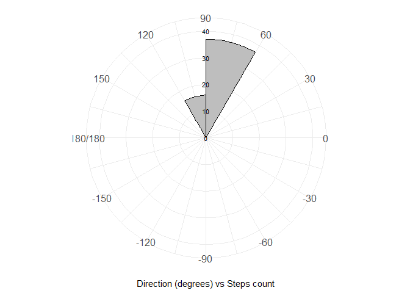

<!-- README.md is generated from README.Rmd. Please edit that file -->

# QuAnTeTrack

<!-- badges: start -->

[](https://CRAN.R-project.org/package=QuAnTeTrack)
[](https://github.com/MacroFunUV/QuAnTeTrack/actions/workflows/R-CMD-check.yaml)
<!-- badges: end -->

Studying fossil vertebrate trackways is crucial as they provide valuable
insights into the behavior, locomotion, and environmental interactions
of extinct species, offering a dynamic perspective on prehistoric life
that skeletal remains alone cannot. Here, I present **QuAnTeTrack**, an
integrated tool designed to **semi-automatically extract
palaeobiological information** by digitizing footprint and trackway
coordinates and analyzing them within the R environment.

QuAnTeTrack includes functions to read footprint coordinates and
trackways stored as **.TPS files**, transforming them into **“track”
objects**. These objects can be used to **calculate and plot key
parameters** such as **turning angles, trackway distances, step lengths,
sinuosity, and straightness**. Additional functions enable the
**quantification of velocity** and the testing of scenarios involving
**acceleration, deceleration, or stable velocity**, as well as comparing
velocity differences between tracks.

The tool also supports **visualizing movement patterns**, plotting
tracks according to velocity. Furthermore, **QuAnTeTrack facilitates the
testing of hypotheses related to gregarious behavior or predatory
events**. For interactions involving multiple tetrapods, such as **group
movement or predation**, trackways are expected to covary more
significantly and present fewer intersections than those generated by
independent events. QuAnTeTrack estimates this by computing **Frechet
and Dynamic Time Warping (DTW) trajectory similarity metrics** and
**quantifying track intersections**. These metrics are evaluated through
**random simulation procedures** to determine how actual trackway
similarities differ from randomly generated ones under various
scenarios, including **geographical constraints and resource
directionality**.

## Installation

You can install the development version of QuAnTeTrack from
[GitHub](https://github.com/) with:

``` r
# install.packages("devtools")
devtools::install_github("MacroFunUV/QuAnTeTrack")
```

## Example

``` r
library(QuAnTeTrack)
```

Example 1: Paluxy River Dataset

``` r
tpsPaluxyRiver <- system.file("extdata", "PaluxyRiver.tps", package = "QuAnTeTrack")
PaluxyRiver <- tps_to_track(tpsPaluxyRiver, scale = 0.004341493, missing = FALSE, NAs = NULL)
```

```
#> $Trajectories
#> $Trajectories$Track_1
#>            x         y        IMAGE ID time
#> 1  0.7554198  1.026763 Sauropod.png  0 0.00
#> 2  0.8313959  1.680158 Sauropod.png  0 0.02
#> 3  0.9703237  2.292308 Sauropod.png  0 0.04
#> 4  1.0680073  2.850190 Sauropod.png  0 0.06
#> 5  1.1656909  3.375511 Sauropod.png  0 0.08
#> 6  1.3176431  3.929051 Sauropod.png  0 0.10
#> 7  1.4934736  4.532519 Sauropod.png  0 0.12
#> 8  1.6606211  5.112108 Sauropod.png  0 0.14
#> 9  1.8234271  5.663478 Sauropod.png  0 0.16
#> 10 1.9970868  6.219189 Sauropod.png  0 0.18
#> 11 2.0795751  6.655509 Sauropod.png  0 0.20
#> 12 2.1012826  7.120049 Sauropod.png  0 0.22
#> 13 2.1642343  7.701809 Sauropod.png  0 0.24
#> 14 2.2402104  8.290081 Sauropod.png  0 0.26
#> 15 2.3009913  8.854475 Sauropod.png  0 0.28
#> 16 2.3747967  9.384137 Sauropod.png  0 0.30
#> 17 2.4898462  9.933336 Sauropod.png  0 0.32
#> 18 2.5983836 10.543316 Sauropod.png  0 0.34
#> 19 2.6548230 11.146783 Sauropod.png  0 0.36
#> 20 2.6743597 11.824056 Sauropod.png  0 0.38
#> 21 2.6396277 12.429694 Sauropod.png  0 0.40
#> 22 2.5636516 12.955015 Sauropod.png  0 0.42
#> 23 2.4985292 13.417384 Sauropod.png  0 0.44
#> 24 2.4268946 13.949217 Sauropod.png  0 0.46
#> 25 2.3530892 14.589587 Sauropod.png  0 0.48
#> 26 2.3053328 15.195226 Sauropod.png  0 0.50
#> 27 2.2488934 15.790010 Sauropod.png  0 0.52
#> 28 2.1859417 16.386965 Sauropod.png  0 0.54
#> 29 2.1121363 17.059897 Sauropod.png  0 0.56
#>    displacementTime               polar
#> 1              0.00 0.755420+ 1.026763i
#> 2              0.02 0.831396+ 1.680158i
#> 3              0.04 0.970324+ 2.292308i
#> 4              0.06 1.068007+ 2.850190i
#> 5              0.08 1.165691+ 3.375511i
#> 6              0.10 1.317643+ 3.929051i
#> 7              0.12 1.493474+ 4.532519i
#> 8              0.14 1.660621+ 5.112108i
#> 9              0.16 1.823427+ 5.663478i
#> 10             0.18 1.997087+ 6.219189i
#> 11             0.20 2.079575+ 6.655509i
#> 12             0.22 2.101283+ 7.120049i
#> 13             0.24 2.164234+ 7.701809i
#> 14             0.26 2.240210+ 8.290081i
#> 15             0.28 2.300991+ 8.854475i
#> 16             0.30 2.374797+ 9.384137i
#> 17             0.32 2.489846+ 9.933336i
#> 18             0.34 2.598384+10.543316i
#> 19             0.36 2.654823+11.146783i
#> 20             0.38 2.674360+11.824056i
#> 21             0.40 2.639628+12.429694i
#> 22             0.42 2.563652+12.955015i
#> 23             0.44 2.498529+13.417384i
#> 24             0.46 2.426895+13.949217i
#> 25             0.48 2.353089+14.589587i
#> 26             0.50 2.305333+15.195226i
#> 27             0.52 2.248893+15.790010i
#> 28             0.54 2.185942+16.386965i
#> 29             0.56 2.112136+17.059897i
#>             displacement
#> 1   0.0000000+0.0000000i
#> 2   0.0759761+0.6533947i
#> 3   0.1389278+0.6121505i
#> 4   0.0976836+0.5578819i
#> 5   0.0976836+0.5253207i
#> 6   0.1519523+0.5535404i
#> 7   0.1758305+0.6034675i
#> 8   0.1671475+0.5795893i
#> 9   0.1628060+0.5513696i
#> 10  0.1736597+0.5557111i
#> 11  0.0824884+0.4363200i
#> 12  0.0217075+0.4645398i
#> 13  0.0629516+0.5817601i
#> 14  0.0759761+0.5882723i
#> 15  0.0607809+0.5643941i
#> 16  0.0738054+0.5296621i
#> 17  0.1150496+0.5491989i
#> 18  0.1085373+0.6099798i
#> 19  0.0564394+0.6034675i
#> 20  0.0195367+0.6772729i
#> 21 -0.0347319+0.6056383i
#> 22 -0.0759761+0.5253207i
#> 23 -0.0651224+0.4623690i
#> 24 -0.0716346+0.5318329i
#> 25 -0.0738054+0.6403702i
#> 26 -0.0477564+0.6056383i
#> 27 -0.0564394+0.5947845i
#> 28 -0.0629516+0.5969553i
#> 29 -0.0738054+0.6729314i
#> 
#> $Trajectories$Track_2
#>            x         y        IMAGE ID time
#> 1  0.3646854  1.693182 Theropod.png  1 0.00
#> 2  0.4927595  2.279284 Theropod.png  1 0.02
#> 3  0.5730771  2.891434 Theropod.png  1 0.04
#> 4  0.7206878  3.564366 Theropod.png  1 0.06
#> 5  0.9095428  4.213419 Theropod.png  1 0.08
#> 6  1.0897147  4.884180 Theropod.png  1 0.10
#> 7  1.2959357  5.546257 Theropod.png  1 0.12
#> 8  1.4652539  6.171432 Theropod.png  1 0.14
#> 9  1.5564252  6.742339 Theropod.png  1 0.16
#> 10 1.6150354  7.304562 Theropod.png  1 0.18
#> 11 1.6736456  7.899347 Theropod.png  1 0.20
#> 12 1.7452802  8.494131 Theropod.png  1 0.22
#> 13 1.8690127  9.043330 Theropod.png  1 0.24
#> 14 2.0752337  9.724944 Theropod.png  1 0.26
#> 15 2.1208193 10.591072 Theropod.png  1 0.28
#> 16 2.2597471 11.277028 Theropod.png  1 0.30
#> 17 2.2467226 11.832739 Theropod.png  1 0.32
#> 18 2.1729172 12.405816 Theropod.png  1 0.34
#> 19 2.1186486 12.994089 Theropod.png  1 0.36
#> 20 2.0969411 13.667020 Theropod.png  1 0.38
#> 21 2.1989662 14.368171 Theropod.png  1 0.40
#> 22 2.3292110 15.112737 Theropod.png  1 0.42
#> 23 2.3986749 15.902889 Theropod.png  1 0.44
#> 24 2.2445519 16.708236 Theropod.png  1 0.46
#>    displacementTime               polar
#> 1              0.00 0.364685+ 1.693182i
#> 2              0.02 0.492759+ 2.279284i
#> 3              0.04 0.573077+ 2.891434i
#> 4              0.06 0.720688+ 3.564366i
#> 5              0.08 0.909543+ 4.213419i
#> 6              0.10 1.089715+ 4.884180i
#> 7              0.12 1.295936+ 5.546257i
#> 8              0.14 1.465254+ 6.171432i
#> 9              0.16 1.556425+ 6.742339i
#> 10             0.18 1.615035+ 7.304562i
#> 11             0.20 1.673646+ 7.899347i
#> 12             0.22 1.745280+ 8.494131i
#> 13             0.24 1.869013+ 9.043330i
#> 14             0.26 2.075234+ 9.724944i
#> 15             0.28 2.120819+10.591072i
#> 16             0.30 2.259747+11.277028i
#> 17             0.32 2.246723+11.832739i
#> 18             0.34 2.172917+12.405816i
#> 19             0.36 2.118649+12.994089i
#> 20             0.38 2.096941+13.667020i
#> 21             0.40 2.198966+14.368171i
#> 22             0.42 2.329211+15.112737i
#> 23             0.44 2.398675+15.902889i
#> 24             0.46 2.244552+16.708236i
#>             displacement
#> 1   0.0000000+0.0000000i
#> 2   0.1280740+0.5861016i
#> 3   0.0803176+0.6121505i
#> 4   0.1476108+0.6729314i
#> 5   0.1888549+0.6490532i
#> 6   0.1801720+0.6707607i
#> 7   0.2062209+0.6620777i
#> 8   0.1693182+0.6251750i
#> 9   0.0911714+0.5709063i
#> 10  0.0586102+0.5622233i
#> 11  0.0586102+0.5947845i
#> 12  0.0716346+0.5947845i
#> 13  0.1237326+0.5491989i
#> 14  0.2062209+0.6816144i
#> 15  0.0455857+0.8661279i
#> 16  0.1389278+0.6859559i
#> 17 -0.0130245+0.5557111i
#> 18 -0.0738054+0.5730771i
#> 19 -0.0542687+0.5882723i
#> 20 -0.0217075+0.6729314i
#> 21  0.1020251+0.7011511i
#> 22  0.1302448+0.7445660i
#> 23  0.0694639+0.7901517i
#> 24 -0.1541230+0.8053470i
#> 
#> 
#> $Footprints
#> $Footprints[[1]]
#>            X         Y        IMAGE ID missing
#> 1  0.9160550  0.633858 Sauropod.png  0  Actual
#> 2  0.5947845  1.419668 Sauropod.png  0  Actual
#> 3  1.0680073  1.940647 Sauropod.png  0  Actual
#> 4  0.8726401  2.643969 Sauropod.png  0  Actual
#> 5  1.2633745  3.056411 Sauropod.png  0  Actual
#> 6  1.0680073  3.694611 Sauropod.png  0  Actual
#> 7  1.5672790  4.163492 Sauropod.png  0  Actual
#> 8  1.4196682  4.901546 Sauropod.png  0  Actual
#> 9  1.9015739  5.322670 Sauropod.png  0  Actual
#> 10 1.7452802  6.004285 Sauropod.png  0  Actual
#> 11 2.2488934  6.434093 Sauropod.png  0  Actual
#> 12 1.9102569  6.876925 Sauropod.png  0  Actual
#> 13 2.2923083  7.363172 Sauropod.png  0  Actual
#> 14 2.0361602  8.040445 Sauropod.png  0  Actual
#> 15 2.4442606  8.539717 Sauropod.png  0  Actual
#> 16 2.1577220  9.169233 Sauropod.png  0  Actual
#> 17 2.5918713  9.599041 Sauropod.png  0  Actual
#> 18 2.3878212 10.267631 Sauropod.png  0  Actual
#> 19 2.8089460 10.819001 Sauropod.png  0  Actual
#> 20 2.5007000 11.474566 Sauropod.png  0  Actual
#> 21 2.8480194 12.173546 Sauropod.png  0  Actual
#> 22 2.4312361 12.685843 Sauropod.png  0  Actual
#> 23 2.6960672 13.224188 Sauropod.png  0  Actual
#> 24 2.3009913 13.610581 Sauropod.png  0  Actual
#> 25 2.5527979 14.287853 Sauropod.png  0  Actual
#> 26 2.1533805 14.891321 Sauropod.png  0  Actual
#> 27 2.4572850 15.499130 Sauropod.png  0  Actual
#> 28 2.0405017 16.080890 Sauropod.png  0  Actual
#> 29 2.3313817 16.693041 Sauropod.png  0  Actual
#> 30 1.8928909 17.426753 Sauropod.png  0  Actual
#> 
#> $Footprints[[2]]
#>            X         Y        IMAGE ID missing
#> 1  0.1866842  1.376253 Theropod.png  1  Actual
#> 2  0.5426866  2.010111 Theropod.png  1  Actual
#> 3  0.4428323  2.548456 Theropod.png  1  Actual
#> 4  0.7033219  3.234412 Theropod.png  1  Actual
#> 5  0.7380538  3.894319 Theropod.png  1  Actual
#> 6  1.0810318  4.532519 Theropod.png  1  Actual
#> 7  1.0983977  5.235841 Theropod.png  1  Actual
#> 8  1.4934736  5.856674 Theropod.png  1  Actual
#> 9  1.4370342  6.486191 Theropod.png  1  Actual
#> 10 1.6758163  6.998487 Theropod.png  1  Actual
#> 11 1.5542545  7.610637 Theropod.png  1  Actual
#> 12 1.7930366  8.188056 Theropod.png  1  Actual
#> 13 1.6975238  8.800206 Theropod.png  1  Actual
#> 14 2.0405017  9.286454 Theropod.png  1  Actual
#> 15 2.1099656 10.163435 Theropod.png  1  Actual
#> 16 2.1316731 11.018709 Theropod.png  1  Actual
#> 17 2.3878212 11.535347 Theropod.png  1  Actual
#> 18 2.1056241 12.130131 Theropod.png  1  Actual
#> 19 2.2402104 12.681501 Theropod.png  1  Actual
#> 20 1.9970868 13.306676 Theropod.png  1  Actual
#> 21 2.1967955 14.027364 Theropod.png  1  Actual
#> 22 2.2011370 14.708978 Theropod.png  1  Actual
#> 23 2.4572850 15.516496 Theropod.png  1  Actual
#> 24 2.3400647 16.289282 Theropod.png  1  Actual
#> 25 2.1490390 17.127190 Theropod.png  1  Actual
```

``` r
plot_track(PaluxyRiver)
```



Display track parameters within a scrollable box
`{r, echo=TRUE, message=FALSE, max.height='100px'}params_paluxy <- track_param(PaluxyRiver) print(params_paluxy)`

``` r
plot_direction(PaluxyRiver, plot_type = "polar_steps")
#> $Track_1
#> $Track_1$Turning_angles
#>  [1] 83.36749 77.21330 80.06835 79.46614 74.64986 73.75563
#>  [7] 73.91299 73.54942 72.64598 79.29432 87.32457 83.82411
#> [13] 82.64091 83.85337 82.06724 78.16842 79.91062 84.65694
#> [19] 88.34770 93.28218 98.22952 98.01709 97.67122 96.57457
#> [25] 94.50862 95.42060 96.01985 96.25904
#> 
#> $Track_1$Mean_turning_angle
#> [1] 85.16786
#> 
#> $Track_1$Standard_deviation_turning_angle
#> [1] 8.716076
#> 
#> $Track_1$Distance
#> [1] 16.09043
#> 
#> $Track_1$Length
#> [1] 16.2711
#> 
#> $Track_1$Step_lengths
#>  [1] 0.6577971 0.6277174 0.5663694 0.5343256 0.5740178
#>  [6] 0.6285614 0.6032098 0.5749037 0.5822135 0.4440490
#> [11] 0.4650467 0.5851561 0.5931582 0.5676575 0.5347796
#> [16] 0.5611201 0.6195609 0.6061010 0.6775546 0.6066334
#> [21] 0.5307864 0.4669326 0.5366356 0.6446094 0.6075182
#> [26] 0.5974563 0.6002654 0.6769667
#> 
#> $Track_1$Mean_step_length
#> [1] 0.5811108
#> 
#> $Track_1$Standard_deviation_step_length
#> [1] 0.05855971
#> 
#> $Track_1$Sinuosity
#> [1] 0.07738533
#> 
#> $Track_1$Straightness
#> [1] 0.9888963
#> 
#> 
#> $Track_2
#> $Track_2$Turning_angles
#>  [1]  77.67357  82.52517  77.62784  73.77659  74.96477
#>  [6]  72.69947  74.84593  80.92672  84.04858  84.37223
#> [11]  83.13249  77.30345  73.16693  86.98721  78.55066
#> [16]  91.34262  97.33861  95.27067  91.84761  81.72095
#> [21]  80.07781  84.97592 100.83397
#> 
#> $Track_2$Mean_turning_angle
#> [1] 82.86999
#> 
#> $Track_2$Standard_deviation_turning_angle
#> [1] 7.941837
#> 
#> $Track_2$Distance
#> [1] 15.13227
#> 
#> $Track_2$Length
#> [1] 15.27567
#> 
#> $Track_2$Step_lengths
#>  [1] 0.5999317 0.6173971 0.6889308 0.6759706 0.6945371
#>  [6] 0.6934507 0.6476978 0.5781403 0.5652701 0.5976653
#> [11] 0.5990828 0.5629646 0.7121273 0.8673266 0.6998831
#> [16] 0.5558637 0.5778101 0.5907702 0.6732814 0.7085351
#> [21] 0.7558719 0.7931992 0.8199620
#> 
#> $Track_2$Mean_step_length
#> [1] 0.6641595
#> 
#> $Track_2$Standard_deviation_step_length
#> [1] 0.08686601
#> 
#> $Track_2$Sinuosity
#> [1] 0.1466281
#> 
#> $Track_2$Straightness
#> [1] 0.9906128
```


``` r
H_paluxyriver <- c(3.472, 2.200)
Method_paluxyriver <- c("A", "B")
velocity_paluxyriver <- velocity_track(PaluxyRiver, H = H_paluxyriver, method = Method_paluxyriver)
```

```
#> $Track_1
#> $Track_1$Step_velocities
#>  [1] 0.2884087 0.2667234 0.2246319 0.2038125 0.2297207
#>  [6] 0.2673225 0.2495612 0.2303131 0.2352243 0.1496251
#> [11] 0.1616271 0.2372131 0.2426553 0.2254857 0.2041018
#> [16] 0.2211659 0.2609607 0.2515620 0.3030204 0.2519311
#> [21] 0.2015630 0.1627231 0.2052861 0.2788176 0.2525451
#> [26] 0.2455988 0.2475302 0.3025814
#> 
#> $Track_1$Mean_velocity
#> [1] 0.2357754
#> 
#> $Track_1$Standard_deviation_velocity
#> [1] 0.03865919
#> 
#> $Track_1$Maximum_velocity
#> [1] 0.3030204
#> 
#> $Track_1$Minimum_velocity
#> [1] 0.1496251
#> 
#> $Track_1$Step_relative_stride
#>  [1] 0.3789154 0.3615884 0.3262496 0.3077913 0.3306554
#>  [6] 0.3620745 0.3474711 0.3311657 0.3353764 0.2557886
#> [11] 0.2678840 0.3370715 0.3416810 0.3269916 0.3080528
#> [16] 0.3232259 0.3568899 0.3491365 0.3902964 0.3494432
#> [21] 0.3057525 0.2689704 0.3091219 0.3713188 0.3499529
#> [26] 0.3441569 0.3457750 0.3899578
#> 
#> $Track_1$Mean_relative_stride
#> [1] 0.3347413
#> 
#> $Track_1$Standard_deviation_relative_stride
#> [1] 0.03373255
#> 
#> $Track_1$Maximum_relative_stride
#> [1] 0.3902964
#> 
#> $Track_1$Minimum_relative_stride
#> [1] 0.2557886
#> 
#> 
#> $Track_2
#> $Track_2$Step_velocities
#>  [1] 0.3812738 0.3999907 0.4803527 0.4653572 0.4868985
#>  [6] 0.4856273 0.4333103 0.3584286 0.3452030 0.3788715
#> [11] 0.3803733 0.3428550 0.5076662 0.7056220 0.4931734
#> [16] 0.3356635 0.3580868 0.3716003 0.4622697 0.5033969
#> [21] 0.5608097 0.6078206 0.6424547
#> 
#> $Track_2$Mean_velocity
#> [1] 0.4559611
#> 
#> $Track_2$Standard_deviation_velocity
#> [1] 0.1015011
#> 
#> $Track_2$Maximum_velocity
#> [1] 0.705622
#> 
#> $Track_2$Minimum_velocity
#> [1] 0.3356635
#> 
#> $Track_2$Step_relative_stride
#>  [1] 0.5453924 0.5612701 0.6263007 0.6145187 0.6313974
#>  [6] 0.6304098 0.5888162 0.5255821 0.5138819 0.5433321
#> [11] 0.5446207 0.5117860 0.6473884 0.7884788 0.6362574
#> [16] 0.5053306 0.5252820 0.5370638 0.6120740 0.6441228
#> [21] 0.6871563 0.7210902 0.7454200
#> 
#> $Track_2$Mean_relative_stride
#> [1] 0.6037814
#> 
#> $Track_2$Standard_deviation_relative_stride
#> [1] 0.0789691
#> 
#> $Track_2$Maximum_relative_stride
#> [1] 0.7884788
#> 
#> $Track_2$Minimum_relative_stride
#> [1] 0.5053306
```

``` r
print(velocity_paluxyriver)
```

```
#> $Track_1
#> $Track_1$Step_velocities
#>  [1] 0.2884087 0.2667234 0.2246319 0.2038125 0.2297207
#>  [6] 0.2673225 0.2495612 0.2303131 0.2352243 0.1496251
#> [11] 0.1616271 0.2372131 0.2426553 0.2254857 0.2041018
#> [16] 0.2211659 0.2609607 0.2515620 0.3030204 0.2519311
#> [21] 0.2015630 0.1627231 0.2052861 0.2788176 0.2525451
#> [26] 0.2455988 0.2475302 0.3025814
#> 
#> $Track_1$Mean_velocity
#> [1] 0.2357754
#> 
#> $Track_1$Standard_deviation_velocity
#> [1] 0.03865919
#> 
#> $Track_1$Maximum_velocity
#> [1] 0.3030204
#> 
#> $Track_1$Minimum_velocity
#> [1] 0.1496251
#> 
#> $Track_1$Step_relative_stride
#>  [1] 0.3789154 0.3615884 0.3262496 0.3077913 0.3306554
#>  [6] 0.3620745 0.3474711 0.3311657 0.3353764 0.2557886
#> [11] 0.2678840 0.3370715 0.3416810 0.3269916 0.3080528
#> [16] 0.3232259 0.3568899 0.3491365 0.3902964 0.3494432
#> [21] 0.3057525 0.2689704 0.3091219 0.3713188 0.3499529
#> [26] 0.3441569 0.3457750 0.3899578
#> 
#> $Track_1$Mean_relative_stride
#> [1] 0.3347413
#> 
#> $Track_1$Standard_deviation_relative_stride
#> [1] 0.03373255
#> 
#> $Track_1$Maximum_relative_stride
#> [1] 0.3902964
#> 
#> $Track_1$Minimum_relative_stride
#> [1] 0.2557886
#> 
#> 
#> $Track_2
#> $Track_2$Step_velocities
#>  [1] 0.3812738 0.3999907 0.4803527 0.4653572 0.4868985
#>  [6] 0.4856273 0.4333103 0.3584286 0.3452030 0.3788715
#> [11] 0.3803733 0.3428550 0.5076662 0.7056220 0.4931734
#> [16] 0.3356635 0.3580868 0.3716003 0.4622697 0.5033969
#> [21] 0.5608097 0.6078206 0.6424547
#> 
#> $Track_2$Mean_velocity
#> [1] 0.4559611
#> 
#> $Track_2$Standard_deviation_velocity
#> [1] 0.1015011
#> 
#> $Track_2$Maximum_velocity
#> [1] 0.705622
#> 
#> $Track_2$Minimum_velocity
#> [1] 0.3356635
#> 
#> $Track_2$Step_relative_stride
#>  [1] 0.5453924 0.5612701 0.6263007 0.6145187 0.6313974
#>  [6] 0.6304098 0.5888162 0.5255821 0.5138819 0.5433321
#> [11] 0.5446207 0.5117860 0.6473884 0.7884788 0.6362574
#> [16] 0.5053306 0.5252820 0.5370638 0.6120740 0.6441228
#> [21] 0.6871563 0.7210902 0.7454200
#> 
#> $Track_2$Mean_relative_stride
#> [1] 0.6037814
#> 
#> $Track_2$Standard_deviation_relative_stride
#> [1] 0.0789691
#> 
#> $Track_2$Maximum_relative_stride
#> [1] 0.7884788
#> 
#> $Track_2$Minimum_relative_stride
#> [1] 0.5053306
```

# Example 2: Mount Tom Dataset

tpsMountTom \<- system.file(“extdata”, “MountTom.tps”, package =
“QuAnTeTrack”) NAs \<- matrix(c(7, 3), nrow = 1, ncol = 2) MountTom \<-
tps_to_track(tpsMountTom, scale = 0.004411765, missing = TRUE, NAs =
NAs, R.L.side = c(“R”, “L”, “L”, “L”, “R”, “L”, “R”, “R”, “L”, “L”, “L”,
“L”, “L”, “R”, “R”, “L”, “R”, “R”, “L”, “R”, “R”, “R”, “R”))
plot_track(MountTom)

# Display track parameters within a scrollable box

params_mounttom \<- track_param(MountTom) print(params_mounttom)

plot_direction(MountTom, plot_type = “polar_steps”)

H_mounttom \<- c(1.380, 1.404, 1.320, 1.736, 1.364, 1.432, 1.508, 1.768,
1.600, 1.848, 1.532, 1.532, 0.760, 1.532, 1.688, 1.620, 0.636, 1.784,
1.676, 1.872, 1.648, 1.760, 1.612) velocity_mounttom \<-
velocity_track(MountTom, H = H_mounttom) print(velocity_mounttom)

\`\`\`
