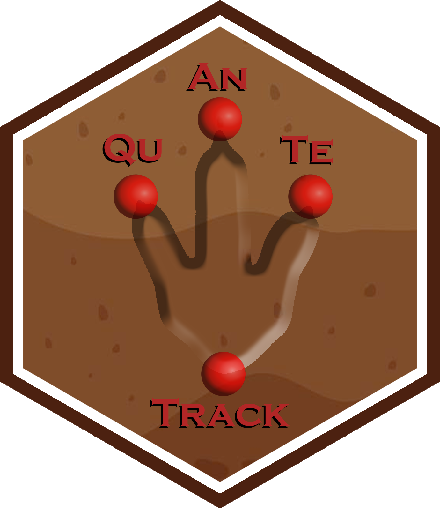

# Cluster tracks based on movement parameters

`cluster_track()` clusters trajectories based on various movement and
velocity parameters calculated for each track.

## Usage

``` r
cluster_track(
  data,
  veltrack,
  variables,
  analysis = c("hclust", "mclust"),
  k = 2,
  dist_method = "euclidean",
  hclust_method = "complete",
  transform = TRUE,
  scale = TRUE,
  max_clusters = NULL,
  gauge_size = NA
)
```

## Arguments

- data:

  A `track` R object, which is a list consisting of two elements:

  - **`Trajectories`**: A list of interpolated trajectories, where each
    trajectory is a series of midpoints between consecutive footprints.

  - **`Footprints`**: A list of data frames containing footprint
    coordinates, metadata (e.g., image reference, ID), and a marker
    indicating whether the footprint is actual or inferred.

- veltrack:

  A `track velocity` R object consisting of a list of lists, where each
  sublist contains the computed parameters for a corresponding track.

- variables:

  A character vector specifying the movement parameters to be used in
  the clustering analysis. Valid parameter names include: `"TurnAng"`,
  `"sdTurnAng"`, `"PathLen"`, `"BeelineLen"`, `"StLength"`,
  `"sdStLength"`, `"StrideLen"`, `"PaceLen"`, `"Sinuosity"`,
  `"Straightness"`, `"TrackWidth"`, `"Gauge"`, `"PaceAng"`, `"StepAng"`,
  `"Velocity"`, `"sdVelocity"`, `"MaxVelocity"`, `"MinVelocity"`.

- analysis:

  Character; clustering backend. One of `"hclust"` (default;
  distance-based hierarchical clustering) or `"mclust"` (model-based
  Gaussian mixtures).

- k:

  Integer or `NULL`; number of clusters to cut the dendrogram when
  `analysis = "hclust"`. Default `2`. If `NULL`, no cut is made and
  `classification` is returned as `NULL`.

- dist_method:

  Character; distance used when `analysis = "hclust"`. One of
  `"euclidean"` (default), `"maximum"`, `"manhattan"`, `"canberra"`,
  `"binary"`, or `"minkowski"`.

- hclust_method:

  Character; agglomeration method when `analysis = "hclust"`. One of
  `"complete"` (default), `"ward.D"`, `"ward.D2"`, `"single"`,
  `"average"` (= UPGMA), `"mcquitty"` (= WPGMA), `"median"` (= WPGMC),
  or `"centroid"` (= UPGMC).

- transform:

  Logical; if `TRUE` (default), applies monotone transformations suited
  to variable support (e.g., log/logit) before clustering.

- scale:

  Logical; if `TRUE` (default), z-transforms (centers and scales) the
  variables used in clustering.

- max_clusters:

  Integer. Maximum number of clusters (mixture components) to consider
  when `analysis = "mclust"`. If `NULL` (default), uses `min(9, n)`,
  where `n` is the number of valid tracks (observations) entering the
  model. The minimum number of clusters considered by default is `1`.

- gauge_size:

  Numeric. Pes/manus length (or width) used to compute Gauge as
  `TrackWidth / gauge_size`. If `NULL` or `NA`, Gauge is returned as
  `NA`. If `"Gauge"` is included in `variables`, `gauge_size` must be a
  single positive numeric value.

## Value

A track clustering R object consisting of a list containing the
following elements:

- `matrix`: A data frame containing the movement parameters calculated
  for each track (original scale/units as produced by
  [`track_param()`](https://macrofunuv.github.io/QuAnTeTrack/reference/track_param.md)
  and
  [`velocity_track()`](https://macrofunuv.github.io/QuAnTeTrack/reference/velocity_track.md)).

- `clust`:

  - When `analysis = "hclust"`: a list with:

    - `hclust`: The
      [`stats::hclust`](https://rdrr.io/r/stats/hclust.html) object
      (dendrogram and merge history).

    - `dist`: The [`stats::dist`](https://rdrr.io/r/stats/dist.html)
      object used to fit `hclust`.

    - `k`: The requested number of clusters used to cut the tree (if
      provided).

    - `classification`: Cluster labels obtained by
      `stats::cutree(hclust, k)`; `NULL` if `k = NULL`.

  - When `analysis = "mclust"`: an `Mclust` object containing the
    results of the model-based clustering analysis (optimal model
    selected by BIC). Main components include:

    - `call`: The matched call.

    - `data`: The input data matrix used by `Mclust`.

    - `modelName`: The covariance model at which the optimal BIC occurs.

    - `n`: Number of observations.

    - `d`: Data dimensionality.

    - `G`: Optimal number of mixture components.

    - `BIC`: Matrix of BIC values for models and components considered.

    - `loglik`: Log-likelihood for the selected model.

    - `df`: Number of estimated parameters.

    - `bic`: BIC value of the selected model.

    - `icl`: ICL value of the selected model.

    - `hypvol`: Hypervolume parameter for the noise component (if
      applicable), otherwise `NULL`.

    - `parameters`: List of fitted parameters, including:

      - `pro`: Mixing proportions (length `G`).

      - `mean`: Component means (vector or matrix with columns as
        components).

      - `variance`: List of variance parameters (structure depends on
        `modelName`).

    - `z`: Matrix of posterior probabilities; entry `(i, k)` is
      P(observation `i` in class `k`).

    - `classification`: Hard labels (MAP from `z`).

    - `uncertainty`: Classification uncertainty for each observation.

## Details

The `cluster_track()` function can perform distance-based hierarchical
clustering via the [`hclust()`](https://rdrr.io/r/stats/hclust.html)
function from the stats package (`analysis = "hclust"`, default) or
model-based clustering via the `Mclust()` function from the mclust
package (`analysis = "mclust"`).

The function first filters out tracks with fewer than four steps, as
these tracks may not provide reliable movement data. It then computes
movement/trackway parameters via
[`track_param()`](https://macrofunuv.github.io/QuAnTeTrack/reference/track_param.md)
(turning angles; path and beeline lengths; step/stride/pace;
sinuosity/straightness; and footprint-based metrics such as trackway
width, gauge, pace angulation and step angle) and combines them with
velocity descriptors from `veltrack`. The selected variables are then
used for clustering. Finally, the selected movement parameters are used
as input for clustering the tracks.

When `analysis = "hclust"`: the function performs agglomerative
hierarchical clustering on a pairwise dissimilarity matrix computed from
the working feature matrix (which already reflects the internal
expansion of circular variables to sine/cosine components, and any
requested transformations and z-scaling).

The algorithm starts with each track as its own cluster and iteratively
merges the two closest clusters according to the chosen `hclust_method`
(linkage criterion) until a single cluster remains. The full merge
history is represented by a dendrogram that can be inspected and cut at
any desired number of clusters.

Advantages include being distribution-free, since the method does not
assume Gaussianity or any parametric mixture form. It is also flexible,
supporting multiple distance metrics, and highly interpretable, as the
dendrogram reveals multiscale clustering structure. In addition, the
number of clusters does not need to be fixed in advance, since it can be
chosen a posteriori by cutting the tree. Disadvantages are that the
greedy nature of the algorithm makes merges irreversible, so no
reassignment is possible once clusters are combined. Results can also be
sensitive to variable scaling, as well as the choice of distance metric
and linkage method. Certain linkage strategies, such as `"median"` or
`"centroid"`, may produce dendrogram inversions, and the `"ward.*"`
methods require Euclidean geometry to preserve their
variance-minimization interpretation.

If `transform = TRUE` and/or `scale = TRUE`, the distance is computed on
the transformed/scaled space. This is generally recommended so that
variables on different scales do not dominate the distances. Missing
values in the selected variables will cause
[`stats::dist()`](https://rdrr.io/r/stats/dist.html) to fail; ensure
inputs are complete (or impute externally) before clustering.

The argument `k` controls the number of clusters to cut the dendrogram.
By default it is set to `2`. If `NULL`, no cut is made and
`classification` is returned as `NULL`. Setting `k = 1` yields a single
cluster containing all tracks.

The argument `dist_method` specifies the distance metric used to build
the dissimilarity matrix, passed to
[`stats::dist`](https://rdrr.io/r/stats/dist.html). For a detailed
explanation of distance metrics see
[`?dist`](https://rdrr.io/r/stats/dist.html).

The argument `hclust_method` specifies the agglomeration (linkage)
method used for hierarchical clustering, passed to
[`stats::hclust`](https://rdrr.io/r/stats/hclust.html). For a detailed
explanation of linkage procedures see
[`?hclust`](https://rdrr.io/r/stats/hclust.html).

When `analysis = "mclust"`, clustering is performed using finite
Gaussian mixture models via the `Mclust()` function from the mclust
package. This approach assumes that the data are generated from a
mixture of multivariate Gaussian distributions, and selects both the
number of mixture components and the covariance parameterization by
optimizing the Bayesian Information Criterion (BIC).

Advantages include statistical rigor, automatic model selection, and the
ability to capture ellipsoidal cluster shapes. Limitations are the
reliance on distributional assumptions (normality, homoscedasticity
depending on the model), potential sensitivity to outliers, and
increased computational cost for high-dimensional data. These
assumptions are partially mitigated by the variable transformations
applied before clustering (e.g., log or logit transforms), which help
approximate Gaussian-like distributions.

If only one parameter is selected, the clustering is performed using
equal variance ("E") and variable variance ("V") Gaussian models. If
more than one parameter is selected, all covariance models available in
`mclust.options("emModelNames")` are considered.

The argument `max_clusters` controls the maximum number of clusters
(mixture components) to be explored. If `NULL` (default), the maximum is
set to `min(9, n)`, where `n` is the number of valid tracks
(observations) entering the model. The minimum number of clusters
considered by default is `1`.

The following movement parameters can be included in the clustering:

- `"TurnAng"`: Turning angles for the track, measured in degrees.
  Internally expanded to sine and cosine components (circular treatment)
  before analysis. This measures how much the direction of movement
  changes at each step.

- `"sdTurnAng"`: The circular standard deviation of the turning angles,
  in degrees. Internally expanded to sine and cosine components before
  analysis to respect angular geometry.

- `"PathLen"`: Total path length (meters), computed as the sum of
  distances between consecutive trajectory points.

- `"BeelineLen"`: Straight-line distance (meters) between the first and
  last points of the trajectory.

- `"StLength"`: Mean step length for each step of the track (meters),
  representing how far the object moved between two consecutive
  trajectory points.

- `"sdStLength"`: The standard deviation of the step lengths (meters),
  showing how consistent the steps are in length.

- `"StrideLen"`: Mean stride length (meters). In the current
  implementation this is computed as `Mean_step_length * 2`.

- `"PaceLen"`: Mean pace length (meters), computed as the mean distance
  between consecutive contralateral footprints (L–R or R–L) in footprint
  order.

- `"Sinuosity"`: A measure of the track's winding nature
  (dimensionless).

- `"Straightness"`: The straightness of the track (dimensionless).

- `"TrackWidth"`: Trackway width, i.e., the lateral spacing between left
  and right footprint series (units consistent with input coordinates,
  typically meters).

- `"Gauge"`: Trackway gauge (dimensionless), computed as
  `TrackWidth / gauge_size`.

- `"PaceAng"`: Pace angulation (degrees), a classical ichnological
  descriptor summarizing the angular relation of successive steps within
  a trackway.

- `"StepAng"`: Mean step angle (degrees), computed as the mean angle
  between each pace segment and the inferred stride/trackway axis
  estimated by PCA.

- `"Velocity"`: The average velocity of the track, calculated as the
  total distance divided by the time elapsed between the first and last
  footprint (meters per second).

- `"sdVelocity"`: The standard deviation of the velocity, indicating how
  much the velocity fluctuates throughout the track (meters per second).

- `"MaxVelocity"`: The maximum velocity achieved during the track,
  identifying the fastest point (meters per second).

- `"MinVelocity"`: The minimum velocity during the track, identifying
  the slowest point (meters per second).

The `cluster_track()` function has biological relevance in identifying
groups of tracks with similar movement parameters, providing insights
into ecological and behavioral patterns. By clustering tracks based on
characteristics such as sinuosity, velocity, and turning angles (treated
circularly via sine/cosine), it helps detect movement patterns
associated with specific behaviors. This can reveal tracks potentially
made by individuals moving together, useful for investigating hypotheses
on gregarious behavior, predation strategies, or coordinated movement.
Additionally, clustering serves as a preliminary step before similarity
tests and simulations, refining track selection and improving hypothesis
testing in movement ecology studies.

## Logo



## References

Alexander, R. M. (1976). Estimates of speeds of dinosaurs. Nature,
261(5556), 129-130.

Ruiz, J., & Torices, A. (2013). Humans running at stadiums and beaches
and the accuracy of speed estimations from fossil trackways. Ichnos,
20(1), 31-35.

Scrucca L., Fop M., Murphy T. B., & Raftery A. E. (2016) mclust 5:
clustering, classification and density estimation using Gaussian finite
mixture models. The R Journal, 8(1), 289-317.

## See also

[`track_param`](https://macrofunuv.github.io/QuAnTeTrack/reference/track_param.md),
[`velocity_track`](https://macrofunuv.github.io/QuAnTeTrack/reference/velocity_track.md),
[`Mclust`](https://mclust-org.github.io/mclust/reference/Mclust.html),
[`hclust`](https://rdrr.io/r/stats/hclust.html)

## Author

Humberto G. Ferrón

humberto.ferron@uv.es

Macroevolution and Functional Morphology Research Group
(www.macrofun.es)

Cavanilles Institute of Biodiversity and Evolutionary Biology

Calle Catedrático José Beltrán Martínez, nº 2

46980 Paterna - Valencia - Spain

Phone: +34 (9635) 44477
