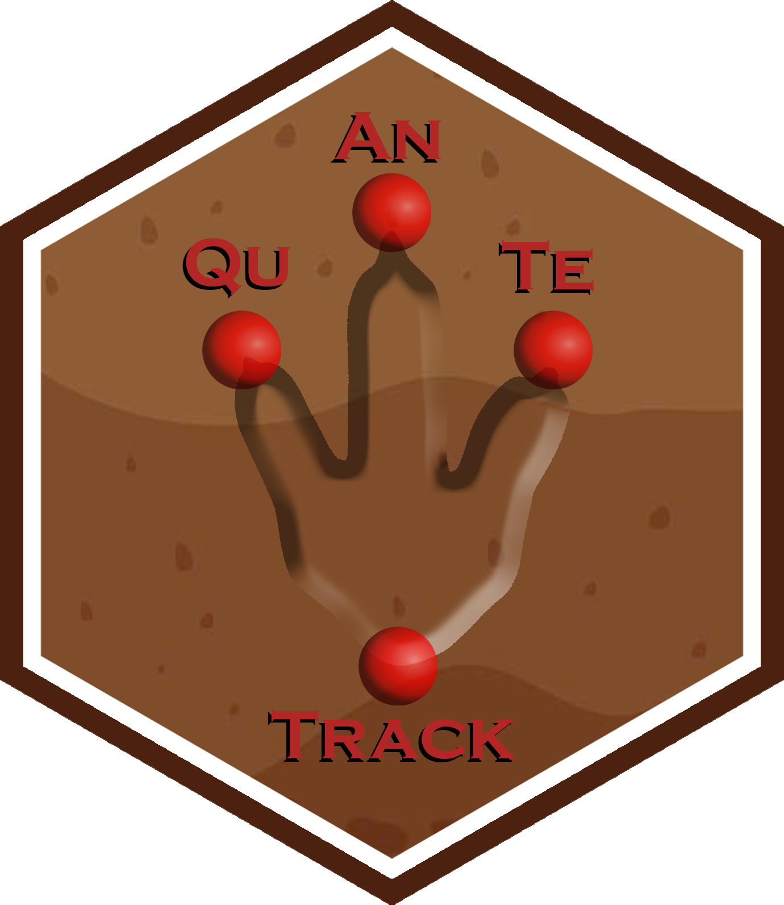

# Similarity metric using Dynamic Time Warping (DTW)

`simil_DTW_metric()` computes similarity metrics between two or more
trajectories using Dynamic Time Warping (DTW). It allows for different
superposition methods to align trajectories before calculating the DTW
metric. The function also supports testing with simulations to calculate
*p*-values for the DTW distance metrics.

## Usage

``` r
simil_DTW_metric(data, test = FALSE, sim = NULL, superposition = "None")
```

## Arguments

- data:

  A `track` R object, which is a list consisting of two elements:

  - **`Trajectories`**: A list of interpolated trajectories, where each
    trajectory is a series of midpoints between consecutive footprints.

  - **`Footprints`**: A list of data frames containing footprint
    coordinates, metadata (e.g., image reference, ID), and a marker
    indicating whether the footprint is actual or inferred.

- test:

  Logical; if `TRUE`, the function compares the observed DTW distances
  against simulated trajectories and calculates *p*-values. Default is
  `FALSE`.

- sim:

  A `track simulation` R object consisting of a list of simulated
  trajectories to use for comparison when `test = TRUE`.

- superposition:

  A character string indicating the method used to align trajectories.
  Options are `"None"`, `"Centroid"`, or `"Origin"`. Default is
  `"None"`.

## Value

A `track similarity` R object consisting of a list containing the
following elements:

- DTW_distance_metric:

  A numeric matrix of pairwise Dynamic Time Warping (DTW) distances
  between trajectories. Each entry represents the DTW distance between
  the corresponding pair of trajectories.

- DTW_distance_metric_p_values:

  (If `test = TRUE`) A numeric matrix of raw pairwise *p*-values,
  computed by Monte Carlo tail tests with the (+1) correction (Phipson &
  Smyth, 2010): \$\$p = (1 + \\\\\text{extreme}\\) / (nsim + 1)\$\$.
  Each entry reflects the probability of observing a DTW distance as
  extreme as the observed one, given the null hypothesis of no
  difference.

- DTW_distance_metric_p_values_BH:

  (If `test = TRUE`) A numeric matrix of Benjamini–Hochberg (BH)
  adjusted *p*-values controlling the false discovery rate (FDR),
  applied across the set of unique pairwise tests (Benjamini & Hochberg,
  1995).

- DTW_metric_p_values_combined:

  (If `test = TRUE`) A single numeric value representing the combined
  *p*-value across all DTW distances (based on a global dominance
  criterion, evaluating in how many simulations the observed distances
  are smaller than the simulated ones across all trajectory pairs
  simultaneously). This indicates the overall significance of the
  observed DTW distances relative to simulations.

- DTW_distance_metric_simulations:

  (If `test = TRUE`) A list containing matrices of DTW distances for
  each simulation iteration, allowing for inspection of the distribution
  of DTW distances across randomized scenarios.

## Details

The `simil_DTW_metric()` function calculates the similarity between
trajectories using the Dynamic Time Warping (DTW) algorithm from the dtw
package. The `dtw()` function is used with the `dist.method` argument
set to `"Euclidean"` for computing the local distances between points in
the trajectories.

DTW aligns two time series by minimizing the cumulative distance between
their points, creating an optimal alignment despite variations in length
or temporal distortions. The algorithm constructs a distance matrix
where each element represents the cost of aligning points between the
two series and finds a warping path through this matrix that minimizes
the total distance. The warping path is contiguous and monotonic,
starting from the bottom-left corner and ending at the top-right corner
(Cleasby et al., 2019).

DTW measures are non-negative and unbounded, with larger values
indicating greater dissimilarity between the time series. This method
has been used in various contexts, including ecological studies to
analyze and cluster trajectory data (Cleasby et al., 2019).

Potential limitations and biases of DTW include sensitivity to noise and
outliers, computational complexity, and the need for appropriate
distance metrics. Additionally, DTW may not always account for all
structural differences between trajectories and can be biased by the
chosen alignment constraints. While DTW can handle trajectories of
different lengths due to its elastic nature, having trajectories of
similar lengths can improve the accuracy and interpretability of the
similarity measure. Similar lengths result in a more meaningful
alignment and can make the computation more efficient. When trajectories
differ significantly in length, preprocessing or normalization might be
necessary, and careful analysis is required to understand the alignment
path. The function’s flexibility in handling different lengths allows it
to be applied in various contexts. However, large differences in
trajectory lengths might introduce potential biases that should be
considered when interpreting the results.

The function offers three different superposition methods to align the
trajectories before `DTW()` is applied:

- `"None"`: No superposition is applied.

- `"Centroid"`: Trajectories are shifted to align based on their
  centroids.

- `"Origin"`: Trajectories are shifted to align based on their starting
  point.

If `test = TRUE`, the function can compute *p*-values by comparing the
observed DTW distances with those generated from a set of simulated
trajectories. The *p*-values are calculated for both individual
trajectory pairs and for the entire set of trajectories. Pairwise
*p*-values are computed with a Monte Carlo tail test using the (+1)
correction to avoid zero-values (see Phipson & Smyth, 2010): \$\$p =
(1 + \\\\\text{extreme}\\) / (nsim + 1)\$\$

These raw *p*-values are then adjusted for multiple comparisons across
the set of unique pairwise tests using the Benjamini–Hochberg (BH)
procedure for false discovery rate (FDR) control (Benjamini & Hochberg,
1995). Both the raw and the BH-adjusted *p*-value matrices are returned
in the output object, allowing users to inspect either uncorrected or
corrected results. In addition, a global combined *p*-value is provided,
summarizing the overall deviation from the null across all pairs.

## Logo



## References

Benjamini, Y., & Hochberg, Y. (1995). Controlling the false discovery
rate: a practical and powerful approach to multiple testing. Journal of
the Royal statistical society: series B (Methodological), 57(1),
289-300.

Cleasby, I. R., Wakefield, E. D., Morrissey, B. J., Bodey, T. W.,
Votier, S. C., Bearhop, S., & Hamer, K. C. (2019). Using time-series
similarity measures to compare animal movement trajectories in ecology.
Behavioral Ecology and Sociobiology, 73, 1-19.

Phipson, B., & Smyth, G. K. (2010). Permutation P-values should never be
zero: calculating exact P-values when permutations are randomly drawn.
Statistical applications in genetics and molecular biology, 9(1).

## See also

[`tps_to_track`](https://macrofunuv.github.io/QuAnTeTrack/reference/tps_to_track.md),
[`simulate_track`](https://macrofunuv.github.io/QuAnTeTrack/reference/simulate_track.md),
[`dtw`](https://rdrr.io/pkg/dtw/man/dtw.html)

## Author

Humberto G. Ferrón

humberto.ferron@uv.es

Macroevolution and Functional Morphology Research Group
(www.macrofun.es)

Cavanilles Institute of Biodiversity and Evolutionary Biology

Calle Catedrático José Beltrán Martínez, nº 2

46980 Paterna - Valencia - Spain

Phone: +34 (9635) 44477

## Examples

``` r
# Example 1: Simulating tracks using the "Directed" model and comparing DTW distance
# in the PaluxyRiver dataset
s1 <- simulate_track(PaluxyRiver, nsim = 3, model = "Directed")
simil_DTW_metric(PaluxyRiver, test = TRUE, sim = s1, superposition = "None")
#> 2026-03-22 15:06:46.28732 Iteration 1
#>  
#> DTW metric
#>          Track_1  Track_2
#> Track_1       NA 11.61054
#> Track_2 11.61054       NA
#> ------------------------------------
#> 2026-03-22 15:06:46.29426 Iteration 2
#>  
#> DTW metric
#>          Track_1  Track_2
#> Track_1       NA 20.37447
#> Track_2 20.37447       NA
#> ------------------------------------
#> 2026-03-22 15:06:46.300791 Iteration 3
#>  
#> DTW metric
#>          Track_1  Track_2
#> Track_1       NA 13.38262
#> Track_2 13.38262       NA
#> ------------------------------------
#> ANALYSIS COMPLETED
#> ------------------------------------
#>  
#> $DTW_distance_metric
#>          Track_1  Track_2
#> Track_1       NA 13.26548
#> Track_2 13.26548       NA
#> 
#> $DTW_distance_metric_p_values
#>         Track_1 Track_2
#> Track_1      NA     0.5
#> Track_2     0.5      NA
#> 
#> $DTW_distance_metric_p_values_BH
#>         Track_1 Track_2
#> Track_1      NA     0.5
#> Track_2     0.5      NA
#> 
#> $DTW_metric_p_values_combined
#> [1] 0.3333333
#> 
#> $DTW_distance_metric_simulations
#> $DTW_distance_metric_simulations[[1]]
#>          Track_1  Track_2
#> Track_1       NA 11.61054
#> Track_2 11.61054       NA
#> 
#> $DTW_distance_metric_simulations[[2]]
#>          Track_1  Track_2
#> Track_1       NA 20.37447
#> Track_2 20.37447       NA
#> 
#> $DTW_distance_metric_simulations[[3]]
#>          Track_1  Track_2
#> Track_1       NA 13.38262
#> Track_2 13.38262       NA
#> 
#> 

# Example 2: Simulating tracks using the "Constrained" model and comparing DTW distance
# in the PaluxyRiver dataset
s2 <- simulate_track(PaluxyRiver, nsim = 3, model = "Constrained")
simil_DTW_metric(PaluxyRiver, test = TRUE, sim = s2, superposition = "None")
#> 2026-03-22 15:06:46.334973 Iteration 1
#>  
#> DTW metric
#>          Track_1  Track_2
#> Track_1       NA 68.32618
#> Track_2 68.32618       NA
#> ------------------------------------
#> 2026-03-22 15:06:46.342408 Iteration 2
#>  
#> DTW metric
#>          Track_1  Track_2
#> Track_1       NA 103.1722
#> Track_2 103.1722       NA
#> ------------------------------------
#> 2026-03-22 15:06:46.349648 Iteration 3
#>  
#> DTW metric
#>          Track_1  Track_2
#> Track_1       NA 15.57121
#> Track_2 15.57121       NA
#> ------------------------------------
#> ANALYSIS COMPLETED
#> ------------------------------------
#>  
#> $DTW_distance_metric
#>          Track_1  Track_2
#> Track_1       NA 13.26548
#> Track_2 13.26548       NA
#> 
#> $DTW_distance_metric_p_values
#>         Track_1 Track_2
#> Track_1      NA    0.25
#> Track_2    0.25      NA
#> 
#> $DTW_distance_metric_p_values_BH
#>         Track_1 Track_2
#> Track_1      NA    0.25
#> Track_2    0.25      NA
#> 
#> $DTW_metric_p_values_combined
#> [1] 0
#> 
#> $DTW_distance_metric_simulations
#> $DTW_distance_metric_simulations[[1]]
#>          Track_1  Track_2
#> Track_1       NA 68.32618
#> Track_2 68.32618       NA
#> 
#> $DTW_distance_metric_simulations[[2]]
#>          Track_1  Track_2
#> Track_1       NA 103.1722
#> Track_2 103.1722       NA
#> 
#> $DTW_distance_metric_simulations[[3]]
#>          Track_1  Track_2
#> Track_1       NA 15.57121
#> Track_2 15.57121       NA
#> 
#> 

# Example 3: Simulating tracks using the "Unconstrained" model and comparing DTW distance
# in the PaluxyRiver dataset
s3 <- simulate_track(PaluxyRiver, nsim = 3, model = "Unconstrained")
simil_DTW_metric(PaluxyRiver, test = TRUE, sim = s3, superposition = "None")
#> 2026-03-22 15:06:46.373989 Iteration 1
#>  
#> DTW metric
#>          Track_1  Track_2
#> Track_1       NA 141.3961
#> Track_2 141.3961       NA
#> ------------------------------------
#> 2026-03-22 15:06:46.381087 Iteration 2
#>  
#> DTW metric
#>          Track_1  Track_2
#> Track_1       NA 233.9219
#> Track_2 233.9219       NA
#> ------------------------------------
#> 2026-03-22 15:06:46.387859 Iteration 3
#>  
#> DTW metric
#>          Track_1  Track_2
#> Track_1       NA 399.6981
#> Track_2 399.6981       NA
#> ------------------------------------
#> ANALYSIS COMPLETED
#> ------------------------------------
#>  
#> $DTW_distance_metric
#>          Track_1  Track_2
#> Track_1       NA 13.26548
#> Track_2 13.26548       NA
#> 
#> $DTW_distance_metric_p_values
#>         Track_1 Track_2
#> Track_1      NA    0.25
#> Track_2    0.25      NA
#> 
#> $DTW_distance_metric_p_values_BH
#>         Track_1 Track_2
#> Track_1      NA    0.25
#> Track_2    0.25      NA
#> 
#> $DTW_metric_p_values_combined
#> [1] 0
#> 
#> $DTW_distance_metric_simulations
#> $DTW_distance_metric_simulations[[1]]
#>          Track_1  Track_2
#> Track_1       NA 141.3961
#> Track_2 141.3961       NA
#> 
#> $DTW_distance_metric_simulations[[2]]
#>          Track_1  Track_2
#> Track_1       NA 233.9219
#> Track_2 233.9219       NA
#> 
#> $DTW_distance_metric_simulations[[3]]
#>          Track_1  Track_2
#> Track_1       NA 399.6981
#> Track_2 399.6981       NA
#> 
#> 

# Example 4: Simulating and comparing DTW distance in the MountTom dataset using the
# "Centroid" superposition method
sbMountTom <- subset_track(MountTom, tracks = c(1, 2, 3, 4, 7, 8, 9, 13, 15, 16, 18))
s4 <- simulate_track(sbMountTom, nsim = 3)
#> Warning: `model` is NULL. Defaulting to 'Unconstrained'.
simil_DTW_metric(sbMountTom, test = TRUE, sim = s4, superposition = "Centroid")
#> 2026-03-22 15:06:46.493025 Iteration 1
#>  
#> DTW metric
#>          Track_01  Track_02  Track_03  Track_04   Track_07  Track_08  Track_09
#> Track_01       NA 36.232329 21.508694 41.333296 27.4766383 26.934719 11.975153
#> Track_02 36.23233        NA 17.310269  5.094300  5.2317340  4.814139 24.840845
#> Track_03 21.50869 17.310269        NA 22.008353  8.5934613  9.630696  8.920250
#> Track_04 41.33330  5.094300 22.008353        NA  7.1986642  7.320271 29.718837
#> Track_07 27.47664  5.231734  8.593461  7.198664         NA  2.365941 16.371995
#> Track_08 26.93472  4.814139  9.630696  7.320271  2.3659406        NA 16.547145
#> Track_09 11.97515 24.840845  8.920250 29.718837 16.3719946 16.547145        NA
#> Track_13 28.56750 16.263341 17.518331 21.715003 12.5890076 10.331657 21.859789
#> Track_15 28.00109  5.069414  9.042917  7.030100  0.7716269  2.711521 16.894484
#> Track_16 13.66698 18.961332  7.908915 24.447798 10.5856228  9.828883  8.029935
#> Track_18 18.85937 20.965267 13.497084 26.461710 13.6049062 12.013732 13.929676
#>           Track_13   Track_15  Track_16  Track_18
#> Track_01 28.567499 28.0010861 13.666975 18.859368
#> Track_02 16.263341  5.0694138 18.961332 20.965267
#> Track_03 17.518331  9.0429170  7.908915 13.497084
#> Track_04 21.715003  7.0300997 24.447798 26.461710
#> Track_07 12.589008  0.7716269 10.585623 13.604906
#> Track_08 10.331657  2.7115212  9.828883 12.013732
#> Track_09 21.859789 16.8944845  8.029935 13.929676
#> Track_13        NA 12.9147940 12.674117  9.799176
#> Track_15 12.914794         NA 11.300687 14.301457
#> Track_16 12.674117 11.3006874        NA  5.901135
#> Track_18  9.799176 14.3014572  5.901135        NA
#> ------------------------------------
#> 2026-03-22 15:06:46.526074 Iteration 2
#>  
#> DTW metric
#>          Track_01 Track_02   Track_03 Track_04  Track_07   Track_08  Track_09
#> Track_01       NA 35.18238 12.5685113 24.68826 10.963069 12.9006567 18.026350
#> Track_02 35.18238       NA 20.5671823 33.26908 22.831244 20.0354275 19.678304
#> Track_03 12.56851 20.56718         NA 25.07932  8.133250  0.7804526  5.061189
#> Track_04 24.68826 33.26908 25.0793224       NA 15.155163 24.7491874 29.267905
#> Track_07 10.96307 22.83124  8.1332500 15.15516        NA  7.9555192 13.379525
#> Track_08 12.90066 20.03543  0.7804526 24.74919  7.955519         NA  5.041384
#> Track_09 18.02635 19.67830  5.0611887 29.26790 13.379525  5.0413836        NA
#> Track_13 16.76024 21.59726  4.6920096 29.81555 12.650415  4.5861983  2.862004
#> Track_15 25.07957 16.64084 14.9073706 16.16482 11.128986 14.3038478 18.109448
#> Track_16 17.29412 17.79911  8.0846508 14.95678  5.248268  7.5728337 11.940694
#> Track_18 18.02644 17.92887  3.2871913 26.53702 10.337118  2.9874120  2.650789
#>           Track_13  Track_15  Track_16  Track_18
#> Track_01 16.760238 25.079572 17.294124 18.026444
#> Track_02 21.597263 16.640843 17.799114 17.928869
#> Track_03  4.692010 14.907371  8.084651  3.287191
#> Track_04 29.815545 16.164820 14.956782 26.537022
#> Track_07 12.650415 11.128986  5.248268 10.337118
#> Track_08  4.586198 14.303848  7.572834  2.987412
#> Track_09  2.862004 18.109448 11.940694  2.650789
#> Track_13        NA 18.302632 12.008692  3.849495
#> Track_15 18.302632        NA  7.129954 14.486823
#> Track_16 12.008692  7.129954        NA  8.507936
#> Track_18  3.849495 14.486823  8.507936        NA
#> ------------------------------------
#> 2026-03-22 15:06:46.559733 Iteration 3
#>  
#> DTW metric
#>          Track_01  Track_02  Track_03  Track_04  Track_07  Track_08  Track_09
#> Track_01       NA 20.430563 23.460559 18.349822 25.464200 25.669158 29.246432
#> Track_02 20.43056        NA 23.379845  7.371869 23.014122 21.073300 25.202217
#> Track_03 23.46056 23.379845        NA 28.720669  3.414931  5.998248  7.406464
#> Track_04 18.34982  7.371869 28.720669        NA 28.864708 27.284162 31.620593
#> Track_07 25.46420 23.014122  3.414931 28.864708        NA  3.054323  3.609704
#> Track_08 25.66916 21.073300  5.998248 27.284162  3.054323        NA  3.276053
#> Track_09 29.24643 25.202217  7.406464 31.620593  3.609704  3.276053        NA
#> Track_13 20.07949 25.330085  7.137944 29.840822 10.436338 12.532380 13.758289
#> Track_15 28.08071 21.770608  8.542537 28.408174  5.302384  2.796887  5.219792
#> Track_16 14.22533 16.678271  7.660794 21.398115  8.846427  8.760901 12.387574
#> Track_18 14.48729  7.212195 14.239602  7.069445 14.511527 13.205435 17.477855
#>           Track_13  Track_15  Track_16  Track_18
#> Track_01 20.079495 28.080707 14.225333 14.487286
#> Track_02 25.330085 21.770608 16.678271  7.212195
#> Track_03  7.137944  8.542537  7.660794 14.239602
#> Track_04 29.840822 28.408174 21.398115  7.069445
#> Track_07 10.436338  5.302384  8.846427 14.511527
#> Track_08 12.532380  2.796887  8.760901 13.205435
#> Track_09 13.758289  5.219792 12.387574 17.477855
#> Track_13        NA 15.090979  8.157657 15.414743
#> Track_15 15.090979        NA 11.068274 14.742140
#> Track_16  8.157657 11.068274        NA  6.975547
#> Track_18 15.414743 14.742140  6.975547        NA
#> ------------------------------------
#> ANALYSIS COMPLETED
#> ------------------------------------
#>  
#> $DTW_distance_metric
#>           Track_01  Track_02  Track_03  Track_04  Track_07  Track_08  Track_09
#> Track_01        NA  3.790482  5.551991  6.354408  6.293755  6.545517 27.473859
#> Track_02  3.790482        NA  6.252057  6.520295  6.335469  5.997973 29.219040
#> Track_03  5.551991  6.252057        NA  1.580837  3.291543  3.451254 15.731908
#> Track_04  6.354408  6.520295  1.580837        NA  2.682540  3.785809 14.493610
#> Track_07  6.293755  6.335469  3.291543  2.682540        NA  2.128353 18.268223
#> Track_08  6.545517  5.997973  3.451254  3.785809  2.128353        NA 17.906662
#> Track_09 27.473859 29.219040 15.731908 14.493610 18.268223 17.906662        NA
#> Track_13 19.805609 22.392336  8.618568  7.853303 12.238617 11.680236  9.666931
#> Track_15  8.429343  7.678979  2.405548  1.255909  2.733940  3.683404 14.242579
#> Track_16  5.274394  5.305788  4.664555  5.251493  3.962571  2.726565 23.970570
#> Track_18  9.501039  8.585502  2.914682  1.882578  3.297273  3.841897 14.279791
#>           Track_13   Track_15  Track_16   Track_18
#> Track_01 19.805609  8.4293428  5.274394  9.5010393
#> Track_02 22.392336  7.6789790  5.305788  8.5855020
#> Track_03  8.618568  2.4055480  4.664555  2.9146816
#> Track_04  7.853303  1.2559087  5.251493  1.8825775
#> Track_07 12.238617  2.7339402  3.962571  3.2972731
#> Track_08 11.680236  3.6834037  2.726565  3.8418973
#> Track_09  9.666931 14.2425792 23.970570 14.2797910
#> Track_13        NA  8.4643474 17.494560  8.8889488
#> Track_15  8.464347         NA  5.635359  0.7762141
#> Track_16 17.494560  5.6353588        NA  6.0479343
#> Track_18  8.888949  0.7762141  6.047934         NA
#> 
#> $DTW_distance_metric_p_values
#>          Track_01 Track_02 Track_03 Track_04 Track_07 Track_08 Track_09
#> Track_01       NA     0.25     0.25     0.25     0.25     0.25     0.75
#> Track_02     0.25       NA     0.25     0.50     0.50     0.50     1.00
#> Track_03     0.25     0.25       NA     0.25     0.25     0.50     1.00
#> Track_04     0.25     0.50     0.25       NA     0.25     0.25     0.25
#> Track_07     0.25     0.50     0.25     0.25       NA     0.25     1.00
#> Track_08     0.25     0.50     0.50     0.25     0.25       NA     1.00
#> Track_09     0.75     1.00     1.00     0.25     1.00     1.00       NA
#> Track_13     0.50     0.75     0.75     0.25     0.50     0.75     0.50
#> Track_15     0.25     0.50     0.25     0.25     0.50     0.75     0.50
#> Track_16     0.25     0.25     0.25     0.25     0.25     0.25     1.00
#> Track_18     0.25     0.50     0.25     0.25     0.25     0.50     0.75
#>          Track_13 Track_15 Track_16 Track_18
#> Track_01     0.50     0.25     0.25     0.25
#> Track_02     0.75     0.50     0.25     0.50
#> Track_03     0.75     0.25     0.25     0.25
#> Track_04     0.25     0.25     0.25     0.25
#> Track_07     0.50     0.50     0.25     0.25
#> Track_08     0.75     0.75     0.25     0.50
#> Track_09     0.50     0.50     1.00     0.75
#> Track_13       NA     0.25     1.00     0.50
#> Track_15     0.25       NA     0.25     0.25
#> Track_16     1.00     0.25       NA     0.50
#> Track_18     0.50     0.25     0.50       NA
#> 
#> $DTW_distance_metric_p_values_BH
#>           Track_01  Track_02  Track_03  Track_04  Track_07  Track_08  Track_09
#> Track_01        NA 0.4741379 0.4741379 0.4741379 0.4741379 0.4741379 0.8418367
#> Track_02 0.4741379        NA 0.4741379 0.6395349 0.6395349 0.6395349 1.0000000
#> Track_03 0.4741379 0.4741379        NA 0.4741379 0.4741379 0.6395349 1.0000000
#> Track_04 0.4741379 0.6395349 0.4741379        NA 0.4741379 0.4741379 0.4741379
#> Track_07 0.4741379 0.6395349 0.4741379 0.4741379        NA 0.4741379 1.0000000
#> Track_08 0.4741379 0.6395349 0.6395349 0.4741379 0.4741379        NA 1.0000000
#> Track_09 0.8418367 1.0000000 1.0000000 0.4741379 1.0000000 1.0000000        NA
#> Track_13 0.6395349 0.8418367 0.8418367 0.4741379 0.6395349 0.8418367 0.6395349
#> Track_15 0.4741379 0.6395349 0.4741379 0.4741379 0.6395349 0.8418367 0.6395349
#> Track_16 0.4741379 0.4741379 0.4741379 0.4741379 0.4741379 0.4741379 1.0000000
#> Track_18 0.4741379 0.6395349 0.4741379 0.4741379 0.4741379 0.6395349 0.8418367
#>           Track_13  Track_15  Track_16  Track_18
#> Track_01 0.6395349 0.4741379 0.4741379 0.4741379
#> Track_02 0.8418367 0.6395349 0.4741379 0.6395349
#> Track_03 0.8418367 0.4741379 0.4741379 0.4741379
#> Track_04 0.4741379 0.4741379 0.4741379 0.4741379
#> Track_07 0.6395349 0.6395349 0.4741379 0.4741379
#> Track_08 0.8418367 0.8418367 0.4741379 0.6395349
#> Track_09 0.6395349 0.6395349 1.0000000 0.8418367
#> Track_13        NA 0.4741379 1.0000000 0.6395349
#> Track_15 0.4741379        NA 0.4741379 0.4741379
#> Track_16 1.0000000 0.4741379        NA 0.6395349
#> Track_18 0.6395349 0.4741379 0.6395349        NA
#> 
#> $DTW_metric_p_values_combined
#> [1] 0
#> 
#> $DTW_distance_metric_simulations
#> $DTW_distance_metric_simulations[[1]]
#>          Track_01  Track_02  Track_03  Track_04   Track_07  Track_08  Track_09
#> Track_01       NA 36.232329 21.508694 41.333296 27.4766383 26.934719 11.975153
#> Track_02 36.23233        NA 17.310269  5.094300  5.2317340  4.814139 24.840845
#> Track_03 21.50869 17.310269        NA 22.008353  8.5934613  9.630696  8.920250
#> Track_04 41.33330  5.094300 22.008353        NA  7.1986642  7.320271 29.718837
#> Track_07 27.47664  5.231734  8.593461  7.198664         NA  2.365941 16.371995
#> Track_08 26.93472  4.814139  9.630696  7.320271  2.3659406        NA 16.547145
#> Track_09 11.97515 24.840845  8.920250 29.718837 16.3719946 16.547145        NA
#> Track_13 28.56750 16.263341 17.518331 21.715003 12.5890076 10.331657 21.859789
#> Track_15 28.00109  5.069414  9.042917  7.030100  0.7716269  2.711521 16.894484
#> Track_16 13.66698 18.961332  7.908915 24.447798 10.5856228  9.828883  8.029935
#> Track_18 18.85937 20.965267 13.497084 26.461710 13.6049062 12.013732 13.929676
#>           Track_13   Track_15  Track_16  Track_18
#> Track_01 28.567499 28.0010861 13.666975 18.859368
#> Track_02 16.263341  5.0694138 18.961332 20.965267
#> Track_03 17.518331  9.0429170  7.908915 13.497084
#> Track_04 21.715003  7.0300997 24.447798 26.461710
#> Track_07 12.589008  0.7716269 10.585623 13.604906
#> Track_08 10.331657  2.7115212  9.828883 12.013732
#> Track_09 21.859789 16.8944845  8.029935 13.929676
#> Track_13        NA 12.9147940 12.674117  9.799176
#> Track_15 12.914794         NA 11.300687 14.301457
#> Track_16 12.674117 11.3006874        NA  5.901135
#> Track_18  9.799176 14.3014572  5.901135        NA
#> 
#> $DTW_distance_metric_simulations[[2]]
#>          Track_01 Track_02   Track_03 Track_04  Track_07   Track_08  Track_09
#> Track_01       NA 35.18238 12.5685113 24.68826 10.963069 12.9006567 18.026350
#> Track_02 35.18238       NA 20.5671823 33.26908 22.831244 20.0354275 19.678304
#> Track_03 12.56851 20.56718         NA 25.07932  8.133250  0.7804526  5.061189
#> Track_04 24.68826 33.26908 25.0793224       NA 15.155163 24.7491874 29.267905
#> Track_07 10.96307 22.83124  8.1332500 15.15516        NA  7.9555192 13.379525
#> Track_08 12.90066 20.03543  0.7804526 24.74919  7.955519         NA  5.041384
#> Track_09 18.02635 19.67830  5.0611887 29.26790 13.379525  5.0413836        NA
#> Track_13 16.76024 21.59726  4.6920096 29.81555 12.650415  4.5861983  2.862004
#> Track_15 25.07957 16.64084 14.9073706 16.16482 11.128986 14.3038478 18.109448
#> Track_16 17.29412 17.79911  8.0846508 14.95678  5.248268  7.5728337 11.940694
#> Track_18 18.02644 17.92887  3.2871913 26.53702 10.337118  2.9874120  2.650789
#>           Track_13  Track_15  Track_16  Track_18
#> Track_01 16.760238 25.079572 17.294124 18.026444
#> Track_02 21.597263 16.640843 17.799114 17.928869
#> Track_03  4.692010 14.907371  8.084651  3.287191
#> Track_04 29.815545 16.164820 14.956782 26.537022
#> Track_07 12.650415 11.128986  5.248268 10.337118
#> Track_08  4.586198 14.303848  7.572834  2.987412
#> Track_09  2.862004 18.109448 11.940694  2.650789
#> Track_13        NA 18.302632 12.008692  3.849495
#> Track_15 18.302632        NA  7.129954 14.486823
#> Track_16 12.008692  7.129954        NA  8.507936
#> Track_18  3.849495 14.486823  8.507936        NA
#> 
#> $DTW_distance_metric_simulations[[3]]
#>          Track_01  Track_02  Track_03  Track_04  Track_07  Track_08  Track_09
#> Track_01       NA 20.430563 23.460559 18.349822 25.464200 25.669158 29.246432
#> Track_02 20.43056        NA 23.379845  7.371869 23.014122 21.073300 25.202217
#> Track_03 23.46056 23.379845        NA 28.720669  3.414931  5.998248  7.406464
#> Track_04 18.34982  7.371869 28.720669        NA 28.864708 27.284162 31.620593
#> Track_07 25.46420 23.014122  3.414931 28.864708        NA  3.054323  3.609704
#> Track_08 25.66916 21.073300  5.998248 27.284162  3.054323        NA  3.276053
#> Track_09 29.24643 25.202217  7.406464 31.620593  3.609704  3.276053        NA
#> Track_13 20.07949 25.330085  7.137944 29.840822 10.436338 12.532380 13.758289
#> Track_15 28.08071 21.770608  8.542537 28.408174  5.302384  2.796887  5.219792
#> Track_16 14.22533 16.678271  7.660794 21.398115  8.846427  8.760901 12.387574
#> Track_18 14.48729  7.212195 14.239602  7.069445 14.511527 13.205435 17.477855
#>           Track_13  Track_15  Track_16  Track_18
#> Track_01 20.079495 28.080707 14.225333 14.487286
#> Track_02 25.330085 21.770608 16.678271  7.212195
#> Track_03  7.137944  8.542537  7.660794 14.239602
#> Track_04 29.840822 28.408174 21.398115  7.069445
#> Track_07 10.436338  5.302384  8.846427 14.511527
#> Track_08 12.532380  2.796887  8.760901 13.205435
#> Track_09 13.758289  5.219792 12.387574 17.477855
#> Track_13        NA 15.090979  8.157657 15.414743
#> Track_15 15.090979        NA 11.068274 14.742140
#> Track_16  8.157657 11.068274        NA  6.975547
#> Track_18 15.414743 14.742140  6.975547        NA
#> 
#> 

# Example 5: Simulating and comparing DTW distance in the MountTom dataset using the
# "Origin" superposition method
sbMountTom <- subset_track(MountTom, tracks = c(1, 2, 3, 4, 7, 8, 9, 13, 15, 16, 18))
s5 <- simulate_track(sbMountTom, nsim = 3)
#> Warning: `model` is NULL. Defaulting to 'Unconstrained'.
simil_DTW_metric(sbMountTom, test = TRUE, sim = s5, superposition = "Origin")
#> 2026-03-22 15:06:46.696284 Iteration 1
#>  
#> DTW metric
#>           Track_01 Track_02  Track_03  Track_04  Track_07  Track_08  Track_09
#> Track_01        NA 41.19277 43.664308  8.869355  9.944193 45.093475 23.871943
#> Track_02 41.192768       NA 40.154605 48.813693 32.351706 36.554071 17.075501
#> Track_03 43.664308 40.15461        NA 44.576166 20.481910  5.828401 30.764012
#> Track_04  8.869355 48.81369 44.576166        NA  8.769586 47.070109 31.736975
#> Track_07  9.944193 32.35171 20.481910  8.769586        NA 22.016058 16.358827
#> Track_08 45.093475 36.55407  5.828401 47.070109 22.016058        NA 29.361682
#> Track_09 23.871943 17.07550 30.764012 31.736975 16.358827 29.361682        NA
#> Track_13 21.427353 19.53094 29.699047 29.548364 13.953011 28.619081  3.310661
#> Track_15 41.278839 42.23705  5.202006 41.309004 18.424856 10.815948 30.998052
#> Track_16 37.378627 32.84373  7.034061 39.456103 14.311318  7.724141 22.924029
#> Track_18 42.517366 39.59092  1.454744 43.419989 19.286347  6.343651 29.833639
#>           Track_13  Track_15  Track_16  Track_18
#> Track_01 21.427353 41.278839 37.378627 42.517366
#> Track_02 19.530941 42.237045 32.843726 39.590917
#> Track_03 29.699047  5.202006  7.034061  1.454744
#> Track_04 29.548364 41.309004 39.456103 43.419989
#> Track_07 13.953011 18.424856 14.311318 19.286347
#> Track_08 28.619081 10.815948  7.724141  6.343651
#> Track_09  3.310661 30.998052 22.924029 29.833639
#> Track_13        NA 29.625173 21.917229 28.729996
#> Track_15 29.625173        NA  8.449278  4.472799
#> Track_16 21.917229  8.449278        NA  6.263905
#> Track_18 28.729996  4.472799  6.263905        NA
#> ------------------------------------
#> 2026-03-22 15:06:46.729734 Iteration 2
#>  
#> DTW metric
#>          Track_01  Track_02  Track_03  Track_04  Track_07  Track_08  Track_09
#> Track_01       NA 63.961623 25.751950 73.183654 19.429482 41.010822 53.590996
#> Track_02 63.96162        NA 36.095760  6.384023 39.307938 33.448919  9.454785
#> Track_03 25.75195 36.095760        NA 44.676213  3.729871 22.805289 27.042880
#> Track_04 73.18365  6.384023 44.676213        NA 48.113566 44.794296 18.079428
#> Track_07 19.42948 39.307938  3.729871 48.113566        NA 23.278140 29.824848
#> Track_08 41.01082 33.448919 22.805289 44.794296 23.278140        NA 20.917456
#> Track_09 53.59100  9.454785 27.042880 18.079428 29.824848 20.917456        NA
#> Track_13 52.84307  5.634563 25.658883 12.768083 28.650352 21.437218  3.653620
#> Track_15 25.29993 38.078891  2.349253 46.425154  3.294479 24.915449 29.258905
#> Track_16 40.61561 20.594324 15.481525 30.410999 17.685432 11.990234 10.035502
#> Track_18 27.81922 38.255506 16.933738 49.061649 16.166760  9.314494 26.159763
#>           Track_13  Track_15 Track_16  Track_18
#> Track_01 52.843067 25.299927 40.61561 27.819224
#> Track_02  5.634563 38.078891 20.59432 38.255506
#> Track_03 25.658883  2.349253 15.48152 16.933738
#> Track_04 12.768083 46.425154 30.41100 49.061649
#> Track_07 28.650352  3.294479 17.68543 16.166760
#> Track_08 21.437218 24.915449 11.99023  9.314494
#> Track_09  3.653620 29.258905 10.03550 26.159763
#> Track_13        NA 27.825577 10.55649 26.198361
#> Track_15 27.825577        NA 17.82689 18.571758
#> Track_16 10.556487 17.826885       NA 13.874638
#> Track_18 26.198361 18.571758 13.87464        NA
#> ------------------------------------
#> 2026-03-22 15:06:46.762771 Iteration 3
#>  
#> DTW metric
#>           Track_01 Track_02 Track_03 Track_04 Track_07  Track_08  Track_09
#> Track_01        NA 21.81824 41.25866 58.84438 47.92946 36.486791  8.070678
#> Track_02 21.818245       NA 38.25845 38.24930 40.52625 21.176085 13.142346
#> Track_03 41.258656 38.25845       NA 51.06898 11.65951 23.800027 28.135439
#> Track_04 58.844378 38.24930 51.06898       NA 44.50872 15.594774 46.021735
#> Track_07 47.929463 40.52625 11.65951 44.50872       NA 20.960690 33.447659
#> Track_08 36.486791 21.17608 23.80003 15.59477 20.96069        NA 21.672411
#> Track_09  8.070678 13.14235 28.13544 46.02173 33.44766 21.672411        NA
#> Track_13 48.142953 34.08763 26.04761 20.15259 17.83202 12.369148 32.931804
#> Track_15 42.161509 28.23528 24.62632 10.84646 18.93727  5.824139 27.224646
#> Track_16 28.982940 27.86553 10.39924 44.15545 15.62605 15.463508 17.998575
#> Track_18  9.348615 16.26480 19.41521 43.98267 24.63137 15.446598  3.868492
#>           Track_13  Track_15  Track_16  Track_18
#> Track_01 48.142953 42.161509 28.982940  9.348615
#> Track_02 34.087630 28.235280 27.865527 16.264803
#> Track_03 26.047605 24.626321 10.399243 19.415208
#> Track_04 20.152588 10.846459 44.155453 43.982672
#> Track_07 17.832017 18.937272 15.626049 24.631369
#> Track_08 12.369148  5.824139 15.463508 15.446598
#> Track_09 32.931804 27.224646 17.998575  3.868492
#> Track_13        NA  6.458651 22.030250 26.214748
#> Track_15  6.458651        NA 18.281297 20.515469
#> Track_16 22.030250 18.281297        NA  9.489018
#> Track_18 26.214748 20.515469  9.489018        NA
#> ------------------------------------
#> ANALYSIS COMPLETED
#> ------------------------------------
#>  
#> $DTW_distance_metric
#>           Track_01  Track_02  Track_03  Track_04  Track_07  Track_08 Track_09
#> Track_01        NA  4.275589  7.090874 10.903521 12.540555  9.621188 49.49228
#> Track_02  4.275589        NA  8.654660 11.618577 11.570116  8.414117 50.23074
#> Track_03  7.090874  8.654660        NA  2.139376  5.526765  3.728201 26.31427
#> Track_04 10.903521 11.618577  2.139376        NA  3.464404  2.340593 24.70882
#> Track_07 12.540555 11.570116  5.526765  3.464404        NA  2.920349 30.42873
#> Track_08  9.621188  8.414117  3.728201  2.340593  2.920349        NA 30.78217
#> Track_09 49.492278 50.230744 26.314273 24.708824 30.428730 30.782172       NA
#> Track_13 36.401978 38.148822 13.819979 13.221657 19.869228 19.725147 16.33798
#> Track_15 14.670720 14.171360  4.001816  2.082973  2.156846  3.205273 23.79589
#> Track_16  8.279528  5.618237  7.192102  6.900596  5.063782  3.566561 40.62266
#> Track_18 16.821003 15.681131  4.982802  3.198363  3.246543  4.229595 24.19802
#>          Track_13  Track_15  Track_16  Track_18
#> Track_01 36.40198 14.670720  8.279528 16.821003
#> Track_02 38.14882 14.171360  5.618237 15.681131
#> Track_03 13.81998  4.001816  7.192102  4.982802
#> Track_04 13.22166  2.082973  6.900596  3.198363
#> Track_07 19.86923  2.156846  5.063782  3.246543
#> Track_08 19.72515  3.205273  3.566561  4.229595
#> Track_09 16.33798 23.795890 40.622664 24.198024
#> Track_13       NA 13.675181 29.381051 14.831959
#> Track_15 13.67518        NA  6.782730  1.392146
#> Track_16 29.38105  6.782730        NA  7.991596
#> Track_18 14.83196  1.392146  7.991596        NA
#> 
#> $DTW_distance_metric_p_values
#>          Track_01 Track_02 Track_03 Track_04 Track_07 Track_08 Track_09
#> Track_01       NA     0.25     0.25     0.50     0.50     0.25     0.75
#> Track_02     0.25       NA     0.25     0.50     0.25     0.25     1.00
#> Track_03     0.25     0.25       NA     0.25     0.50     0.25     0.25
#> Track_04     0.50     0.50     0.25       NA     0.25     0.25     0.50
#> Track_07     0.50     0.25     0.50     0.25       NA     0.25     0.75
#> Track_08     0.25     0.25     0.25     0.25     0.25       NA     1.00
#> Track_09     0.75     1.00     0.25     0.50     0.75     1.00       NA
#> Track_13     0.50     1.00     0.25     0.50     0.75     0.50     0.75
#> Track_15     0.25     0.25     0.50     0.25     0.25     0.25     0.25
#> Track_16     0.25     0.25     0.50     0.25     0.25     0.25     1.00
#> Track_18     0.50     0.25     0.50     0.25     0.25     0.25     0.50
#>          Track_13 Track_15 Track_16 Track_18
#> Track_01     0.50     0.25     0.25     0.50
#> Track_02     1.00     0.25     0.25     0.25
#> Track_03     0.25     0.50     0.50     0.50
#> Track_04     0.50     0.25     0.25     0.25
#> Track_07     0.75     0.25     0.25     0.25
#> Track_08     0.50     0.25     0.25     0.25
#> Track_09     0.75     0.25     1.00     0.50
#> Track_13       NA     0.50     1.00     0.25
#> Track_15     0.50       NA     0.25     0.25
#> Track_16     1.00     0.25       NA     0.50
#> Track_18     0.25     0.25     0.50       NA
#> 
#> $DTW_distance_metric_p_values_BH
#>           Track_01  Track_02  Track_03  Track_04  Track_07  Track_08  Track_09
#> Track_01        NA 0.4435484 0.4435484 0.5978261 0.5978261 0.4435484 0.8250000
#> Track_02 0.4435484        NA 0.4435484 0.5978261 0.4435484 0.4435484 1.0000000
#> Track_03 0.4435484 0.4435484        NA 0.4435484 0.5978261 0.4435484 0.4435484
#> Track_04 0.5978261 0.5978261 0.4435484        NA 0.4435484 0.4435484 0.5978261
#> Track_07 0.5978261 0.4435484 0.5978261 0.4435484        NA 0.4435484 0.8250000
#> Track_08 0.4435484 0.4435484 0.4435484 0.4435484 0.4435484        NA 1.0000000
#> Track_09 0.8250000 1.0000000 0.4435484 0.5978261 0.8250000 1.0000000        NA
#> Track_13 0.5978261 1.0000000 0.4435484 0.5978261 0.8250000 0.5978261 0.8250000
#> Track_15 0.4435484 0.4435484 0.5978261 0.4435484 0.4435484 0.4435484 0.4435484
#> Track_16 0.4435484 0.4435484 0.5978261 0.4435484 0.4435484 0.4435484 1.0000000
#> Track_18 0.5978261 0.4435484 0.5978261 0.4435484 0.4435484 0.4435484 0.5978261
#>           Track_13  Track_15  Track_16  Track_18
#> Track_01 0.5978261 0.4435484 0.4435484 0.5978261
#> Track_02 1.0000000 0.4435484 0.4435484 0.4435484
#> Track_03 0.4435484 0.5978261 0.5978261 0.5978261
#> Track_04 0.5978261 0.4435484 0.4435484 0.4435484
#> Track_07 0.8250000 0.4435484 0.4435484 0.4435484
#> Track_08 0.5978261 0.4435484 0.4435484 0.4435484
#> Track_09 0.8250000 0.4435484 1.0000000 0.5978261
#> Track_13        NA 0.5978261 1.0000000 0.4435484
#> Track_15 0.5978261        NA 0.4435484 0.4435484
#> Track_16 1.0000000 0.4435484        NA 0.5978261
#> Track_18 0.4435484 0.4435484 0.5978261        NA
#> 
#> $DTW_metric_p_values_combined
#> [1] 0
#> 
#> $DTW_distance_metric_simulations
#> $DTW_distance_metric_simulations[[1]]
#>           Track_01 Track_02  Track_03  Track_04  Track_07  Track_08  Track_09
#> Track_01        NA 41.19277 43.664308  8.869355  9.944193 45.093475 23.871943
#> Track_02 41.192768       NA 40.154605 48.813693 32.351706 36.554071 17.075501
#> Track_03 43.664308 40.15461        NA 44.576166 20.481910  5.828401 30.764012
#> Track_04  8.869355 48.81369 44.576166        NA  8.769586 47.070109 31.736975
#> Track_07  9.944193 32.35171 20.481910  8.769586        NA 22.016058 16.358827
#> Track_08 45.093475 36.55407  5.828401 47.070109 22.016058        NA 29.361682
#> Track_09 23.871943 17.07550 30.764012 31.736975 16.358827 29.361682        NA
#> Track_13 21.427353 19.53094 29.699047 29.548364 13.953011 28.619081  3.310661
#> Track_15 41.278839 42.23705  5.202006 41.309004 18.424856 10.815948 30.998052
#> Track_16 37.378627 32.84373  7.034061 39.456103 14.311318  7.724141 22.924029
#> Track_18 42.517366 39.59092  1.454744 43.419989 19.286347  6.343651 29.833639
#>           Track_13  Track_15  Track_16  Track_18
#> Track_01 21.427353 41.278839 37.378627 42.517366
#> Track_02 19.530941 42.237045 32.843726 39.590917
#> Track_03 29.699047  5.202006  7.034061  1.454744
#> Track_04 29.548364 41.309004 39.456103 43.419989
#> Track_07 13.953011 18.424856 14.311318 19.286347
#> Track_08 28.619081 10.815948  7.724141  6.343651
#> Track_09  3.310661 30.998052 22.924029 29.833639
#> Track_13        NA 29.625173 21.917229 28.729996
#> Track_15 29.625173        NA  8.449278  4.472799
#> Track_16 21.917229  8.449278        NA  6.263905
#> Track_18 28.729996  4.472799  6.263905        NA
#> 
#> $DTW_distance_metric_simulations[[2]]
#>          Track_01  Track_02  Track_03  Track_04  Track_07  Track_08  Track_09
#> Track_01       NA 63.961623 25.751950 73.183654 19.429482 41.010822 53.590996
#> Track_02 63.96162        NA 36.095760  6.384023 39.307938 33.448919  9.454785
#> Track_03 25.75195 36.095760        NA 44.676213  3.729871 22.805289 27.042880
#> Track_04 73.18365  6.384023 44.676213        NA 48.113566 44.794296 18.079428
#> Track_07 19.42948 39.307938  3.729871 48.113566        NA 23.278140 29.824848
#> Track_08 41.01082 33.448919 22.805289 44.794296 23.278140        NA 20.917456
#> Track_09 53.59100  9.454785 27.042880 18.079428 29.824848 20.917456        NA
#> Track_13 52.84307  5.634563 25.658883 12.768083 28.650352 21.437218  3.653620
#> Track_15 25.29993 38.078891  2.349253 46.425154  3.294479 24.915449 29.258905
#> Track_16 40.61561 20.594324 15.481525 30.410999 17.685432 11.990234 10.035502
#> Track_18 27.81922 38.255506 16.933738 49.061649 16.166760  9.314494 26.159763
#>           Track_13  Track_15 Track_16  Track_18
#> Track_01 52.843067 25.299927 40.61561 27.819224
#> Track_02  5.634563 38.078891 20.59432 38.255506
#> Track_03 25.658883  2.349253 15.48152 16.933738
#> Track_04 12.768083 46.425154 30.41100 49.061649
#> Track_07 28.650352  3.294479 17.68543 16.166760
#> Track_08 21.437218 24.915449 11.99023  9.314494
#> Track_09  3.653620 29.258905 10.03550 26.159763
#> Track_13        NA 27.825577 10.55649 26.198361
#> Track_15 27.825577        NA 17.82689 18.571758
#> Track_16 10.556487 17.826885       NA 13.874638
#> Track_18 26.198361 18.571758 13.87464        NA
#> 
#> $DTW_distance_metric_simulations[[3]]
#>           Track_01 Track_02 Track_03 Track_04 Track_07  Track_08  Track_09
#> Track_01        NA 21.81824 41.25866 58.84438 47.92946 36.486791  8.070678
#> Track_02 21.818245       NA 38.25845 38.24930 40.52625 21.176085 13.142346
#> Track_03 41.258656 38.25845       NA 51.06898 11.65951 23.800027 28.135439
#> Track_04 58.844378 38.24930 51.06898       NA 44.50872 15.594774 46.021735
#> Track_07 47.929463 40.52625 11.65951 44.50872       NA 20.960690 33.447659
#> Track_08 36.486791 21.17608 23.80003 15.59477 20.96069        NA 21.672411
#> Track_09  8.070678 13.14235 28.13544 46.02173 33.44766 21.672411        NA
#> Track_13 48.142953 34.08763 26.04761 20.15259 17.83202 12.369148 32.931804
#> Track_15 42.161509 28.23528 24.62632 10.84646 18.93727  5.824139 27.224646
#> Track_16 28.982940 27.86553 10.39924 44.15545 15.62605 15.463508 17.998575
#> Track_18  9.348615 16.26480 19.41521 43.98267 24.63137 15.446598  3.868492
#>           Track_13  Track_15  Track_16  Track_18
#> Track_01 48.142953 42.161509 28.982940  9.348615
#> Track_02 34.087630 28.235280 27.865527 16.264803
#> Track_03 26.047605 24.626321 10.399243 19.415208
#> Track_04 20.152588 10.846459 44.155453 43.982672
#> Track_07 17.832017 18.937272 15.626049 24.631369
#> Track_08 12.369148  5.824139 15.463508 15.446598
#> Track_09 32.931804 27.224646 17.998575  3.868492
#> Track_13        NA  6.458651 22.030250 26.214748
#> Track_15  6.458651        NA 18.281297 20.515469
#> Track_16 22.030250 18.281297        NA  9.489018
#> Track_18 26.214748 20.515469  9.489018        NA
#> 
#> 
```
