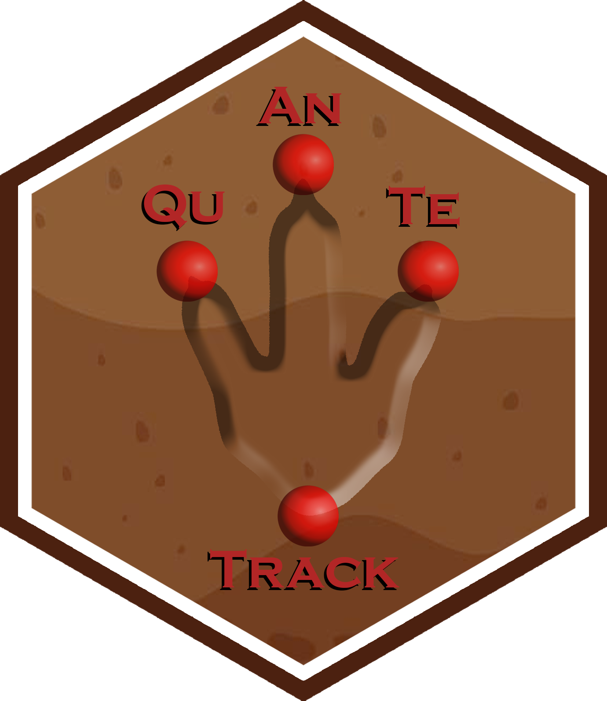

<!-- avoid border around images -->
<style>
    img {
        border: 0;
    }
</style>


```{r, include = FALSE}
knitr::opts_chunk$set(
  collapse = TRUE,
  comment = "#>",
  fig.width = 16,
  fig.height = 8,
  fig.retina = NULL,
  out.width = "100%"
)
```

```{css, echo=FALSE}
<style>
/* Add border and styling to code chunks and outputs */
pre {
  border: 1px solid #4d4d4d;    /* Dark gray border */
  padding: 10px;
  background-color: #f7f7f7;    /* Light gray background */
  border-radius: 4px;
}

/* Style the outputs (console results) with a border */
pre[class] {
  border: 1px solid #4d4d4d;
  padding: 10px;
  background-color: #f7f7f7;
  border-radius: 4px;
}

/* Remove borders from plots */
div.figure {
  border: none;
  background: none;
  box-shadow: none;
}
</style>
```

<div style="text-align: center;">
  
</div>


```{css, echo=FALSE}
pre {
  max-height: 300px;
  overflow-y: auto;
}

pre[class] {
  max-height: 500px;
}
```


```{r, include = FALSE}
if (Sys.getenv("RGL_USE_NULL") == "" && !interactive()) {
  Sys.setenv(RGL_USE_NULL = "TRUE")
}
```

## **Getting Started with QuAnTeTrack**  

### **Installation**
To install the **QuAnTeTrack** package from GitHub, you will need to use the `devtools` package. If you haven't installed `devtools` yet, you can do so with the following command:

```r
install.packages("devtools")
```

Once `devtools` is installed, you can install **QuAnTeTrack** using:

```r
devtools::install_github("MacroFunUV/QuAnTeTrack")
```

If you have already installed **QuAnTeTrack** and want to ensure you have the latest version, you can update it with:

```r
devtools::install_github("MacroFunUV/QuAnTeTrack", force = TRUE)
```

### **Loading the Package**
Once installed, you can load the package using:

```{r setup}
library(QuAnTeTrack)
```

This command will make all the functions from **QuAnTeTrack** available for use. You are now ready to begin your trackway analysis!


## **Overview of the Analytical Workflow in QuAnTeTrack**

The **QuAnTeTrack** package (**Qu**antitative **An**alysis of **Te**trapod **Track**ways) provides a structured and comprehensive workflow for analyzing trackway data, facilitating the assessment of paleoecological and paleoethological hypotheses. The workflow integrates various functions for data digitization, loading, exploratory analysis, statistical testing, simulation, similarity assessment, intersection detection, and clustering. This pipeline aims to help researchers reconstruct, compare, and interpret movement patterns and behavioral dynamics of trackmakers.


### **1. Data Digitization and Preprocessing**

The first step involves **digitizing the trackway data** using the **TPS software suite**, particularly:

- **tpsUtil** (*Rohlf, 2008*): For compiling and converting `.TPS` files.  
- **tpsDig** (*Rohlf, 2009*): For digitizing footprint coordinates from trackways.  

The digitization process should ensure that the footprints are consistently recorded across all tracks. This process is essential for converting raw images into structured data for further analysis.


### **2. Loading Data with `tps_to_track()`**

Once digitized, the data is loaded into **QuAnTeTrack** using the `tps_to_track()` function. This function:

- Reads `.TPS` files containing digitized footprints within tracks.
- Extracts and organizes data into structured `track` R objects.
- Handles missing footprints through interpolation if required.
- Converts raw data into real-world measurements using user-specified scales.

The resulting **`track` R objects** contain:

- **Trajectories:** Interpolated pathways derived from midpoints between footprints.  
- **Footprints:** Original digitized points and metadata for each track.  

Additionally, if the dataset is extensive, users can utilize the **`subset_track()`** function to isolate specific tracks for focused analysis. This step helps avoid computational overhead and allows customized analyses of selected trajectories.


### **3. Exploratory Analysis of Track Parameters**

Before testing specific hypotheses, users should perform an initial exploration of the data. This includes:

- **Visual Inspection of Tracks (`plot_track()`)**:  
  Generates visualizations of trackways and footprints to inspect their overall structure. The function offers various modes:
  - Plotting only footprints
  - Plotting only tracks
  - Plotting both footprints and tracks

- **Parameter Calculation (`track_param()`)**:  
  Calculates essential movement parameters, including:
  - Step lengths
  - Turning angles
  - Total distance and track length
  - Sinuosity
  - Straightness
  
- **Velocity Calculation (`velocity_track()`)**:  
  Estimates velocities and relative stride lengths for each track, applying formulas based on empirical studies. This step is crucial for understanding speed dynamics and comparing them across different trackmakers or scenarios.

- **Visualization of Velocity Patterns (`plot_velocity()`)**:  
  Provides a detailed view of how velocity or relative stride length changes along each track. This visualization is essential for identifying patterns of acceleration, deceleration, or steady movement.

- **Direction Analysis (`plot_direction()`)**:  
  Provides various visualization options to explore trackway directionality:
  - Boxplots of step directions
  - Polar histograms of step directions and average directions
  - Faceted plots for comparing multiple tracks
  
These functions help identify general patterns and irregularities in the data before proceeding with formal statistical testing.


### **4. Testing Directional and Velocity Patterns**

To assess whether tracks exhibit distinct movement patterns, the following statistical tests can be applied:

- **Testing Velocity (`test_velocity()`)**:  
  - Compares mean velocities across tracks using ANOVA, Kruskal-Wallis, or GLM.
  - Performs pairwise comparisons if necessary.
  - Provides visualizations of velocity distributions across different tracks.

- **Movement Mode Analysis (`mode_velocity()`)**:  
  - Applies Spearman’s rank correlation to detect trends of **acceleration**, **deceleration**, or **steady movement** along each track.

- **Testing Direction (`test_direction()`)**:  
  - Uses **ANOVA**, **Kruskal-Wallis**, or **Generalized Linear Models (GLM)** to compare mean directions across tracks.  
  - Performs pairwise comparisons if necessary.

These statistical tests allow researchers to rigorously compare and quantify movement characteristics, providing a foundation for hypothesis testing.


### **5. Simulation-Based Hypothesis Testing (`simulate_track()`)**

The `simulate_track()` function generates **simulated trajectories** based on different movement models to test specific hypotheses. Three models are available:

- **Directed Model:** Represents highly constrained, purposeful movement along a consistent direction.  
- **Constrained Model:** Generates correlated random walks, suitable for partially directed movement.  
- **Unconstrained Model:** Represents fully random exploratory movement.  

These models can be **informed by geological data** (e.g., sedimentology, paleogeomorphology, etc.) to test the influence of environmental constraints on movement. For example, natural barriers or features inferred from geological evidence may restrict the range of simulated paths.

The `plot_sim()` function overlays simulated tracks on the actual trajectories, allowing users to visually assess how well different models replicate observed track patterns. This visual comparison is essential for evaluating the realism of simulated tracks.


### **6. Comparing Simulated and Empirical Tracks**

The **QuAnTeTrack** package offers several functions aimed at comparing similarity and intersection metrics between two or more actual tracks. These metrics are then evaluated against simulated datasets to determine the probability of observing such similarity or intersection counts under scenarios of independent (non-coordinated) movement.

- **Dynamic Time Warping (`simil_DTW_metric()`)**:  
  Compares trajectories based on the optimal alignment of points, allowing for variable path lengths.

- **Fréchet Distance (`simil_Frechet_metric()`)**:  
  Measures similarity by comparing the overall shape of trajectories, focusing on global rather than local alignment.

- **Track Intersections (`track_intersection()`)**:  
  Identifies and counts unique intersections between tracks, which can indicate interaction or coordinated movement.


### **7. Combining Probability Metrics (`combined_prob()`)**

The `combined_prob()` function integrates *p*-values from multiple similarity metrics and intersection tests to provide a more robust assessment of observed patterns. This approach offers an overall measure of significance, enhancing the reliability of the results by accounting for different aspects of similarity and interaction.


### **8. Clustering Analysis (`cluster_track()`)**

The `cluster_track()` function is an optional but powerful step that can be applied **before formal statistical testing**. It clusters tracks based on calculated movement parameters, identifying groups of tracks with similar behaviors. The clustering process:

- Facilitates targeted testing of specific behavioral hypotheses (e.g., gregarious movement).
- Helps filter relevant datasets before applying similarity metrics.
- Informs the selection of appropriate simulation models by identifying common movement characteristics.


## **Raw Data Format**  
**QuAnTeTrack** accepts raw data in the form of **.TPS files** containing footprint coordinates. Each track should be recorded as a different image within the **.TPS file**.  

### **Requirements**  
- **Footprint coordinates** should be digitized in **equivalent positions** within each footprint.  
- **Tracks with missing footprints** are acceptable and will be **interpolated** as needed by the package functions.  
- It is **recommended** to digitize the coordinates using the **TPS software suite**, particularly:  
  - **tpsUtil** (*Rohlf, 2008*) - for file manipulation and data conversion.  
  - **tpsDig** (*Rohlf, 2009*) - for digitizing landmarks and outlines.  

This vignette demonstrates how to **load, process, and analyze trackway data** using the **QuAnTeTrack** package. We will walk through the **Paluxy River** and the **Mount Tom** datasets, representing dinosaur tracks from the Paluxy River site (**Farlow et al. (2012)**) and the Mount Tom site (**Ostrom (1972)**), respectively. Examples of `.tps` files of these datasets can be downloaded here:

  - [Paluxy River](../inst/extdata/PaluxyRiver.tps)
  - [Mount Tom](../inst/extdata/MountTom.tps)


## **Loading and Converting Data**  

The **`tps_to_track()`** function is a critical tool for converting raw `.TPS` files containing digitized trackway data into usable `track` objects within the **QuAnTeTrack** package. It is particularly useful for reconstructing trackways from footprints digitized using the **TPS software suite**, such as **tpsUtil** or **tpsDig**. This function reads the raw `.TPS` files, extracts coordinates, and transforms them into structured `track` R objects for further analysis.

The **`tps_to_track()`** function reads `.TPS` files where each track is represented by a series of (x, y) coordinates saved as different images. It then processes these data to create a set of trajectory coordinates by calculating the midpoints between consecutive footprints. These trajectories represent the reconstructed pathways of the trackmaker, allowing users to analyze the overall movement patterns. If some footprints are missing, the function can interpolate them based on the position of adjacent footprints and the specified side (left or right) of the first footprint. 

The function accepts several arguments to handle different aspects of the data. The **`file`** argument specifies the path to the `.TPS` file containing the digitized footprints. The **`scale`** argument is a numeric value that defines the scale factor (meters per pixel) to convert coordinates to real-world measurements. The **`missing`** argument indicates whether the dataset contains missing footprints that need interpolation (`TRUE` or `FALSE`). The **`NAs`** argument is a matrix that specifies the missing footprints to be interpolated, where each row indicates the track number and the position of the missing footprint. The **`R.L.side`** argument is a character vector that indicates whether the first footprint of each track is from the left or right side. This information is essential when handling tracks with missing footprints.

The **`tps_to_track()`** function generates a structured `track` R object consisting of two elements: **Trajectories** and **Footprints**. The **`Trajectories`** element is a list of interpolated trajectories representing the reconstructed pathways of the trackmaker. Each trajectory is calculated as the midpoint between consecutive footprints. The **`Footprints`** element is a list of data frames containing the original footprint coordinates, associated metadata (such as image reference and ID), and a marker indicating whether each footprint is actual or inferred.

The **returned `track` R object** includes:  
- **Trajectories:** A list of interpolated trajectories, where each trajectory is a series of midpoints between consecutive footprints.  
- **Footprints:** A list of data frames containing footprint coordinates, metadata (e.g., image reference, ID), and a marker indicating whether the footprint is actual or inferred.  

This function provides a comprehensive approach to converting raw `.TPS` files into structured data objects, making it possible to apply further analyses using the **QuAnTeTrack** package.

### **Examples of Usage:**  
Here, the TPS files (**PaluxyRiver.tps** and **MountTom.tps**) are loaded using the `system.file()` function to ensure compatibility across systems. This approach is necessary because these files are stored as **internal data within the package** (specifically, in the `inst/extdata/` folder). Using `system.file()` ensures that the files can be accessed regardless of the user's operating system or working directory, making the vignette fully portable and reproducible. They are then converted to `track` objects using the `tps_to_track()` function. The `scale` argument is used to set the coordinate scaling factor. For the **PaluxyRiver** dataset, no footprints are missing, so the `missing` argument is set to `FALSE` and `NAs = NULL`. For the **MountTom** dataset, some footprints are missing, so the `missing` argument is set to `TRUE`, and the missing footprints are specified using the `NAs` matrix. Additionally, the `R.L.side` argument is provided to specify the side of the first footprint of each track (either "R" for right or "L" for left).

For users working with their own data, **replace** `system.file("extdata", "PaluxyRiver.tps", package = "QuAnTeTrack")` and `system.file("extdata", "MountTom.tps", package = "QuAnTeTrack")` with the **file paths to your .TPS files** (e.g., `"C:/path/to/your/PaluxyRiver.tps"` and `"C:/path/to/your/MountTom.tps"`).  

```{r, eval=FALSE}
PaluxyRiver <- tps_to_track(
  system.file("extdata", "PaluxyRiver.tps", package = "QuAnTeTrack"),
  scale = 0.004341493,
  missing = FALSE,
  NAs = NULL
)
```

```{r, eval=FALSE}
MountTom <- tps_to_track(
  system.file("extdata", "MountTom.tps", package = "QuAnTeTrack"),
  scale = 0.004411765,
  missing = TRUE,
  NAs = matrix(c(7, 3), nrow = 1, ncol = 2),
  R.L.side = c(
    "R", "L", "L", "L", "R", "L", "R", "R", "L", "L", "L", "L", "L", 
    "R", "R", "L", "R", "R", "L", "R", "R", "R", "R"
  )
)
```

## **Plotting Tracks**  

The **`plot_track()`** function is a versatile tool designed to visualize track and footprint data in various ways, providing a flexible approach to examining and presenting trackway datasets. This function generates customizable plots using the `ggplot2` package, allowing users to inspect individual tracks, footprints, or a combination of both. By adjusting various plotting parameters, users can tailor their visualizations to highlight specific aspects of the dataset, such as individual track paths, footprint shapes, and colors.

The **`plot_track()`** function allows users to choose between three plotting modes: plotting only the footprints, only the interpolated trackways, or a combination of both. This is controlled by the `plot` argument, which can be set to `"Footprints"`, `"Tracks"`, or `"FootprintsTracks"` (default). The footprints and tracks are plotted using different layers, with footprints represented by points and tracks represented by lines.

Additional customization options include changing colors, sizes, shapes, and transparency of the plotted elements. Users can provide a vector of colors via the `colours` argument, which allows different tracks to be plotted in different colors. The `cex.f` and `cex.t` arguments control the sizes of footprint points and track lines, respectively. The `shape.f` argument allows users to specify the shapes of footprint points, while the `alpha.f`, `alpha.t`, and `alpha.l` arguments control the transparency of footprints, track lines, and labels, respectively.

The **`plot_track()`** function also supports the addition of labels to individual tracks. If the `plot.labels` argument is set to `TRUE`, labels are displayed at the start of each track, with the label text determined by the `labels` argument. If labels are not provided, the function automatically generates labels based on track names. Users can adjust the label size using the `cex.l` argument and control the padding around the labels with the `box.p` argument. 

The **`plot_track()`** function returns a `ggplot` object, which can be further customized using additional `ggplot2` functions. This allows users to enhance their plots with additional layers, themes, and annotations as needed.

The function is especially useful for comparing multiple trackways at once, providing a comprehensive view of track distribution, direction, and spacing. It also allows users to produce clean visualizations suitable for presentation or publication.

### **Examples of Usage:**  
 
By default, **`plot_track()`** displays both footprints and interpolated trajectories. This is useful for getting a general overview of the track and its corresponding interpolated pathways.  

```{r echo=TRUE}
plot_track(PaluxyRiver)
```

```{r echo=TRUE}
plot_track(MountTom)
```


To visualize only the footprint data without the interpolated trajectories, use the `plot = "Footprints"` argument. This is particularly useful when you want to inspect the original footprint positions without the influence of interpolated tracks.

```{r echo=TRUE}
plot_track(PaluxyRiver, plot = "Footprints")
```

```{r echo=TRUE}
plot_track(MountTom, plot = "Footprints")
```

 
If you want to focus on the interpolated trackways without displaying the footprints, use the `plot = "Tracks"` argument. This visualization helps analyze the continuity and pattern of movement.  

```{r echo=TRUE}
plot_track(PaluxyRiver, plot = "Tracks")
```

```{r echo=TRUE}
plot_track(MountTom, plot = "Tracks")
```

### **Further Customizations**  

The `plot_track()` function also allows for various customizations to enhance visualization. Below are some examples illustrating these customizations:  

```{r echo=TRUE}
labels <- paste("Track", seq_along(MountTom[[1]]))
plot_track(MountTom, plot.labels = TRUE, labels = labels, cex.l = 4, box.p = 0.3, alpha.l = 0.7)
```

```{r echo=TRUE}
plot_track(PaluxyRiver, plot = "Footprints", colours = c("red", "orange"), shape.f = c(15, 18))
```


## **Extracting Track Parameters**  

The **`track_param()`** function is designed to compute and print various parameters related to the movement patterns of tracks from a `track` object, which is a structured list generated by the **`tps_to_track()`** function. This function is essential for extracting detailed information about the structure of individual tracks and their spatial relationships, providing key metrics that can be used for further analysis, comparison, and visualization. The `track_param()` function uses several helper functions from the `trajr` package, which is commonly applied in animal movement analysis.

The **`track_param()`** function works by iterating over each trajectory within the provided track data and computing a set of movement-related parameters. The function calculates turning angles, step lengths, total distances covered, track lengths, and measures of sinuosity and straightness. These parameters are essential for understanding the locomotor patterns of the trackmakers.

The turning angles are calculated using the `TrajAngles()` function, providing a measure of directional changes at each step. The mean turning angle and standard deviation are also calculated to summarize overall turning behavior. The distance covered by the track is obtained using the `TrajDistance()` function, which measures the total straight-line distance between the start and end points of the track. The track length is calculated using the `TrajLength()` function, which sums the distances between all consecutive points in the track. The step lengths, or the distances between consecutive points, are calculated with `TrajStepLengths()`. The function also computes the mean and standard deviation of these step lengths. The sinuosity of the track is calculated using the `TrajSinuosity2()` function, which quantifies how much a path deviates from a straight line. The measure of sinuosity is based on the method described by Benhamou (2004), which refines previous methods to provide more accurate estimates of tortuosity for paths with varying turning angles and step lengths. The straightness index is calculated with `TrajStraightness()`, defined as the ratio between the beeline distance (start to end) and the total path length. This measure is based on the work of Batschelet (1981) and provides insight into how direct or meandering the movement of the trackmaker was.

The sinuosity calculation is based on the following formula:
\[
S = 2 \left[ p \left( \frac{1 + c}{1 - c} + b^2 \right) \right]^{-0.5}
\]
where:
- \( p \) is the mean step length (in meters),
- \( c \) is the mean cosine of turning angles (in radians), and
- \( b \) is the coefficient of variation of the step length (in meters).  

The straightness index is calculated as the ratio \( D/L \), where \( D \) is the beeline distance between the first and last points of the trajectory, and \( L \) is the total path length. This index is useful for comparing the efficiency of directed walks but is not suitable for random trajectories, where the index tends towards zero with increasing steps.

The **`track_param()`** function returns a list of lists, where each sublist contains the computed parameters for a corresponding track. The parameters include turning angles, mean turning angle, standard deviation of turning angles, distance, length, step lengths, mean step length, standard deviation of step length, sinuosity, and straightness. The reference direction for calculating angles is considered to be along the positive x-axis, with angles measured counterclockwise. The computed parameters are returned in a structured format, allowing users to further process or visualize the data as needed.

The **`track_param()`** function provides valuable insights into the structure and efficiency of trackmaker movements, making it a crucial tool for analyzing fossil trackways.

### **Examples of Usage:**
```{r, eval=FALSE}
params_paluxy <- track_param(PaluxyRiver)
```

```{r echo=FALSE}
params_paluxy <- track_param(PaluxyRiver)
```

```{r, eval=FALSE}
params_mount <- track_param(MountTom)
```

```{r echo=FALSE}
params_mount <- track_param(MountTom)
```


## **Plotting Direction Data**  

The **`plot_direction()`** function generates various types of plots to visualize direction data from `track` R objects. It provides users with the ability to create boxplots, polar histograms of step directions, polar histograms of average directions per track, and faceted polar histograms. The plots can be customized by adjusting parameters such as angle range for binning, positioning of y-axis labels, and specifying manual breaks for the y-axis.

This function supports multiple plotting styles through the `plot_type` argument, allowing users to compare and visualize direction data effectively. The **`plot_type`** argument accepts four options:  

1. **"boxplot"** - Displays the distribution of step directions across tracks as boxplots.  
2. **"polar_steps"** - Generates polar histograms showing the frequency of steps in various directional bins.  
3. **"polar_average"** - Creates polar histograms showing the frequency of average directions per track.  
4. **"faceted"** - Produces faceted polar histograms of step directions for each track individually.  

The **`plot_direction()`** function returns a `ggplot` object displaying the specified plot type. The use of the **`ggplot2`** package provides high-quality visualizations with extensive customization options, making this function a versatile tool for analyzing trackway direction data.

### **Examples of Usage:**
Boxplots provide a summary of the distribution of directions, including median, quartiles, and outliers. This visualization is useful for comparing general directionality across tracks.  

```{r echo=TRUE, results='hide'}
plot_direction(PaluxyRiver, plot_type = "boxplot")
```

```{r echo=TRUE, results='hide'}
plot_direction(MountTom, plot_type = "boxplot")
```


Polar plots show the individual step directions radiating from a central point, providing a detailed visualization of the movement patterns of the tracks.  

```{r echo=TRUE, results='hide'}
plot_direction(PaluxyRiver, plot_type = "polar_steps")
```

```{r echo=TRUE, results='hide'}
plot_direction(MountTom, plot_type = "polar_steps")
```


Polar plot of average directions averages the directional data for each track, providing a simplified overview of general movement trends.  

```{r echo=TRUE, results='hide'}
plot_direction(PaluxyRiver, plot_type = "polar_average")
```

```{r echo=TRUE, results='hide'}
plot_direction(MountTom, plot_type = "polar_average")
```


Faceted polar plots of step directions display individual step directions for each track in separate panels, allowing for a clearer comparison of movement patterns across multiple tracks.  

```{r echo=TRUE, results='hide'}
plot_direction(PaluxyRiver, plot_type = "faceted")
```

```{r echo=TRUE, results='hide'}
plot_direction(MountTom, plot_type = "faceted")
```

### **Further Customizations**  
The **`plot_direction()`** function offers several customization options to enhance the visualization of your data:  

- **`y_breaks_manual`**: Define custom breaks on the radial axis for `polar_average` plots. Example:  
```{r echo=TRUE, results='hide'}
plot_direction(PaluxyRiver, plot_type = "polar_average", y_breaks_manual = c(1, 2))
```

- **`y_labels_position`**: Adjust the position of y-axis labels. This can be helpful when fine-tuning polar plots for presentation. Example:  
```{r echo=TRUE, results='hide'}
plot_direction(PaluxyRiver, plot_type = "polar_steps", y_labels_position = -90)
```

- **`facet_labels`**: Provide custom labels for faceted plots to improve clarity when comparing multiple tracks.  

These customization options allow you to tailor your plots to best fit your analytical needs and presentation preferences.  


## **Testing for Differences in Direction Means**  

The **`test_direction()`** function evaluates differences in mean direction across different tracks within a `track` R object. It provides three statistical methods: **ANOVA**, **Kruskal-Wallis test**, and **Generalized Linear Models (GLM)**, allowing users to compare directional data and identify significant differences between tracks. The function also includes diagnostic tests to check assumptions of normality and homogeneity of variances before proceeding with the analysis. When more than two tracks are present, it performs pairwise comparisons to identify specific differences between tracks. 

The **`test_direction()`** function requires that each track contains more than three footprints to be included in the analysis. Tracks with three or fewer footprints are removed because statistical tests for comparing mean directions rely on having a sufficient number of data points to provide meaningful results. With only three or fewer footprints, the sample size is too small to accurately estimate mean direction and variability, making statistical comparisons unreliable. This threshold ensures that the results are statistically robust and meaningful.

If `"ANOVA"` is selected, the function checks for normality (using the **Shapiro-Wilk test**) and homogeneity of variances (using **Levene’s test**). If assumptions are violated, it issues warnings suggesting the use of `"Kruskal-Wallis"` or `"GLM"` instead. `"ANOVA"` compares mean directions across tracks, and if significant differences are detected, **Tukey’s HSD** is used for post-hoc pairwise comparisons. 

When `"Kruskal-Wallis"` is chosen, the function performs a **non-parametric test** that compares median directions across tracks. If significant differences are detected, **Dunn's test** is used for post-hoc pairwise comparisons. 
If `"GLM"` is specified, the function uses a **Generalized Linear Model (GLM)** with a Gaussian family to compare mean directions across tracks. Pairwise comparisons are conducted using the `emmeans` package, which computes differences between group means and adjusts for multiple comparisons using **Tukey’s method**. This approach is useful when the data does not meet the assumptions of ANOVA but still requires a parametric approach. 

The function returns a list of results that includes:  
- **`normality_results`**: A matrix containing the test statistic and p-value for the Shapiro-Wilk normality test for each track.  
- **`homogeneity_test`**: The result of Levene's test, including the p-value for testing homogeneity of variances across tracks.  
- **`ANOVA`** (if selected): A list containing the ANOVA table and **Tukey HSD** post-hoc results.  
- **`Kruskal_Wallis`** (if selected): A list containing the Kruskal-Wallis test result and **Dunn's test** post-hoc results.  
- **`GLM`** (if selected): A summary of the **GLM fit** and pairwise comparisons from the `emmeans` package.  

The **`test_direction()`** function provides a comprehensive statistical framework to compare directional data from different tracks. Its ability to perform parametric, non-parametric, and generalized linear model analyses makes it versatile for a wide range of datasets, even when assumptions of normality or homogeneity of variances are violated.

### **Examples of Usage:**
Testing with ANOVA. 
```{r, eval=FALSE}
test_direction(PaluxyRiver, analysis = "ANOVA")
```

```{r echo=FALSE}
test_direction(PaluxyRiver, analysis = "ANOVA")
```

```{r, eval=FALSE}
test_direction(MountTom, analysis = "ANOVA")
```

```{r echo=FALSE}
test_direction(MountTom, analysis = "ANOVA")
```

Testing with Kruskal-Wallis. 
```{r, eval=FALSE}
test_direction(PaluxyRiver, analysis = "Kruskal-Wallis")
```

```{r echo=FALSE}
test_direction(PaluxyRiver, analysis = "Kruskal-Wallis")
```

```{r, eval=FALSE}
test_direction(MountTom, analysis = "Kruskal-Wallis")
```

```{r echo=FALSE}
test_direction(MountTom, analysis = "Kruskal-Wallis")
```

Testing with Generalized Linear Model. 
```{r, eval=FALSE}
test_direction(PaluxyRiver, analysis = "GLM")
```

```{r echo=FALSE}
test_direction(PaluxyRiver, analysis = "GLM")
```

```{r, eval=FALSE}
test_direction(MountTom, analysis = "GLM")
```

```{r echo=FALSE}
test_direction(MountTom, analysis = "GLM")
```


## **Calculating Velocities and Relative Stride Lengths**  

The **`velocity_track()`** function calculates the velocities and relative stride lengths for each step within a series of tracks. It requires a 'track' R object as input, which contains both trajectories and footprints, and uses the height at the hip for each track maker to estimate speed. The function supports two calculation methods: Method A (Alexander, 1976) and Method B (Ruiz & Torices, 2013), which are specified via the `method` argument. By default, Method A is applied to all tracks if no method is specified. The gravitational acceleration, `G`, is set to 9.8 m/s^{2} by default but can be modified if needed.

This function works by first extracting the track data and then calculating the Euclidean distance between consecutive footprints to determine the stride length. For each step, the velocity is calculated using one of the two methods.

Method A applies the formula (Alexander, 1976):

\[
v = 0.25 \cdot \sqrt{G} \cdot S^{1.67} \cdot H^{-1.17}
\]

where \( v \) is the velocity (m/s), \( G \) is gravity (m/s^{2}), \( S \) is stride length (m), and \( H \) is the hip height (m). This method is based on empirical studies that model the relationship between stride length, body size, and speed for general terrestrial vertebrates. The coefficients \( 0.25 \), \( 1.67 \), and \( -1.17 \) have been derived from studies focused on scaling relationships in bipedal and quadrupedal animals.

Method B follows a similar approach but with a coefficient of \( 0.226 \) instead of \( 0.25 \), which provides a refinement for bipedal locomotion. The formula is (Ruiz & Torices, 2013):

\[
v = 0.226 \cdot \sqrt{G} \cdot S^{1.67} \cdot H^{-1.17}
\]

The relative stride length is calculated as the ratio between stride length and hip height (\( S / H \)), which allows distinguishing between different gaits according to Thulborn & Wade (1984). The classification is as follows:  
- **Walk:** Relative stride \( < 2.0 \) (locomotor performance equivalent to walking in mammals).  
- **Trot:** Relative stride \( 2.0 \leq A/H \leq 2.9 \) (locomotor performance equivalent to trotting or racking in mammals).  
- **Run:** Relative stride \( > 2.9 \) (locomotor performance equivalent to cantering, galloping, or sprinting in mammals).  

The function returns a 'track velocity' R object containing a list of lists, each representing a track. For each track, it provides:  
- **Step_velocities:** A vector of calculated velocities for each step (in m/s).  
- **Mean_velocity:** The average velocity across all steps.  
- **Standard_deviation_velocity:** The standard deviation of the calculated velocities.  
- **Maximum_velocity:** The highest calculated velocity.  
- **Minimum_velocity:** The lowest calculated velocity.  
- **Step_relative_stride:** A vector of calculated relative stride lengths.  
- **Mean_relative_stride:** The average of the relative stride lengths.  
- **Standard_deviation_relative_stride:** The standard deviation of the relative stride lengths.  
- **Maximum_relative_stride:** The highest calculated relative stride length.  
- **Minimum_relative_stride:** The lowest calculated relative stride length.  

The function is particularly useful for estimating the speed of ancient track-makers from their footprints and evaluating their locomotion style (walking, trotting, or running).  


### **Examples of Usage:**  
Calculate velocities for the MountTom dataset (Method A).
```{r echo=TRUE}
H_mounttom <- c(
  1.380, 1.404, 1.320, 1.736, 1.364, 1.432, 1.508, 1.768, 1.600,
  1.848, 1.532, 1.532, 0.760, 1.532, 1.688, 1.620, 0.636, 1.784, 1.676, 1.872,
  1.648, 1.760, 1.612
)
velocity_mounttom <- velocity_track(MountTom, H = H_mounttom)
```

Calculate velocities for the PaluxyRiver dataset (Method A)
```{r echo=TRUE}
H_paluxyriver <- c(3.472, 2.200)
velocity_paluxyriver <- velocity_track(PaluxyRiver, H = H_paluxyriver)
```

Calculate velocities for the PaluxyRiver dataset with different methods
```{r echo=TRUE}
H_paluxyriver <- c(3.472, 2.200)
Method_paluxyriver <- c("A", "B")
velocity_paluxyriver_diff_methods <- velocity_track(PaluxyRiver, H = H_paluxyriver, method = Method_paluxyriver)
```


## **Plotting Velocity Data** 

The **`plot_velocity()`** function provides a powerful visualization tool for examining trajectories colored by either **velocity** or **relative stride length**. By applying color gradients, it highlights how these parameters change along the paths of various tracks, providing valuable insights into locomotor dynamics.

The function takes as inputs a `track` R object and a `track velocity` R object, where the latter contains the calculated velocities and relative stride lengths for each track. The user can specify the parameter to be visualized via the **`param`** argument, choosing between `"V"` for velocity or `"RSL"` for relative stride length. If not specified, the function defaults to visualizing velocity.

The plotting process is handled by the **`ggplot2`** package, using **`geom_path()`** to plot the tracks and **`scale_color_gradientn()`** to apply a color gradient representing the selected parameter. Users can customize the color palette via the **`colours`** argument and adjust the line width with the **`lwd`** argument. 

The function also allows the user to include or exclude a legend from the plot by setting the **`legend`** argument to `TRUE` or `FALSE`, respectively. This flexibility ensures that the plots can be tailored to the user's preferences and presentation requirements.

The resulting plot provides a visually appealing and informative representation of how velocity or relative stride length changes along each trajectory. Such plots are particularly useful for comparing the locomotor patterns of different track makers or assessing how environmental or anatomical factors influence movement.


## **Testing for Differences in Velocity Means**  

The **`test_velocity()`** function evaluates differences in mean velocities across different tracks within a `track` R object. It provides three statistical methods: **ANOVA**, **Kruskal-Wallis test**, and **Generalized Linear Models (GLM)**, allowing users to compare velocity data and identify significant differences between tracks. The function also includes diagnostic tests to check assumptions of normality and homogeneity of variances before proceeding with the analysis. When more than two tracks are present, it performs pairwise comparisons to identify specific differences between tracks. 

The **`test_velocity()`** function requires that each track contains more than three footprints to be included in the analysis. This is necessary because statistical tests for comparing mean velocities rely on having a sufficient number of data points to provide meaningful results. When a track contains only three or fewer footprints, the sample size is too small to accurately estimate mean velocity and its variability, making statistical comparisons unreliable. By setting this threshold, the function ensures that the results are statistically robust and meaningful.

The function accepts a `trackvel` object, which is an output of the **`velocity_track()`** function. This object contains calculated velocities and other related parameters for each track, including individual step velocities, mean velocities, and relative stride lengths. This information serves as the input for the statistical comparisons performed by **`test_velocity()`**.

If `"ANOVA"` is selected, the function checks for normality (using the **Shapiro-Wilk test**) and homogeneity of variances (using **Levene’s test**). If assumptions are violated, it issues warnings suggesting the use of `"Kruskal-Wallis"` or `"GLM"` instead. `"ANOVA"` compares mean velocities across tracks, and if significant differences are detected, **Tukey’s HSD** is used for post-hoc pairwise comparisons. 

When `"Kruskal-Wallis"` is chosen, the function performs a **non-parametric test** that compares median velocities across tracks. If significant differences are detected, **Dunn's test** is used for post-hoc pairwise comparisons. 
If `"GLM"` is specified, the function uses a **Generalized Linear Model (GLM)** with a Gaussian family to compare mean velocities across tracks. Pairwise comparisons are conducted using the `emmeans` package, which computes differences between group means and adjusts for multiple comparisons using **Tukey’s method**. This approach is useful when the data does not meet the assumptions of ANOVA but still requires a parametric approach. 

If the argument `plot = TRUE` is specified, a boxplot of velocities by track is generated for visual comparison of velocity distributions across tracks. The boxplot allows the user to visually assess differences in central tendency and variability across tracks, complementing the statistical analyses.

The function returns a list of results that includes:  
- **`normality_results`**: A matrix containing the test statistic and p-value for the Shapiro-Wilk normality test for each track.  
- **`homogeneity_test`**: The result of Levene's test, including the p-value for testing homogeneity of variances across tracks.  
- **`ANOVA`** (if selected): A list containing the ANOVA table and **Tukey HSD** post-hoc results.  
- **`Kruskal_Wallis`** (if selected): A list containing the Kruskal-Wallis test result and **Dunn's test** post-hoc results.  
- **`GLM`** (if selected): A summary of the **GLM fit** and pairwise comparisons from the `emmeans` package.  
- **`plot`** (if requested): A boxplot of velocities by track.


## **Testing for Acceleration, Deceleration, or Steady Movement along Trajectories**

The **`mode_velocity()`** function evaluates whether a track maker is accelerating, decelerating, or maintaining a steady speed along its trajectory by applying Spearman’s rank correlation test. This test is particularly suitable for analyzing trends in velocity because it does not assume normality or linearity in the relationship between step number and velocity. Instead, it detects monotonic relationships based on ranks, making it robust to outliers and effective for identifying general trends.

The function processes each trajectory in the `trackvel` list separately. For each trajectory, the function calculates the Spearman correlation coefficient and its associated p-value, comparing velocity values to their corresponding step numbers. If the p-value is less than 0.05, the trend is classified as “acceleration” if the correlation coefficient is positive or “deceleration” if it is negative. If the p-value is greater than or equal to 0.05, the trend is labeled as “steady,” indicating no significant monotonic relationship between velocity and step number. This approach allows the detection of gradual changes in velocity over the course of a track, which may reflect shifts in locomotor performance or behavior.

Trajectories with fewer than three steps are considered insufficient for reliable statistical analysis, and the function returns a message indicating that the data is inadequate for correlation analysis. This is because the calculation of a meaningful correlation requires a minimum of three data points.

The **`mode_velocity()`** function provides a straightforward way to classify velocity trends based on statistical significance, making it a useful tool for examining how track makers modulate their speed along their paths. However, it only identifies monotonic trends and may not detect more complex, non-monotonic changes in speed. Furthermore, the classification is qualitative, providing information about the general nature of the trend rather than quantifying the rate of change.

This approach draws from established non-parametric statistical techniques developed by **Spearman (1904)** for measuring association between variables. The robustness of the method to non-normal data and its resistance to outliers makes it well-suited for paleontological and biomechanical applications where data quality and quantity can be limited.


## **Subsetting Tracks from Track Data**

The **`subset_track()`** function is designed to extract specific tracks from a larger dataset of tracks, making it easier to focus on particular trajectories or footprints for further analysis or visualization. This function is particularly useful when working with extensive datasets where only a subset of tracks is relevant to the research question.

The function operates by taking a `track` R object, which contains two elements: **`Trajectories`** and **`Footprints`**. Each of these elements is a list, where each list entry corresponds to a separate track. By specifying the desired indices through the **`tracks`** argument, users can isolate particular tracks of interest. 

If the **`tracks`** argument is left unspecified (`NULL`), the function defaults to returning all tracks in the dataset. Otherwise, it subsets the dataset based on the indices provided. If any indices are outside the range of available tracks, they are ignored with a warning message to notify the user. This functionality ensures robustness when working with datasets of varying sizes.

The function returns a modified `track` R object with the same structure as the original, but only containing the specified tracks. This approach maintains compatibility with other functions that expect a `track` R object, allowing for seamless integration into broader analytical workflows.


## **Simulating Tracks Using Different Movement Models**

The **`simulate_track()`** function generates simulated movement trajectories based on an existing set of tracks. It offers three distinct movement models—**Directed**, **Constrained**, and **Unconstrained**—each representing varying levels of constraint in movement patterns. This flexibility allows users to model scenarios reflecting biological or environmental constraints, such as directed movement towards resources, movement along geographical features, or free exploratory behavior.

The **`Directed`** model is the most constrained, simulating trajectories that follow a specific direction based on the original track's angular orientation. It aims to maintain a consistent overall direction with minor deviations to reflect natural variability. This model is useful for scenarios where movement is highly directional, such as an animal navigating toward a known resource.

The **`Constrained`** model represents a correlated random walk, where movement is not strictly directional but is influenced by certain angular and linear properties of the original track. This model allows for random exploration while retaining some of the characteristics of the original movement pattern. It is suitable for situations where animals navigate with limited knowledge of their surroundings, such as navigating within a bounded area without a specific destination.

The **`Unconstrained`** model provides the most flexibility, simulating trajectories that represent exploratory or dispersal behavior without directional bias. It is based on a fully random walk with the starting direction randomly determined for each simulation. This model is appropriate for scenarios where animals are moving through unfamiliar or homogeneous environments.

The function ensures that simulations are only applied to trajectories with at least four steps. This requirement is necessary because calculating the standard deviations of angles and step lengths, which are essential for simulating the trajectories, is impossible for shorter trajectories. If shorter tracks are present, the user is advised to use the **`subset_track()`** function to filter them out.

The function returns a `track simulation` R object, which is a list of simulated trajectories. Each simulation is stored separately, and users can choose to visualize or analyze these simulations to compare them against the original tracks, assess movement constraints, or explore alternative movement hypotheses.


## **Plotting Simulated and Actual Tracks**

The **`plot_sim()`** function provides a visual comparison between simulated movement trajectories and the actual observed tracks. By overlaying simulated tracks generated through **`simulate_track()`** with the original tracks, this function enables the user to evaluate how closely the simulations replicate real movement patterns.

The function relies on the **`ggplot2`** package to create plots with two primary components:  

1. **Simulated Trajectories:**  
   These are displayed with paths colored according to the user-specified colors via the `colours_sim` argument. The user can also adjust transparency and line width through the `alpha_sim` and `lwd_sim` arguments. The default color is black, and the default transparency level is set to a low value (`0.1`) to avoid visual clutter when many simulated tracks are plotted.

2. **Actual Trajectories:**  
   The original tracks are plotted on top of the simulated trajectories using the colors specified by the `colours_act` argument. Users can also adjust transparency (`alpha_act`) and line width (`lwd_act`) to enhance visibility. This overlay helps in visually comparing the similarity between actual and simulated tracks.  

This visualization tool is essential for assessing whether the chosen simulation model (**Directed**, **Constrained**, or **Unconstrained**) adequately captures the movement dynamics represented by the original tracks. It allows researchers to compare multiple models or to test how well a specific model can replicate the original track patterns under various conditions.


## **Similarity Metric Calculation using Dynamic Time Warping (DTW)**

The **`simil_DTW_metric()`** function is designed to compare the similarity between two or more movement trajectories using the **Dynamic Time Warping (DTW)** algorithm. This approach allows for comparing sequences that may differ in length, aligning them optimally by minimizing the cumulative distance between corresponding points. It’s particularly effective for analyzing animal movement patterns, where trajectories often exhibit temporal distortions or variable lengths.

The function provides three options for aligning trajectories before computing the DTW metric:

1. **None:** No alignment is applied; the trajectories are compared as they are.
2. **Centroid:** Trajectories are shifted so that their centroids are aligned, which helps eliminate positional differences while preserving the overall shape.
3. **Origin:** Trajectories are aligned to their starting points, making the comparison independent of the initial position.

The similarity measure is computed using the **`dtw()`** function from the **`dtw`** package, with the Euclidean distance used to calculate local distances between points. The resulting metric is a non-negative and unbounded value, with larger values indicating greater dissimilarity between trajectories.

If `test = TRUE`, the function performs a statistical test by comparing the observed DTW distances with those generated from simulated tracks. The simulation process involves generating random trajectories that are compared against the original tracks to determine if the observed DTW distances are significantly smaller than those expected under random conditions.

P-values are calculated in two ways:

- **Pairwise P-values:** For each trajectory pair, the proportion of simulated DTW distances smaller than the observed distance is calculated.
- **Combined P-value:** The overall proportion of simulations where all observed distances are smaller than the simulated distances, providing a measure of how distinct the observed tracks are from the simulated ones.

This method is valuable for evaluating the similarity of animal movement patterns under different experimental conditions or testing hypotheses about how closely simulated tracks replicate real movements. However, DTW is sensitive to noise and outliers, and large differences in trajectory lengths can introduce biases. Therefore, preprocessing or normalization may be necessary to improve accuracy.

The **`simil_DTW_metric()`** function provides a flexible framework for conducting DTW-based comparisons, allowing users to test the robustness of their results through simulations and to explore different alignment methods to enhance comparability.


## **Similarity Metric Calculation using Fréchet Distance**

The **`simil_Frechet_metric()`** function compares movement trajectories using the **Fréchet distance**, a metric that measures the similarity between two curves or continuous trajectories by considering both the order and location of points. It’s often described through the analogy of a person walking a dog on an extendable leash, where both move along their respective paths but can adjust their speed independently. The Fréchet distance corresponds to the minimum leash length required to keep the person and the dog connected throughout their journey.

Unlike other methods like **Dynamic Time Warping (DTW)**, which focuses on pointwise alignment, the Fréchet distance is particularly effective when analyzing overall shapes of trajectories. This makes it a valuable tool for comparing animal movement patterns where the global shape of the movement path is of interest.

The function allows users to align trajectories before computing the Fréchet distance using three methods:

1. **None:** No alignment is applied; trajectories are compared in their original form.
2. **Centroid:** Trajectories are shifted so their centroids are aligned, ensuring that positional differences do not affect the comparison.
3. **Origin:** Trajectories are aligned to their starting points, making comparisons independent of their initial position.

If `test = TRUE`, the function performs statistical testing by comparing observed Fréchet distances with those derived from simulated trajectories. The simulations are generated using the **`simulate_track()`** function, and comparisons are made to determine if observed distances are significantly smaller than what would be expected by chance.

P-values are computed in two ways:
- **Pairwise P-values:** These p-values represent the proportion of simulated distances that are smaller than the observed distance for each trajectory pair.
- **Combined P-value:** The overall proportion of simulations where all observed distances are smaller than the simulated distances, providing a comprehensive measure of similarity.

The **Fréchet distance** is particularly suited for applications where the overall shape of a trajectory matters, such as comparing migration routes, travel paths, or animal tracks. However, it is sensitive to noise because all points are considered in its calculation. Additionally, the method may yield invalid measurements when comparing very disparate tracks, such as those simulated under completely unconstrained models. When this occurs, the Fréchet distance is returned as -1.

The **`simil_Frechet_metric()`** function provides a robust framework for comparing trajectories, offering multiple options for alignment and statistical testing to assess how well simulations replicate real-world movement patterns.


## **Intersection Metric Calculation for Tracks**
The `track_intersection()` function is designed to detect and count the number of unique intersections between movement trajectories, making it a useful tool for exploring interactions between trackmakers. By examining when and where different trajectories cross, it’s possible to infer potential behavioral interactions, like coordinated movement, chasing, or random exploration. The function can also generate simulated tracks to provide a statistical basis for comparison, allowing users to evaluate how often intersections would occur under various scenarios.

The way the function works is fairly straightforward. It examines each pair of trajectories, represented as lines made up of consecutive points. It then checks whether line segments from different trajectories cross one another, recording each crossing point. Since each intersection is represented by a unique coordinate, duplicates are removed to ensure only unique intersection points are counted. This count provides a basic measure of interaction between the trajectories.

The function also allows for more sophisticated hypothesis testing through the generation of simulated trajectories. If the `test` argument is set to `TRUE`, the user must provide a set of simulated tracks to compare against the original ones. The idea here is to see how many intersections occur in the real data compared to those that occur in simulated, randomized scenarios. This comparison can provide valuable insights into whether observed intersections are more or less frequent than expected by chance.

To enhance the flexibility of the function, it supports various methods for altering the starting positions of simulated tracks. These options are controlled by the `origin.permutation` argument, which offers several choices. If it is set to `"None"`, simulated trajectories are not shifted and their starting points match the original data. If it is set to `"Min.Box"`, the starting points of simulated trajectories are randomly placed within the minimum bounding box that surrounds all original starting points. The `"Conv.Hull"` option, on the other hand, places the simulated tracks within the convex hull that encompasses all original starting points, which is often a more precise reflection of the space the tracks occupy. The most customizable option, `"Custom"`, allows the user to define a specific area by providing a set of coordinates that delimit a particular region of interest. This feature is particularly useful when there is prior knowledge of terrain features or other environmental factors that might influence movement.

The results are returned as a list containing several components, depending on whether testing was performed. At the most basic level, the function returns a matrix where each cell represents the number of unique intersection points between two trajectories. If testing is enabled, the function also returns a matrix of p-values that compare observed intersection counts to those generated from simulated tracks, providing a statistical assessment of how unusual the observed intersections are. Additionally, the function provides an overall p-value that summarizes the significance of the intersection counts across all pairs of trajectories. Finally, it returns the full list of simulated intersection counts, which can be useful for further exploration or visualization of the results.

The function’s versatility makes it applicable to a range of scenarios. For instance, if trackmakers are expected to be moving in parallel—such as members of a herd or pack following a common path—fewer intersections would be expected compared to random movement. In such cases, a significantly low number of intersections would support the hypothesis of coordinated or parallel movement. Conversely, in a hunting or chasing scenario, a greater number of intersections than expected by chance might be anticipated. Therefore, analyzing the number of intersections alongside similarity metrics from functions like `simil_DTW_metric()` or `simil_Frechet_metric()` can provide a more comprehensive assessment of trackmaker behavior. 

Ultimately, this function offers a robust way of examining track interactions by comparing observed intersection counts to those expected under different simulated scenarios. By allowing various permutation methods, it provides the user with the flexibility to tailor the analysis to specific research questions and assumptions about trackmaker behavior.


## **Combining P-values from Multiple Similarity and Intersection Metrics**

The `combined_prob()` function is designed to combine p-values obtained from various similarity and intersection metrics to provide a more comprehensive assessment of how well the observed trajectories compare to those generated through simulation. The function can be particularly useful when multiple metrics are applied to the same set of data, as it allows users to integrate the results and obtain an overall measure of significance.

The basic idea behind this function is to assess how the observed similarity or intersection metrics compare to those generated under various simulated scenarios. It starts by receiving a list of metrics, each of which is expected to be an R object representing the results of similarity or intersection tests. These metrics could have been obtained from functions like `simil_DTW_metric()`, `simil_Frechet_metric()`, and `track_intersection()`.

To make meaningful comparisons, the function ensures that all metrics provided in the `metrics` list have been derived using the same number of simulations (`nsim`). If the metrics are incompatible, the function raises an error to prevent incorrect calculations.

The process works by generating a matrix of p-values where each entry represents the combined significance of multiple metrics for a particular trajectory pair. For each simulation iteration, the function subtracts the observed metric values from the simulated ones, building a series of differences for each metric. If all differences for a given trajectory pair are positive, that combination is considered significant, contributing to the calculation of p-values.

The function also provides an overall p-value that summarizes the combined significance across all trajectory pairs. This value indicates how consistently the observed data differs from the simulated datasets across all metrics. 

The result is returned as a list containing two components:
1. A matrix of combined p-values for each trajectory pair, where the entries represent the probability of observing the combined metrics across all simulations.
2. A single overall p-value summarizing the combined significance of all metrics across all pairs of trajectories.

The `combined_prob()` function provides an efficient way to aggregate multiple similarity or intersection metrics, making it an essential tool for users who wish to comprehensively evaluate their models and hypotheses. By allowing for the integration of different metrics, the function offers a holistic approach to analyzing and comparing track data.


## **Clustering Tracks Based on Movement Parameters**

Clustering tracks is a powerful way to identify patterns of movement that might suggest particular behaviors or strategies used by trackmakers. The `cluster_track()` function is designed to take a set of tracks, calculate various movement parameters for each track, and then classify them into groups based on their similarities. This approach allows us to go beyond simply comparing tracks pairwise; instead, we can detect broader patterns of behavior shared across multiple tracks.

The first step in this process involves preparing the data by filtering out tracks with fewer than four steps. Such short tracks can’t provide reliable information about movement patterns and would only add noise to the clustering process. After filtering, the function calculates several movement parameters, each reflecting different aspects of the trackmaker’s behavior.

These parameters include metrics like turning angles, step lengths, sinuosity, straightness, and velocity. Turning angles capture how often the trackmaker changes direction, which can indicate whether it was moving in a directed or exploratory manner. Step lengths and their variability provide clues about the consistency of movement, while sinuosity and straightness measure how direct or meandering the trackmaker’s path was. Finally, velocity parameters describe the overall speed and how much it fluctuated throughout the track.

The function uses the `mclust` package to perform clustering based on these parameters. It applies model-based clustering, which means that instead of forcing the data into arbitrary groups, it looks for natural clusters by fitting a series of Gaussian mixture models. The best-fitting model is selected based on the Bayesian Information Criterion (BIC), allowing for both single-parameter and multi-parameter clustering. If only one parameter is selected, simpler models with equal or variable variance are used. When multiple parameters are included, the function considers the entire range of Gaussian models available in `mclust`.

This clustering process has important biological implications. By identifying groups of tracks that share similar movement parameters, we can begin to understand the underlying behaviors that produced those tracks. For example, tracks with low sinuosity and high velocity might represent individuals moving directly towards a target, while high sinuosity and variable step lengths could suggest foraging or exploratory behavior.

More interestingly, clustering can help detect coordinated movement. If several tracks are classified within the same group and also show high similarity when measured with metrics like Dynamic Time Warping (DTW) or Fréchet distance, it may indicate that the trackmakers were moving together. This approach could be particularly valuable for studying social behavior, such as gregarism or coordinated hunting.

Another practical application of clustering is to refine the dataset before applying more computationally intensive similarity metrics or intersection tests. By first identifying groups of tracks that share similar movement characteristics, researchers can focus on the most relevant comparisons, enhancing the robustness of their hypothesis testing.


## **References**  
- **Alexander, R. M. (1976).** Estimates of speeds of dinosaurs. *Nature*, 261(5556), 129-130.  
- **Batschelet, E. (1981).** Circular statistics in biology. *Academic Press*, 388 pp.  
- **Benhamou, S. (2004).** How to reliably estimate the tortuosity of an animal's path: straightness, sinuosity, or fractal dimension?. *Journal of Theoretical Biology*, 229(2), 209-220.  
- **Farlow, J. O., O’Brien, M., Kuban, G. J., Dattilo, B. F., Bates, K. T., Falkingham, P. L., & Piñuela, L. (2012).** Dinosaur Tracksites of the Paluxy River Valley (Glen Rose Formation, Lower Cretaceous), Dinosaur Valley State Park, Somervell County, Texas. *In Proceedings of the V International Symposium about Dinosaur Palaeontology and their Environment* (pp. 41-69). Burgos: Salas de los Infantes.  
- **Ostrom, J. H. (1972).** Were some dinosaurs gregarious? *Palaeogeography, Palaeoclimatology, Palaeoecology*, 11(4), 287-301.  
- **Rohlf, F. J.** 2008. **tpsUtil. Version 1.40.** Department of Ecology and Evolution, State University of New York.  
  Available at: [https://sbmorphometrics.org/](https://sbmorphometrics.org/)  
- **Rohlf, F. J.** 2009. **tpsDig. Version 2.14.** Department of Ecology and Evolution, State University of New York.  
  Available at: [https://sbmorphometrics.org/](https://sbmorphometrics.org/)  
- **Ruiz, J., & Torices, A. (2013).** Humans running at stadiums and beaches and the accuracy of speed estimations from fossil trackways. *Ichnos*, 20(1), 31-35.  
- **Thulborn, R. A., & Wade, M. (1984).** Dinosaur trackways in the Winton Formation (mid-Cretaceous) of Queensland. *Memoirs of the Queensland Museum*, 21(2), 413-517.  
