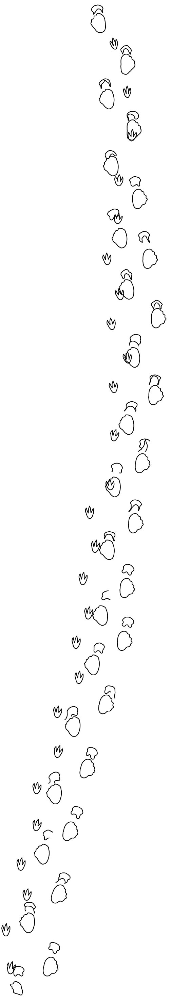
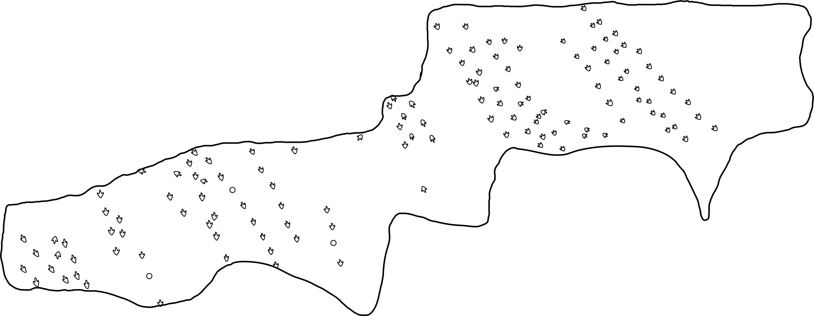

<!-- avoid border around images -->

```{=html}
<style>
    img {
        border: 0;
    }
</style>
```

```{r, include = FALSE}
knitr::opts_chunk$set(
  collapse = TRUE,
  comment = "#>",
  fig.width = 16,
  fig.height = 8,
  fig.retina = NULL,
  out.width = "100%"
)
```

```{css, echo=FALSE}
<style>
/* Add border and styling to code chunks and outputs */
pre {
  border: 1px solid #4d4d4d;    /* Dark gray border */
  padding: 10px;
  background-color: #f7f7f7;    /* Light gray background */
  border-radius: 4px;
}

/* Style the outputs (console results) with a border */
pre[class] {
  border: 1px solid #4d4d4d;
  padding: 10px;
  background-color: #f7f7f7;
  border-radius: 4px;
}

/* Remove borders from plots */
div.figure {
  border: none;
  background: none;
  box-shadow: none;
}
</style>
```

::: {style="text-align: center;"}

:::

```{css, echo=FALSE}
pre {
  max-height: 300px;
  overflow-y: auto;
}

pre[class] {
  max-height: 500px;
}
```

```{r, include = FALSE}
if (Sys.getenv("RGL_USE_NULL") == "" && !interactive()) {
  Sys.setenv(RGL_USE_NULL = "TRUE")
}
```

In this workflow we illustrate typical **QuAnTeTrack** analyses using two classic datasets: the **Paluxy River** tracksite (*Farlow et al., 2012*) and the **Mount Tom** tracksite (*Ostrom, 1972*).

This document is intended as a **concise, example-driven companion** to the main **QuAnTeTrack workflow vignette**, focusing on direct function usage and interpretation rather than methodological detail. For a full description of data structures, assumptions, simulation models, and extended workflows, see:

👉 **https://macrofunuv.github.io/QuAnTeTrack/articles/QuAnTeTrack.html**


## **Applied Example 1: Paluxy River "chase sequence" — compatibility with a partial parallel pursuit**

For the Paluxy River "chase sequence", we test whether the spatial relationship between the sauropod and theropod trackways is compatible with a scenario in which both trackmakers moved within a coordinated temporal window (e.g., a chase or pursuit), producing **greater geometric correspondence** than expected under independent movement. Importantly, correlated trajectories may arise for reasons unrelated to interaction—such as landscape topology, channeling effects, or attraction to shared resources—so the analysis explicitly contrasts the observed trackways against **null movement models** representing these alternative explanations.

::: {style="text-align: center;"}

:::

The workflow begins by converting digitized TPS data into a `trackway` object (`tps_to_track()`), followed by visual inspection of footprints and interpolated trajectories (`plot_track()`). This step ensures that footprint sequencing, trajectory reconstruction, and inferred movement directions are internally consistent before quantitative analyses are applied.

```{r, eval=FALSE}
PaluxyRiver <- tps_to_track(
  system.file("extdata", "PaluxyRiver.tps", package = "QuAnTeTrack"),
  scale = 0.004,
  R.L.side = c("R", "L"),
  missing = FALSE,
  NAs = NULL
)
```

```{r echo=FALSE}
PaluxyRiver <- tps_to_track(
  system.file("extdata", "PaluxyRiver.tps", package = "QuAnTeTrack"),
  scale = 0.004,
  R.L.side = c("R", "L"),
  missing = FALSE,
  NAs = NULL
)
```
```{r echo=TRUE}
plot_track(PaluxyRiver, plot.labels =  TRUE)
```

```{r echo=TRUE}
plot_track(PaluxyRiver, plot = "FootprintsTrajectories", cex.f = 4, alpha.t = 0.2, seq.foot = TRUE)
```

```{r echo=TRUE}
plot_track(PaluxyRiver, plot = "Trajectories", arrow.t = TRUE, arrow.size = 0.1)
```

We then generate null expectations of movement using `simulate_track()`, which allows simulation under three increasingly structured non-gregarious assumptions: Unconstrained (fully random movement), Constrained (correlated random walks preserving step-length and turning-angle structure), and Directed (movement biased around the observed overall direction). These models define alternative scenarios in which independent trackmakers may nonetheless exhibit apparent path correlation due to environmental constraints, landscape topology, or attraction to shared resources rather than true interaction. In the present vignette, we adopt only the most restrictive null model, the Directed model, which assumes strong directional forcing and therefore represents a conservative scenario in which independent trajectories are expected to be maximally aligned. The other models are supported by the function and can be explored analogously in applied analyses, but are not explicitly simulated here. For the purposes of this vignette, simulations are run using a limited number of iterations (e.g., 100) to keep computation time reasonable and to ensure compatibility with online rendering. In applied analyses, a substantially larger number of simulations (≥ 1000) is recommended to obtain stable null distributions and robust probability estimates.

```{r, eval=FALSE}
sim_directed_paluxy <- simulate_track(PaluxyRiver, nsim = 100, model = "Directed")
print(sim_directed_paluxy[1:100])
```

```{r echo=FALSE}
sim_directed_paluxy <- simulate_track(PaluxyRiver, nsim = 100, model = "Directed")
print(sim_directed_paluxy[1:100])
```

The simulated and observed trajectories are visually compared using `plot_sim()`.

```{r echo=TRUE}
plot_sim(PaluxyRiver, sim_directed_paluxy, colours_sim = c("#723f20", "#cb1308"),
  alpha_sim = 0.02,
  colours_act = c("#723f20", "#cb1308")
)
```

To formally test whether the observed trajectories show unusually strong covariation, we quantify between-track similarity using **Dynamic Time Warping** (`simil_DTW_metric()`) and **Fréchet distance** (`simil_Frechet_metric()`), and we quantify trajectory crossings using `track_intersection()`. In each case, the observed metrics are explicitly **contrasted against the distributions obtained from simulated null models**, yielding probability-based assessments (*p*-values) of how extreme the observed patterns are relative to random expectations under each movement assumption.


```{r, eval=FALSE}
simil_dtw_directed_paluxy <- simil_DTW_metric(PaluxyRiver, test = TRUE, 
                                              sim = sim_directed_paluxy, 
                                              superposition = "Centroid")
print(simil_dtw_directed_paluxy)
```

```{r echo=FALSE}
simil_dtw_directed_paluxy <- simil_DTW_metric(PaluxyRiver, test = TRUE, 
                                              sim = sim_directed_paluxy, 
                                              superposition = "Centroid")
print(simil_dtw_directed_paluxy)
```

```{r, eval=FALSE}
print(simil_dtw_directed_paluxy$DTW_metric_p_values_combined)
```

```{r, echo=FALSE}
print(simil_dtw_directed_paluxy$DTW_metric_p_values_combined)
```

```{r, eval=FALSE}
simil_frechet_directed_paluxy <- simil_Frechet_metric(PaluxyRiver, test = TRUE, 
                                              sim = sim_directed_paluxy, 
                                              superposition = "Centroid")
print(simil_frechet_directed_paluxy)
```

```{r echo=FALSE}
simil_frechet_directed_paluxy <- simil_Frechet_metric(PaluxyRiver, test = TRUE, 
                                              sim = sim_directed_paluxy, 
                                              superposition = "Centroid")
print(simil_frechet_directed_paluxy)
```

```{r, eval=FALSE}
print(simil_frechet_directed_paluxy$Frechet_metric_p_values_combined)
```

```{r, echo=FALSE}
print(simil_frechet_directed_paluxy$Frechet_metric_p_values_combined)
```

```{r, eval=FALSE}
int_directed_paluxy <- track_intersection(PaluxyRiver, test = TRUE, H1 = "Lower", 
                                          sim = sim_directed_paluxy, 
                                          origin.permutation = "None")
print(int_directed_paluxy)
```

```{r echo=FALSE}
int_directed_paluxy <- track_intersection(PaluxyRiver, test = TRUE, H1 = "Lower", 
                                          sim = sim_directed_paluxy, 
                                          origin.permutation = "None")
print(int_directed_paluxy)
```

```{r, eval=FALSE}
print(int_directed_paluxy$Intersection_metric_p_values_combined)
```

```{r, echo=FALSE}
print(int_directed_paluxy$Intersection_metric_p_values_combined)
```
A partial parallel pursuit scenario predicts a specific outcome: **greater-than-random trajectory similarity** combined with **fewer-than-random intersections**, consistent with parallel movement rather than repeated crossing. Evidence from multiple metrics is finally integrated using `combined_prob()`, producing a single summary probability that reflects whether the overall dataset departs from null expectations in the direction predicted by the chase hypothesis.

```{r, eval=FALSE}
combined_metrics_paluxy <- combined_prob(PaluxyRiver, metrics = list(
  simil_dtw_directed_paluxy,
  simil_frechet_directed_paluxy,
  int_directed_paluxy
))
print(combined_metrics_paluxy)
```

```{r echo=FALSE}
combined_metrics_paluxy <- combined_prob(PaluxyRiver, metrics = list(
  simil_dtw_directed_paluxy,
  simil_frechet_directed_paluxy,
  int_directed_paluxy
))
print(combined_metrics_paluxy)
```

```{r eval=FALSE}
print(combined_metrics_paluxy$P_values_global)
```

```{r echo=FALSE}
print(combined_metrics_paluxy$P_values_global)
```

### **Interpretation of results**

When evaluated individually against the **directed null model**, both trajectory similarity metrics show comparatively low probabilities (DTW: *p* = `r round(simil_dtw_directed_paluxy$DTW_metric_p_values_combined, 2)`; Fréchet: *p* = `r round(simil_frechet_directed_paluxy$Frechet_metric_p_values_combined, 2)`), indicating a tendency toward **greater geometric correspondence** than expected under the most restrictive scenario of independent, directionally constrained movement. Although neither metric alone crosses conventional significance thresholds, both deviate **consistently in the same direction**, arguing against isolated stochastic effects. In contrast, the intersection analysis shows no reduction in crossings relative to the directed null expectation (*p* = `r round(int_directed_paluxy$Intersection_metric_p_values_combined, 2)`), which by itself would remain compatible with independent movement under strong directional constraints.

Crucially, when all metrics are evaluated jointly using `combined_prob()`, the global probability (*p* = `r round(combined_metrics_paluxy$P_values_global, 3)`) indicates a **statistically significant departure from the directed null model**. Because the directed model represents the **most conservative non-gregarious expectation**, explicitly incorporating strong landscape constraints or shared directional forcing, rejection of this model provides **strong evidence that the observed trackway configuration cannot be fully explained by independent movement alone**.

Taken together, these results support the interpretation that the sauropod and theropod trackways were produced within a **coordinated temporal framework**, consistent with a scenario of **partial parallel pursuit** rather than coincidental alignment driven solely by environmental structure. Importantly, this inference emerges most clearly when multiple, complementary metrics are considered simultaneously, highlighting the value of **integrative, multi-metric approaches** for detecting subtle but biologically meaningful signals in fossil trackway data.


### **Applied Example 2: Mount Tom — assessing compatibility with gregarious movement**

For the Mount Tom tracksite, we evaluate whether a subset of trackways can be plausibly interpreted as the product of **gregarious movement**, defined here as multiple individuals moving with a degree of spatial and kinematic coherence exceeding that expected under independent locomotion. As in the Paluxy River case, apparent similarity among trajectories may arise from non-social processes—such as landscape constraints, preferential pathways, or shared directional biases—so the analysis is structured to progressively distinguish exploratory patterns from signals consistent with coordinated movement.

::: {style="text-align: center;"}

:::

The workflow begins by converting digitized TPS data into a `trackway` R object (`tps_to_track()`), followed by a visual inspection of footprints and interpolated trajectories using `plot_track()`. This step serves as a diagnostic check to verify footprint ordering, trajectory reconstruction, and inferred directionality of movement, ensuring internal consistency of the data prior to quantitative analysis. In the Mount Tom dataset, one trackway (numer 3) contains a missing footprint (number 7); this absence is explicitly specified during data import and the corresponding footprint position is interpolated, allowing trajectory reconstruction to proceed while preserving the original track geometry.

```{r, eval=FALSE}
MountTom <- tps_to_track(
  system.file("extdata", "MountTom.tps", package = "QuAnTeTrack"),
  scale = 0.004411765,
  R.L.side = c(
    "R", "L", "L", "L", "R", "L", "R", "R", "L", "L", "L",
    "L", "L", "R", "R", "L", "R", "R", "L", "R", "R",
    "R", "R"
  ),
  missing = TRUE,
  NAs = matrix(c(3, 7), nrow = 1, ncol = 2)
)
```

```{r echo=FALSE}
MountTom <- tps_to_track(
  system.file("extdata", "MountTom.tps", package = "QuAnTeTrack"),
  scale = 0.004411765,
  R.L.side = c(
    "R", "L", "L", "L", "R", "L", "R", "R", "L", "L", "L",
    "L", "L", "R", "R", "L", "R", "R", "L", "R", "R",
    "R", "R"
  ),
  missing = TRUE,
  NAs = matrix(c(3, 7), nrow = 1, ncol = 2)
)
```

```{r echo=TRUE}
plot_track(MountTom, plot.labels =  TRUE)
```

```{r echo=TRUE}
plot_track(MountTom, plot = "FootprintsTrajectories", cex.f = 4, alpha.t = 0.2, seq.foot = TRUE)
```

```{r echo=TRUE}
plot_track(MountTom, plot = "Trajectories", arrow.t = TRUE, arrow.size = 0.1)
```

We then perform an initial exploration of movement-related parameters using `track_param()`, which provides a quantitative overview of variation in trajectory geometry and structure across all trackways, allowing broad patterns to be identified before any grouping or hypothesis-driven testing.

```{r, eval=FALSE}
MountTom_param<-track_param(MountTom)
print(MountTom_param)
```

```{r, echo=FALSE}
MountTom_param<-track_param(MountTom)
print(MountTom_param)
```

We then explore **kinematic and directional properties** of the trackways. Velocities are estimated using `velocity_track()`, and patterns of speed variation are examined both visually and statistically (`plot_velocity()`, `test_velocity()`). Directional structure is explored using `plot_direction()`, and formal tests of directional similarity are conducted with `test_direction()`. Together, these analyses allow us to assess whether subsets of trackways show internally coherent speed and orientation patterns that would be expected under group movement, while also identifying heterogeneity incompatible with gregarism.

```{r, eval=FALSE}
H_mounttom <- c(
  1.380, 1.404, 1.320, 1.736, 1.364, 1.432, 1.508, 1.768, 1.600,
  1.848, 1.532, 1.532, 0.760, 1.532, 1.688, 1.620, 0.636, 1.784, 1.676, 1.872, 1.648, 1.760, 1.612
)
vel_MoutTom <- velocity_track(MountTom, H = H_mounttom)
print(vel_MoutTom)
```

```{r, echo=FALSE}
H_mounttom <- c(
  1.380, 1.404, 1.320, 1.736, 1.364, 1.432, 1.508, 1.768, 1.600,
  1.848, 1.532, 1.532, 0.760, 1.532, 1.688, 1.620, 0.636, 1.784, 1.676, 1.872, 1.648, 1.760, 1.612
)
vel_MoutTom <- velocity_track(MountTom, H = H_mounttom)
print(vel_MoutTom)
```

```{r, echo=TRUE}
plot_vel_V <- plot_velocity(MountTom, vel_MoutTom, param = "V")
print(plot_vel_V)
```

```{r, echo=TRUE}
plot_vel_RSL <- plot_velocity(MountTom, vel_MoutTom, param = "RSL")
print(plot_vel_RSL)
```

```{r, eval=FALSE}
test_vel_MoutTom <- test_velocity(MountTom, vel_MoutTom)
print(test_vel_MoutTom)
```

```{r, echo=FALSE}
test_vel_MoutTom <- test_velocity(MountTom, vel_MoutTom)
print(test_vel_MoutTom)
```

```{r, echo=TRUE}
plot_vel_seq <- plot_velocity(MountTom, vel_MoutTom, type = "sequence",param = "V")
print(plot_vel_seq)
```

```{r, echo=TRUE}
plot_dir_box <- plot_direction(MountTom, plot_type = "boxplot")
print(plot_dir_box)
```

```{r, echo=TRUE}
plot_dir_ste <- plot_direction(MountTom, plot_type = "polar_steps")
print(plot_dir_ste)
```

```{r, echo=TRUE}
plot_dir_ave <- plot_direction(MountTom, plot_type = "polar_average")
print(plot_dir_ave)
```

```{r, echo=TRUE}
plot_dir_fac <- plot_direction(MountTom, plot_type = "faceted")
print(plot_dir_fac)
```

```{r, eval=FALSE}
test_dir_WW <- test_direction(MountTom, analysis = "Watson-Wheeler",
               permutation = TRUE, B = 100, seed = 42)
print(test_dir_WW)
```

```{r, echo=FALSE}
test_dir_WW <- test_direction(MountTom, analysis = "Watson-Wheeler",
               permutation = TRUE, B = 100, seed = 42)
print(test_dir_WW)
```


Only after this exploratory phase do we perform **unsupervised clustering** of trackways (`cluster_track()`), using multiple geometric and kinematic variables to identify groups of trajectories with similar movement characteristics. Importantly, clustering is used here as a **data-driven preselection step**, not as a test of gregarism per se. Candidate clusters are subsequently **subsetted** and treated as explicit hypotheses of potential group movement.


To formally evaluate whether similarity among trackways within these subsets exceeds random expectations, we quantify between-track similarity using **Dynamic Time Warping** (`simil_DTW_metric()`) and **Fréchet distance** (`simil_Frechet_metric()`). These metrics are evaluated against simulated null models generated with `simulate_track()`, representing alternative non-gregarious scenarios (e.g., Unconstrained, Constrained, and Directed movement) in which apparent coherence may arise from environmental or directional forcing rather than social behavior.

In each case, observed similarity metrics are explicitly contrasted against the distributions obtained from simulated null models, yielding probability-based assessments (*p*-values) of whether the observed coherence is greater than expected under independent movement. Evidence across metrics and null scenarios is then integrated to assess whether the spatial and kinematic structure of the Mount Tom trackways is compatible with **gregarious movement**. Interpretation of these results is presented in a later section, once quantitative outputs are available.


For the Mount Tom tracksite, we test whether a subset of trackways can be reasonably interpreted as the product of **gregarious movement**, that is, multiple individuals moving in spatial and kinematic coherence beyond what would be expected under independent movement. As with Paluxy River, apparent similarity among trajectories may arise from non-social factors such as landscape constraints, shared routes, or directional biases, so the analysis explicitly contrasts observed patterns against appropriate null expectations.


The workflow begins by converting the digitized TPS data into a `trackway` object (`tps_to_track()`), followed by an exploratory assessment of trackway geometry and orientation (`plot_track()`) to ensure internal consistency prior to quantitative analysis. 


We then perform an **unsupervised clustering** of trackways (`cluster_track()`) based on multiple movement-related variables, with the aim of identifying groups of trackways that share similar kinematic and geometric properties and could plausibly represent contemporaneous movement by multiple individuals.

```{r echo=TRUE}
H_mounttom <- c(
  1.380, 1.404, 1.320, 1.736, 1.364, 1.432, 1.508, 1.768, 1.600,
  1.848, 1.532, 1.532, 0.760, 1.532, 1.688, 1.620, 0.636, 1.784, 1.676, 1.872,
  1.648, 1.760, 1.612
)

cluster_track(MountTom,veltrack=velocity_track(MountTom, H = H_mounttom),variables=c("Sinuosity","Straightness","PaceAng"))
```

Before formal hypothesis testing, candidate clusters are **subsetted** and explored independently. We examine velocity estimates (`velocity_track()`), movement directions (`plot_direction()`), and corresponding statistical tests (`test_velocity()`, `test_direction()`) to evaluate whether trackways within each cluster exhibit coherent speed and directional patterns consistent with group movement.

To formally assess whether similarity among clustered trackways exceeds random expectations, we quantify between-track similarity using **Dynamic Time Warping** (`simil_DTW_metric()`) and **Fréchet distance** (`simil_Frechet_metric()`). These metrics are evaluated against simulated null models (`simulate_track()`) under multiple movement assumptions, including **Unconstrained**, **Constrained**, and **Directed** scenarios, capturing alternative non-gregarious explanations such as environmental channeling or shared directional bias.

In each case, observed similarity metrics are explicitly **contrasted against the distributions obtained from simulated null models**, yielding probability-based assessments (*p*-values) of whether the observed coherence among trackways is greater than expected under independent movement. Evidence across metrics and scenarios is then interpreted to assess whether the spatial and kinematic structure of the Mount Tom trackways is compatible with gregarious movement.


## **Getting Started with QuAnTeTrack**

### **Installation**

To install the **QuAnTeTrack** package, we can choose between installing the **stable version from CRAN** (recommended) or the **development version from GitHub**.

#### **From CRAN (recommended)**

To install the stable version from CRAN, use:

``` r
install.packages("QuAnTeTrack")
```

#### **From GitHub (development version)**

If we want the latest development version, we will need to use the `devtools` package. If we haven't installed `devtools` yet, we can do so with the following command:

``` r
install.packages("devtools")
```

Once `devtools` is installed, we can install **QuAnTeTrack** using:

``` r
devtools::install_github("MacroFunUV/QuAnTeTrack")
```

If we have already installed **QuAnTeTrack** and want to ensure we have the latest version, we can update it with:

``` r
devtools::install_github("MacroFunUV/QuAnTeTrack", force = TRUE)
```

### **Loading the Package**

Once installed, we can load the package using:

```{r setup}
library(QuAnTeTrack)
```

This command will make all the functions from **QuAnTeTrack** available for use. We are now ready to begin our trackway analysis!


## **Terminology**

The terminology used throughout **QuAnTeTrack** follows standardized definitions for tetrapod footprint and trackway analysis. All anatomical, ichnological, and trackway-related terms adhere to the nomenclature and definitions proposed in the *Glossary of Tetrapod Tracks* published by *Lallensack et al. (2025)*.

By adopting this reference framework, **QuAnTeTrack** ensures terminological consistency with current ichnological standards and facilitates comparability across studies. Users are encouraged to consult the glossary for detailed definitions.

## **Hypoteses to be tested**
We will show tipical QuAnTeTrack workflows and functionalities by testin 1.  wether chase sequence of Paluxy River tracksite (*Farlow et al., 2012*) is compatible with hunting scene with partial paralell purchase and 2. whther at least som of the tracks in Mount Tom tracksite (*Ostrom, 1972*) are atributable to gregarious movement. Examples of `.tps` files of these datasets can be downloaded here:

-   [Paluxy River](https://github.com/MacroFunUV/QuAnTeTrack/blob/master/inst/extdata/PaluxyRiver.tps)
-   [Mount Tom](https://github.com/MacroFunUV/QuAnTeTrack/blob/master/inst/extdata/MountTom.tps)

## **Paluxy River**

First, we convert digitized `.TPS` files into `trackway` objects that store trajectories and footprints in a format compatible with all **QuAnTeTrack** analyses.


Then, we evaluate trackway geometry by visually inspecting footprints and interpolated trajectories, allowing us to check footprint ordering and confirm that inferred trackway directions are consistent.


We simulate null models of movement to evaluate whether observed trajectories deviate from random expectations. The function allows simulation under three movement assumptions: **Unconstrained** (fully random movement), **Constrained** (a correlated random walk preserving step-length and turning-angle structure), and **Directed** (movement constrained around the observed overall direction). Together, these models represent alternative non-gregarious scenarios in which independent trackmakers may show apparent path correlation due to landscape topology, spatial constraints, or resource-oriented movement rather than true coordinated behavior.


We visualize the simulated tracks over the original tracks.


If trajectories were made simultaneously by the sauropod and theropod we would expect higher covariation than random and at the same time if paralell runing less interactions than random. this we do with dtw, frechet, interactions and combined


For datasets with missing footprints, enable interpolation and specify their positions:

```{r, eval=FALSE}
MountTom <- tps_to_track(
  system.file("extdata", "MountTom.tps", package = "QuAnTeTrack"),
  scale = 0.004,
  missing = TRUE,
  NAs = matrix(c(7, 3), nrow = 1, ncol = 2),
  R.L.side = c(
    "R", "L", "L", "L", "R", "L", "R", "R", "L", "L", "L", "L", "L", 
    "R", "R", "L", "R", "R", "L", "R", "R", "R", "R"
  )
)
```

```{r echo=FALSE}
MountTom <- tps_to_track(
  system.file("extdata", "MountTom.tps", package = "QuAnTeTrack"),
  scale = 0.004,
  missing = TRUE,
  NAs = matrix(c(7, 3), nrow = 1, ncol = 2),
  R.L.side = c(
    "R", "L", "L", "L", "R", "L", "R", "R", "L", "L", "L", "L", "L", 
    "R", "R", "L", "R", "R", "L", "R", "R", "R", "R"
  )
)
```

## **Subsetting trackways from trackway Data**


## **Subsetting trackways from trackway Data**

The **`subset_track()`** function is designed to extract specific trackways from a larger dataset of trackways, making it easier to focus on particular **trajectories or footprints** for further analysis or visualization. This function is particularly useful when working with **extensive datasets** where only a subset of trackways is relevant to the research question.

The function operates by taking a **`trackway` R object**, which contains two elements: **`Trajectories`** and **`Footprints`**. Each of these elements is a **list**, where each list entry corresponds to a separate trackway. By specifying the desired indices through the **`tracks`** argument, users can isolate particular trackways of interest.

If the **`tracks`** argument is left unspecified (**`NULL`**), the function defaults to returning **all trackways** in the dataset. Otherwise, it subsets the dataset based on the **indices provided**. If any indices are **outside the range of available trackways**, they are ignored with a **warning message** to notify the user. This functionality ensures robustness when working with datasets of varying sizes.

The function returns a modified **`trackway` R object** with the same structure as the original, but only containing the specified trackways. This approach maintains compatibility with other functions that expect a **`trackway` R object**, allowing for seamless integration into broader analytical workflows.

### **Examples of Usage**

To prepare a subset of trackways with more than **three footprints** from the **MountTom dataset** for later analyses, we can use the **`subset_track()`** function. This is especially useful for focusing on a selection of trackways of interest before applying similarity metrics, simulations, or statistical tests.

```{r, eval=FALSE}
sbMountTom <- subset_track(MountTom, tracks = c(1, 2, 3, 4, 7, 8, 9, 13, 15, 16, 18))
print(sbMountTom)
```

```{r echo=FALSE}
sbMountTom <- subset_track(MountTom, tracks = c(1, 2, 3, 4, 7, 8, 9, 13, 15, 16, 18))
print(sbMountTom)
```


## **Plotting trackways**

The **`plot_track()`** function is a versatile tool designed to visualize **trackway and footprint data** from a **`trackway` R object** in various ways, providing a flexible approach to examining and presenting trackway datasets. This function generates customizable plots using the **`ggplot2`** package, allowing users to inspect individual trajectories, footprints, or a combination of both. By adjusting various plotting parameters, users can tailor their visualizations to highlight specific aspects of the dataset, such as **individual trajectories paths**, **footprint shapes**, and **colors**, among others.

The **`plot_track()`** function allows users to choose between three plotting modes: plotting only the **footprints**, only the **interpolated trajectories**, or a **combination of both**. This is controlled by the **`plot`** argument, which can be set to **`"Footprints"`**, **`"Trajectories"`**, or **`"FootprintsTrajectories"`** (default). The footprints and trajectories are plotted using different layers, with footprints represented by **points** and trajectories represented by **lines**. 

The **`plot_track()`** function also allows users to visualize the **direction of movement** along trackways by adding **arrowheads at the terminal end of each trajectory**. This behavior is controlled by the **`arrow.t`** argument. When **`arrow.t = TRUE`**, arrowheads are drawn at the end of trajectory lines, indicating the inferred direction of progression along each trackway. The size of the arrowheads can be adjusted using the **`arrow.size`** argument, allowing arrows to be scaled appropriately for different plotting resolutions or figure sizes. Arrow color and transparency are automatically inherited from the corresponding trajectory lines (i.e., they follow the settings of **`colours`** and **`alpha.t`**), ensuring visual consistency between trajectories and their associated directional indicators.

In addition to these options, the **`plot_track()`** function allows users to inspect the **sequence of footprints along each trackway** using the **`seq.foot`** argument. When **`seq.foot = TRUE`**, footprints are labeled with their sequential order along the trackway instead of being plotted as points, using the same size specified by **`cex.f`**. This option is intended as a diagnostic tool to verify that footprints are correctly ordered along each trackway after digitization and preprocessing, facilitating the detection of ordering errors or inconsistencies in the footprint sequence.

Additional customization options include changing **colors**, **sizes**, **widths**, **shapes**, and **transparency** of the plotted elements. Users can provide a vector of colors via the **`colours`** argument, which allows elements of different trackways to be plotted in different colors. The **`cex.f`** and **`cex.t`** arguments control the sizes of footprint points and trajectory lines, respectively. The **`shape.f`** argument allows users to specify the shapes of footprint points, while the **`alpha.f`**, **`alpha.t`**, and **`alpha.l`** arguments control the transparency of footprints, trajectory lines, and labels, respectively.

The **`plot_track()`** function also supports the addition of **labels** to individual trackways. If the **`plot.labels`** argument is set to **`TRUE`**, labels are displayed at the start of each trackway, with the label text determined by the **`labels`** argument. If labels are not provided, the function automatically generates labels based on trackway names in the original TPS file. Users can adjust the label size using the **`cex.l`** argument and control the padding around the labels with the **`box.p`** argument.

The **`plot_track()`** function returns a **`ggplot`** object, which can be further customized using additional **`ggplot2`** functions. This allows users to enhance their plots with additional layers, themes, and annotations as needed.

The **`plot_track()`** function is designed as a **diagnostic and exploratory tool**. Its primary purpose is to display the raw spatial data (footprint coordinates and interpolated trajectories) that have been digitized, allowing users to visually confirm data integrity prior to quantitative analyses. This includes verifying footprint order, assessing trackway orientation, and checking the correspondence between interpolated trajectories and the underlying footprint data.

Importantly, these visualizations are **not intended to replace traditional ichnological representations**. Hand-drawn maps and interpretative outlines often convey morphological, taxonomic, and contextual information that cannot be captured by raw coordinate plots alone. Instead, **`plot_track()`** provides a reproducible, data-driven visualization that complements classical ichnological illustrations and serves primarily as a quality-control and exploratory aid.


### **Examples of Usage**

By default, **`plot_track()`** displays both footprints and interpolated trajectories. This is useful for getting a general overview of the track and its corresponding interpolated pathways.


```{r echo=TRUE}
plot_track(MountTom)
```

To visualize only the footprint data without the interpolated trajectories, use the `plot = "Footprints"` argument. This is particularly useful when we want to inspect the original footprint positions without the influence of interpolated trajaectories.

```{r echo=TRUE}
plot_track(PaluxyRiver, plot = "Footprints")
```

```{r echo=TRUE}
plot_track(MountTom, plot = "Footprints")
```

In addition, the correctness of the **footprint sequence** along each trackway can be visually assessed using the **`seq.foot = TRUE`** argument, which replaces footprint points with their sequential numbering. This provides a direct check that footprints are ordered consistently with the inferred direction of movement.


```{r echo=TRUE}
plot_track(MountTom, plot = "FootprintsTrajectories", cex.f = 4, alpha.t = 0.2, seq.foot = TRUE)
```

If the goal is to focus exclusively on the interpolated trajectories without displaying individual footprints, the **`plot = "Trajectories"`** option can be used. This visualization highlights the overall geometry, continuity, and spatial pattern of movement along each trackway. When combined with **`arrow.t = TRUE`**, arrowheads are added to the terminal end of each trajectory, providing an explicit visual indication of **trackway directionality**. This is particularly useful as a quality-control step, allowing users to verify that trajectories are oriented correctly and that the inferred direction of movement is consistent with the underlying footprint sequence and field interpretation. By making directionality explicit, this option helps detect potential errors in footprint ordering or trajectory construction prior to downstream analyses.


```{r echo=TRUE}
plot_track(MountTom, plot = "Trajectories", arrow.t = TRUE, arrow.size = 0.1)
```

The **`plot_track()`** function also allows **labeling individual trackways** using the **`plot.labels`** and **`labels`** arguments. In this example, trackways from the **Mount Tom** dataset are assigned custom labels (e.g., *“Trackway 1”*, *“Trackway 2”*...) generated with `paste()`. Label appearance is customized by increasing label size (**`cex.l = 4`**), adding padding around labels (**`box.p = 0.3`**), and applying semi-transparency (**`alpha.l = 0.7`**) to improve readability.


```{r echo=TRUE}
labels <- paste("Trackway", seq_along(MountTom[[1]]))
plot_track(MountTom, plot.labels = TRUE, labels = labels, cex.l = 4, box.p = 0.3, alpha.l = 0.7)
```

Here, we plot only **footprints** from the **Paluxy River** dataset, using **`colours = c("red", "orange")`** to distinguish trackways and **`shape.f = c(15, 18)`** to assign different footprint shapes.


```{r echo=TRUE}
plot_track(PaluxyRiver, plot = "Footprints", colours = c("red", "orange"), shape.f = c(15, 18))
```

By setting **`seq.foot = TRUE`**, footprint points are replaced by their **sequential numbers**, allowing individual footprints to be clearly distinguished and their order along each trackway to be visually verified.

```{r echo=TRUE}
plot_track(PaluxyRiver, plot = "Footprints", colours = c("red", "orange"), shape.f = c(15, 18), cex.f = 4,seq.foot = TRUE)
```

## **Observer-related uncertainty and reproducibility of digitization**

Quantitative analyses of fossil trackways ultimately rely on coordinates placed by human observers. Even when the same trackway is digitized following a standardized protocol, small differences in landmark placement may arise between observers or between repeated digitizations by the same observer. These differences introduce **sampling uncertainty** that can propagate through all downstream analyses and, if not explicitly evaluated, may obscure or even mimic biological patterns.

To explicitly assess the reproducibility of trackway metrics and to distinguish genuine biological signal from human-induced noise, **QuAnTeTrack** provides the function **`observer_error_partitioning()`**. This function quantifies how much of the variability in trackway parameters is attributable to **true differences among trackways** versus **inter-observer and intra-observer sampling effects**, using replicated digitizations and mixed-effects modeling.

The logic behind `observer_error_partitioning()` is straightforward: if a given parameter primarily reflects biological differences among trackways, repeated digitizations of the same trackway—regardless of who digitizes them—should yield similar values. Conversely, if a parameter is highly sensitive to landmark placement or digitization choices, a large proportion of its variance will be associated with observer identity or with replicate-to-replicate scatter.

By partitioning variance into biologically meaningful and observer-related components, this function allows users to: (1) Audit the **reproducibility** of digitized trackway data, (2) identify **robust metrics** suitable for hypothesis testing, and (3) detect parameters that are **dominated by sampling noise** and require caution or protocol refinement.

The analysis requires **three explicit inputs** that together define the structure of the reproducibility assessment. The **`data`** argument must be a **single `trackway` R object** that contains the **complete digitization experiment**, including **all biological trackways under study** and **all digitizations performed on them**. Each trackway may be represented by **one or more digitizations**, produced by **one or more observers**, and each observer may contribute **one or more replicate digitization attempts**. Every digitization, regardless of trackway, observer, or replicate status, is stored as a **separate entry** within this single `trackway` object. **All trackways, observers, and replicates intended for variance partitioning must therefore be included together in the same object** and must not be split across multiple objects, files, or analyses, as the function relies on their **joint structure** to estimate variance components. The **`metadata`** argument is a **data frame** that encodes this structure explicitly and must contain **one row per track entry**. This information is provided through **explicit columns** in the metadata table: a **`trackway` column** identifying the trackway to which each digitization belongs, an **`observer` column** identifying the observer who produced the digitization, and a **`replica` column** giving the replicate index within each observer–trackway combination. These column-wise identifiers define the **random-effects structure** of the mixed-effects models fitted by the function: variability among **`trackway`** levels captures **between-trackway (biological) differences**, variability among **`observer`** levels captures **inter-observer sampling effects**, variability among **`observer:trackway`** levels captures **observer-specific deviations for particular trackways**, and the **residual variance** represents **replicate-to-replicate variability** within observer–trackway combinations; random-effect terms that occur with a **single level** are omitted automatically. Finally, the **`variables`** argument specifies which **trackway parameters** are evaluated; by default, the function analyzes a **broad set of directional, kinematic, and geometric metrics**, but users may restrict this set to focus on **specific aspects of trackway geometry** or to assess the **robustness of individual metrics** prior to downstream hypothesis testing.

For each selected trackway parameter, `observer_error_partitioning()` fits a mixed-effects model that decomposes variance into four conceptual components:

- **Between-trackway variance (`trackway`)** — interpreted as biological signal,
- **Between-observer variance (`observer`)** — inter-observer sampling error,
- **Observer × trackway interaction (`observer:trackway`)** — observer-specific bias tied to particular tracks,
- **Residual variance** — intra-observer sampling error (replicate-to-replicate scatter).

Random-effect terms that cannot be estimated (e.g., factors with only one level) are automatically excluded, allowing the function to adapt to different experimental designs (inter-only, intra-only, or combined).

Angular parameters, such as turning angles and pace angulation, are treated using a sine–cosine transformation to respect their circular nature and to avoid artificial discontinuities at 0°/360°. Variance components are estimated independently in sine and cosine space and then averaged.

To facilitate interpretation, the function summarizes robustness using a **signal-to-noise ratio (SNR)**, defined as the ratio between biological variance and the total sampling-related variance (observer, observer × trackway, and residual components). As a practical guideline:

- **Low SNR (< 1)** indicates that observer-related uncertainty exceeds biological signal,
- **Intermediate SNR (~1–2)** suggests comparable biological and sampling contributions,
- **High SNR (> 2)** indicates that biological differences dominate and the metric is robust.

This information is particularly useful for deciding which parameters can be confidently interpreted in downstream analyses and which should be treated with caution.

`observer_error_partitioning()` returns an `"error_partitioning"` object that includes:

- A **summary table** reporting variance components and their relative contributions for each parameter,
- A **signal-to-noise table** quantifying biological versus sampling variance,
- A **compact quality-control table** that classifies each metric according to robustness and identifies the dominant source of variance,
- The **fitted mixed-effects models** used in the analysis, along with the underlying analysis table and model formulas.

Together, these outputs provide both a quantitative and an intuitive assessment of digitization reliability.

### **Example usage**
This example uses the Paluxy River trackway dataset, which was digitized multiple times by different members of the PASLab team at the Cavanilles Institute of Biodiversity and Evolutionary Biology, University of Valencia (Spain). The goal is to quantify how much variability in trackway parameters reflects true biological differences among trackways, and how much arises from observer and replicate effects.

We first load the replicated TPS file and convert it into a trackway object. Each footprint is assigned a left/right side, and medial trajectories are reconstructed from consecutive footprints.

```{r, eval=FALSE}
tps <- system.file("extdata", "PaluxyRiverObsRep.tps",
                   package = "QuAnTeTrack")
RL <- rep(c("R","L"), length.out = 34)
trks <- tps_to_track(file = tps, scale = 0.004341493,
                     R.L.side = RL, missing = FALSE, NAs = NULL)
```

```{r echo=FALSE}
tps <- system.file("extdata", "PaluxyRiverObsRep.tps",
                   package = "QuAnTeTrack")
RL <- rep(c("R","L"), length.out = 34)
trks <- tps_to_track(file = tps, scale = 0.004341493,
                     R.L.side = RL, missing = FALSE, NAs = NULL)
```

Next, we build the metadata table required for observer-based error partitioning. Each replicated digitization is treated as a separate entry. The metadata explicitly records, in columns, the replicate index, the trackway identity, and the observer who digitized it.

```{r, eval=FALSE}
n  <- length(trks$Trajectories)
md <- data.frame(
  trackway    = rep(c("T01","T02"), length.out = n),
  observer = ifelse(seq_len(n) <= ceiling(n/2), "obs1", "obs2"),
  stringsAsFactors = FALSE
)
md$replica <- ave(seq_len(n),
                  interaction(md$observer, md$trackway, drop = TRUE),
                  FUN = seq_along)
md <- md[, c("replica","trackway","observer")]
```

```{r echo=FALSE}
n  <- length(trks$Trajectories)
md <- data.frame(
  trackway    = rep(c("T01","T02"), length.out = n),
  observer = ifelse(seq_len(n) <= ceiling(n/2), "obs1", "obs2"),
  stringsAsFactors = FALSE
)
md$replica <- ave(seq_len(n),
                  interaction(md$observer, md$trackway, drop = TRUE),
                  FUN = seq_along)
md <- md[, c("replica","trackway","observer")]
```

We then select a subset of parameters that include both linear and angular metrics, allowing us to evaluate how different types of variables respond to observer and replicate effects.

```{r, eval=FALSE}
vars <- c("BeelineLen","Straightness","TurnAng","PaceAng")
```

```{r echo=FALSE}
vars <- c("BeelineLen","Straightness","TurnAng","PaceAng")
```

Finally, we run the observer-based error partitioning. The function fits mixed-effects models for each selected variable and decomposes variance into biological and observer-related components. The resulting quality-control table summarizes robustness using signal-to-noise ratios and variance dominance.

```{r, eval=FALSE}
res_full <- observer_error_partitioning(data = trks,
                                        metadata = md,
                                        variables = vars)
print(res_full$qc)
```

```{r echo=FALSE}
res_full <- observer_error_partitioning(data = trks,
                                        metadata = md,
                                        variables = vars)
print(res_full$qc)
```

## **Anatomical uncertainty and landmark-fidelity effects**

Even when trackways are digitized by a single observer following a consistent protocol, fossil footprints are rarely preserved with perfect anatomical fidelity. Erosion, deformation, substrate collapse, or incomplete preservation may obscure the precise position of biologically meaningful reference points, introducing uncertainty that is independent of who digitizes the material. This form of uncertainty is intrinsic to the fossil record and reflects limitations in anatomical preservation rather than the human sampling process.

To explicitly quantify the impact of this source of uncertainty, **QuAnTeTrack** provides the function **`anatomical_error_partitioning()`**. This function evaluates how much of the variability in trackway parameters can be attributed to **imprecision in landmark placement caused by anatomical or taphonomic factors**, as opposed to genuine biological differences among trackways. In contrast to observer-based approaches, this function relies exclusively on simulation and does not incorporate observer identity or replicated digitizations.

The logic behind `anatomical_error_partitioning()` is conceptually analogous to a sensitivity analysis. Rather than asking whether different observers obtain similar results, it asks a different question: *if the anatomical reference points of footprints were slightly misplaced within a realistic spatial tolerance, how much would the resulting trackway parameters change?* Parameters that remain stable under such perturbations can be considered robust to preservation-related uncertainty, whereas parameters that vary strongly are more sensitive to landmark fidelity and should be interpreted with caution.

The analysis operates on a single `trackway` R object containing the original digitized data. Landmark uncertainty is introduced by repeatedly perturbing footprint coordinates within a user-defined spatial tolerance, specified via an **error radius** that represents expected imprecision in reference-point placement. This tolerance may be applied uniformly to all trackways or allowed to vary among trackways to reflect heterogeneous preservation quality across a site.

For each simulation, footprint landmarks are randomly displaced within the specified tolerance, the medial trajectory is reconstructed following the same procedure used for the original data, and trackway parameters are recalculated. Repeating this process across many Monte Carlo simulations generates a distribution of values for each parameter that reflects **anatomical noise alone**, without any contribution from observer effects.

The resulting variability is then decomposed into two primary components: variability among trackways, interpreted as biological signal, and variability generated within trackways by simulated landmark perturbations, interpreted as anatomical uncertainty. Angular parameters, such as turning angles and pace angulation, are handled using a sine–cosine transformation to respect their circular nature and avoid artificial discontinuities.

As in the observer-based framework, robustness is summarized using a **signal-to-noise ratio (SNR)**, defined here as the ratio between between-track (biological) variance and variance introduced by anatomical uncertainty. Low SNR values indicate that a parameter is strongly affected by landmark fidelity, whereas high SNR values indicate that biological differences dominate despite plausible levels of anatomical imprecision.

`anatomical_error_partitioning()` returns an `"error_partitioning"` object that mirrors the structure used for observer-related uncertainty, facilitating direct comparison between the two sources of error. The output includes a summary of variance components for each parameter, signal-to-noise ratios, and a compact quality-control table identifying which metrics are most sensitive to anatomical uncertainty.

By explicitly quantifying the effects of landmark fidelity, this function provides a critical complement to observer-based error assessment. Together, these approaches allow users to disentangle uncertainty arising from the fossil record itself from uncertainty introduced during digitization, and to identify trackway parameters that remain interpretable despite imperfect preservation.

### **Example usage**

In the examples below, anatomical uncertainty is explored by progressively increasing the spatial tolerance applied to footprint landmarks. As the assumed imprecision increases, parameters that are sensitive to landmark fidelity typically show increasing anatomical variance and decreasing signal-to-noise ratios, whereas robust parameters remain comparatively stable.


## **Extracting Track Parameters**

The **`track_param()`** function is designed to compute and display various parameters related to the **movement patterns of tracks** from a **`track` R object**. This function is essential for extracting detailed information about the **structure of individual tracks** and their **spatial relationships**, providing key metrics that can be used for further analysis, comparison, and visualization. The **`track_param()`** function utilizes several helper functions from the **`trajr`** package, which is commonly applied in **animal movement analysis**.

The **`track_param()`** function works by iterating over each trajectory within the provided track data and computing a set of **movement-related parameters**. These include **turning angles**, **step lengths**, **total distances covered**, **track lengths**, and measures of **sinuosity and straightness**. Such parameters are crucial for understanding the **locomotor patterns of trackmakers** and assessing their **movement efficiency**.

The **turning angles** are calculated using the **`trajr::TrajAngles()`** function, providing a measure of **directional changes** at each step. The **mean turning angle** and **standard deviation** are also calculated to summarize overall turning behavior. The **distance covered by the track** is obtained using the **`trajr::TrajDistance()`** function, which measures the total **straight-line distance** between the start and end points of the track. The **track length** is calculated using the **`trajr::TrajLength()`** function, which sums the distances between all consecutive points in the track. The **step lengths**, representing the distances between consecutive points, are calculated with **`trajr::TrajStepLengths()`**. The function also computes the **mean and standard deviation of these step lengths**. The **sinuosity** of the track is calculated using the **`trajr::TrajSinuosity2()`** function, which quantifies how much a path deviates from a straight line. This measure of sinuosity is based on the method described by *Benhamou (2004)*, which refines previous methods to provide more accurate estimates of tortuosity for paths with varying turning angles and step lengths. The **straightness index** is calculated with **`trajr::TrajStraightness()`**, defined as the ratio between the beeline distance (start to end) and the total path length. This measure is based on the work of *Batschelet (1981)* and provides insight into how direct or meandering the movement of the trackmaker was.

The calculation of **sinuosity** is based on the formula:\
$$
S = 2 \left[ p \left( \frac{1 + c}{1 - c} + b^2 \right) \right]^{-0.5}
$$

where:

-   $p$ is the mean step length (in meters),
-   $c$ is the mean cosine of turning angles (in radians), and
-   $b$ is the coefficient of variation of the step length (in meters).

The **straightness index** is calculated as the ratio $D/L$, where $D$ is the beeline distance between the first and last points of the trajectory, and $L$ is the total path length. This index is particularly useful for comparing the efficiency of directed walks, but it is not suitable for random trajectories, where the index tends towards zero with increasing steps.

The **`track_param()`** function returns a **list of lists**, where each sublist contains the **computed parameters** for a corresponding track. The parameters include: **turning angles**, **mean turning angle**, **standard deviation of turning angles**, **distance**, **length**, **step lengths**, **mean step length**, **standard deviation of step length**, **sinuosity** and **straightness**.

The **reference direction for calculating angles** is considered to be along the positive x-axis, with angles measured counterclockwise. The computed parameters are returned in a structured format, allowing users to further process or visualize the data as needed.

The **`track_param()`** function provides valuable insights into the **structure and efficiency of trackmaker movements**, making it a crucial tool for analyzing **fossil trackways**.

### **Examples of Usage**

The **`track_param()`** function extracts movement parameters such as turning angles, step lengths, distances, track lengths, sinuosity, and straightness from **`track` R objects**. The examples below calculate these parameters for the **Paluxy River** and **Mount Tom** datasets.

```{r, eval=FALSE}
params_paluxy <- track_param(PaluxyRiver)
```

```{r echo=FALSE}
params_paluxy <- track_param(PaluxyRiver)
```

```{r, eval=FALSE}
params_mount <- track_param(MountTom)
```

```{r echo=FALSE}
params_mount <- track_param(MountTom)
```


## **Calculating Velocities and Relative Stride Lengths**

The **`velocity_track()`** function calculates the **velocities** and **relative stride lengths** for each step within a series of tracks. It requires a **`track` R object** as input, which contains both **trajectories and footprints**, and uses the **height at the hip**, `H`, for each track maker to estimate speed. The `H` argument should be supplied as a numeric value representing the hip height in meters. If the hip height is unknown, it must be estimated from skeletal proportions or other anatomical information. The accuracy of velocity calculations depends heavily on providing a realistic value for this parameter. The function supports two calculation methods: **Method A** (*Alexander, 1976*) and **Method B** (*Ruiz & Torices, 2013*), which are specified via the `method` argument. By default, **Method A** is applied to all tracks if no method is specified. The **gravitational acceleration**, `G`, is set to **9.8 m/s^2^** by default.

This function works by first extracting the track data and then calculating the **Euclidean distance** between consecutive footprints to determine the **stride length**. For each step, the **velocity** is calculated using one of the two methods.

**Method A** applies the formula (*Alexander, 1976*):

$$
v = 0.25 \cdot \sqrt{G} \cdot S^{1.67} \cdot H^{-1.17}
$$

where $v$ is the **velocity (m/s)**, $G$ is **gravitational acceleration (m/s^2^)**, $S$ is **stride length (m)**, and $H$ is the **hip height (m)**. This method is based on empirical studies that model the relationship between stride length, body size, and speed for general terrestrial vertebrates. The coefficients $0.25$, $1.67$, and $-1.17$ have been derived from studies focused on scaling relationships in **bipedal and quadrupedal animals**.

**Method B** follows a similar approach but with a coefficient of $0.226$ instead of $0.25$, which provides a refinement for **bipedal locomotion**. The formula is (*Ruiz & Torices, 2013*):

$$
v = 0.226 \cdot \sqrt{G} \cdot S^{1.67} \cdot H^{-1.17}
$$

The **relative stride length** is calculated as the ratio between **stride length and hip height** ($S / H$), which allows distinguishing between different **gaits** according to *Thulborn & Wade (1984)*. The classification is as follows:

-   **Walk:** Relative stride $< 2.0$ (locomotor performance equivalent to walking in mammals).\
-   **Trot:** Relative stride $2.0 \leq A/H \leq 2.9$ (locomotor performance equivalent to trotting or racking in mammals).\
-   **Run:** Relative stride $> 2.9$ (locomotor performance equivalent to cantering, galloping, or sprinting in mammals).

The function returns a **track `velocity object`**, which is structured as a **list of lists**, with each list representing an individual track. For each track, the output includes various metrics that describe the calculated velocities and relative stride lengths. Specifically, it provides a vector of calculated velocities for each step, referred to as **`Step_velocities`**, measured in meters per second (**m/s**). Additionally, the function calculates the **`Mean_velocity`**, which represents the average speed across all steps, as well as the **`Standard_deviation_velocity`**, which quantifies the variation in velocity measurements. The **`Maximum_velocity`** and **`Minimum_velocity`** indicate the highest and lowest calculated velocities, respectively. In terms of relative stride lengths, the function also provides a vector of calculated values known as **`Step_relative_stride`**. The average of these values is captured by the **`Mean_relative_stride`**, while their variation is described by the **`Standard_deviation_relative_stride`**. Moreover, the highest and lowest calculated relative stride lengths are denoted as **`Maximum_relative_stride`** and **`Minimum_relative_stride`**, respectively. This comprehensive output allows users to thoroughly assess the speed and locomotion style of the track-makers under study.

The function is particularly useful for estimating the **speed of ancient track-makers** from their footprints and evaluating their **locomotion style (walking, trotting, or running)**.

### **Examples of Usage**

Calculating velocities for the **Paluxy River dataset** using **Method A** for both tracks. The hip heights (`H_paluxyriver`) are provided for each trackmaker.

```{r, eval=FALSE}
H_paluxyriver <- c(3.472, 2.200)
velocity_paluxyriver <- velocity_track(PaluxyRiver, H = H_paluxyriver)
```

```{r echo=FALSE}
H_paluxyriver <- c(3.472, 2.200)
velocity_paluxyriver <- velocity_track(PaluxyRiver, H = H_paluxyriver)
```

Calculating velocities for the **Mount Tom dataset** using **Method A** for all tracks. Multiple hip heights (`H_mounttom`) are specified, corresponding to each track in the dataset.  

```{r, eval=FALSE}
H_mounttom <- c(
  1.380, 1.404, 1.320, 1.736, 1.364, 1.432, 1.508, 1.768, 1.600,
  1.848, 1.532, 1.532, 0.760, 1.532, 1.688, 1.620, 0.636, 1.784, 1.676, 1.872,
  1.648, 1.760, 1.612
)
velocity_mounttom <- velocity_track(MountTom, H = H_mounttom)
```

```{r echo=FALSE}
H_mounttom <- c(
  1.380, 1.404, 1.320, 1.736, 1.364, 1.432, 1.508, 1.768, 1.600,
  1.848, 1.532, 1.532, 0.760, 1.532, 1.688, 1.620, 0.636, 1.784, 1.676, 1.872,
  1.648, 1.760, 1.612
)
velocity_mounttom <- velocity_track(MountTom, H = H_mounttom)
```

Comparing velocities for the **Paluxy River dataset** using **different methods**: **Method A** for the sauropod trackway and **Method B** for the theropod trackway. This demonstrates how to apply distinct calculation methods to different trackmakers within the same dataset.

```{r, eval=FALSE}
H_paluxyriver <- c(3.472, 2.200)
Method_paluxyriver <- c("A", "B")
velocity_paluxyriver_diff <- velocity_track(PaluxyRiver, H = H_paluxyriver, method = Method_paluxyriver)
```

```{r echo=FALSE}
H_paluxyriver <- c(3.472, 2.200)
Method_paluxyriver <- c("A", "B")
velocity_paluxyriver_diff <- velocity_track(PaluxyRiver, H = H_paluxyriver, method = Method_paluxyriver)
```


## **Plotting Velocity Data**

The **`plot_velocity()`** function provides a powerful visualization tool for examining trajectories colored by either **velocity** or **relative stride length**. By applying color gradients, it highlights how these parameters change along the paths of various tracks, providing valuable insights into locomotor dynamics.

The function takes as inputs a **`track` R object** and a **`track velocity` R object**, where the latter contains the calculated velocities and relative stride lengths for each track. The user can specify the parameter to be visualized via the **`param`** argument, choosing between **`"V"`** for velocity or **`"RSL"`** for relative stride length. If not specified, the function defaults to visualizing **velocity**.

The plotting process is handled by the **`ggplot2`** package, using **`ggplot2::geom_path()`** to plot the tracks and **`ggplot2::scale_color_gradientn()`** to apply a color gradient representing the selected parameter. Users can customize the color palette via the **`colours`** argument and adjust the line width with the **`lwd`** argument.

The function also allows the user to include or exclude a legend from the plot by setting the **`legend`** argument to **`TRUE`** or **`FALSE`**, respectively. This flexibility ensures that the plots can be tailored to the user's preferences and presentation requirements.

The resulting plot provides a visually appealing and informative representation of how **velocity** or **relative stride length** changes along each trajectory. Such plots are particularly useful for comparing the locomotor patterns of different track makers or assessing how environmental or anatomical factors influence movement.


### **Examples of Usage**

Plotting trajectories colored by **relative stride length (RSL)** for the **PaluxyRiver dataset** using the previously calculated `velocity_paluxyriver_diff` object.

```{r echo=TRUE}
plot_velocity(PaluxyRiver, velocity_paluxyriver_diff, param = "RSL")
```

Plotting trajectories colored by **velocity** for the **MountTom dataset** using the previously calculated `velocity_mounttom` object.

```{r echo=TRUE}
plot_velocity(MountTom, velocity_mounttom, param = "V")
```

Generating a clean visualization of **relative stride length (RSL)** for the **PaluxyRiver dataset** without displaying a legend.

```{r echo=TRUE}
plot_velocity(PaluxyRiver, velocity_paluxyriver_diff, param = "RSL", lwd = 1.5, 
              colours = c("purple", "orange", "pink", "gray"), legend = FALSE)
```

Applying **custom colors and increased line width** to enhance visualization of **velocity patterns** for the **MountTom dataset**.

```{r echo=TRUE}
plot_velocity(MountTom, velocity_mounttom, param = "V", lwd = 2, 
              colours = c("blue", "green", "yellow", "red"))
```


## **Plotting Direction Data**

The **`plot_direction()`** function provides a comprehensive approach to visualizing **direction data** from **`track` R objects**. It allows users to generate various types of plots to effectively compare and examine directionality within their datasets. The available plotting styles are highly customizable, making this function versatile for different types of directional analysis.

This function supports four primary **plotting styles**, specified by the **`plot_type`** argument. The **`"boxplot"`** option displays the distribution of step directions across tracks as boxplots, providing an overview of directionality variations by showing medians, quartiles, and potential outliers. The **`"polar_steps"`** option generates **polar histograms** that visualize the frequency of steps within various directional bins, making it particularly useful for examining the spread and density of step directions around a central point and highlighting dominant movement trends. The **`"polar_average"`** style also produces **polar histograms**, but it focuses on average directions per track rather than individual steps. This summarization approach offers a simplified comparison of overall trends across multiple tracks. Finally, the **`"faceted"`** option creates **faceted polar histograms** where each track is displayed separately within a grid of plots, providing a clear visual comparison of step directions across tracks and making it especially effective for analyzing individual trackmaker behaviors.

The **`plot_direction()`** function allows users to **customize visualizations** through several arguments. The **`angle_range`** argument controls the width of the bins used in **polar histograms**, allowing users to specify the desired **angular resolution**. The **`y_labels_position`** argument is useful for **positioning the labels of the y-axis**, especially in polar plots, to enhance clarity and presentation. Users can also provide **custom breaks for the y-axis** using the **`y_breaks_manual`** argument, which defines where the labels should be placed for better visualization of frequency data. This flexibility ensures that the user can **tailor the output** to suit specific analytical needs, whether examining **general trends**, comparing **individual tracks**, or highlighting particular aspects of **directional data**.

By generating high-quality visualizations as **`ggplot` R objects**, the **`plot_direction()`** function allows for further customization using additional functions from the **`ggplot2`** package. This integration makes it easy to enhance plots with annotations, themes, and other graphical elements.

The function is particularly useful for analyzing **trackway direction data**, providing valuable insights into **movement patterns**, **orientation preferences**, and **potential group behavior**.

### **Examples of Usage**

The **`boxplot`** option generates a summary of directional data distribution, highlighting central tendency, variability, and potential outliers across tracks.

```{r echo=TRUE, results='hide'}
plot_direction(PaluxyRiver, plot_type = "boxplot")
```

```{r echo=TRUE, results='hide'}
plot_direction(MountTom, plot_type = "boxplot")
```

The **`polar_steps`** option creates a polar histogram of individual steps radiating from a central point, revealing the angular spread of movement and dominant directions.

```{r echo=TRUE, results='hide'}
plot_direction(PaluxyRiver, plot_type = "polar_steps")
```

```{r echo=TRUE, results='hide'}
plot_direction(MountTom, plot_type = "polar_steps")
```

The **`polar_average`** option generates a simplified polar plot by averaging step directions for each track, providing a general overview of dominant movement trends.

```{r echo=TRUE, results='hide'}
plot_direction(PaluxyRiver, plot_type = "polar_average")
```

```{r echo=TRUE, results='hide'}
plot_direction(MountTom, plot_type = "polar_average")
```

The **`faceted`** option displays individual step directions separately for each track using faceted panels, allowing detailed comparison of movement patterns across multiple tracks.

```{r echo=TRUE, results='hide'}
plot_direction(PaluxyRiver, plot_type = "faceted")
```

```{r echo=TRUE, results='hide'}
plot_direction(MountTom, plot_type = "faceted")
```

Customization options include setting custom breaks on the radial axis with **`y_breaks_manual`** and adjusting the position of y-axis labels with **`y_labels_position`** for better presentation.

```{r echo=TRUE, results='hide'}
plot_direction(PaluxyRiver, plot_type = "polar_average", y_breaks_manual = c(1, 2))
```

```{r echo=TRUE, results='hide'}
plot_direction(PaluxyRiver, plot_type = "polar_steps", y_labels_position = -90)
```

## **Testing for Differences in Velocity**

The **`test_velocity()`** function evaluates differences in **velocities** across different tracks within a **`track` R object**. It provides three statistical methods,  which can be selected using the `analysis` argument:: **ANOVA**, **Kruskal-Wallis test**, and **Generalized Linear Models (GLM)**, allowing users to compare velocity data and identify significant differences between tracks. The function also includes diagnostic tests to check assumptions of **normality** and **homogeneity of variances** before proceeding with the analysis. When more than two tracks are present, it performs **pairwise comparisons** to identify specific differences between tracks.

The **`test_velocity()`** function requires that each track contains more than **three footprints** to be included in the analysis. This is necessary because statistical tests for comparing mean velocities rely on having a sufficient number of data points to provide meaningful results. When a track contains only three or fewer footprints, the sample size is too small to accurately estimate mean velocity and its variability, making statistical comparisons unreliable. By setting this threshold, the function ensures that the results are **statistically robust and meaningful**.

The function accepts a **`track velocity` R object**, which is an output of the **`velocity_track()`** function. This object contains **calculated velocities** and other related parameters for each track, including **individual step velocities**, **mean velocities**, and **relative stride lengths**. This information serves as the input for the statistical comparisons performed by **`test_velocity()`**.

If **`"ANOVA"`** is selected, the function checks for **normality** (using the **Shapiro-Wilk test**) and **homogeneity of variances** (using **Levene’s test**). If assumptions are violated, it issues warnings suggesting the use of **`"Kruskal-Wallis"`** or **`"GLM"`** instead. **`"ANOVA"`** compares mean velocities across tracks, and if significant differences are detected, **Tukey’s HSD** is used for **post-hoc pairwise comparisons**. When **`"Kruskal-Wallis"`** is chosen, the function performs a **non-parametric test** that compares **median velocities** across tracks. If significant differences are detected, **Dunn's test** is used for **post-hoc pairwise comparisons**. If **`"GLM"`** is specified, the function uses a **Generalized Linear Model (GLM)** with a **Gaussian family** to compare **mean velocities** across tracks. **Pairwise comparisons** are conducted using the **`emmeans` package**, which computes differences between group means and adjusts for multiple comparisons using **Tukey’s method**. This approach is useful when the data does not meet the assumptions of **ANOVA** but still requires a parametric approach.

If the argument **`plot = TRUE`** is specified, a **boxplot of velocities by track** is generated for visual comparison of **velocity distributions** across tracks. The boxplot allows the user to visually assess differences in **central tendency** and **variability** across tracks, complementing the statistical analyses.

The function returns a list of results that includes: **`normality_results`**, a matrix containing the test statistic and *p*-value for the **Shapiro-Wilk normality test** for each track; **`homogeneity_test`**, the result of **Levene's test**, including the *p*-value for testing **homogeneity of variances** across tracks; **`ANOVA`**, if selected, containing the **ANOVA table** and **Tukey HSD** post-hoc results; **`Kruskal_Wallis`**, if selected, containing the **Kruskal-Wallis test result** and **Dunn's test** post-hoc results; **`GLM`**, if selected, providing a summary of the **GLM fit** and pairwise comparisons from the **`emmeans` package**; and finally, the **`plot`** if requested, displaying a **boxplot of velocities by track**.

### **Examples of Usage**  

The **ANOVA** method is suitable for comparing mean velocities when data meet the assumptions of normality and homogeneity of variances. 

```{r, eval=FALSE}
test_velocity(PaluxyRiver, velocity_paluxyriver_diff, analysis = "ANOVA")
```

```{r echo=FALSE}
test_velocity(PaluxyRiver, velocity_paluxyriver_diff, analysis = "ANOVA")
```

```{r, eval=FALSE}
test_velocity(MountTom, velocity_mounttom, analysis = "ANOVA")
```

```{r echo=FALSE}
test_velocity(MountTom, velocity_mounttom, analysis = "ANOVA")
```

The **Kruskal-Wallis** test is a non-parametric method that compares median velocities, useful when normality or homogeneity of variances cannot be assumed.

```{r, eval=FALSE}
test_velocity(PaluxyRiver, velocity_paluxyriver_diff, analysis = "Kruskal-Wallis")
```

```{r echo=FALSE}
test_velocity(PaluxyRiver, velocity_paluxyriver_diff, analysis = "Kruskal-Wallis")
```

```{r, eval=FALSE}
test_velocity(MountTom, velocity_mounttom, analysis = "Kruskal-Wallis")
```

```{r echo=FALSE}
test_velocity(MountTom, velocity_mounttom, analysis = "Kruskal-Wallis")
```

The **GLM** approach offers a flexible alternative when data do not meet the assumptions required for ANOVA. This method fits a linear model with a Gaussian family and performs pairwise comparisons using `emmeans`.

```{r, eval=FALSE}
test_velocity(PaluxyRiver, velocity_paluxyriver_diff, analysis = "GLM")
```

```{r echo=FALSE}
test_velocity(PaluxyRiver, velocity_paluxyriver_diff, analysis = "GLM")
```

```{r, eval=FALSE}
test_velocity(MountTom, velocity_mounttom, analysis = "GLM")
```

```{r echo=FALSE}
test_velocity(MountTom, velocity_mounttom, analysis = "GLM")
```


## **Testing for Acceleration, Deceleration, or Steady Movement along Trajectories**

The **`mode_velocity()`** function evaluates whether a track maker is **accelerating**, **decelerating**, or maintaining a **steady speed** along its trajectory by applying **Spearman’s rank correlation test**. This test is particularly suitable for analyzing trends in velocity because it does not assume normality or linearity in the relationship between step number and velocity. Instead, it detects **monotonic relationships based on ranks**, making it robust to **outliers** and effective for identifying general trends.

The function accepts a **`track velocity` R object** and processes each trajectory separately. For each trajectory, the function calculates the **Spearman correlation coefficient** and its associated *p*-value, comparing **velocity values** to their corresponding **step numbers**. If the *p*-value is less than **0.05**, the trend is classified as **“acceleration”** if the correlation coefficient is positive or **“deceleration”** if it is negative. If the *p*-value is greater than or equal to **0.05**, the trend is labeled as **“steady,”** indicating no significant monotonic relationship between **velocity and step number**. This approach allows the detection of gradual changes in velocity over the course of a track, which may reflect shifts in **locomotor performance or behavior**.

Trajectories with fewer than **three steps** are considered insufficient for reliable statistical analysis, and the function returns a message indicating that the data is inadequate for **correlation analysis**. This is because the calculation of a meaningful correlation requires a minimum of **three data points**.

The **`mode_velocity()`** function provides a straightforward way to classify **velocity trends** based on statistical significance, making it a useful tool for examining how track makers **modulate their speed** along their paths. However, it only identifies **monotonic trends** and may not detect more complex, **non-monotonic changes in speed**. Furthermore, the classification is **qualitative**, providing information about the general nature of the trend rather than quantifying the rate of change.

This approach draws from established **non-parametric statistical techniques** for measuring association between variables. The robustness of the method to **non-normal data** and its resistance to **outliers** makes it well-suited for **paleontological and biomechanical applications** where data quality and quantity can be limited.

### **Examples of Usage**
The **`velocity_paluxyriver_diff`** object contains calculated velocities for the **PaluxyRiver dataset** with different methods applied to the sauropod (Method A) and theropod (Method B).


```{r, eval=FALSE}
mode_velocity(velocity_paluxyriver_diff)
```

```{r echo=FALSE}
mode_velocity(velocity_paluxyriver_diff)
```

The **`velocity_mounttom`** object contains calculated velocities for the **MountTom dataset**.


```{r, eval=FALSE}
mode_velocity(velocity_mounttom)
```

```{r echo=FALSE}
mode_velocity(velocity_mounttom)
```


## **Testing for Differences in Direction**

The **`test_direction()`** function provides a powerful statistical framework for comparing **directions** across different tracks within a **`track` R object**. It offers three distinct methods for this purpose, which can be selected using the **`analysis`** argument: **ANOVA**, **Kruskal-Wallis test**, and **Generalized Linear Models (GLM)**, ensuring robust analysis even when assumptions about data distribution and variance homogeneity are violated. The function requires that each track contains more than **three footprints** to be included in the analysis, as statistical tests for comparing mean directions require a sufficient sample size to generate meaningful results. This threshold ensures that the comparisons are statistically reliable and robust.

When using the **`"ANOVA"`** option, the function first checks the **normality of the data** through the **Shapiro-Wilk test** and assesses **homogeneity of variances** using **Levene’s test**. If these assumptions are violated, the user is advised to consider the **Kruskal-Wallis** or **GLM** methods instead. The **ANOVA** method compares **mean directions across tracks**, and if significant differences are detected, **Tukey’s HSD test** is applied to perform **post-hoc pairwise comparisons**. The **`"Kruskal-Wallis"`** option, in contrast, offers a non-parametric approach that compares **median directions** across tracks and applies **Dunn's test** for pairwise comparisons if significant differences are found. This method is particularly suitable when data do not meet the assumptions required for parametric tests. Alternatively, if the **`"GLM"`** option is selected, the function applies a **Generalized Linear Model (GLM)** with a **Gaussian family** to compare **mean directions**. The **`emmeans` package** is then used to compute **pairwise comparisons**, with adjustments for multiple comparisons following **Tukey’s method**, offering a flexible approach when dealing with complex data distributions or deviations from normality.

The **`test_direction()`** function returns list with a detailed set of results. It provides a **normality results matrix** containing the **Shapiro-Wilk test statistic and *p*-value** for each track, allowing the user to evaluate whether the data follows a normal distribution. The function also outputs the result of **Levene’s test**, including the **p-value** used to assess whether variances across tracks are homogeneous. When the **ANOVA** method is selected, the function delivers the **ANOVA table** along with **Tukey HSD post-hoc results**, enabling a thorough examination of differences between groups. For the **Kruskal-Wallis** test, the function returns the overall test result alongside **Dunn’s test post-hoc comparisons**, providing a non-parametric alternative for analyzing differences in central tendency. In the case of **GLM**, the output includes a summary of the model fit along with the **pairwise comparisons** calculated via the **`emmeans` package**, providing an efficient method to detect significant differences while accommodating more complex statistical models.

The flexibility and comprehensiveness of the **`test_direction()`** function make it a versatile tool for comparing **directional data** across multiple tracks. Its ability to perform **parametric, non-parametric, and generalized linear model analyses** ensures that researchers can robustly test hypotheses related to **movement patterns, group behavior, and ecological interactions**, regardless of the underlying data structure.

### **Examples of Usage**

Testing with **ANOVA** checks for differences in **mean directions** across tracks, assuming the data is normally distributed and variances are homogeneous. Post-hoc pairwise comparisons are conducted if significant differences are found.

```{r, eval=FALSE}
test_direction(PaluxyRiver, analysis = "Watson-Williams")
```

```{r include=FALSE}
test_dir_paluxy_WaWi <- test_direction(PaluxyRiver, analysis = "Watson-Williams")
```

```{r, echo=FALSE}
print(test_dir_paluxy_WaWi)
```


```{r, eval=FALSE}
test_direction(MountTom, analysis = "Watson-Williams")
```


```{r include=FALSE}
test_dir_mount_WaWi <- test_direction(MountTom, analysis = "Watson-Williams")
```

```{r, echo=FALSE}
print(test_dir_mount_WaWi)
```


Testing with **Kruskal-Wallis** provides a non-parametric alternative for comparing **median directions** across tracks when the data does not meet the assumptions of ANOVA. Significant differences are further examined using Dunn’s test.

```{r, eval=FALSE}
test_direction(PaluxyRiver, analysis = "Watson-Wheeler")
```

```{r include=FALSE}
test_dir_paluxy_WaWh <- test_direction(PaluxyRiver, analysis = "Watson-Wheeler")
```

```{r, echo=FALSE}
print(test_dir_paluxy_WaWh)
```


```{r, eval=FALSE}
test_direction(MountTom, analysis = "Watson-Wheeler")
```


```{r include=FALSE}
test_dir_mount_WaWh <- test_direction(MountTom, analysis = "Watson-Wheeler")
```

```{r, echo=FALSE}
print(test_dir_mount_WaWh)
```


## **Simulating Tracks Using Different Movement Models**

The **`simulate_track()`** function generates **simulated movement trajectories** based on an existing set of tracks. It offers three distinct movement models—**Directed**, **Constrained**, and **Unconstrained**—each representing varying levels of constraint in movement patterns. This flexibility allows users to model scenarios reflecting **biological or environmental constraints**, such as directed movement towards resources, movement along geographical features, or free exploratory behavior.

The **`Directed`** model is the most constrained, simulating trajectories that follow a specific direction based on the original track's **angular orientation**. It aims to maintain a consistent overall direction with minor deviations to reflect natural variability. This model is useful for scenarios where movement is **highly directional**, such as an animal navigating toward a known resource.

The **`Constrained`** model represents a **correlated random walk**, where movement is not strictly directional but is influenced by certain **angular and linear properties** of the original track. This model allows for random exploration while retaining some of the characteristics of the original movement pattern. It is suitable for situations where animals navigate with **limited knowledge of their surroundings**, such as navigating within a **bounded area without a specific destination**.

The **`Unconstrained`** model provides the most flexibility, simulating trajectories that represent **exploratory or dispersal behavior without directional bias**. It is based on a **fully random walk** with the starting direction randomly determined for each simulation. This model is appropriate for scenarios where animals are moving through **unfamiliar or homogeneous environments**.

The **`simulate_track()`** function requires several arguments to define the simulation process. The **`data`** argument specifies the input as a `track` R object. The **`nsim`** argument defines the number of simulations to run, with a default value of **1000** if not specified. This number represents a **recommended minimum** to ensure stable and reliable estimation of *p*-values, particularly when assessing the statistical significance of observed trajectory features. Using fewer simulations may result in imprecise or biased *p*-value estimates due to insufficient sampling of the null distribution. The **`model`** argument determines the type of movement model to be used, which can be **"Directed"**, **"Constrained"**, or **"Unconstrained"**, with the default being **"Unconstrained"** if not provided.

The function ensures that simulations are only applied to **trajectories with at least four steps**, as calculating the **standard deviations of angles and step lengths**—essential for the simulation process—is not feasible for shorter trajectories. In cases where tracks are too short, the user is advised to use the **`subset_track()`** function to exclude those tracks from the simulation process.

The **`simulate_track()`** function returns a **`track simulation` R object**, which is a list of simulated trajectories. Each simulation is stored separately, providing users with the flexibility to **visualize, analyze, and compare these simulations** against the original tracks to evaluate **movement constraints** or explore **alternative movement hypotheses**. This approach is particularly useful for testing **paleoecological and paleoethological hypotheses**, such as assessing whether observed movement patterns are consistent with group behavior, resource-driven navigation, or independent exploratory movement.

### **Examples of Usage**

Simulating tracks from the **Paluxy River** and **Mount Tom** datasets using the **Unconstrained**, **Directed**, and **Constrained** models. For the **Mount Tom** dataset, tracks were preprocessed using **`subset_track()`** to retain only those containing at least four steps. Although the simulations were performed with **100 simulated tracks**, the examples below display **only a subset of 10 simulated tracks** to prevent the vignette from becoming excessively large. This approach ensures the vignette remains efficient, clear, and easy to navigate.

```{r, eval=FALSE}
sim_unconstrained_paluxy <- simulate_track(PaluxyRiver, nsim = 100, model = "Unconstrained")
print(sim_unconstrained_paluxy[1:10])
```

```{r echo=FALSE}
sim_unconstrained_paluxy <- simulate_track(PaluxyRiver, nsim = 100, model = "Unconstrained")
print(sim_unconstrained_paluxy[1:10])
```


```{r, eval=FALSE}
sim_directed_paluxy <- simulate_track(PaluxyRiver, nsim = 100, model = "Directed")
print(sim_directed_paluxy[1:10])
```

```{r echo=FALSE}
sim_directed_paluxy <- simulate_track(PaluxyRiver, nsim = 100, model = "Directed")
print(sim_directed_paluxy[1:10])
```

```{r, eval=FALSE}
sim_constrained_paluxy <- simulate_track(PaluxyRiver, nsim = 100, model = "Constrained")
print(sim_constrained_paluxy[1:10])
```

```{r echo=FALSE}
sim_constrained_paluxy <- simulate_track(PaluxyRiver, nsim = 100, model = "Constrained")
print(sim_constrained_paluxy[1:10])
```

```{r, eval=FALSE}
sim_unconstrained_mount <- simulate_track(sbMountTom, nsim = 100, model = "Unconstrained")
print(sim_unconstrained_mount[1:10])
```

```{r echo=FALSE}
sim_unconstrained_mount <- simulate_track(sbMountTom, nsim = 100, model = "Unconstrained")
print(sim_unconstrained_mount[1:10])
```


```{r, eval=FALSE}
sim_directed_mount <- simulate_track(sbMountTom, nsim = 100, model = "Directed")
print(sim_directed_mount[1:10])
```

```{r echo=FALSE}
sim_directed_mount <- simulate_track(sbMountTom, nsim = 100, model = "Directed")
print(sim_directed_mount[1:10])
```

```{r, eval=FALSE}
sim_constrained_mount <- simulate_track(sbMountTom, nsim = 100, model = "Constrained")
print(sim_constrained_mount[1:10])
```

```{r echo=FALSE}
sim_constrained_mount <- simulate_track(sbMountTom, nsim = 100, model = "Constrained")
print(sim_constrained_mount[1:10])
```


## **Plotting Simulated and Actual Tracks**

The **`plot_sim()`** function provides a **visual comparison** between **simulated movement trajectories** and the **actual observed tracks**, allowing users to evaluate how closely the simulations replicate **real movement patterns**. The function requires two main inputs: a **`track` R object** representing the original track data and a **`track simulation` R object** generated by the **`simulate_track()`** function, which contains the simulated trajectories to be compared against the original tracks.

The function relies on the **`ggplot2`** package to create plots with two primary components: **simulated and actual trajectories**. **Simulated trajectories** are displayed with paths colored according to the user-specified colors via the **`colours_sim`** argument. The user can also adjust **transparency** and **line width** through the **`alpha_sim`** and **`lwd_sim`** arguments. The default color for simulated tracks is **black**, and the default transparency level is set to a low value (**`0.1`**) to avoid visual clutter when many simulated tracks are plotted. The **original trajectories** are plotted on top of the simulated trajectories using the colors specified by the **`colours_act`** argument. Users can also adjust **transparency** (**`alpha_act`**) and **line width** (**`lwd_act`**) to enhance visibility. This overlay helps in visually comparing the **similarity between actual and simulated tracks**.

The function **returns a `ggplot` R object** that overlays the original and simulated tracks, allowing for further customization using additional **`ggplot2`** functions if desired. This visualization tool is essential for assessing whether the chosen simulation model (**Directed**, **Constrained**, or **Unconstrained**) adequately captures the **movement dynamics** represented by the original tracks and for comparing how well a specific model replicates the original track patterns under various conditions.

### **Examples of Usage**

Visualizing the **Unconstrained simulation for the Paluxy River dataset** using default settings.  
This plot provides a basic comparison of the simulated tracks over the original tracks.

```{r echo=TRUE}
plot_sim(PaluxyRiver, sim_unconstrained_paluxy)
```

Visualizing the **Directed simulation for the Paluxy River dataset** with customized colors, transparency, and line width. Simulated tracks are plotted using light blue and orange colors with moderate transparency, making them easily distinguishable from the actual tracks plotted in black.  
```{r echo=TRUE}
plot_sim(PaluxyRiver, sim_directed_paluxy,
  colours_sim = c("#E69F00", "#56B4E9"),
  alpha_sim = 0.4, lwd_sim = 1,
  colours_act = c("black", "black"), alpha_act = 0.7, lwd_act = 2
)
```

Visualizing the **Constrained simulation for the Paluxy River dataset** with enhanced transparency and a reduced line width for the simulated tracks. This approach highlights the actual tracks more clearly, emphasizing the contrast between real and simulated data.

```{r echo=TRUE}
plot_sim(PaluxyRiver, sim_constrained_paluxy,
  colours_sim = c("#E69F00", "#56B4E9"),
  alpha_sim = 0.6, lwd_sim = 0.1,
  alpha_act = 0.5, lwd_act = 2
)
```

Visualizing the **Unconstrained simulation for the MountTom dataset** using default settings.  
This plot provides a straightforward comparison of the simulated tracks over the actual tracks without any customization.

```{r echo=TRUE}
plot_sim(sbMountTom, sim_unconstrained_mount)
```

Visualizing the **Directed simulation for the MountTom dataset** with a custom color palette, higher transparency, and thicker lines for simulated tracks. This setup allows for better differentiation between the various simulated tracks and the original ones.

```{r echo=TRUE}
plot_sim(sbMountTom, sim_directed_mount,
  colours_sim = c("#6BAED6", "#FF7F00", "#1F77B4", "#D62728", 
                  "#2CA02C", "#9467BD", "#8C564B", "#E377C2", 
                  "#7F7F7F", "#BCBD22", "#17BECF"),
  alpha_sim = 0.3, lwd_sim = 1.5,
  alpha_act = 0.8, lwd_act = 2
)
```

Visualizing the **Constrained simulation for the MountTom dataset** with a diverse color palette and thinner simulated tracks for better clarity.  The high transparency of simulated tracks ensures the original tracks remain clearly visible.

```{r echo=TRUE}
plot_sim(sbMountTom, sim_constrained_mount,
  colours_sim = c("#6BAED6", "#FF7F00", "#1F77B4", "#D62728", 
                  "#2CA02C", "#9467BD", "#8C564B", "#E377C2", 
                  "#7F7F7F", "#BCBD22", "#17BECF"),
  alpha_sim = 0.5, lwd_sim = 0.2,
  alpha_act = 0.6, lwd_act = 2
)
```


## **Similarity Metric Calculation using Dynamic Time Warping (DTW) and Fréchet Distance**

The **`simil_DTW_metric()`** and **`simil_Frechet_metric()`** functions provide robust tools for comparing **movement trajectories** by quantifying their similarity through distinct mathematical approaches. Both functions operate on a **`track` R object**, allowing users to evaluate whether observed patterns deviate from random expectations by comparing real tracks to simulated ones. 

The **`simil_DTW_metric()`** function applies the **Dynamic Time Warping (DTW)** algorithm, which is especially suitable for analyzing **animal movement patterns** with **temporal distortions or varying lengths**. By minimizing the **cumulative distance between corresponding points**, it effectively aligns sequences even when timing or pacing differs between trajectories. The calculation uses the **`dtw::dtw()`** function from the **`dtw`** package, employing **Euclidean distance** to compute local distances between points. This method excels at assessing how well simulated tracks replicate real movements, although it can be sensitive to noise and outliers, particularly when comparing trajectories of different lengths.

In contrast, the **`simil_Frechet_metric()`** function calculates similarity based on the **Fréchet distance**, a metric that evaluates the **overall shape of trajectories** by considering both the **order and location of points**. Unlike DTW, which focuses on pointwise alignment, the Fréchet distance measures similarity by assessing how closely two paths follow each other over their entire length. This approach is often illustrated by the analogy of a **person walking a dog on a leash**, where both can adjust their speed independently but must remain connected. It is particularly effective for comparing trajectories where the overall path shape matters, such as **migration routes, travel paths, or animal tracks**. However, because the Fréchet distance evaluates all points along the path, this method is particularly **sensitive to noise** and may return an invalid measurement (**-1**) when comparing highly disparate tracks, especially those generated under fully **Unconstrained models**. It is essential for users to **check for the presence of -1 values** in the resulting **`track similarity` R object**, as these invalid measurements cannot be used in further analyses. Ignoring this warning may lead to incorrect conclusions or errors when processing the results.

Both functions include the **`superposition`** argument, which provides options for aligning trajectories before calculating similarity metrics: **`"None"`**, **`"Centroid"`**, and **`"Origin"`**. The **`"None"`** option compares trajectories as they are, while **`"Centroid"`** alignment shifts trajectories to their centroids, eliminating positional differences while preserving shape. The **`"Origin"`** option aligns trajectories to their starting points, making comparisons independent of absolute positions. These alignment methods ensure comparisons are based on **movement patterns** rather than arbitrary spatial differences.

Statistical testing is supported when **`test = TRUE`**, requiring a **`track simulation` R object** to be provided through the **`sim`** argument. This allows users to compare similarity metrics between real tracks and simulated trajectories, determining whether observed similarities are significantly greater than those expected under random conditions. The functions provide two types of ***p*-values**: **pairwise *p*-values**, which represent the proportion of simulated distances smaller than the observed distance for each trajectory pair, and **combined *p*-values**, which reflect the overall proportion of simulations where all observed distances are smaller than the simulated ones. This statistical framework offers a comprehensive approach for evaluating similarity metrics and testing hypotheses about track similarity.

The **`simil_DTW_metric()`** and **`simil_Frechet_metric()`** functions return a **`track similarity` R object**, which contains valuable information about the similarity between trajectories. This object includes a matrix called **`DTW_distance_metric`** (for the DTW metric) or **`Frechet_distance_metric`** (for the Fréchet metric), which stores the pairwise distances calculated between all trajectories. If the **`test`** argument is set to **`TRUE`**, additional components are included in the output. Specifically, a matrix of **`DTW_distance_metric_p_values`** or **`Frechet_distance_metric_p_values`** is provided, containing the *p*-values for the pairwise distances obtained by comparing the observed tracks to those generated through simulations. The **`DTW_metric_p_values_combined`** and **`Frechet_metric_p_values_combined`** elements report the overall *p*-value, summarizing the significance of the similarity between all tracks when considering the simulated datasets. Moreover, the output includes **`DTW_distance_metric_simulations`** or **`Frechet_distance_metric_simulations`**, a list of matrices with the similarity metrics calculated from each simulated dataset. This comprehensive output structure allows users to thoroughly evaluate whether the observed similarity between trajectories is greater than expected under random conditions, providing robust statistical support for their analyses.

The combination of flexible alignment options, statistical testing, and compatibility with **simulated datasets** makes these functions highly valuable for investigating **animal movement patterns**, testing hypotheses about **track similarity**, and assessing the accuracy of simulations.

### **Examples of Usage**

Comparing **Paluxy River** tracks against **Directed model simulations** using **Centroid superposition**.


Comparing **MountTom** tracks (after subsetting) against **Constrained model simulations** using **Origin superposition**.

```{r, eval=FALSE}
simil_dtw_constrained_mount <- simil_DTW_metric(sbMountTom, test = TRUE, 
                                                sim = sim_constrained_mount, 
                                                superposition = "Origin")
```

```{r include=FALSE}
simil_dtw_constrained_mount <- simil_DTW_metric(sbMountTom, test = TRUE, 
                                                sim = sim_constrained_mount, 
                                                superposition = "Origin")
```

```{r, echo=FALSE}
print(simil_dtw_constrained_mount)
```

```{r, eval=FALSE}
simil_frechet_constrained_mount <- simil_Frechet_metric(sbMountTom, test = TRUE, 
                                                sim = sim_constrained_mount, 
                                                superposition = "Origin")
```

```{r include=FALSE}
simil_frechet_constrained_mount <- simil_Frechet_metric(sbMountTom, test = TRUE, 
                                                sim = sim_constrained_mount, 
                                                superposition = "Origin")
```

```{r, echo=FALSE}
print(simil_frechet_constrained_mount)
```

The resulting **`track similarity objects`** can then be explored to check **pairwise distances**, ***p*-values**, and **combined *p*-values**. It is important to verify the presence of invalid measurements (**-1**) in the results, especially when working with highly disparate tracks generated by **Unconstrained models**.


## **Intersection Metric Calculation for Tracks**

The **`track_intersection()`** function is designed to detect and quantify **unique intersections** between real **movement trajectories**, helping to identify behavioral interactions such as **coordinated movement**, **chasing**, or **random exploration**. By comparing actual tracks against simulated trajectories generated with the **`simulate_track()`** function, users can statistically assess whether observed intersections occur more or less frequently than expected under random conditions.

The input to this function is a **`track` R object**. If statistical testing is desired, **`test`** argument must be set **`TRUE`** and a **`track simulation` R object** provided via the **`sim`** argument.

The function offers several options for modifying the **starting positions of simulated tracks**, controlled by the **`origin.permutation`** argument. When set to **`"None"`**, simulated trajectories retain their original starting points, making them comparable to the actual data without spatial modification. The **`"Min.Box"`** option randomly places the starting points of simulated tracks within the **minimum bounding box** surrounding all original starting points, simulating movement within a defined area. The **`"Conv.Hull"`** option provides a more precise alternative by placing simulated tracks within the **convex hull** encompassing all original starting points, reflecting the actual space occupied by the tracks. The **`"Custom"`** option allows users to specify an area of interest by providing a set of coordinates (**`custom.coord`**) defining the region's vertices, which is particularly useful when prior knowledge of terrain features or environmental factors suggests that movement may be spatially constrained.

The **`H1`** argument specifies the **alternative hypothesis** to be tested. When set to **`"Lower"`**, the function evaluates whether the observed intersections are significantly fewer than those generated by simulations, which may indicate **coordinated or gregarious movement**. When set to **`"Higher"`**, it tests whether the observed intersections are significantly greater, which could be indicative of **predatory or chasing interactions**. Users must provide a value for **`H1`** when the **`test`** argument is set to **`TRUE`**.

The output of the **`track_intersection()`** function is a **`track intersection` R object** that provides a comprehensive assessment of how tracks intersect and, when applicable, how these intersections compare to simulated datasets. The core component of this object is the **`Intersection_metric`**, a matrix that details the number of unique intersection points between pairs of trajectories. When **`test = TRUE`**, which requires a **`track simulation` R object** generated via **`simulate_track()`** provided through the **`sim`** argument, the function produces additional outputs aimed at statistically evaluating the observed intersections. One of these is the **`Intersection_metric_p_values`** matrix, which compares the observed intersections to those derived from simulations. Each *p*-value in this matrix indicates the proportion of simulated datasets with intersection counts as extreme or more extreme than the observed ones, depending on the selected **`H1`** hypothesis (whether intersections are expected to be fewer or more frequent than random expectation). The function also returns the **`Intersection_metric_p_values_combined`**, a single value that summarizes the overall statistical significance of the intersection metrics across all trajectory pairs. This combined *p*-value provides a general indication of whether the total number of intersections observed is significantly different from those generated through simulations, either supporting or rejecting the hypothesis under investigation. Additionally, the function provides the **`Intersection_metric_simulations`**, a list containing matrices of intersection counts for each simulation iteration. This detailed output allows users to explore how the number of intersections varies across multiple randomized scenarios, providing deeper insights into the robustness and consistency of the observed patterns. By comparing these results to simulated tracks, researchers can better evaluate whether the observed intersections are genuinely meaningful or simply the result of random chance.

### **Examples of Usage**

Detecting intersections between **Paluxy River** tracks and simulated tracks generated using the **Directed model**, without modifying the starting positions, and testing for **reduced intersections**.  

Detecting intersections between **MountTom** tracks (after subsetting) and simulated tracks generated using the **Constrained model**, with **convex hull permutation** of starting points, and testing for **increased intersections**.  

```{r, eval=FALSE}
int_constrained_mount <- track_intersection(sbMountTom, test = TRUE, H1 = "Higher", 
                                            sim = sim_constrained_mount, 
                                            origin.permutation = "Conv.Hull")
print(int_constrained_mount)
```

```{r include=FALSE}
int_constrained_mount <- track_intersection(sbMountTom, test = TRUE, H1 = "Higher", 
                                            sim = sim_constrained_mount, 
                                            origin.permutation = "Conv.Hull")
```

```{r, echo=FALSE}
print(int_constrained_mount)
```


## **Combining *P*-values from Multiple Similarity and Intersection Metrics**

The **`combined_prob()`** function is designed to **combine *p*-values** obtained from various **similarity and intersection metrics** to provide a more comprehensive assessment of how well the **observed trajectories compare to those generated through simulation**. The function is useful when multiple metrics are applied to the same set of data, as it allows users to **integrate the results and obtain an overall measure of significance**.

The basic idea behind this function is to assess how the **observed similarity or intersection metrics** compare to those generated under various **simulated scenarios**. It starts by receiving a **list of `track similarity` and/or `track intersection` R objects**, obtained from **`simil_DTW_metric()`**, **`simil_Frechet_metric()`**, and/or **`track_intersection()` functions**. To make meaningful comparisons, the function ensures that all metrics provided in the **`metrics` list** have been derived using the same number of simulations. If the metrics are incompatible, the function raises an error to prevent incorrect calculations. The process works by generating a **matrix of *p*-values** where each entry represents the **combined significance of multiple metrics for a particular trajectory pair**. The function also provides an **overall *p*-value** that summarizes the combined significance across all **trajectory pairs**. This value indicates how consistently the **observed data differs from the simulated datasets** across all metrics. 

The result is returned as a **list** consisting of two main components. The first component is a **matrix of combined *p*-values for each trajectory pair**, where the entries indicate the **probability of observing the combined metrics across all simulations**. This matrix provides a detailed comparison of how **individual track pairs** compare to the simulated datasets. The second component is a **single overall *p*-value** that summarizes the **combined significance of all metrics across all pairs of trajectories**, offering a **comprehensive assessment of the dataset as a whole**.

The **`combined_prob()`** function provides an efficient way to **aggregate multiple similarity or intersection metrics**, making it an essential tool for users who wish to **comprehensively evaluate their models and hypotheses**. By allowing for the integration of different metrics, the function offers a **holistic approach to analyzing and comparing track data**.

### **Examples of Usage**

Combining *p*-values for the **Paluxy River** dataset based on analyses performed with the **Directed model simulations**. In this example, we combine results from three different methods: **Dynamic Time Warping (DTW)**, **Fréchet distance**, and **intersection counts**. All of them were computed using the same simulated dataset (`sim_directed_paluxy`) and are stored in the objects `simil_dtw_directed_paluxy`, `simil_frechet_directed_paluxy`, and `int_directed_paluxy`.

```{r, eval=FALSE}
combined_metrics_paluxy <- combined_prob(PaluxyRiver, metrics = list(
  simil_dtw_directed_paluxy,
  simil_frechet_directed_paluxy,
  int_directed_paluxy
))
```

```{r include=FALSE}
combined_metrics_paluxy <- combined_prob(PaluxyRiver, metrics = list(
  simil_dtw_directed_paluxy,
  simil_frechet_directed_paluxy,
  int_directed_paluxy
))
```

```{r echo=FALSE}
print(combined_metrics_paluxy)
```


## **Clustering Tracks Based on Movement Parameters**

**Clustering tracks** is a powerful approach for detecting **patterns of movement** that may reveal specific **behaviors or strategies employed by trackmakers**. The **`cluster_track()`** function is designed to process a set of tracks by **calculating various movement parameters** and then classifying them into groups based on their **similarities**. Instead of just comparing tracks pairwise, this method allows for the identification of broader **behavioral patterns shared across multiple tracks**.

The process begins with **preparing the data**, where tracks containing **fewer than four steps** are filtered out. Short tracks lack sufficient information about movement patterns and would introduce noise into the clustering process. Once filtered, the function calculates multiple **movement parameters** to characterize the trackmaker’s behavior. These parameters include metrics such as **turning angles**, **step lengths**, **sinuosity**, **straightness**, and **velocity**. 

The **`cluster_track()`** function uses the **`mclust` package** to perform **model-based clustering**, which is particularly effective because it identifies **natural clusters** by fitting various **Gaussian mixture models** to the data. Unlike methods that impose arbitrary groupings, **model-based clustering** selects the most suitable model by optimizing the **Bayesian Information Criterion (BIC)**. This approach is versatile, supporting **single-parameter and multi-parameter clustering**, depending on the user’s analytical needs. When **only one parameter** is selected, the function uses simpler models with **equal or variable variance**. When **multiple parameters** are specified, it examines the entire range of **Gaussian models** provided by **`mclust`**.

The parameters used for clustering are specified via the **`variables`** argument. Users can choose from a variety of options, including **`"TurnAng"`** (mean turning angle), **`"sdTurnAng"`** (standard deviation of turning angles), **`"Distance"`** (total distance covered), **`"Length"`** (total length of the trajectory), **`"StLength"`** (mean step length), **`"sdStLength"`** (standard deviation of step length), **`"Sinuosity"`** (path tortuosity), **`"Straightness"`** (straight-line efficiency), **`"Velocity"`** (mean velocity), **`"sdVelocity"`** (standard deviation of velocity), **`"MaxVelocity"`** (maximum velocity), and **`"MinVelocity"`** (minimum velocity). This flexibility allows users to focus on specific aspects of movement or combine multiple characteristics to create a comprehensive profile of trackmaker behavior.

The **`data`** argument expects a **`track` R object** and the **`veltrack`** argument requires a **`track velocity` R object**. These parameters are used to enhance the clustering process by incorporating speed-related information alongside spatial metrics.

The results of the clustering process have important **biological implications**. By grouping tracks with similar **movement parameters**, researchers can infer the **behaviors that produced those tracks**. For instance, tracks characterized by **low sinuosity and high velocity** might indicate animals moving directly toward a target, while **high sinuosity and variable step lengths** could suggest **foraging or exploratory behavior**.

Additionally, clustering can reveal **coordinated movement**. If multiple tracks fall within the same cluster and also exhibit high similarity when analyzed with methods like **Dynamic Time Warping (DTW)** or **Fréchet distance**, it could indicate **group movement or coordinated hunting strategies**.

Moreover, the clustering approach offers a practical way to **refine datasets** before applying more computationally demanding tests. By first identifying groups of tracks that share similar characteristics, users can focus on the most relevant comparisons, enhancing the **robustness of their hypothesis testing**. This **pre-clustering step** can significantly improve the efficiency and reliability of subsequent analyses, such as **similarity metrics or intersection tests**.

The output of the **`cluster_track()`** function is a **`track clustering` R object**, which provides detailed information about the clustering process and the resulting classification of tracks based on their movement parameters. The output is structured as a list containing two primary components: **`matrix`** and **`clust`**. The **`matrix`** element is a data frame that holds the calculated movement parameters for each track, including metrics such as turning angles, step lengths, sinuosity, straightness, and various velocity parameters. This matrix serves as the input data for the clustering process, providing a comprehensive summary of the tracks' movement characteristics. The **`clust`** element is an **`Mclust` R object** generated by the **`mclust` package**. This object contains all the results of the model-based clustering analysis, including the optimal model selected according to the **Bayesian Information Criterion (BIC)**. The **`clust`** object includes essential information such as the number of clusters identified (**`G`**), the specific model used (**`modelName`**), the mixing proportions of each component (**`pro`**), the means of each cluster (**`mean`**), and the variance parameters (**`variance`**). Additionally, it provides the **log-likelihood**, **BIC**, and **ICL (Integrated Complete-data Likelihood)** values corresponding to the best-fitting model. The **classification** of tracks is provided within the **`clust`** object as the **`classification`** element, which assigns each track to a specific cluster. The **`z`** matrix within this object gives the probability of each track belonging to each cluster, while the **`uncertainty`** element measures the confidence associated with each classification. The **`cluster_track()`** function's output allows users to assess how tracks are grouped based on their movement patterns, providing valuable insights into potential behavioral strategies. This clustering result can be directly used to guide further analyses, such as comparing clusters with similarity metrics or testing whether clusters correspond to specific ecological or behavioral hypotheses.

The **`cluster_track()`** function provides a flexible and powerful framework for identifying **behavioral patterns** from trackway data, enabling researchers to draw meaningful conclusions about the **behavioral ecology of ancient trackmakers**.

### **Examples of Usage**

First, compute velocities for the subsetted MountTom dataset using the **`velocity_track()`** function. This object will later be passed to **`cluster_track()`**:

```{r, eval=FALSE}
H_mounttom_subset <- c(
  1.380, 1.404, 1.320, 1.736, 1.432, 1.508, 1.768, 0.760, 1.688, 1.620, 1.784
)
velocity_sbmounttom <- velocity_track(sbMountTom, H = H_mounttom_subset)
```

```{r echo=FALSE}
H_mounttom_subset <- c(
  1.380, 1.404, 1.320, 1.736, 1.432, 1.508, 1.768, 0.760, 1.688, 1.620, 1.784
)
velocity_sbmounttom <- velocity_track(sbMountTom, H = H_mounttom_subset)
```

Next, perform clustering using key variables related to movement behavior: **sinuosity**, **straightness**, **velocity**, and **turning angles**.

```{r, eval=FALSE}
clustering_mounttom <- cluster_track(
  data = sbMountTom,
  veltrack = velocity_sbmounttom,
  variables = c("Sinuosity", "Straightness", "Velocity", "TurnAng"),
  analysis = "mclust"
)
```

```{r include=FALSE}
clustering_mounttom <- cluster_track(
  data = sbMountTom,
  veltrack = velocity_sbmounttom,
  variables = c("Sinuosity", "Straightness", "Velocity", "TurnAng"),
  analysis = "mclust"
)
```

```{r echo=FALSE}
print(clustering_mounttom)
```

We then check the classification of tracks.

```{r, eval=FALSE}
clustering_mounttom$clust$classification
```

```{r echo=FALSE}
clustering_mounttom$clust$classification
```

And the probability of each track belonging to each cluster.

```{r, eval=FALSE}
clustering_mounttom$clust$z
```

```{r echo=FALSE}
clustering_mounttom$clust$z
```
The resulting clusters can help infer **behavioral strategies** (e.g., direct vs. exploratory movement), and serve as a **pre-selection step** for deeper hypothesis testing. Tracks in the same cluster can be further analyzed with **similarity metrics**, **intersection metrics**, and the **combined_prob()** function to test whether observed movement patterns reflect non-random, coordinated, or functionally distinct behaviors—while also **reducing computational cost** by narrowing the scope of comparisons.

## **References**

-   **Alexander, R. M. (1976).** Estimates of speeds of dinosaurs. *Nature*, 261(5556), 129-130. DOI: <https://doi.org/10.1038/261129a0>.
-   **Batschelet, E. (1981).** Circular statistics in biology. *Academic Press*, 388 pp.\
-   **Benhamou, S. (2004).** How to reliably estimate the tortuosity of an animal's path: straightness, sinuosity, or fractal dimension?. *Journal of Theoretical Biology*, 229(2), 209-220. DOI: <https://doi.org/10.1016/j.jtbi.2004.03.016>.
-   **Farlow, J. O., O’Brien, M., Kuban, G. J., Dattilo, B. F., Bates, K. T., Falkingham, P. L., & Piñuela, L. (2012).** Dinosaur Tracksites of the Paluxy River Valley (Glen Rose Formation, Lower Cretaceous), Dinosaur Valley State Park, Somervell County, Texas. *In Proceedings of the V International Symposium about Dinosaur Palaeontology and their Environment* (pp. 41-69). Burgos: Salas de los Infantes.\
-   **Lallensack, J. N., Leonardi, G., & Falkingham, P. L. (2025).** Glossary of tetrapod tracks. *Palaeontologia Electronica*, 28(1), 1-105. DOI: [https://doi.org/10.26879/1389](https://doi.org/10.26879/1389).\
-   **Ostrom, J. H. (1972).** Were some dinosaurs gregarious? *Palaeogeography, Palaeoclimatology, Palaeoecology*, 11(4), 287-301. DOI: [https://doi.org/10.1016/0031-0182(72)90049-1](https://doi.org/10.1016/0031-0182(72)90049-1).\
-   **Rohlf, F. J.** 2008. **tpsUtil. Version 1.40.** Department of Ecology and Evolution, State University of New York.\
    Available at: <https://sbmorphometrics.org/>\
-   **Rohlf, F. J.** 2009. **tpsDig. Version 2.14.** Department of Ecology and Evolution, State University of New York.\
    Available at: <https://sbmorphometrics.org/>\
-   **Ruiz, J., & Torices, A. (2013).** Humans running at stadiums and beaches and the accuracy of speed estimations from fossil trackways. *Ichnos*, 20(1), 31-35.\
-   **Thulborn, R. A., & Wade, M. (1984).** Dinosaur trackways in the Winton Formation (mid-Cretaceous) of Queensland. *Memoirs of the Queensland Museum*, 21(2), 413-517.\
-   **Zelditch, M., Swiderski, D., & Sheets, H. D. (2012).** Geometric morphometrics for biologists: a primer. *Academic Press*, 477 pp.

